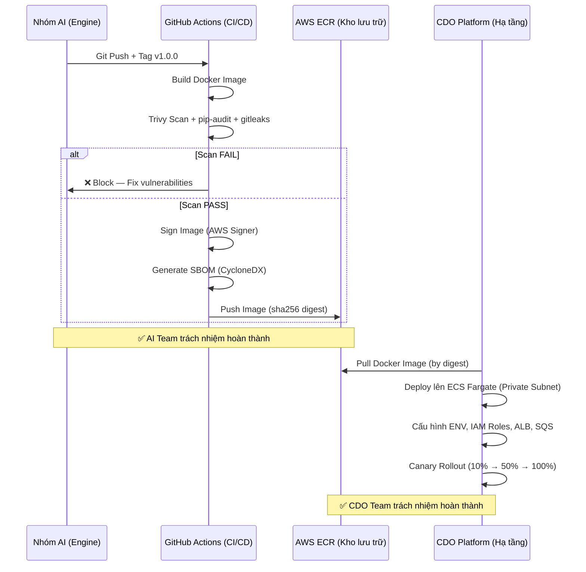

# Deployment Contract — Task Force 2 (FinOps Watch)

<!-- Owner: Nhóm AI 2
     Signed by: AI Lead + CDO Leads × 2 (CDO-01, CDO-02) + Security Reviewer
     Date signed: 2026-06-25 (W11 T5)
     🔒 FREEZE — no change without formal Change Request
     Word target: 2000-3000 từ (Contract tier)
     Cross-ref: ai-api-contract.md · telemetry-contract.md · docs/02_solution_design.md -->

---

## 1. Mục đích & Nguyên tắc cốt lõi

Định nghĩa **AI Engine deploy như thế nào** — compute target, scale, secrets, network, rollback. CDO Platform cần thông tin này để config infra connect được + size capacity đúng.

**Key principle**: Nhóm AI host AI Engine **ONCE** per Task Force. 2 CDO Platform (CDO-01, CDO-02) cùng point endpoint chung, phân biệt multi-tenant theo `tenant_id` / `line_item_usage_account_id`. Không có chuyện mỗi CDO deploy AI Engine riêng (reference: TF2_FINOPS_LEARNER.md §Deliverable).

> **WHY host ONCE**: Giảm chi phí Bedrock token 50% (shared prompt cache). Đơn giản hóa maintenance (1 container image, 1 rollback path). Multi-tenant isolation đã enforce ở application layer (reference: ADR-001).

---

## 2. Ownership Boundary Contract

Ranh giới trách nhiệm rõ ràng giữa AI Team và CDO Team. **Bắt buộc** để tránh mơ hồ khi incident (reference: CAPSTONE_EVIDENCE_PACK_FORMAT.md — evidence for process thinking).

```yaml
ownership:
  ai_team:                        # Bàn giao container image → CDO deploy
    - detection_logic             # Thuật toán Isolation Forest + Nova LLM
    - rca_reasoning               # Root Cause Analysis prompt engineering
    - recommendation_generation   # Mitigation + rollback command generation
    - fallback_logic              # Nova Pro → Nova Lite → Rules Engine
    - contract_management         # Schema versioning, API contract
    - container_image             # Build + sign + push Docker Image lên ECR
    - eval_baseline               # Precision/recall/F1 benchmark maintenance

  cdo_team:                       # Sở hữu hạ tầng và quyền thực thi
    - infra_deployment            # ECS Fargate, ALB, VPC, Subnets
    - iam_permissions             # IAM Roles, Policies, Permission Boundaries
    - telemetry_ingestion         # CUR S3 read, CE API call, CloudWatch pull
    - action_execution            # Thực thi lệnh AWS CLI từ AI recommendation
    - rollback_orchestration      # Hoàn tác containment action
    - queue_management            # SQS Primary + DLQ + Rollback queue
    - network_security            # Security Groups, NACLs, Route 53
    - dashboard_hosting           # Finance Dashboard + Engineering Console
```

> **WHY explicit boundary**: Trong incident T+0, mọi người biết ai sửa gì. AI Team sửa logic → push image mới. CDO Team sửa infra → rollback ECS deployment. Không chồng chéo (reference: vc-risk-evidence-pack — high-risk class "deploy/runtime/container" requires clear ownership).

---

## 3. Artifact Contract — Supply-chain Security

Tuân thủ OpenSSF SLSA Level 2. Container Image phải **bất biến** (immutable).

```yaml
artifact:
  image_repository: "200000000012.dkr.ecr.ap-southeast-1.amazonaws.com/tf2/finops-ai-engine"
  image_tag: "v1.0.0"             # Semantic versioning
  image_digest: "sha256:d95a947d174640bb8e9ef96a099a4e2b02e70e9a59e9a4f216e91f1a4e21a2eb" # CDO deploy bằng digest — KHÔNG dùng mutable tag
  signed_image: true              # AWS Signer KMS Key verification
  sbom_attached: true             # Software Bill of Materials (CycloneDX format)
  build_id: "42"                  # CI pipeline build ID (GitHub Actions run number)
  build_timestamp: "2026-06-25T10:00:00Z" # Thời điểm build container
  vulnerability_scan: trivy       # Zero Critical CVE policy
```

> **WHY deploy bằng digest**: Tag `latest` hoặc `v1.0.0` có thể bị overwrite (mutable). Deploy bằng `sha256:abc123` đảm bảo CDO-01 và CDO-02 chạy **chính xác cùng binary** (reference: vc-risk-evidence-pack — artifact provenance requirement).

---

## 4. Compute & Scaling Contract

Thông số CDO dùng để định kích thước ECS Fargate Task.

### 4.1 Compute Configuration

| Aspect | Configuration | WHY |
|---|---|---|
| **Target** | ECS Fargate task | Serverless — không quản lý EC2. Chạy trong private subnet. |
| **Cluster** | `tf-2-aiops-cluster` | Dedicated cluster cho AI workload |
| **Service name** | `ai-engine` | |
| **Image source** | ECR repo URI + image digest | Immutable reference (§3) |
| **CPU per task** | 2048 (2 vCPU) | Bedrock heavy chains + Isolation Forest ML cần 2 core |
| **Memory per task** | 4096 MB (4 GB) | CUR dataframe ~50MB + model overhead |
| **Timeout** | 300s (5 phút hard limit) | Async batch — không cần long-running |

### 4.2 Auto-scaling

| Aspect | Value | WHY |
|---|---|---|
| **Min tasks** | 2 | High availability — survive single AZ failure |
| **Max tasks** | 10 | Budget guard — max 10 × $0.10/hr = $1.00/hr burst |
| **Scale-up trigger 1** | CPU > 70% | Standard ECS metric |
| **Scale-up trigger 2** | SQS Backlog > 100 messages | Event-driven scaling |
| **Scale-up cooldown** | 60 giây | Responsive to batch spike |
| **Scale-down cooldown** | 300 giây | Avoid flapping |

### 4.3 Resource Limits (OOM Protection)

```yaml
resource_limits:
  max_memory_hard_limit: 4096Mi
  max_cpu_hard_limit: 2048m
  max_concurrency_per_task: 50
  max_payload_size_mb: 10         # Khớp API Gateway limit
```

---

## 5. Networking Contract (Bản đồ cô lập mạng kín)

AI Engine tuân thủ nguyên lý an ninh mạng **Zero-Trust**. Hệ thống không có cổng Public ra Internet và bị cô lập hoàn toàn sau tường lửa:

| Thành phần | Đặc tả cấu hình mạng | Lý do thiết kế (WHY) |
|---|---|---|
| **Subnet Type** | Private Subnet Only | Ngăn chặn hoàn toàn mọi nguy cơ tiếp cận từ môi trường Internet. |
| **Load Balancer** | Internal ALB Only | Chỉ cho phép các dịch vụ nội bộ có định danh nằm trong VPC truy cập. |
| **Ingress Rule** | SG-to-SG Enforcement | Chỉ chấp nhận kết nối duy nhất từ định danh Security Group của CDO Platforms. Cấm Allow by IP/CIDR. |
| **Egress Rule** | VPC Endpoints (VPCe) Only | Khóa cứng lối ra. Chỉ cho phép định tuyến tới: Bedrock API Endpoint, Secrets Manager VPCe, DynamoDB VPCe, SQS VPCe, và **S3 Gateway Endpoint** (Phục vụ kéo an toàn file log CUR vi mô qua đường mạng nội bộ tốc độ cao). |
| **Encryption** | TLS 1.3 Enforced | Mã hóa 100% dữ liệu dịch chuyển trên đường truyền mạng nội bộ. |

### Deployment Topology Diagram

```mermaid
graph TB
    subgraph "VPC Task Force 2"
        subgraph "Private Subnet (Multi-AZ)"
            ALB["Internal ALB<br/>ai-engine.tf-2.internal"]
            ECS["ECS Fargate Tasks × min 2"]
            ALB --> ECS
        end
        SM["Secrets Manager VPCe"]
        DDB["DynamoDB VPCe"]
        SQS_E["SQS VPCe"]
        S3_E["S3 Gateway Endpoint"]
        ECS --> SM
        ECS --> DDB
        ECS --> SQS_E
        ECS --> S3_E
    end
    Bedrock["AWS Bedrock<br/>(ap-southeast-1)"]
    ECS --> Bedrock

    subgraph "CDO Platforms × 2"
        CDO1["CDO-01 Platform"]
        CDO2["CDO-02 Platform"]
    end
    CDO1 --> ALB
    CDO2 --> ALB
  ```

### Per-CDO Platform Pointer

> AI engine host ONCE; 2 CDO point cùng endpoint.

| CDO Platform | Endpoint URL | Auth |
|---|---|---|
| CDO-01 | `https://ai-engine.tf-2.internal/` | IAM SigV4 |
| CDO-02 | (same — shared endpoint) | IAM SigV4 |

---

## 6. Security Contract — Hard Boundaries

### 6.1 Forbidden Actions (NON-NEGOTIABLE)

**AI Engine KHÔNG BAO GIỜ** (reference: 01_requirements.md §4):

```yaml
forbidden_actions:
  - terminate_production_resources  # NEVER terminate prod (prod-core, prod-payments)
  - delete_data                     # NEVER delete S3 objects, DynamoDB items, RDS instances
  - modify_iam                      # NEVER modify IAM roles, policies, permission boundaries
  - create_iam_users                # NEVER create new IAM identities
  - mutate_security_groups          # NEVER modify network security rules
  - bypass_cdo_execution            # AI chỉ recommend → CDO execute
  - access_public_internet          # Container trong private subnet only
```

### 6.2 Environment Safety Matrix

Khớp với `mitigation_action.strategy` trong ai-api-contract.md §5.2 (reference: 02_solution_design.md §1 Mermaid diagram).

| Environment | Allowed Action | Confidence Threshold | Auto-execute? |
|---|---|---|---|
| `prod-core` | tag-for-review + Slack Alert SRE | N/A | ❌ Never |
| `prod-payments` | tag-for-review + Slack Alert SRE | N/A | ❌ Never |
| `staging` | time-gated-countdown (4h) → shutdown | N/A | ⏱️ After countdown |
| `dev` / `sandbox` | auto-shutdown | ≥ 0.80 | ✅ Yes |
| `ml-research` | auto-shutdown GPU instances | ≥ 0.80 | ✅ Yes |
| `data-analytics` | quota-cap via Service Quotas API | ≥ 0.85 | ✅ Yes |

### 6.3 Network & IAM Boundary

```yaml
security_boundary:
  network: Private_Subnet_Only
  iam: Least_Privilege
  public_ingress: forbidden
  long_lived_secrets: forbidden     # Cấm IAM Access Keys tĩnh
  encryption_at_rest: aws-kms      # DynamoDB + S3
  encryption_in_transit: tls-1.3
  waf_enabled: true
  rate_limit_per_tenant: 100 req/min
```

### 6.4 Tenant Isolation (Blast Radius Protection)

```yaml
tenant_isolation:
  partition_key: tenant_id         # DynamoDB partition key
  per_tenant_budget_cap: true
  per_tenant_error_budget: true
  per_tenant_lock_state: true      # 1% Error Budget Lock (§10)
  cross_tenant_data_leak: impossible  # Per-request scoping, no shared context
```

> **WHY per-request scoping**: AI Engine không persist context across tenants. Mỗi request = 1 tenant's data + fresh LLM context. Ngăn chặn cross-tenant data bleed (reference: 03_ai_engine_spec.md §3 Multi-tenant routing).

---

## 7. State & Queue Contract

AI Engine Container hoàn toàn **stateless**. Mọi trạng thái lưu trữ bên ngoài.

```yaml
state_stores:
  idempotency_store:
    service: dynamodb
    table: tf-2-ai-idempotency
    ttl: 24h
  audit_store:
    service: dynamodb
    table: tf-2-ai-audit-ledger
    ttl: 90d                       # → stream to S3 Archive after TTL
  anomaly_store:
    service: dynamodb
    table: tf-2-ai-anomalies
  feedback_store:
    service: dynamodb
    table: tf-2-ai-feedback-loops

queue_contract:
  primary: finops-watch-detect
  dead_letter: finops-watch-detect-dlq
  rollback: finops-watch-rollback         # SQS Queue để CDO báo cáo trạng thái hoàn tất rollback về cho AI Engine audit
  retention_days: 14
  poison_threshold: 3              # Max retry → DLQ
  visibility_timeout: 300s         # Khớp container timeout

concurrency_limits:
  max_parallel_jobs_per_tenant: 3
  max_total_parallel_jobs: 50
  max_ad_hoc_jobs_per_day: 5       # Quét khẩn cấp (is_ad_hoc = true)
```

---

## 8. Secrets & Rotation Contract

```yaml
secrets:
  bedrock_credentials:
    store: aws-secrets-manager
    key_path: "tf-2/ai-engine/bedrock"
    rotation_days: 90
  required_env_vars:
    - AWS_REGION
    - MODEL_PRIMARY
    - OTEL_EXPORTER_ENDPOINT
    - MAX_DAILY_TOKEN_BUDGET
  startup_validation:
    fail_if_missing_env: true
    fail_if_missing_dependency: true
    dependency_check: [dynamodb, sqs]
    retry_count: 5
```

> **WHY fail fast**: Nếu container thiếu env var → crash ngay lúc start thay vì chạy 5 phút rồi fail khi cần Bedrock (reference: AWS Well-Architected — Reliability Pillar).

---

## 9. Failure Contract

### 9.1 Failure Semantics

| Failure Mode | Detection | Response | Reference |
|---|---|---|---|
| `model_timeout` | Bedrock > 45s | Degrade → Nova Lite → Rules Engine | API Contract §7 `ERR_LLM_TIMEOUT` |
| `schema_invalid` | JSON schema validation fail | Send to DLQ, do not retry | API Contract §7 `ERR_INVALID_SCHEMA` |
| `telemetry_incomplete` | `completeness_score < 0.8` | Enter DRY-RUN mode | Telemetry Contract §13 |
| `dependency_down` | DynamoDB/SQS timeout | Retry with exponential backoff | §9.2 |
| `action_rejected` | CDO returns rollback failure | Log audit only, alert SRE | |

### 9.2 Retry Policy

```yaml
retry_policy:
  retryable_errors: [bedrock_timeout, network_timeout, database_lock]
  max_retries: 3
  exponential_backoff:
    base_delay_ms: 1000
    multiplier: 2.0
    max_backoff_ms: 30000
```

### 9.3 Model Fallback Chain

`Nova Pro → Nova Lite → Rules Engine` (reference: 02_solution_design.md §2).

```yaml
model_fallback:
  primary: amazon.nova-pro-v1      # Full RCA + NL reasoning
  secondary: amazon.nova-lite-v1   # Simplified RCA (lower cost, higher latency tolerance)
  tertiary: rules-engine           # Static threshold evaluator (zero LLM cost)
  triggers:
    timeout: 10000ms               # Nova Pro > 10s → fallback
    cost_breach: true              # Daily token budget exceeded → fallback
    http_5xx: true                 # Bedrock 5xx → fallback
    throttle_60pct: true           # Bedrock throttle >60% → circuit break
```

---

## 10. Budget Guardrails — Circuit Breaker

Bảo vệ ngân sách Bedrock **< $50/tháng** (reference: 01_requirements.md §4 Budget constraint).

```yaml
budget_guardrails:
  max_daily_tokens: 500000
  max_daily_cost_usd: 1.67        # $50 / 30 ngày ≈ $1.67/ngày
  max_monthly_cost_usd: 50.00
  breaker_escalation:
    - level_1: fallback_to_nova_lite     # 80% daily budget
    - level_2: fallback_to_rules_engine  # 100% daily budget
    - level_3: halt_all_processing       # 120% monthly budget → P1 alert
```

### 1% Error Budget Lock

- **SLI**: $\frac{\text{Số can thiệp thành công}}{\text{Tổng can thiệp tự động}}$
- **SLO**: 99.0% (Error Budget = 1%)
- **Hành vi**: Nếu Undo Rate > 1% trong cửa sổ trượt 30 ngày → Tenant tự động `LOCKED` → mọi containment chuyển về `Dry-run/Alert-only`

> **WHY 1% Lock**: Nếu AI Engine tắt nhầm resource 2 lần / 100 lần → thảm họa trust. Lock tự động bảo vệ production trước khi team diagnose issue (reference: Google SRE Error Budget policy).

---

## 11. Deployment Strategy — Canary Rollout

| Step | Traffic | Interval | Abort nếu |
|---|---|---|---|
| 1 | 10% | 5 phút | Error rate > 1% |
| 2 | 50% | 5 phút | P99 latency > 800ms |
| 3 | 100% | — | Burn-rate fast alert triggered |

**Abort → auto rollback** to previous git SHA via ArgoCD. Target RTO < 60 giây.

### Rollback Contract

```yaml
rollback:
  primary_method: ArgoCD rollback to previous git SHA
  secondary_method: ECS service revert (manual)
  target_rto: 60s
  auto_trigger: true               # When canary abort criteria met
  prod_requires_dual_approval: true # SRE Lead + Team Lead phê duyệt
```

---

## 12. Health Check & Observability Contract

### 12.1 Health Check

| Field | Value |
|---|---|
| **Path** | `/health` (reference: API Contract §5.5) |
| **Port** | 8080 |
| **Interval** | 30 giây |
| **Healthy threshold** | 2 consecutive 200 |
| **Unhealthy threshold** | 3 consecutive non-200 |
| **Deep check** | Verify DynamoDB connection + Bedrock accessibility |

### 12.2 Observability Export

```yaml
observability:
  traces: aws-xray
  metrics: cloudwatch-metrics
  logs:
    destination: cloudwatch-logs
    format: json
    retention_days: 14
  otel_endpoint: "CDO-specific (env var OTEL_EXPORTER_ENDPOINT)"
```

### 12.3 Graceful Shutdown

```yaml
graceful_shutdown:
  drain_inflight: true            # Hoàn tất job đang chạy
  checkpoint: true                # Ghi checkpoint vào DynamoDB
  sigterm_grace: 30s              # Thời gian chờ sau SIGTERM
```

> **WHY graceful shutdown**: CDO rolling update ECS task → nếu kill đang-chạy → mất kết quả detection → CDO phải re-trigger → lãng phí Bedrock token (reference: AWS Well-Architected — Operational Excellence).

---

## 13. Disaster Recovery Contract

```yaml
disaster_recovery:
  primary_region: ap-southeast-1   # Singapore
  secondary_region: ap-southeast-2 # Sydney (design-only, not deployed in capstone)
  rpo_minutes: 15
  rto_minutes: 5
  failover_trigger: "5 consecutive healthcheck failures"
```

> **WHY design-only DR**: Multi-region active-active out of scope cho capstone (reference: 01_requirements.md §5). DR chỉ documented, không deployed (reference: TF2_FINOPS_LEARNER.md §Out of scope).

---

## 14. Live SLO Contract

Khớp với SLO trong ai-api-contract.md §6.

| Metric | Target | How to measure |
|---|---|---|
| **Ingestion Latency (P99)** | < 50ms | Phản hồi `202 Accepted` ngay sau khi nhận request |
| **Result Query Latency (P99)** | < 10ms | Đọc DynamoDB result store |
| **LLM Inference SLA** | < 30 giây | Gọi Bedrock + ghi DB |
| **Detection Latency (P95)** | < 20s | Tổng batch processing |
| **System Availability** | ≥ 99.5% | API Gateway + ALB uptime |
| **Error Rate** | < 0.5% | 5xx responses / total requests |
| **AI Detection Precision** | ≥ 80% | True Anomalies / Total Flagged (backtest) |
| **False Positive Rate** | ≤ 10% | False Anomalies / Total Normal (backtest) |
| **Rollback Success Rate** | > 99% | Successful rollbacks / total rollbacks |
| **Containment Success Rate** | > 95% | Successful containments / total triggered |

---

## 15. Security Scan Contract

Bảo đảm an toàn trước khi promote container lên production (reference: vc-security — STRIDE + OWASP methodology).

```yaml
security_scan:
  image_scan: trivy                # Zero Critical CVE → block deploy
  dependency_scan: pip-audit       # Python dependency audit
  secret_detection: gitleaks       # No hardcoded secrets in image
  fail_on_critical: true
  scan_frequency: every_build
```

---

## Appendix A. Handover Workflow



---

## Appendix B. IAM Policy Example (Containment Service — CDO Side)

CDO cấu hình IAM Role cho Containment Worker tuân thủ **Least Privilege + Explicit Deny** (reference: 01_requirements.md §6 IAM Least Privilege):

```json
{
  "Version": "2012-10-17",
  "Statement": [
    {
      "Sid": "AllowReadOnlyAndTagging",
      "Effect": "Allow",
      "Action": [
        "ec2:Describe*", "rds:Describe*", "sagemaker:Describe*",
        "ec2:CreateTags", "rds:AddTagsToResource", "sagemaker:AddTags"
      ],
      "Resource": "*"
    },
    {
      "Sid": "AllowContainmentOnNonProd",
      "Effect": "Allow",
      "Action": [
        "ec2:StopInstances",
        "rds:StopDBInstance",
        "sagemaker:StopNotebookInstance"
      ],
      "Resource": "*",
      "Condition": {
        "StringNotEquals": {
          "aws:ResourceTag/Environment": ["prod-core", "prod-payments"]
        }
      }
    },
    {
      "Sid": "AllowQuotaContainmentOnNonProd",
      "Effect": "Allow",
      "Action": [
        "servicequotas:RequestServiceQuotaIncrease",
        "servicequotas:GetServiceQuota"
      ],
      "Resource": "*"
    },
    {
      "Sid": "ExplicitDenyDangerous",
      "Effect": "Deny",
      "Action": [
        "ec2:TerminateInstances", "rds:DeleteDBInstance", "rds:DeleteDBCluster",
        "s3:DeleteObject", "s3:DeleteBucket",
        "iam:*", "sts:AssumeRole"
      ],
      "Resource": "*"
    }
  ]
}
```

> **WHY Explicit Deny**: `Allow` + `Condition` có thể bị bypass nếu có policy khác grant. `Deny` là absolute — không IAM policy nào override được (reference: AWS IAM Policy Evaluation Logic).

---

## Appendix C. ADR Index (Cross-reference)

| ADR | Quyết định | Lý do | Trade-off |
|---|---|---|---|
| ADR-001 | Host ONCE per Task Force | Chia sẻ prompt cache, giảm cost 50% | CDO phụ thuộc single endpoint |
| ADR-002 | Batch Cadence 24h | CUR cập nhật 8-12h, data lag chấp nhận được | Max detection delay = 24h |
| ADR-003 | DynamoDB Cache CE results | CE rate limit 5 req/s, cache tránh throttle | Thêm DynamoDB cost ~$1/month |
| ADR-004 | IAM SigV4 Auth (no API keys) | Không static secret, auto-rotate | CDO phải implement SigV4 signing |
| ADR-005 | 1% Error Budget Lock | Bảo vệ trust, auto-lock containment khi lỗi nhiều | Có thể block legitimate containment |

---

## Open Questions (Resolved)

- [x] **Q1**: Multi-region cho disaster recovery — có trong scope capstone không?
  - *Resolved*: Không. Design-only. Single-region `ap-southeast-1` (reference: TF2_FINOPS_LEARNER.md §Out of scope).

- [x] **Q2**: Cost cap per task force per ngày — đặt mức nào?
  - *Resolved*: $1.67/ngày (= $50/30 ngày). Circuit breaker escalation 3 levels (§10).

---

## Related Documents

- ai-api-contract.md — 5 API endpoints specification
- telemetry-contract.md — CDO signals definition
- docs/01_requirements.md — success criteria + hard constraints
- docs/02_solution_design.md — architecture + component breakdown
- docs/03_ai_engine_spec.md — model governance + Bedrock Guardrails
- docs/05_adrs.md — Architecture Decision Records
- data/tf2-finops/README.md — ground truth data schema
- reference/CAPSTONE_EVIDENCE_PACK_FORMAT.md — evidence documentation standards