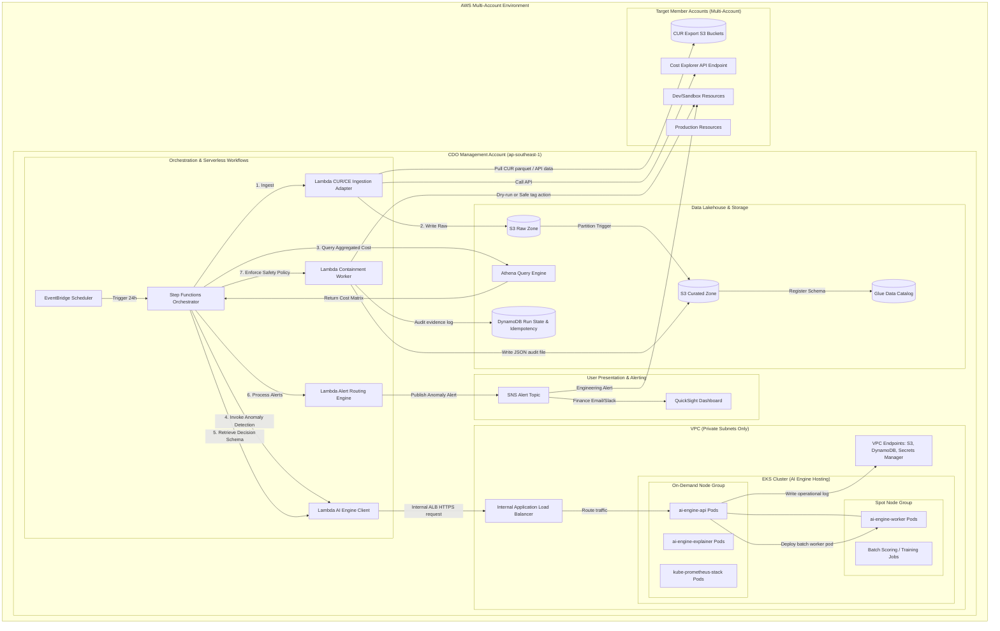

# Infrastructure Design - Task Force 2 · FinOps Watch CDO

<!-- Doc owner: CDO Team
     Status: Final (W11 T6 Pack #1) → Updated (W12 T4 Pack #2)
-->

## 1. Architecture diagram

The CDO platform uses a lakehouse-centric control plane combined with serverless orchestration workflows and a managed EKS cluster to host the AI Engine runtime. The data processing and anomaly detection flow operates on a scheduled 24h cadence.



*Caption: The CDO management VPC contains private subnets with no public route tables. External cost data is pulled from member accounts via OIDC trust roles. The AI Engine endpoints are exposed internally via an AWS ALB routing to EKS services, segregating stable APIs on on-demand nodes and batch workers on spot nodes. Workflows are scheduled and monitored by Step Functions.*

## 2. Component table

The following infrastructure components are deployed for the CDO platform and hosted workloads:

| Component | AWS Service | Reason | Cost note |
|---|---|---|---|
| Ingestion & Storage | S3 Standard + Glacier | Host raw cost data, normalized parquet files, model artifacts, and audit logs. | Low storage cost ($0.023/GB/month). Lifecycled. |
| Schema Registry | Glue Data Catalog | Governs schema definitions for raw and curated datasets. | Serverless, first 1M objects free. |
| Serverless Query | Athena | Allows ad-hoc SQL aggregation of CUR cost data without dedicated instances. | Pay-per-query ($5.00/TB scanned). Materialized. |
| Ingestion & Logic | Lambda | Short-running serverless adapters for data ingestion, endpoint invocation, routing, and containment. | Pay-per-execution. High concurrency limit. |
| Orchestration | Step Functions | Standard workflows provide persistent state, error retries, and conditional logic. | $0.000025 per state transition. |
| Hosting Cluster | AWS EKS | Hosts the versioned AI Engine runtime and batch jobs with enterprise container isolation. | $0.10/hour cluster fee. |
| Stable Compute | EC2 On-Demand Nodes | Managed Node Group (e.g., `m5.large`) for stable pods (`ai-engine-api`, monitoring). | ~2 nodes active. Stable runtime. |
| Batch Compute | EC2 Spot Nodes | Managed Node Group (e.g., `c5.large`) for batch scoring, feature engineering, and retraining. | Up to 60-90% savings compared to on-demand. |
| Container Registry | ECR | Securely stores Docker images generated by AIOps for EKS deployments. | $0.10/GB storage fee, free data transfer to EKS. |
| Ingress / Service | internal ALB / NLB | Routes Step Functions traffic securely to the AI API endpoint within the VPC. | ~1 active load balancer (~$20/month base). |
| Configuration Store | Secrets Manager | Stores API keys, OIDC credentials, and DB strings securely. | $0.40/secret/month + API call volume. |
| Operational State | DynamoDB | Stores scheduled run state, idempotency keys, anomaly indexes, and audit logs. | On-demand capacity mode, low storage footprint. |
| Presentation | QuickSight | Finance-friendly BI dashboards showing cost trends and anomaly metrics. | User-based licensing ($18-$24/user/month). |
| Alerting Engine | SNS | Fan-out notification engine routing alerts to email, Slack webhooks, and HTTP targets. | First 1M notifications free. |
| Observability | CloudWatch / Container Insights | Aggregates VPC flow logs, Lambda traces, EKS metrics, and cluster application logs. | Charged per GB ingested ($0.50/GB). Retained 14 days. |
| Private Transport | VPC NAT Gateway / Endpoints | Interface endpoints allow Lambda and EKS to call AWS APIs privately without traversing the internet. | Hourly fee + processing charges per GB. |

## 3. Differentiation angle deep-dive

### 3.1 Why this angle?

The lakehouse-centric scheduled FinOps control plane combined with EKS AI hosting matches production-grade requirements. Production billing data (CUR) changes on a daily batch frequency, making real-time streaming detection redundant. Organizing data into raw and curated S3 zones cataloged by Glue allows us to perform fast, scalable queries via Athena. 

By hosting the AIOps AI Engine on EKS rather than serverless containers (like Fargate), the CDO platform achieves full infrastructure efficiency. EKS managed node groups split workloads cleanly: always-on, low-latency services (such as model APIs and monitoring tools) run on stable on-demand nodes. Compute-heavy, interruptible workloads (like model retraining, feature extraction, and batch cost scoring) are deployed as Kubernetes Jobs on cheap spot nodes. This ensures we scale dynamically without paying premium rates for idle GPU or high-CPU servers.

### 3.2 Strengths (with metrics)

The chosen EKS + Lakehouse architecture is compared below against alternative designs:

| Metric | Lakehouse + EKS (CDO) | Pure Serverless (Lambda) | Serverless Container (Fargate) |
|---|---|---|---|
| **Fixed Platform Cost** | Medium (~$150/month base cluster) | Ultra-low (pay-per-use, ~$0) | Low-Medium (~$60/month base ALB) |
| **Variable Cost / Batch Run** | Low (90% spot savings for worker jobs) | Medium (high compute overhead for ML) | Medium (standard compute rates) |
| **Max Job Duration** | Unlimited (Supports hours-long ML jobs) | 15-minute limit (Fails for retraining) | Unlimited (No spot placement controls) |
| **Workload Isolation** | Pod-level (EKS Network Policies + namespaces) | IAM function-level (Basic) | Task-level (Security groups only) |
| **Model Scaling Latency** | <5s (HPA local replica scaling on nodes) | 10-30s (Cold starts on large ZIPs) | 30-90s (Provisioning container task) |
| **Ops Overhead (hr/week)** | ~4 hours (Managed nodes update) | ~1 hour (Zero infra ops) | ~2 hours (Task configuration management) |
| **Time to Onboard Tenant** | <5 minutes (Namespace + SQS routing setup) | <2 minutes (Deploy dynamic config) | <10 minutes (Task configuration update) |

### 3.3 Accepted weaknesses

- **Operational complexity**: Requires managing Helm charts, GitOps sync loops (ArgoCD/Flux), and Kubernetes RBAC.
- **Bootstrapping latency**: Initial cluster provisioning and Kubernetes configuration takes ~15 minutes, making rapid sandbox setups slower.
- **Spot Interruption Risk**: Spot workers running batch scoring or retraining can be reclaimed by AWS with a 2-minute warning. The system must implement application checkpointing and automatic job retry mechanisms.

## 4. Multi-account approach

### 4.1 Account model

The CDO platform is centralized in a designated **FinOps Management Account**. Cross-account data gathering uses standard read-only IAM roles in target member accounts.
- **FinOps Management Account**: Hosts the Step Functions orchestrator, S3 Data Lake, Glue Data Catalog, EKS cluster, QuickSight dashboard, and DynamoDB.
- **Target Member Accounts**: Maintain a read-only role (`FinOpsCostReaderRole`) allowing S3 access to CUR exports and query permissions for the local Cost Explorer API. It also hosts the execution role (`FinOpsContainmentWorkerRole`) allowing resource tagging, schedule registration, and quota enforcement.

### 4.2 Isolation pattern

- **S3 Data Lake**: Prefixes partition historical cost datasets by account ID (e.g., `s3://cdo-curated-zone/account_id=123456789012/year=2026/`).
- **Glue Catalog**: Partitions the catalog structure to enforce predicate pushdown during Athena queries.
- **EKS AI Hosting**: Pods are separated using Kubernetes namespaces (e.g., `ai-inference`, `ai-batch-jobs`). Network policies block cross-namespace network routes, preventing batch worker pods from connecting to core database or monitoring systems.
- **DynamoDB State Table**: Partitioned using a compound key structure (`account_id#cost_period`) to prevent cross-account run state interference.

### 4.3 Onboarding flow

To onboard a new AWS account into the FinOps Watch platform, the following automated steps occur:
```
1. Deploy FinOps IAM roles (Reader & Worker) in target account via CloudFormation StackSet.
2. Register account metadata (Account ID, Squad Owner, Slack Endpoint) in DynamoDB 'Accounts' table.
3. Configure CUR 2.0 export target to the FinOps Raw S3 bucket using cross-account policies.
4. Execute Step Functions onboarding sanity run (Verify read permission, pull initial 24h cost, write raw).
5. Verify schema normalization in Glue and validate dashboard overlay view.
```

### 4.4 Idempotency

To prevent double-processing cost data for a single timeframe (which leads to duplicated alerts and containment actions), the orchestrator registers an idempotency lock before calling the AI Engine.
- **Idempotency key format**: `{account_id}:{cost_period_start}:{cost_period_end}` (e.g., `123456789012:2026-06-22T00:00:00Z:2026-06-23T00:00:00Z`).
- **DynamoDB Run State Table (`finops-run-state`)**:
  - `IdempotencyKey` (Partition Key - String)
  - `RunId` (String - UUID)
  - `Status` (String - PENDING, RUNNING, COMPLETED, FAILED)
  - `StartedAt` (Number - Epoch)
  - `CompletedAt` (Number - Epoch)
  - `EvidenceUri` (String - S3 path to decision output json)
  - `ErrorDetails` (String - details if status is FAILED)

When a scheduled run triggers, a conditional DynamoDB write checks if `IdempotencyKey` exists. If the status is `RUNNING` or `COMPLETED`, the workflow aborts. If it is `FAILED`, the workflow resets status to `PENDING` and triggers a retry.

## 5. Alternatives considered

### 5.1 Orchestration layer

- **Option A - Apache Airflow / MWAA**: Checked as a pipeline runner. Rejected due to high baseline fixed cost ($200+/month for managed runtime), complex Python dependency management, and slow deployment cycle.
- **Option B - AWS Batch**: Analyzed for running ingestion scripts. Rejected because it lacks state machine visual tracking and complex branching logic (e.g., timeout fallbacks, separate alert paths).
- Yes **Chosen: EventBridge Scheduler + Step Functions Standard**: Provides serverless visual workflows, native AWS service integrations, built-in retry-on-failure steps, and zero idle costs.

### 5.2 Data layer

- **Option A - Amazon Redshift Serverless**: Evaluated as the primary cost analytical store. Rejected because it is over-provisioned for a 24h batch ingestion cadence, generating high minimum query billing.
- **Option B - DynamoDB Only**: Considered for hosting historical cost logs. Rejected because DynamoDB does not support complex analytical SQL queries (e.g., historical standard deviation calculations) required by AIOps integration without costly full table scans.
- Yes **Chosen: S3 + Glue Data Catalog + Athena**: Provides a low-cost, serverless lakehouse engine that queries structured Parquet partitions on S3, mapping directly to BI dashboard views.

## 6. Scaling strategy

The platform scales dynamically across all layers:
- **Data Ingestion**: EventBridge triggers Step Functions using parallel map states. If the company grows from 12 squads to 120, target account ingestions execute concurrently up to Lambda's default concurrency limit (1000).
- **Athena Query Engine**: Scales horizontally automatically. Athena splits large datasets across its internal execution engine, charging only for scanned bytes. Query execution limits are managed via S3 Partition Projection.
- **EKS AI Inference**: Pods of `ai-engine-api` auto-scale via Kubernetes **Horizontal Pod Autoscaler (HPA)** based on average CPU/Memory targets (70%). Highly concurrent loads scale out pod replicas across on-demand nodes.
- **EKS Worker Jobs**: Batch, training, and feature engineering jobs trigger dynamically. The cluster uses **Karpenter** or **Cluster Autoscaler** to provision temporary EC2 spot instances when pending worker pods are scheduled, and terminates them immediately when jobs complete.

## 7. Failure modes + recovery

The following table details failure modes, automated recovery steps, and operational targets:

| Failure | Detection | Recovery | RTO | RPO |
|---|---|---|---|---|
| Member account CUR lag | Ingestion validation returns empty/truncated records | Log run state as `INCOMPLETE_DATA`, alert Engineering Slack, skip containment triggers, use previous run cache. | 1 hour | 24 hours |
| Cost Explorer API rate limit | Lambda CUR/CE adapter receives HTTP 429 throttling | Exponential retry with jitter. Fall back to raw CUR partition exports. | 15 mins | 0 |
| hosted AI API timeout | Step Functions Lambda client detects 60s timeout | Retry call 3 times. If timeout persists, trip circuit-breaker and fail-closed: log anomaly status `AI_UNAVAILABLE`. | 5 mins | 0 |
| AI Engine Pod crash | Kubernetes Kubernetes replica target unreached | Pod restart by Kubelet. HPA schedules additional pod on healthy on-demand node. | < 10s | 0 |
| Spot node reclamation | EC2 Spot Interruption Warning (2-minute warning) | Karpenter intercepts event, marks node as cordoned, drains pods, and launches replacement node. Batch jobs resume from checkpoint. | < 2 mins | Checkpoint |
| Step Functions workflow failure | CloudWatch rule catches `State Entered: FAILED` | Log run status as `FAILED` in DynamoDB to release idempotency lock. Alert DevOps on Slack with trace details. | 10 mins | 24 hours |
| Duplicate execution trigger | DynamoDB conditional put exception on idempotency check | Abort runner immediately. Record warning in logs, trace duplicate UUID. | < 5s | 0 |
| QuickSight dashboard stale | Dashboard dashboard data ingestion timestamp > 26h | Raise CloudWatch alarm, trigger manual refresh via Lambda helper, notify Finance via email. | 30 mins | 24 hours |
| SNS Alert delivery failure | SNS delivery status logs error (e.g., SMTP fail) | SNS retries delivery with backoff. If failure continues, route to backup email queue. | 5 mins | 0 |
| Containment denial | Target account IAM change denies permission to tag | Log containment status `DENIED`, write incident audit log, alert Squad owner and security team immediately. | 1 hour | 0 |

## Related documents

- [`03_security_design.md`](03_security_design.md) - Pod-level security, network policies, IAM/IRSA roles, and hard safety boundaries.
- [`04_deployment_design.md`](04_deployment_design.md) - IaC modules, Helm workload configurations, and CI/CD quality gates.
- [`05_cost_analysis.md`](05_cost_analysis.md) - Detailed cost projections for EKS hosting and serverless data pipelines.
- [`08_adrs.md`](08_adrs.md) - Core architecture decision records (cadence trade-off, lakehouse design, EKS choice).
