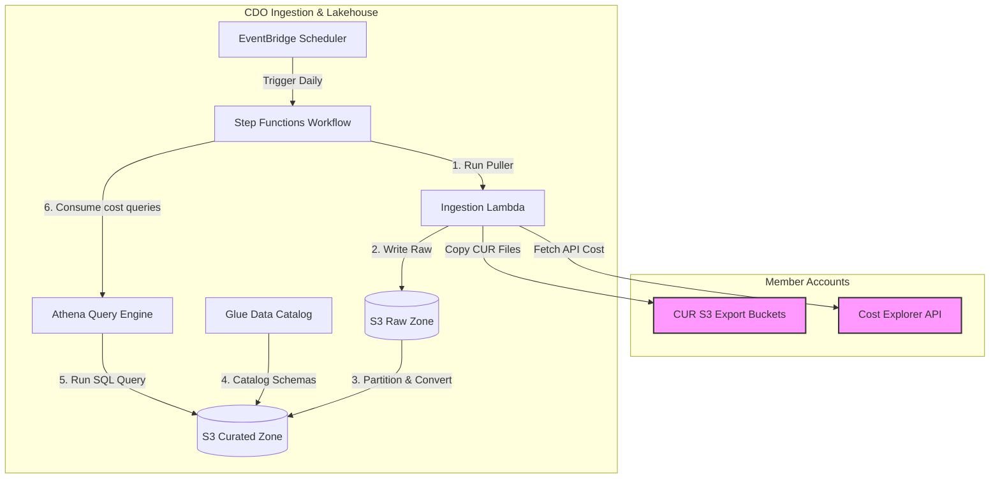
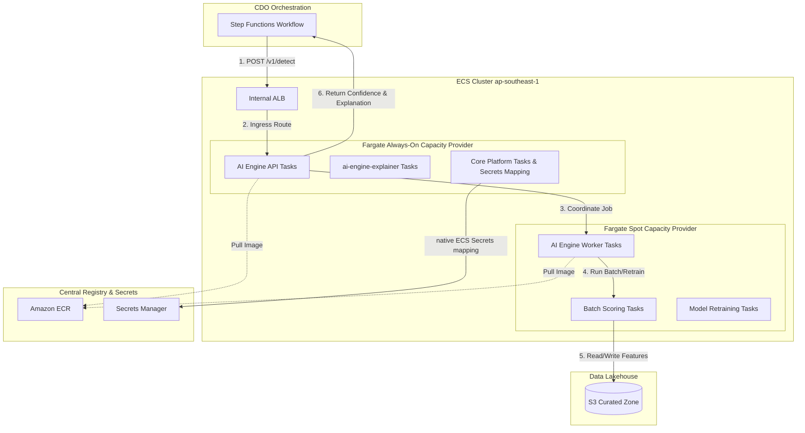
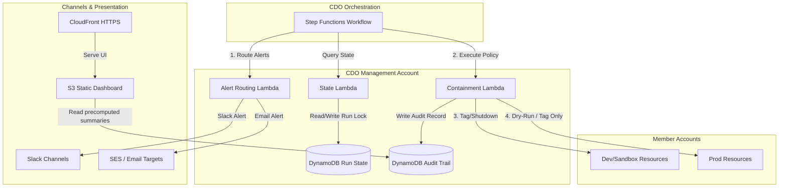

# Infrastructure Design - Task Force 2 · FinOps Watch CDO

<!-- Doc owner: CDO Team
     Status: Final (W11 T6 Pack #1) -> Updated (W12 T4 Pack #2)
-->

## 1. Architecture diagram

The CDO platform is designed around a lakehouse-centric data plane for ingest and analysis, orchestrated by serverless workflows, and integrated with a single shared AIOps-provided AI Engine endpoint hosted once per Task Force on a managed ECS cluster (`tf-2-aiops-cluster`). The ECS compute tier uses a hybrid configuration of Fargate always-on capacity provider tasks and Fargate Spot capacity provider tasks to optimize execution costs. The shared endpoint is reached at `https://ai-engine.tf-2.internal/` using IAM SigV4 authentication.

The architecture is sized around recurring CDO platform responsibilities, not around the AIOps model-training dataset. CDO must reliably pull billing data from approved AWS sources, normalize it into a contract-ready shape, invoke the AIOps-owned AI Engine, and preserve the returned decision evidence. Any synthetic historical dataset used to train, enhance, or backtest the model remains AIOps-owned. Detection telemetry is strictly CUR-only (S3 CUR partition pulls and Cost Explorer API calls) and does NOT include CloudWatch utilization metrics (CPU, memory, database connections), which are used ONLY for platform operational observability (alerts, logging, metrics, dashboard).

```mermaid
graph TB
    subgraph "AWS Member Accounts"
        MemberS3[CUR S3 Export Buckets]
        MemberCE[Cost Explorer API Endpoints]
    end

    subgraph "CDO Management Account VPC (ap-southeast-1)"
        subgraph "Ingestion & Orchestration"
            EB[EventBridge Scheduler] -->|Trigger Daily| SF[Step Functions Workflow]
            SF -->|Invoke Puller| LambdaPull[Ingestion Lambda]
            SF -->|Evaluate Run| LambdaState[State Lambda]
            SF -->|Trigger Containment| LambdaCont[Containment Lambda]
            SF -->|Route Alerts| LambdaAlert[Alert Routing Lambda]
        end

        subgraph "Data Lakehouse Tier"
            S3Raw[(S3 Raw Zone)]
            S3Cur[(S3 Curated Zone)]
            GlueCat[Glue Data Catalog]
            Athena[Athena Query Engine]
        end

        subgraph "Private Subnets (ECS Cluster)"
            subgraph "ECS Cluster Services"
                ControlPlane[ECS Control Plane]
            end
            
            subgraph "Fargate Always-On Capacity Provider"
                API_P[AI Engine API Tasks]
                EXP_P[ai-engine-explainer Tasks]
                SecretsMap[ECS Task Definition Secrets Mapping]
                Core_P[Core CDO Platform Tasks]
            end

            subgraph "Fargate Spot Capacity Provider"
                WRK_P[AI Engine Worker Tasks]
                Batch_J[Batch Scoring Tasks]
                Train_J[Model Retraining Tasks]
            end

            InternalALB[Internal ALB]
        end

        subgraph "Database Store"
            DDB[(DynamoDB Run State & Audit)]
        end
    end

    subgraph "Alerting & Presentation"
        Slack[Slack Notification Engine]
        Email[SES Email Target]
        S3Dashboard[S3 Static Dashboard Assets]
        CloudFront[CloudFront HTTPS Ingress]
    end

    %% Ingestion flows
    LambdaPull -->|Fetch Cost Data| MemberCE
    LambdaPull -->|Pull CUR Files| MemberS3
    LambdaPull -->|Write raw cost| S3Raw

    %% Transformation flows
    S3Raw -->|Partition/Schema Validation| S3Cur
    GlueCat -->|Catalog schemas| S3Cur
    Athena -->|Query data| S3Cur

    %% Orchestration & Database interactions
    LambdaState -->|Idempotency key check & write state| DDB
    LambdaCont -->|Write immutable audit trail| DDB
    LambdaCont -->|Assume role & tag/suggest/shutdown| MemberAccounts[Member Accounts Resources]
    LambdaAlert -->|Route alert payload| Slack
    LambdaAlert -->|Route alert payload| Email

    %% AI Engine Integration
    SF -->|Detect Request via Internal ALB| InternalALB
    InternalALB -->|Route Ingress| API_P
    API_P -->|Coordinate batch scoring| WRK_P
    WRK_P -->|Process logs| Batch_J
    Batch_J -->|Read/Write features| S3Cur
    
    %% Dashboard presentation
    CloudFront -->|Serve Static Files & JSON| FinanceUsers[Finance Users]
    S3Dashboard -->|Deliver Assets| CloudFront
    SF -->|Write precomputed JSON summaries| S3Dashboard
    SF -->|Write run summaries| DDB
```



*Caption: The CDO pipeline is triggered daily by EventBridge Scheduler. The Step Functions workflow coordinates ingestion from member accounts, writes raw CUR and Cost Explorer data to S3, and catalogs it. The workflow requests anomaly detection from the AIOps-owned AI Engine via the ECS internal ALB. The ECS cluster isolates stable APIs on Fargate always-on capacity provider tasks and batch-scoring/training tasks on Fargate Spot capacity provider tasks. Dashboard views and containment workflows pull clean state from precomputed summaries in S3 and DynamoDB.*

---

To provide a clearer view of the CDO platform's operations, the overall architecture is broken down into a high-level overview followed by three detailed zoom-in diagrams below:

### 1.1 High-Level Architecture Overview

This diagram represents the high-level macro interactions between the central orchestrator, the lakehouse data plane, the ECS compute cluster, and the alerting/containment engines.


*Caption: The central Step Functions Orchestrator drives the entire FinOps loop: extracting data to the Lakehouse, calling the ECS-hosted AI Engine for anomaly decisions, and invoking alerting and containment workflows based on the results.*

Operationally, Step Functions is the control boundary between deterministic CDO logic and probabilistic AI output. Every transition records a `run_id`, cost window, account scope, and contract version so that Finance can trace a dashboard anomaly back to the exact ingestion batch and AI decision. This design also prevents the AI Engine from directly touching member accounts; all alerting and containment actions are mediated by CDO policy workers.

### 1.2 Ingestion & Data Lakehouse Workflow

This diagram zooms in on the ingestion pipeline and the lakehouse storage/query layers.



*Caption: Step Functions invokes the Ingestion Lambda daily via EventBridge Scheduler. Raw cost data from Member Accounts is stored in the S3 Raw Zone, transitioned and cataloged into Parquet format in the S3 Curated Zone, and made queryable via Athena. The query results are passed back to the Step Functions orchestrator to feed the AI Engine.*

The ingestion workflow normalizes the two operational billing shapes before invoking the AI Engine. CUR provides resource-level fields such as account ID, product code, resource ID, unblended cost, and resource tags. Cost Explorer provides aggregate fields such as linked account, service name, service code, region, unblended cost, and estimated/final status. The curated layer keeps both normalized service code and display-name fields so CDO can pass consistent payloads to AIOps and build dashboard views without taking ownership of model training data.

### 1.3 AI Engine ECS Hosting Platform

This diagram zooms in on the ECS cluster layout, illustrating the separation of stable API tasks (Always-On) from batch-processing and retraining tasks (Spot).



*Caption: The AI Engine `/v1/detect` request from the Step Functions orchestrator is routed via the Internal ALB to the AI Engine API Tasks running on Fargate always-on capacity provider tasks. Heavy-duty tasks are coordinated on Fargate Spot capacity provider tasks to read/write curated features from S3. Credentials and configurations are synced from Secrets Manager using native ECS Task Definition Secrets Manager mapping.*

The ECS platform separates runtime reliability from cost-efficient batch execution. AI Engine API Tasks and `ai-engine-explainer` tasks remain on Fargate always-on capacity provider tasks because Step Functions depends on predictable response behavior during the daily run. AI Engine Worker Tasks, batch scoring tasks, feature engineering tasks, and retraining tasks are placed on Fargate Spot capacity provider tasks because they can checkpoint to S3 and retry after interruption. This distinction is required for both cost control and accurate failure recovery.

### 1.4 Alerting & Containment Engine

This diagram zooms in on the alerting and containment flow, detailing how policy is enforced safely across production and non-production environments with a compliance audit trail.



*Caption: The Step Functions workflow triggers separate alerting and containment Lambdas based on the AI Engine's decisions. Containment Lambdas read run state, write audit logs to DynamoDB, apply active containment (tag/shutdown) on Dev/Sandbox accounts, and execute dry-run actions (tag/suggest only) on Prod. An S3 + CloudFront static web dashboard reads precomputed DynamoDB/S3 JSON audit and spend summaries to present containment status directly to Finance stakeholders.*

The containment engine treats `execution_mode` as a mandatory policy input, not a runtime convenience. Production resources can only receive tag, suggest, or dry-run outcomes, while dev/sandbox resources may receive apply-mode actions only when policy and approval requirements are satisfied. Each proposed or executed action writes an audit record before attempting any member-account operation.

---

## 2. Component table

The following infrastructure components are deployed in `ap-southeast-1` to operate the FinOps Watch platform:

| Component | AWS Service | Reason | Cost note |
|---|---|---|---|
| Ingestion Trigger | EventBridge Scheduler | Triggers the ingestion pipeline daily on a serverless, managed cron schedule. | Free tier covers 14M invocations/month, then $1.00 per million. |
| Orchestration Layer | Step Functions | Serverless state machine executing workflow logic, conditional branches, wait states, and error retries. | $0.025 per 1,000 state transitions. |
| Compute (Adapters) | Lambda | Runs lightweight, serverless adapter code to pull Cost Explorer API data, copy CUR 2.0 exports, and handle alerts/containment. | Pay-per-use, ~$0.00001667 per GB-second. |
| Data Lake (Raw) | Amazon S3 | Stores immutable daily CUR 2.0 files and Cost Explorer JSON dumps. | $0.023 per GB/month + request fees. |
| Data Lake (Curated) | Amazon S3 | Stores partitioned, schema-validated cost files in Parquet format, optimized for querying. | $0.0125 per GB/month (Infrequent Access) + transition fees. |
| Metadata Catalog | Glue Data Catalog | Automatically registers table partitions and maintains the schema definitions for Athena. | First 1M cataloged objects are free; crawler runs cost $0.44 per DPU-hour. |
| Query Engine | Amazon Athena | Allows serverless SQL queries on S3 files to build materialized views and drive dashboards. | $5.00 per TB of data scanned. |
| State & Audit Database | Amazon DynamoDB | Stores run state, idempotency keys, containment audit logs, and dashboard materialized views. | On-demand capacity: $1.25 per million write units, $0.25 per million read units. |
| AI Engine Hosting | Amazon ECS | Hosts the shared AIOps-provided AI Engine (service `ai-engine` on cluster `tf-2-aiops-cluster`) with task sizing of 2 vCPU and 4 GB memory, and a 300s timeout. | ECS control plane is fully managed at no additional cluster charge. |
| Stable Workload Compute | Fargate always-on capacity provider tasks | Runs stable, always-on tasks (AI Engine API Tasks, ai-engine-explainer, monitoring, load balancing integration) on Fargate always-on capacity provider. Scaled via AWS Application Auto Scaling (min 2 / max 10 tasks, triggered when CPU >70% or SQS backlog >100). | Fargate On-Demand rate (based on vCPU and memory per hour in ap-southeast-1). |
| Batch Workload Compute | Fargate Spot capacity provider tasks | Runs batch detection tasks, heavy feature engineering, and model training/retraining (AI Engine Worker Tasks) on Fargate Spot capacity provider. Spot tasks are interruptible, supporting checkpoint recovery and backoff. | Fargate Spot rate with up to 60-70% savings compared to on-demand Fargate tasks. |
| Container Registry | Amazon ECR | Hosts versioned Docker container images for AIOps models. | $0.10 per GB/month (first 500 MB free). |
| Secrets Provider | Secrets Manager | Securely manages API keys, DB credentials, and Slack webhooks with automated rotation. | $0.40 per secret/month + $0.05 per 10,000 requests. |
| Load Balancer | Application Load Balancer (Internal) | Exposes the shared ECS AI Engine API service internally to Step Functions/Lambda functions over private subnets via `https://ai-engine.tf-2.internal/` (port 443 HTTPS, TLS 1.3, SG-to-SG ingress; port 8080 `/health` check). | ~$0.0225 per LCU-hour. |
| Finance Dashboard | Amazon S3 + CloudFront | A lightweight internal web dashboard hosted as static assets in Amazon S3 and delivered through Amazon CloudFront. The dashboard reads precomputed finance-readable summaries from S3 JSON objects or DynamoDB records. | S3 storage and CloudFront HTTPS request/data transfer fees (typically <$5/month). QuickSight is retained only as a future BI option. |
| Alert Channels | Amazon SNS / Slack API | Delivers separate routing paths for alerts (Finance alerts via Slack/Email, Eng alerts via Slack/Jira). | SNS is free up to 100k email notifications/month; Slack API is free. |
| Containment Worker | AWS Lambda | Assumes roles in member accounts to apply tags or shut down dev/sandbox resources, strictly executing in `dry-run` or `apply` modes. | Pay-per-use. |

> [!NOTE]
> Actual run costs for the CDO pipeline during the build period are tracked with: `Evidence needed: CDO pipeline actual operational costs`.

The component model maps directly to the three data contracts used by the platform:

| Contract | CDO component responsible | Minimum evidence retained |
|---|---|---|
| Cost data pull contract | EventBridge Scheduler, Step Functions, Ingestion Lambda, S3, Glue, Athena | Source object URI, cost window, account, service, region, tag owner, unblended cost, estimated/final flag. |
| AI decision output contract | Internal ALB, AI Engine API Tasks, Step Functions, DynamoDB | Model version, anomaly ID, confidence, severity, expected vs actual spend, evidence window, explanation, recommended route. |
| Alert and containment contract | Alert Lambda, Containment Lambda, DynamoDB, S3 audit trail | Route target, approval requirement, execution mode, before/after state, rollback path, audit record ID. |

---

## 3. Differentiation angle deep-dive

### 3.1 Why this angle?

The CDO platform implements a **lakehouse-centric FinOps control plane with serverless orchestration and ECS hybrid hosting for the AI Engine**.
1. **Lakehouse Fit**: Production FinOps operates on a natural 24h cadence dictated by AWS CUR export frequencies. A lakehouse pattern (S3 + Glue + Athena) avoids the high fixed costs of an always-on data warehouse (like Redshift) or relational databases, while keeping historical cost data fully structured, audit-ready, and partition-queried.
2. **Serverless Orchestration**: EventBridge and Step Functions manage the flow serverless-first, keeping the operational overhead of the pipeline orchestrator near zero.
3. **ECS Fargate Hybrid Compute for AI**: The AIOps-provided AI Engine contains two distinct workloads:
   - Stable inference endpoints (AI Engine API Tasks, `ai-engine-explainer`) that must remain highly available and low-latency.
   - Heavy batch jobs (AI Engine Worker Tasks for feature engineering, batch scoring, and model retraining) that are computationally intensive but interruptible.
   Hosting the AI Engine on ECS enables the CDO to place stable APIs on Fargate always-on capacity provider tasks to guarantee SLOs, and batch workers on Fargate Spot capacity provider tasks. This achieves a 60-70% reduction in AI compute cost. Under ECS Fargate, we configure Capacity Providers to allocate workloads across Fargate (always-on) and Fargate Spot, achieving automated lifecycle management and cost-optimized compute scaling without managing EC2 infrastructure.

The practical reason this matters is operational independence. AIOps can iterate on model logic, feature engineering, and false-positive handling without changing the CDO workflow. CDO keeps the lakehouse, scheduler, API invocation path, alert routing, and containment policy stable, while the ECS-hosted AI Engine can evolve behind a versioned contract.

### 3.2 Strengths (with metrics)

The metrics below highlight the trade-offs of the lakehouse-centric + ECS Fargate hybrid architecture compared to alternative CDO approaches:

| Axis | Chosen Angle (Lakehouse + ECS Fargate Hybrid) | Alternative A (ECS Cluster on EC2 + RDS Aurora) | Alternative B (Third-Party SaaS Platform) |
|---|---|---|---|
| **Cost per daily run (Ingest + Query)** | ~$0.15 (S3 + Athena pay-per-query) | ~$5.00 (Fixed daily rate of RDS instance) | N/A (Included in subscription fees) |
| **AI compute cost (Hosting/Month)** | ~$80 (ECS Fargate always-on + Fargate Spot tasks) | ~$240 (ECS cluster management + Spot instance scaling) | N/A |
| **Operational overhead (Hours/Week)** | ~2 hours (Managing Terraform ECS, task config) | ~8 hours (ECS cluster on EC2 and Terraform ECS configuration updates) | ~1 hour (SaaS connection updates) |
| **Account onboarding time** | < 10 mins (Terraform IAM cross-account stack) | ~25 mins (Manual DB schema setup + VPC peering) | > 60 mins (Manual setup + IAM configs) |
| **Scalability for model retraining** | Excellent (Fargate Spot task pools scaled via AWS Application Auto Scaling) | Excellent (ECS Spot task pools scaled via AWS Application Auto Scaling) | Poor (AIOps model cannot run locally) |

### 3.3 Accepted weaknesses

- **ECS Fargate Spot Interruption Risk**: Running heavy batch training and scoring workloads on Fargate Spot capacity provider tasks exposes the system to task termination. This is accepted because ECS Fargate automatically handles task rescheduling, and the AIOps worker supports checkpointing to S3, minimizing lost progress while securing 60-70% compute savings.
- **VPC Endpoints Cost**: Routing all traffic privately within the VPC requires interface endpoints (Secrets Manager, ECR, CloudWatch), adding fixed charges (~$7.20/endpoint/month). This is accepted to meet the strict security requirement of zero public transit of cost/audit data.
- **CUR Ingestion Latency**: AWS CUR exports lag by 8 to 24 hours. This lag is accepted since the platform runs on a 24-hour cadence, meaning real-time streaming is not required for daily anomaly detection.

---

## 4. Multi-account approach

### 4.1 Account model

The CDO platform is deployed in a central **CDO Management Account**. It ingests cost data from and triggers containment actions in multiple **Member Accounts** within the AWS Organization.
- **Cross-Account Cost Ingestion**: The central `LambdaCURPuller` assumes the read-only role `FinOpsCURPullerRole` in each target member account. This role grants access to retrieve local Cost Explorer API data and copy CUR files from the member account's S3 export bucket.
- **Cross-Account Containment**: The central `LambdaContainment` assumes `FinOpsContainmentWorkerRole` in the target member account. The assumed role contains tightly scoped permissions to tag resources or adjust Auto Scaling Groups (ASGs) in that specific member account.

The account model must preserve environment context because the same anomaly type has different action limits depending on environment. A runaway GPU workload in a non-prod research account may be eligible for containment after approval; a similar signal in a production payments account must remain tag/suggest/dry-run only.

### 4.2 Isolation pattern

- **Data Isolation**: Cost data collected from member accounts is stored in a single S3 bucket partitioned by Account ID: `s3://cdo-curated-bucket/account_id=123456789012/year=2026/month=06/`.
- **Query Isolation**: Athena table definitions use Glue partition projection. Athena queries executed for dashboard materialized views are restricted by the `account_id` partition key.
- **Ownership Resolution**: Resources are mapped to specific engineering squads using the standardized metadata tags `owner` and `squad`. When the ingestion pipeline encounters resources lacking these tags, it automatically assigns them to a default squad (`unassigned-resources`) and routes alerts to the CDO infrastructure channel for manual remediation.

Partitioning by account and period is the primary performance control, while tags provide the business ownership view. The platform must keep untagged spend visible instead of dropping it during normalization, because missing ownership tags are an important Finance escalation path even when AIOps owns the final anomaly classification.

### 4.3 Onboarding flow

When onboarding a new AWS account or squad to the FinOps Watch platform, the following automated pipeline is executed:

```
1. Add account ID and owner mapping to the Terraform 'accounts.tfvars' configuration.
2. Terraform execution applies IAM Stack:
   - Provisions 'FinOpsCrossAccountAccessRole' in the target member account.
   - Configures trust policy allowing the central CDO Lambda and ECS task roles to assume it.
   - Updates target account CUR export configuration to deliver data to S3.
3. Glue crawler is triggered to update partitions in the Glue Data Catalog.
4. E2E Validation run:
   - Ingestion Lambda makes a test API call to target account Cost Explorer.
   - Verifies connectivity to ECS internal service endpoint.
5. Account status marked as 'ACTIVE' in the DynamoDB registry.
```

### 4.4 Idempotency

To prevent duplicate runs for the same cost period (which would skew dashboard data and incur duplicate Cost Explorer API fees), the CDO platform implements an idempotency mechanism:
- Every daily execution generates an idempotency key: `account_id:billing_period:execution_date` (e.g., `123456789012:2026-06:2026-06-22`).
- The Step Functions workflow begins by querying the DynamoDB `cdo-run-state-table` for the key.
- If the key exists with `Status = COMPLETED` or `Status = IN_PROGRESS`, the Step Functions workflow aborts gracefully, recording the duplicate attempt in the audit logs.
- If the key does not exist, a new record is created with `Status = IN_PROGRESS` and a TTL of 48 hours to lock the run.

### 4.5 Cost Data Caching & Cost Explorer Rate Limit Control

To protect the AWS Cost Explorer API from exceeding its strict rate limit of **5 requests per second**, the CDO platform implements a DynamoDB-based caching strategy as described in the telemetry contract:
- **CDO Cache Storage**: The Ingestion Lambda queries daily Cost Explorer metrics and caches the result payload inside a dedicated DynamoDB table (`cdo-cost-cache-table`) keyed by `AccountID:DateRange`.
- **AI Engine Offline Consumption**: When the AIOps-provided AI Engine executes and requires historical baseline cost data (such as 7-day or 30-day trailing spends for feature engineering and anomaly analysis), it reads the cached cost records directly from the CDO DynamoDB store via the internal ALB boundary.
- **Benefits**: This prevents the AI Engine and multiple platform Lambdas from calling the Cost Explorer API concurrently, ensuring the platform remains well below the 5 requests/sec threshold and eliminating any chance of AWS throttling.

### 4.6 Telemetry Ingestion Compliance & Validation

The CDO platform enforces all data-plane validation and security controls defined in `telemetry-contract.md` and `ai-api-contract.md`:
- **Schema & Ingestion Types**: Telemetry complies with schema version 3 (`telemetry://finops-watch/v3`). Ingestion supports `RAW_JSON` (<10MB Cost Explorer API data) and `S3_POINTER` (<500MB compressed CUR exports stored in S3) data ingestion types. No CloudWatch performance telemetry (utilization signals like CPUUtilization, DatabaseConnections, memory_mib) is sent to the AI Engine for detection; these are reserved strictly for platform operational observability (alerts, logging, metrics, dashboard).
- **Request & Integrity Headers**: Every request to the shared endpoint (`https://ai-engine.tf-2.internal/`) includes standard cross-cutting headers: `X-Tenant-Id` (UUID v4), `X-Idempotency-Key` (composite key: `tenant_id:YYYY-MM-DD` with 24h DynamoDB TTL), `X-Correlation-Id` (UUID), `X-Payload-SHA256`, and `X-Request-Timestamp`.
- **Response Fields**: The API returns standard fields, including `audit_id`, `status` (`processing` | `completed` | `failed`), `anomalies_list` (containing `anomaly_metadata`, `finance_dashboard_data`, and `engineering_dashboard_data`), and `pagination` (with `next_token` and `limit`).
- **Control Flags**: 
  - `is_ad_hoc`: Bypasses 24h idempotency limits for emergency scans (capped at 5 requests/day).
  - `is_estimated`: Indicates AWS estimated data; lowers AI confidence score (<0.50), sets actions to review-only, and bypasses automatic containment.
  - `is_forced_dry_run`: Automatically set by the AI Engine if telemetry completeness score is `< 0.8`, forcing dry-run containment to prevent wrong actions on dirty data.
- **Audit Trail Chain**: Containment records write to a tamper-evident audit ledger using an integrity hash chain: `sha256(current_payload + previous_hash)` retained for $\ge 90$ days.
- **Request & Time Integrity**:
  - **Replay Protection**: CDO API verification layer enforces a 300-second request window (`abs(now - timestamp) > 300s` results in `400 Bad Request` + `ERR_REPLAY_DETECTED`).
  - **Clock Skew Control**: Requests with a clock skew exceeding 10 seconds (`clock_skew_ms > 10000`) are rejected immediately.
- **Data Normalization & PII Scrubbing**: CDO anonymizes all PII at the ingestion layer, mapping CUR `line_item_unblended_cost` and reconciling CUR `service_code` (e.g., `AmazonEC2`) with Cost Explorer display names (`service`).
- **Business Context Signals**: Daily batches package external context markers (flash-sale, load test, or migration active flags) to provide the AI Engine with the business insights necessary to avoid benign false positive classifications.

---

## 5. Alternatives considered

### 5.1 Orchestration layer

- **Option A**: Apache Airflow on AWS (MWAA).
  - *Pros*: Excellent Python integration, native complex dependency trees, detailed task visualizer.
  - *Cons*: High fixed cost (~$350/month minimum), slow startup time (20+ minutes), complex infrastructure configuration.
- **Option B**: ECS Scheduled Tasks.
  - *Pros*: Runs natively within the ECS cluster using EventBridge scheduler.
  - *Cons*: Difficult to orchestrate complex multi-step cross-account workflows, manage intermediate states, and implement custom error handlers compared to AWS Step Functions.
- **Chosen**: EventBridge Scheduler + Step Functions Standard.
  - *Reason*: 100% serverless, zero idle costs, native integration with AWS Lambda and DynamoDB, and robust out-of-the-box error retry handlers.

### 5.2 Data layer

- **Option A**: Amazon Redshift.
  - *Pros*: Ultra-fast relational SQL query performance on petabyte-scale datasets.
  - *Cons*: High minimum cost (~$180/month for a small provisioned node), excessive overhead for a mid-size company running 24h batch cycles.
- **Option B**: Amazon RDS PostgreSQL.
  - *Pros*: Structured queries, familiar transaction support, easy index management.
  - *Cons*: Fixed monthly instance charge, manual storage scaling, and lacks direct, performant integration with raw S3 parquet files.
- **Chosen**: Amazon S3 + Glue Data Catalog + Amazon Athena.
  - *Reason*: Leverages the true lakehouse model. Storage costs are minimal (S3), query costs are pay-per-use (Athena), and it supports raw semi-structured JSON alongside optimized Parquet data cataloging.

---

## 6. Scaling strategy

The CDO platform scales dynamically to handle increases in data volume and compute requirements:

- **ECS Task Autoscaling**: The AI Engine API Tasks and `ai-engine-explainer` services use ECS Service Auto Scaling (using CPU target tracking 70%) to scale out if concurrent request volume spikes.
- **ECS Capacity Provider Scaling**: The ECS cluster utilizes AWS Application Auto Scaling and Fargate Capacity Providers. It dynamically provisions and terminates Fargate tasks, scheduling AI Engine Worker Tasks onto Fargate Spot capacity provider tasks and stable API tasks onto Fargate always-on capacity provider tasks.
- **Athena Query Optimization**: S3 buckets are partitioned by `account_id`, `year`, and `month`. Athena queries limit data scans to specific partitions, preventing execution bottlenecks.
- **DynamoDB Scaling**: The `cdo-run-state-table` is configured in **On-Demand Capacity Mode**, allowing it to scale instantly from zero to thousands of read/write requests without manual intervention.

The production scaling assumption is that line-item volume grows faster than account count. Therefore, S3 partitioning, Athena scan limits, and AI batch worker autoscaling are more important than increasing Lambda concurrency. Model-training or backtest dataset size is handled by AIOps; CDO scales the operational ingestion, invocation, dashboard, and audit path.

---

## 7. Failure modes + recovery

The following table outlines the failure modes, detection mechanisms, and recovery runbooks for the CDO platform:

| Failure | Detection | Recovery | RTO | RPO |
|---|---|---|---|---|
| **CUR Export Delay** | Step Functions validation Lambda returns empty or missing daily Parquet partition in S3. | Step Functions enters a wait state and retries every 2 hours. If delay exceeds 24 hours, it alerts the operator. | N/A | 24 hours |
| **Cost Explorer Throttling** | Ingestion Lambda catches `LimitExceededException` from AWS API. | Exponential backoff with random jitter in Lambda code; retries up to 5 times. | 30 mins | 0 |
| **AI Engine Timeout / API Error** | Client receives `500 Internal Error` with `ERR_LLM_TIMEOUT` (Bedrock 45s hard limit) or `503 Service Unavailable` with `ERR_SERVICE_DOWN`. | **CDO fails closed**: Ingestion workflow terminates, containment actions are blocked, a failed run is logged, and CDO immediately falls back to static rule-based SRE alerting. | 4 hours | 24 hours |
| **Failed Run Workflow** | Step Functions execution status updates to `FAILED`; triggers CloudWatch Alarm. | Step Functions logs the error block to DynamoDB. Engineers resolve the issue and trigger a manual redrive of the state machine from the failed step. | 2 hours | 24 hours |
| **Duplicate Run Attempt** | DynamoDB write returns unique key constraint violation, or API returns HTTP `409` with `Retry-After: 30`. | CDO worker sleeps for 30 seconds and polls for results, avoiding double calls. | < 10s | 0 |
| **Mismatched Idempotency Payload** | API returns HTTP `400` with `ERR_IDEMPOTENCY_MISMATCH` due to different payload on same key. | CDO logs critical alert, blocks run, and SRE fixes the key generation logic. | 2 hours | 0 |
| **Dashboard Stale Data** | CloudWatch Alarm triggers if the latest curated partition timestamp is >26 hours old. | Alerts engineers to review the pipeline logs and manually trigger a redrive of the daily ingestion run. | 1 hour | 24 hours |
| **Alert Delivery Failure** | `LambdaAlertRouting` catches connection timeout or HTTP 5xx error from Slack API. | The Lambda function sends the alert payload to an SQS Dead Letter Queue (DLQ) and attempts delivery via SES email fallback. | 10 mins | 0 |
| **Containment Action Denial** | Member account cross-account role assumption returns `AccessDeniedException`. | **CDO fails closed**: The incident is logged in the DynamoDB audit table as `DENIED`, and a critical alert is sent to the security channel. | 1 hour | 0 |
| **AI Contract Version Mismatch** | Pre-run validation finds that the deployed AI Engine API Tasks contract version differs from the Step Functions expected schema. | Block the run before detection, mark the run as `FAILED_CONTRACT_CHECK`, notify CDO and AIOps, and do not execute containment. | 2 hours | 24 hours |
| **Spot Worker Interruption** | ECS task receives Fargate Spot task termination or interruption event. | Retry the batch job from the latest S3 checkpoint on a healthy Fargate Spot task or on-demand fallback task if the retry window is exhausted. | 1 hour | 0 for checkpointed work |

---

## Related documents

- [`01_requirements_analysis.md`](01_requirements_analysis.md) - Business context, NFR targets, and CDO/AIOps boundaries.
- [`03_security_design.md`](03_security_design.md) - IAM roles, Security Groups, ECS Task Roles, and KMS encryption keys.
- [`04_deployment_design.md`](04_deployment_design.md) - Terraform IaC modular configurations, GitHub Actions (CI/CD) deployment pipelines.
- [`05_cost_analysis.md`](05_cost_analysis.md) - Estimated pipeline operational budget and cadence comparisons.
- [`08_adrs.md`](08_adrs.md) - Architectural decisions regarding 24h cadence and ECS Fargate capacity provider selection.
