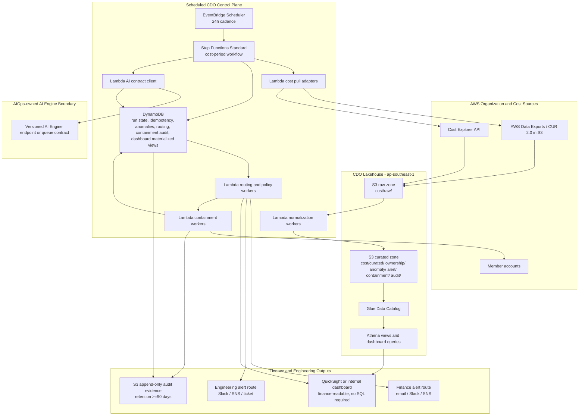
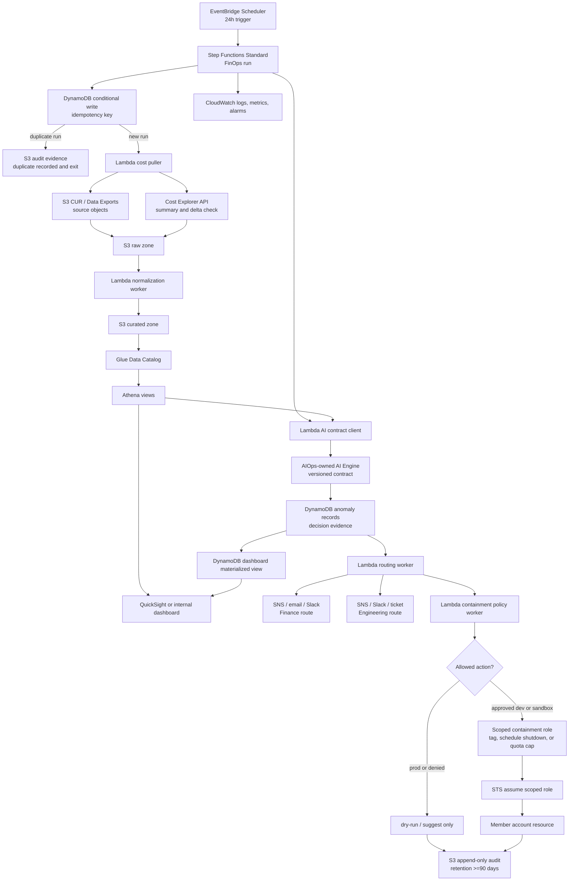

# Infrastructure Design - TF2 FinOps Watch CDO

## 1. Architecture Direction

The CDO platform for TF2 FinOps Watch is an AWS-only, lakehouse-centric FinOps control plane in `ap-southeast-1`. It is designed for scheduled cost-period processing rather than request-response traffic. The default cadence is 24h because it balances Cost and Usage Report delivery lag, Cost Explorer availability, operating cost, and false-positive control better than a 12h or 48h cadence for this capstone scope.

The platform ingests synthetic cost data unless real AWS bill access is explicitly provided. Data sources are AWS Data Exports/CUR 2.0 or CUR files in S3 plus Cost Explorer API. CDO owns the cost data pull, normalized cost windows, ownership metadata, orchestration, idempotency, dashboard materialization, alert routing, containment guardrails, and audit evidence. The AIOps team owns anomaly detection logic, model selection, model versioning, confidence scoring, explanation text, AI Engine runtime, and AI backtest metrics.

The hard production safety boundary is: NEVER terminate prod, delete data, or modify IAM. All containment paths support `dry-run`; prod is limited to tag, suggest, or dry-run behavior. If the AIOps-owned AI Engine is unavailable, CDO fails closed for containment, alerts operators, preserves the failed run, and writes an audit record.

## 2. Target Architecture



This layout keeps the data plane durable and queryable in S3, Glue, and Athena, while keeping workflow state and idempotency in DynamoDB. Step Functions Standard is preferred over ad hoc Lambda chaining because the workflow needs visible retries, failure states, and evidence for each cost period. Lambda is the default compute choice for short CDO adapters and policy workers. Fargate is reserved for a future long-running connector if the final AI Engine contract requires persistent connections or heavier batch processing.

### AWS Services Workflow Diagram



This workflow diagram shows the runtime order of AWS services for one scheduled cost period. The Step Functions execution remains the control spine, DynamoDB prevents duplicate processing, S3/Glue/Athena provide the lakehouse evidence path, and all alerting or containment decisions end in append-only S3 audit evidence.

## 3. Data Flow

1. **Schedule start**: EventBridge Scheduler starts one Step Functions Standard execution for the current eligible cost period at the chosen 24h cadence.
2. **Idempotency check**: The workflow writes a conditional DynamoDB run-state item before processing. If the same cost period and data version already exist, the workflow records a duplicate-run audit event and exits without reprocessing.
3. **Cost data pull**: Lambda adapters pull synthetic CUR/Data Exports objects from S3 and query Cost Explorer for summary validation, service-level totals, and recent cost deltas.
4. **Normalization**: Workers normalize account, service, region, owner tag, environment, usage date, cost period, cost amount, and USD currency into curated S3 prefixes and Athena tables.
5. **AI invocation**: The AI contract client sends the normalized cost window and evidence URI to the AIOps-owned AI Engine. CDO validates required response fields, timeouts, retries transient errors, and trips a circuit breaker for repeated failures.
6. **Evidence persistence**: AI decision outputs are stored in DynamoDB anomaly records and S3 evidence prefixes. CDO stores model version and backtest metrics only as AIOps-provided integration evidence.
7. **Dashboard materialization**: Athena views and DynamoDB materialized dashboard records update spend trend, anomaly overlay, confidence display, owner routing, containment status, and audit links.
8. **Alert routing**: Routing workers send Finance alerts for business impact and Engineering alerts for owner action. Routes are based on anomaly type, severity, owner tags, account, environment, and approval requirement.
9. **Containment decision**: Policy workers evaluate whether an action is allowed. Prod receives tag, suggest, or dry-run only. Dev and sandbox may allow approved schedule shutdown or quota cap paths.
10. **Audit write**: Every containment proposal or action writes actor, timestamp, correlation ID, idempotency key, anomaly ID, owner, before state, proposed or applied after state, execution mode, rollback path, approval status, retention location, and retention period.

## 4. Component Table

| Component | AWS service | Responsibility | Reason | Cost note |
|---|---|---|---|---|
| Cost export storage | S3 for AWS Data Exports/CUR 2.0 | Receives detailed cost and usage files | Native AWS billing export source and durable batch input | Storage grows with synthetic history and partition count; lifecycle policy required |
| Cost summary access | Cost Explorer API | Provides recent service/account cost summaries and cross-checks | Complements CUR lag with API-level validation | API usage should stay low at 24h cadence; watch throttling |
| Raw data lake | S3 raw zone | Stores immutable pulled source data by cost period and ingestion time | Preserves source evidence for replay and audit | Use partitioned prefixes and lifecycle controls |
| Curated data lake | S3 curated zone | Stores normalized cost, ownership, anomaly, alert, containment, and audit datasets | Keeps dashboard and downstream jobs off raw files | Evidence needed: expected GB-month for synthetic 3-month dataset |
| Metadata catalog | Glue Data Catalog | Defines schemas and partitions for Athena | Makes S3 data queryable without a warehouse cluster | Glue crawler frequency should match cadence, or use explicit partition registration |
| Query layer | Athena | Serves dashboard and investigation queries | Serverless query layer fits batch FinOps evidence | Enforce query limits and partition pruning to control spend |
| Scheduler | EventBridge Scheduler | Starts the 24h cost-period workflow | Simple managed cadence with low operational overhead | Lower frequency than 12h reduces duplicate work and API calls |
| Workflow engine | Step Functions Standard | Coordinates pull, normalize, AI call, routing, containment, and audit steps | Durable execution history, retries, and visible failure states | Standard workflows fit low-frequency batch runs |
| Short compute | Lambda | Implements adapters, validators, route workers, and policy workers | Low fixed cost and simple scaling for short CDO tasks | Evidence needed: measured Lambda duration and memory after W12 tests |
| Long connector option | ECS Fargate | Optional worker for long-running AI connector or heavy batch job | Used only if Lambda limits are exceeded | Not part of the default path because it adds fixed runtime cost |
| Operational state | DynamoDB | Stores run state, idempotency keys, anomaly records, routing state, containment audit index, and dashboard materialized views | Low-latency conditional writes and serverless metadata storage | On-demand mode is suitable until access patterns stabilize |
| AI integration | AIOps-owned AI Engine endpoint or queue | Receives normalized cost window and returns anomaly decision contract | Keeps model ownership outside CDO while preserving integration evidence | AI runtime cost belongs to AIOps, not CDO platform cost |
| Dashboard | QuickSight or lightweight internal dashboard | Displays finance-readable spend trend, anomaly overlay, confidence, owners, and audit links | Finance users must not need SQL knowledge | QuickSight refresh cadence should follow the 24h workflow |
| Alerting | SNS plus email or Slack webhook targets | Separates Finance and Engineering notification paths | Keeps business escalation distinct from owner remediation | Alert volume should be budgeted and throttled |
| Observability | CloudWatch Logs, metrics, alarms | Tracks workflow failures, API throttling, stale dashboards, and containment denials | Native AWS visibility for capstone operations | Log retention should be capped and reviewed in cost analysis |
| Cross-account access | IAM roles and STS assume-role | Provides read-only cost access and scoped containment access | Supports multi-account AWS without static credentials | Role sprawl must be controlled with naming and policy boundaries |
| Audit evidence | S3 append-only audit prefix with retention controls | Stores containment and run evidence for at least 90 days | Finance-readable and compliance-friendly evidence trail | Use lifecycle tiers after the hot review period |

## 5. Multi-Account Access

The management account hosts the CDO control plane and cost lakehouse. Member accounts expose read-only roles for cost metadata, tag inventory, and environment ownership lookup. Cost data access is centralized through CUR/Data Exports in S3 and Cost Explorer API permissions. No member account grants broad administrative access to the CDO workflow.

Containment roles are separate from cost-read roles. They are tightly scoped by account, environment, action type, and resource pattern:

| Environment | Allowed CDO containment behavior | Denied behavior |
|---|---|---|
| Prod | Tag for review, create recommendation, send alert, record dry-run result | Termination, deletion, IAM modification, schedule shutdown apply, quota cap apply |
| Staging | Tag for review, dry-run schedule shutdown, dry-run quota cap, recommendation | Deletion and IAM modification |
| Dev and sandbox | Tag for review, approved schedule shutdown, approved quota cap, right-sizing suggestion | Data deletion, IAM modification, unapproved apply action |

All role assumptions include correlation ID and run ID in session tags where supported. CloudTrail management events and CDO audit records must be linkable by correlation ID.

## 6. Idempotency and Run State

The workflow must ensure the same cost period cannot be processed twice. The idempotency key format is:

```text
finops-watch:{cadence}:{cost-period-start}:{cost-period-end}:{account-scope}:{source-data-version}
```

`source-data-version` is derived from the CUR/Data Exports object manifest, object ETag set, or synthetic dataset version. The first workflow step writes a DynamoDB item with a conditional expression that only succeeds when the key does not exist. The item stores:

| Field | Purpose |
|---|---|
| `idempotency_key` | Primary duplicate-run guard |
| `run_id` | Correlates Step Functions execution, alerts, AI request, and audit records |
| `cost_period_start` and `cost_period_end` | Defines the cost window |
| `cadence` | Records 24h schedule decision |
| `source_data_version` | Detects whether source files changed |
| `status` | `started`, `completed`, `failed`, `duplicate`, or `ai_unavailable` |
| `ai_contract_version` | Records the AIOps contract version consumed by CDO |
| `dashboard_refresh_status` | Shows whether dashboard materialization completed |
| `audit_uri` | Points to S3 evidence for the run |

If a run fails, the status remains queryable and replay requires an explicit operator action with a new source data version or a manual replay reason. Duplicate runs do not call the AI Engine, do not send duplicate alerts, and do not trigger containment.

## 7. Containment Architecture

Containment is policy-driven and dry-run-first. Each action is evaluated against account, environment, owner, anomaly type, approval requirement, and allowed action list before any apply path is considered.

| Pattern | Capstone status | Apply scope | Description |
|---|---|---|---|
| Tag for review | Implemented design pattern | Dev, sandbox, staging; prod as tag/suggest only | Adds or proposes a review tag such as `FinOpsWatch=ReviewRequired` with anomaly ID and owner context. In prod, this remains tag/suggest/dry-run only based on client approval. |
| Schedule shutdown | Designed containment pattern | Dev and sandbox only after policy approval | For idle or runaway non-prod resources, proposes or applies a scheduled stop window. It never terminates resources and includes rollback by removing the schedule. |
| Quota cap | Designed containment pattern | Dev and sandbox only after policy approval | For runaway training or spend spikes, proposes a service quota or budget guardrail action. IAM modification is not allowed; any quota action must use pre-approved mechanisms. |

Every containment action records actor, timestamp, correlation ID, idempotency key, anomaly ID, resource/account/squad owner, before state, proposed or applied after state, execution mode, rollback path, approval status, retention location, and retention period. Audit retention is >=90 days.

## 8. Failure Modes and Recovery

| Failure mode | Detection | Recovery behavior | Containment behavior | Evidence |
|---|---|---|---|---|
| CUR/Data Exports delay | Expected object or manifest missing for cost period | Mark run as waiting or failed depending on age; retry on next schedule | No containment | Run-state item and CloudWatch alarm |
| Cost Explorer throttling | API 429 or throttling exception | Exponential backoff with bounded retries; use CUR-derived data when sufficient | No apply action until data confidence is acceptable | Error metric and run audit event |
| AI Engine timeout | AI contract client exceeds timeout | Retry transiently, then open circuit breaker for the run | Fail closed; no automatic apply action | `ai_unavailable` run status and operator alert |
| AI Engine unavailable | 5xx, network failure, authentication failure, or circuit open | Preserve failed run, alert operators, write audit event | Fail closed; no automatic apply action | S3 audit record and DynamoDB status |
| Failed workflow step | Step Functions task failure after retries | Mark run failed and preserve partial artifacts | No new containment action | Step Functions execution history |
| Duplicate scheduled run | DynamoDB conditional write fails for idempotency key | Exit as duplicate without AI call or alert send | No containment | Duplicate-run audit record |
| Dashboard stale data | Dashboard materialized view timestamp older than last completed run | Raise stale-dashboard alarm and show last refresh time | Containment does not depend on dashboard freshness | Dashboard status field and CloudWatch alarm |
| Alert delivery failure | SNS, email, Slack, or webhook delivery failure | Retry route, then send fallback operator alert | Containment remains gated by policy and approval | Routing-state record |
| Containment denial | Policy denies action due to prod, missing approval, unknown owner, or unsupported resource | Record denial and route recommendation to owner | Dry-run or suggest only | Containment audit record |
| Audit write failure | S3 put or DynamoDB audit index write fails | Treat as workflow failure; do not apply containment without audit write | Fail closed | Failed audit metric and run status |

## 9. Operational Scaling and Limits

The expected workload is low-frequency batch processing, not high-RPS API serving. Scaling pressure comes from account count, CUR file size, Athena query cost, and alert volume. The default approach is to partition S3 data by cost period, account, service, and environment; use Athena partition pruning; keep DynamoDB access patterns keyed by run ID, anomaly ID, and owner route; and limit dashboard refresh to the completed workflow cadence.

The 24h cadence reduces Cost Explorer calls, Step Functions executions, dashboard refreshes, and duplicate alert risk compared with 12h. A 48h cadence is cheaper but weakens time-to-detection for runaway non-prod spend such as training clusters. Evidence needed: measured workflow duration, Athena bytes scanned, Lambda duration, and dashboard refresh time from W12 synthetic demo runs.

## 10. Open Questions

| Question | Owner needed | Why it matters |
|---|---|---|
| Final AI Engine contract shape: endpoint vs queue, authentication, timeout, and response schema | AIOps team | CDO must implement the exact invocation, retry, and validation behavior |
| Synthetic dataset versioning format | Client or mentor | Idempotency depends on stable source-data-version calculation |
| Final account and squad ownership mapping | Client | Routing and containment policy require reliable owner metadata |
| Human approval owner for dev/sandbox apply actions | Client | Schedule shutdown and quota cap apply paths require explicit approval authority |
| Dashboard implementation choice: QuickSight or internal web dashboard | CDO team and client | Determines refresh mechanism, access control, and evidence screenshots |
| Alert targets for Finance and Engineering | Client | CDO needs route destinations and escalation expectations |

## Related Documents

- `01_requirements_analysis.md` defines the CFO problem, CDO requirements, and CDO/AIOps ownership boundary.
- `03_security_design.md` expands IAM least privilege, encryption, secrets, network boundaries, and audit controls.
- `04_deployment_design.md` defines IaC, CI/CD, environment separation, deployment gates, and rollback.
- `05_cost_analysis.md` estimates the CDO platform cost separately from AIOps AI Engine runtime cost.
- `06_dashboard_alerting_design.md` defines finance-readable dashboard views and alert payloads.
- `08_adrs.md` records the 24h cadence, lakehouse-centric architecture, dry-run-first containment, and audit-retention decisions.
