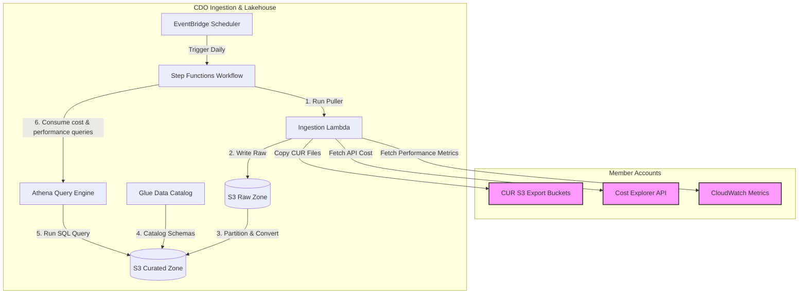
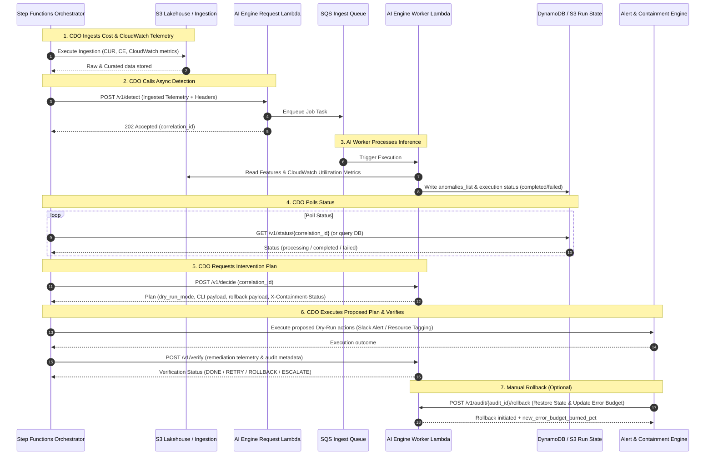

# Infrastructure Design - Task Force 2 · FinOps Watch CDO

<!-- Doc owner: CDO Team
     Status: Final (W11 T6 Pack #1) -> Updated (W12 T4 Pack #2)
-->

> [!IMPORTANT]
> **Safety Boundary**: All containment actions executed by this infrastructure must conform to the absolute hard boundaries: **NEVER terminate prod, delete data, or modify IAM**.


## 1. Architecture diagram

The CDO platform is designed around a lakehouse-centric data plane for ingest and analysis, orchestrated by serverless workflows, and integrated with a shared AIOps-provided AI Engine hosted on AWS Lambda container images. The serverless compute tier utilizes Lambda functions running within private subnets. The central Step Functions orchestrator coordinates the execution flow by invoking the AI Engine Request Lambda directly. An asynchronous queueing model using SQS/DLQ isolates heavy inference workloads from request validation. The Request Lambda processes incoming detection requests, publishes them to SQS, and returns status immediately. Note that `/v1/detect`, `/v1/status/{id}`, `/v1/decide`, `/v1/verify`, and `/v1/audit/{audit_id}/rollback` represent logical contract semantics for model integration, not deployed REST/HTTP routes in this baseline batch workflow, as no Private API Gateway is deployed.

The architecture is sized around recurring CDO platform responsibilities, not around the AIOps model-training dataset. CDO must reliably pull cost and performance data from approved AWS sources, normalize it into a contract-ready shape, invoke the AIOps-owned AI Engine, and preserve the returned decision evidence. Any synthetic historical dataset used to train, enhance, or backtest the model remains AIOps-owned. Detection telemetry includes CUR data, Cost Explorer API queries, and CloudWatch performance metrics (`resource_utilization_metrics` such as CPU, memory, network, disk, database connections, and GPU metrics). If CloudWatch metrics are unavailable, the platform automatically falls back to CUR-only mode, halving the model confidence score (`confidence *= 0.5`) and forcing dry-run/alert-only containment.

```mermaid
graph TB
    subgraph "AWS Member Accounts"
        MemberS3[CUR S3 Export Buckets]
        MemberCE[Cost Explorer API Endpoints]
        MemberCW[CloudWatch Metrics Endpoints]
    end

    subgraph "CDO Management Account VPC (ap-southeast-1)"
        subgraph "Ingestion & Orchestration"
            EB[EventBridge Scheduler] -->|Trigger Daily| SF[Step Functions Workflow]
            SF -->|Invoke Puller| LambdaPull[Ingestion Lambda]
            SF -->|Evaluate Run| LambdaState[State Lambda]
            SF -->|Trigger Containment| LambdaCont[Containment Lambda]
            SF -->|Route Alerts| LambdaAlert[Alert Routing Lambda]
        end

        subgraph "Data Lakehouse Tier"
            S3Raw[(S3 Raw Zone)]
            S3Cur[(S3 Curated Zone)]
            GlueCat[Glue Data Catalog]
            Athena[Athena Query Engine]
        end

        subgraph "Private Subnets (Serverless Compute & Queue)"
            subgraph "Request Lambda"
                AILambdaReq[AI Engine Request Lambda]
            end

            subgraph "SQS Buffer"
                SQSQueue[SQS Ingest Queue]
                SQSDLQ[SQS Dead Letter Queue]
            end

            subgraph "Worker Lambda Executor"
                AILambdaWorker[AI Engine Worker Lambda]
            end

            VPCEndpoints[Private VPC Endpoints: S3, DDB, ECR, KMS, Logs, STS, Secrets]
        end

        subgraph "Database Store"
            DDB[(DynamoDB Run State, Audit & Results)]
        end
    end

    subgraph "Alerting & Presentation"
        Slack[Slack Notification Engine]
        Email[SES Email Target]
        S3Dashboard[S3 Static Dashboard Assets]
        CloudFront[CloudFront HTTPS Ingress]
        Cognito[Cognito User Pool & Hosted UI]
        LambdaEdge["Lambda@Edge Auth Validator"]
    end

    %% Ingestion flows
    LambdaPull -->|Fetch Cost Data| MemberCE
    LambdaPull -->|Pull CUR Files| MemberS3
    LambdaPull -->|Fetch Performance Metrics| MemberCW
    LambdaPull -->|Write raw cost| S3Raw

    %% Transformation flows
    S3Raw -->|Partition/Schema Validation| S3Cur
    GlueCat -->|Catalog schemas| S3Cur
    Athena -->|Query data| S3Cur

    %% Orchestration & Database interactions
    LambdaState -->|Idempotency key check & write state| DDB
    LambdaCont -->|Write immutable audit trail| DDB
    LambdaCont -->|Assume role & tag/suggest/shutdown| MemberAccounts[Member Accounts Resources]
    LambdaAlert -->|Route alert payload| Slack
    LambdaAlert -->|Route alert payload| Email

    %% AI Engine Integration
    SF -->|1. POST /v1/detect| AILambdaReq
    AILambdaReq -->|2. Queue detection job| SQSQueue
    AILambdaReq -->|3. Return accepted status| SF
    SQSQueue -->|4. Trigger worker| AILambdaWorker
    SQSQueue -.->|Failed retries| DLQ
    AILambdaWorker -->|5. Read cost & CloudWatch metrics| S3Cur
    AILambdaWorker -->|6. Write results| DDB
    AILambdaWorker -->|7. Write evidence payload| S3Cur
    SF -->|8. GET /v1/status/{correlation_id} (Poll DynamoDB)| DDB
    SF -->|9. POST /v1/decide| AILambdaWorker
    SF -->|10. POST /v1/verify / Rollback| AILambdaWorker
```

*Caption: The CDO pipeline is triggered daily by EventBridge Scheduler. The Step Functions workflow coordinates ingestion from member accounts, writes raw CUR, Cost Explorer, and CloudWatch performance data to S3, and catalogs it. The workflow invokes the AIOps-owned AI Engine Request Lambda (`POST /v1/detect`), which queues the detection task to SQS. The Worker Lambda is triggered by SQS, executes detection, and writes results to DynamoDB. Step Functions polls status (`GET /v1/status/{id}`), requests decisions (`POST /v1/decide`), and verifies remediation actions (`POST /v1/verify`) directly.*

---

To provide a clearer view of the CDO platform's operations, the overall architecture is broken down into a high-level overview followed by three detailed zoom-in diagrams below:

### 1.1 High-Level Architecture Overview

This diagram represents the high-level macro interactions between the central orchestrator, the lakehouse data plane, the Lambda container compute, and the alerting/containment engines.

```mermaid
graph TD
    subgraph "Member Accounts"
        Members[AWS Resources, Cost Exports & CloudWatch Metrics]
    end

    subgraph "CDO Management Account"
        SF[Step Functions Orchestrator] -->|1. Ingest Data| Lakehouse[(S3 Lakehouse & Athena)]
        Lakehouse -->|2. Cost & Performance Data| SF
        SF -->|3. POST /v1/detect| AILambdaReq[AI Engine Request Lambda]
        AILambdaReq -->|4. Queue Task| SQS[SQS Buffer]
        SQS -->|5. Execute Inference| AILambdaWorker[AI Engine Worker Lambda]
        AILambdaWorker -->|6. Store Results| DDB[(DynamoDB Run State / S3)]
        SF -->|7. Poll GET /v1/status/{id}| DDB
        SF -->|8. POST /v1/decide| AILambdaWorker
        SF -->|9. Execute Containment Plan| Actions[Alerting & Containment Engine]
        SF -->|10. POST /v1/verify| AILambdaWorker
    end

    Actions -->|11. Apply Policy| Members
    Actions -->|12. Publish| Dashboard[Finance Dashboard / Channels]
```

*Caption: The central Step Functions Orchestrator drives the entire FinOps loop: extracting cost and CloudWatch telemetry to the Lakehouse, calling Request Lambda (`POST /v1/detect`), polling results via `GET /v1/status/{id}`, calling `POST /v1/decide` to get plans, triggering containment actions, and verifying outcomes via `POST /v1/verify`.*

Operationally, Step Functions is the control boundary between deterministic CDO logic and probabilistic AI output. Every transition records a `run_id`, cost window, account scope, and contract version so that Finance can trace a dashboard anomaly back to the exact ingestion batch and AI decision. This design also prevents the AI Engine from directly touching member accounts; all alerting and containment actions are mediated by CDO policy workers.

### 1.2 Ingestion & Data Lakehouse Workflow

This diagram zooms in on the ingestion pipeline and the lakehouse storage/query layers.



*Caption: Step Functions invokes the Ingestion Lambda daily via EventBridge Scheduler. Raw cost data and CloudWatch utilization metrics are stored in the S3 Raw Zone, transitioned and cataloged into Parquet format in the S3 Curated Zone, and made queryable via Athena. The query results are passed back to the Step Functions orchestrator to feed the AI Engine.*

The ingestion workflow normalizes the two operational billing shapes and CloudWatch performance metrics before invoking the AI Engine. CUR provides resource-level fields such as account ID, product code, resource ID, unblended cost, and resource tags. Cost Explorer provides aggregate fields such as linked account, service name, service code, region, unblended cost, and estimated/final status. CloudWatch provides resource utilization metrics (CPU, memory, net, disk, DB connections, and GPU metrics). The curated layer keeps normalized display name and service code fields so CDO can build dashboard views without taking ownership of model training data.

### 1.3 AI Engine Lambda Container Hosting Platform

This diagram zooms in on the AWS Lambda container architecture, showing the Step Functions invocation of the Request Lambda, SQS queuing, and the Worker Lambda executing asynchronous inference.

```mermaid
graph TB
    subgraph "CDO Orchestration"
        SF[Step Functions Workflow]
    end

    subgraph "Data Lakehouse"
        CuratedS3[(S3 Curated Zone)]
    end

    subgraph "Database Store"
        DDB[(DynamoDB Run State & Results)]
    end

    subgraph "Private Serverless Compute & Queues"
        subgraph "Request Ingress & Control"
            Request[AI Engine Request Lambda Function]
        end

        subgraph "Asynchronous Messaging"
            SQS[SQS Ingest Queue]
            DLQ[SQS Dead Letter Queue]
        end

        subgraph "Async Inference Execution"
            Worker[AI Engine Worker Lambda Function]
        end
    end
    
    subgraph "Central Registry & Secrets"
        ECR[Amazon ECR]
        SM[Secrets Manager]
    end

    %% Flow
    SF -->|1. POST /v1/detect| Request
    Request -->|2. Enqueue Job & Return Accepted| SQS
    SQS -->|3. Trigger Worker| Worker
    SQS -.->|Failed retries| DLQ
    Worker -->|4. Read Cost & Performance Features| CuratedS3
    Worker -->|5. Write inference results & state| DDB
    Worker -->|6. Write evidence payload| CuratedS3
    SF -->|7. Poll status / GET /v1/status/{id}| DDB
    SF -->|8. POST /v1/decide| Worker
    SF -->|9. POST /v1/verify| Worker
    
    Request -.->|Pull Image by Digest| ECR
    Worker -.->|Pull Image by Digest| ECR
    Request -.->|Access SDK| SM
    Worker -.->|Access SDK| SM
```

*Caption: The AI Engine detection request from the Step Functions orchestrator is sent via direct Lambda invocation to the AI Engine Request Lambda function (`POST /v1/detect`). The Request Lambda validates the request, enqueues the job to an SQS Queue, and returns an accepted status with an audit ID. The Worker Lambda is triggered by SQS to perform batch scoring, read cost and CloudWatch utilization metrics from S3, and write results back to DynamoDB. The central Step Functions orchestrator polls status (`GET /v1/status/{id}`), requests decisions (`POST /v1/decide`), and verifies remediation actions (`POST /v1/verify`) directly.*

The Lambda-based platform separates request validation from asynchronous batch execution using SQS queues. The AI Engine Request Lambda function handles rapid ingress validation (accepting detection requests, generating audit IDs, and enqueuing jobs). The AI Engine Worker Lambda function is triggered asynchronously by SQS to perform resource-intensive model inference, checkpointing feature progress to S3 and storing final results in DynamoDB. The central Step Functions orchestrator polls the DynamoDB table directly to verify execution status (`GET /v1/status/{id}`) and retrieve the final decisions (`POST /v1/decide`). This decoupling ensures rapid response to the orchestrator, isolates compute consumption via reserved concurrency limits, and uses native SQS/DLQ retries to handle transient failures gracefully without REST/HTTP proxy layers.

### 1.4 Alerting & Containment Engine

This diagram zooms in on the alerting and containment flow, detailing how policy is enforced safely across production and non-production environments with a compliance audit trail.

```mermaid
graph TB
    subgraph "CDO Orchestration"
        SF[Step Functions Workflow]
    end

    subgraph "Member Accounts"
        DevSand[Dev/Sandbox Resources]
        Prod[Prod Resources]
    end

    subgraph "CDO Management Account"
        SF -->|1. Route Alerts| AlertLambda[Alert Routing Lambda]
        SF -->|2. Execute Policy & verify| ContLambda[Containment Lambda]
        
        StateLambda[State Lambda] -->|Read/Write Run Lock| StateDB[(DynamoDB Run State)]
        SF -->|Query State| StateLambda
        
        ContLambda -->|Write Audit Record| AuditDB[(DynamoDB Audit Trail)]
        ContLambda -->|3. Tag/Shutdown| DevSand
        ContLambda -->|4. Dry-Run / Tag Only| Prod
    end

    subgraph "Channels & Presentation"
        AlertLambda -->|Slack Alert| Slack[Slack Channels]
        AlertLambda -->|Email Alert| SES[SES / Email Targets]
        CloudFront[CloudFront HTTPS] -->|Serve authenticated UI| S3Dashboard2[S3 Static Dashboard]
        S3Dashboard2 -->|Read precomputed summaries| AuditDB
        S3Dashboard2 -->|5. Trigger actions (POST)| APIGateway[AWS API Gateway / Lambda Function URL]
        APIGateway -->|6. Execute action| ContLambda
        CloudFront -->|Auth redirect| Cognito[Cognito User Pool]
        LambdaEdge["Lambda@Edge Auth Validator"] -->|Validate cookie JWT| CloudFront
    end
```

*Caption: The Step Functions workflow triggers separate alerting and containment Lambdas based on the AI Engine's decisions. Containment Lambdas read run state, write audit logs to DynamoDB, apply active containment (tag/shutdown) on Dev/Sandbox accounts, and execute dry-run actions (tag/suggest only) on Prod. An S3 + CloudFront static web dashboard reads precomputed DynamoDB/S3 JSON audit and spend summaries to present containment status directly to Finance stakeholders. Dashboard action controls (such as manual rollbacks or containment extensions) are routed securely from the S3 Static Dashboard to the Containment Lambda via an AWS API Gateway (HTTP API) or AWS Lambda Function URL endpoint. CDO calls `POST /v1/verify` to complete the loop, and supports manual rollbacks via `POST /v1/audit/{audit_id}/rollback`.*

The containment engine treats `execution_mode` as a mandatory policy input, not a runtime convenience. Production resources can only receive tag, suggest, or dry-run outcomes, while dev/sandbox resources may receive apply-mode actions only when policy and approval requirements are satisfied. Each proposed or executed action writes an audit record before attempting any member-account operation. Once completed, CDO invokes `POST /v1/verify` to report the telemetry outcome, or triggers manual rollbacks via `POST /v1/audit/{audit_id}/rollback` which initiates resource tagging restoration.

### 1.5 Programmatic API Sequence Workflow

The detailed programmatic sequence between the Step Functions orchestrator, Lakehouse, and the hosted AI Engine functions is represented below:



*Caption: The programmatic API sequence diagram outlines the asynchronous anomaly detection and remediation validation loop, showing status polling, plans generation, verification, and manual rollback handlers.*

---

## 2. Component table

The following infrastructure components are deployed in `ap-southeast-1` to operate the FinOps Watch platform:

| Component | AWS Service | Reason | Cost note |
|---|---|---|---|
| Ingestion Trigger | EventBridge Scheduler | Triggers the ingestion pipeline daily on a serverless, managed cron schedule. | Free tier covers 14M invocations/month, then $1.00 per million. |
| Orchestration Layer | Step Functions | Serverless state machine executing workflow logic, conditional branches, wait states, and error retries. | $0.025 per 1,000 state transitions. |
| Compute (Adapters) | Lambda | Runs lightweight, serverless adapter code to pull Cost Explorer API data, copy CUR 2.0 exports, and handle alerts/containment. | Pay-per-use, ~$0.00001667 per GB-second. |
| Data Lake (Raw) | Amazon S3 | Stores immutable daily CUR 2.0 files and Cost Explorer JSON dumps. | $0.023 per GB/month + request fees. |
| Data Lake (Curated) | Amazon S3 | Stores partitioned, schema-validated cost files in Parquet format, optimized for querying. | $0.0125 per GB/month (Infrequent Access) + transition fees. |
| Metadata Catalog | Glue Data Catalog | Automatically registers table partitions and maintains the schema definitions for Athena. | First 1M cataloged objects are free; crawler runs cost $0.44 per DPU-hour. |
| Query Engine | Amazon Athena | Allows serverless SQL queries on S3 files to build materialized views and drive dashboards. | $5.00 per TB of data scanned. |
| State & Audit Database | Amazon DynamoDB | Stores run state, idempotency keys, containment audit logs, and dashboard materialized views. | On-demand capacity: $1.25 per million write units, $0.25 per million read units. |
| AI Engine Hosting | AWS Lambda (Container Image) | Hosts the shared AIOps-provided AI Engine (Request and Worker functions) using container images packaged in ECR with up to 10 GB storage size support. | Pay-per-use execution costs: ~$0.00001667 per GB-second. |
| Async Queue Buffer | Amazon SQS & DLQ | Buffers incoming detect tasks from the Request Lambda to isolate compute execution, scale worker Lambda, and manage failures via Dead Letter Queue. | $0.40 per million messages (first 1M free). |
| Container Registry | Amazon ECR | Hosts versioned Docker container images for AIOps models, referenced in deployment by immutable image digest hashes. | $0.10 per GB/month (first 500 MB free). |
| Secrets Provider | Secrets Manager | Securely manages API keys, DB credentials, and Slack webhooks, accessed dynamically via the AWS SDK inside Lambda functions. | $0.40 per secret/month + $0.05 per 10,000 requests. |
| Private VPC Traffic | VPC Endpoints | Enables secure, private access to AWS services (ECR, S3, DynamoDB, KMS, Logs, Secrets Manager) from within private VPC subnets. | ~$7.20 per endpoint/month per AZ + data processing charges. |
| Finance Dashboard | Amazon S3 + CloudFront | A lightweight internal web dashboard hosted as static assets in S3 and delivered through CloudFront. Assets are secured via OAC (Origin Access Control) and verified by Lambda@Edge. | CloudFront egress/request fees, S3 storage, and OAC (typically <$3/month). |
| Dashboard Auth Gateway | Amazon Cognito | Deploys Cognito User Pool, Hosted UI, and groups (finops-finance-readonly, finops-engineering-operator, finops-cdo-admin) to authenticate and authorize dashboard users. | User Pool feature is free up to 50,000 monthly active users (MAUs). |
| Viewer-Request Auth Gate | Lambda@Edge | Viewer-request handler checking secure HTTP-only cookies and validating JWT signatures against Cognito JWKS before forwarding requests to private S3 bucket. | ~$0.60 per million invocations + execution duration charges. |
| Dashboard Backend API | AWS API Gateway (HTTP API) or Lambda Function URLs | Provides secure public HTTPS endpoints for the dashboard frontend to trigger interactive action controls (like extend or rollback). Secures endpoints via Amazon Cognito JWT authorization or IAM. | HTTP API: $1.00 per million requests; Lambda Function URL is free. |
| Alert Channels | Amazon SNS / Slack API | Delivers separate routing paths for alerts (Finance alerts via Slack/Email, Eng alerts via Slack/Jira). | SNS is free up to 100k email notifications/month; Slack API is free. |
| Containment Worker | AWS Lambda | Assumes roles in member accounts to apply tags or shut down dev/sandbox resources, strictly executing in `dry-run` or `apply` modes. | Pay-per-use. |

> [!NOTE]
> Actual run costs for the CDO pipeline during the build period are tracked with: `Evidence needed: CDO pipeline actual operational costs`.

The component model maps directly to the three data contracts used by the platform:

| Contract | CDO component responsible | Minimum evidence retained |
|---|---|---|
| Cost data pull contract | EventBridge Scheduler, Step Functions, Ingestion Lambda, S3, Glue, Athena | Source object URI, cost window, account, service, region, tag owner, unblended cost, estimated/final flag. |
| AI decision output contract | AI Engine Request & Worker Lambdas, Step Functions, DynamoDB, S3 | Model version, anomaly ID, confidence, severity, expected vs actual spend, evidence window, explanation, recommended route. |
| Alert and containment contract | Alert Lambda, Containment Lambda, DynamoDB, S3 audit trail | Route target, approval requirement, execution mode, before/after state, rollback path, audit record ID. |

---

## 3. Differentiation angle deep-dive

### 3.1 Why this angle?

The CDO platform implements a **lakehouse-centric FinOps control plane with serverless orchestration and AWS Lambda container image hosting for the AI Engine**.
1. **Lakehouse Fit**: Production FinOps operates on a natural 24h cadence dictated by AWS CUR export frequencies. A lakehouse pattern (S3 + Glue + Athena) avoids the high fixed costs of an always-on data warehouse (like Redshift) or relational databases, while keeping historical cost data fully structured, audit-ready, and partition-queried.
2. **Serverless Orchestration**: EventBridge and Step Functions manage the flow serverless-first, keeping the operational overhead of the pipeline orchestrator near zero.
3. **AWS Lambda Container Hosting for AI**: The AIOps-provided AI Engine separates runtime tasks into:
   - Ingress validation tasks (handled by the Request Lambda) called directly by the orchestrator, performing rapid schema check and job enqueuing.
   - Asynchronous batch inference jobs (handled by the Worker Lambda) triggered via SQS to bypass Lambda timeout constraints.
   Hosting the AI Engine on AWS Lambda container images enables serverless scaling, eliminates idle compute costs (unlike always-on containers), and leverages ECR digest pinning for immutable deployment. Compute capacity and throttling are managed via Reserved Concurrency limits. Step Functions queries DynamoDB directly for completion status, removing the need for a synchronous HTTP polling endpoint. Offline model training, retraining, and heavy offline analysis remain outside the CDO runtime scope.

The practical reason this matters is operational independence. AIOps can iterate on model logic, feature engineering, and false-positive handling without changing the CDO workflow. CDO keeps the lakehouse, scheduler, API invocation path, alert routing, and containment policy stable, while the Lambda-container-hosted AI Engine can evolve behind a versioned contract.

### 3.2 Strengths (with metrics)

The metrics below highlight the trade-offs of the lakehouse-centric + Lambda container architecture compared to alternative CDO approaches:

| Axis | Chosen Angle (Lakehouse + Lambda Container) | Alternative A (ECS Cluster on EC2 + RDS Aurora) | Alternative B (Third-Party SaaS Platform) |
|---|---|---|---|
| **Cost per daily run (Ingest + Query)** | ~$0.15 (S3 + Athena pay-per-query) | ~$5.00 (Fixed daily rate of RDS instance) | N/A (Included in subscription fees) |
| **AI compute cost (Hosting/Month)** | ~$40 (Lambda pay-per-use + SQS queueing) | ~$240 (ECS cluster management + Spot instance scaling) | N/A |
| **Operational overhead (Hours/Week)** | ~0.5 hours (Managing serverless Terraform Lambdas) | ~8 hours (ECS cluster on EC2 and Terraform ECS configuration updates) | ~1 hour (SaaS connection updates) |
| **Account onboarding time** | < 10 mins (Terraform IAM cross-account stack) | ~25 mins (Manual DB schema setup + VPC peering) | > 60 mins (Manual setup + IAM configs) |
| **Scalability for model retraining** | N/A (Offline; training stays offline / AIOps-managed) | Excellent (ECS Spot task pools scaled via AWS Application Auto Scaling) | Poor (AIOps model cannot run locally) |

### 3.3 Accepted weaknesses

- **Lambda Cold Start and Scale Concurrency Limits**: Running inference workloads on Lambda container images can introduce cold-start latency (pulling container images on initialization) and risk concurrency limit exhaustion. This is accepted because detection runs on a daily batch cadence (not real-time), and API concurrency is isolated via Reserved Concurrency constraints.
- **VPC Endpoints Cost**: Routing all traffic privately within the VPC requires interface endpoints (ECR, S3, DynamoDB, KMS, Logs, Secrets Manager), adding fixed charges (~$7.20/endpoint/month per AZ). This is accepted to meet the strict security requirement of zero public transit of cost/audit data.
- **CUR Ingestion Latency**: AWS CUR exports lag by 8 to 24 hours. This lag is accepted since the platform runs on a 24-hour cadence, meaning real-time streaming is not required for daily anomaly detection.

---

## 4. Multi-account approach

### 4.1 Account model

The CDO platform is deployed in a central **CDO Management Account**. It ingests cost data from and triggers containment actions in multiple **Member Accounts** within the AWS Organization.
- **Cross-Account Cost Ingestion**: The central `LambdaCURPuller` assumes the read-only role `FinOpsCURPullerRole` in each target member account. This role grants access to retrieve local Cost Explorer API data and copy CUR files from the member account's S3 export bucket.
- **Cross-Account Containment**: The central `LambdaContainment` assumes `FinOpsContainmentWorkerRole` in the target member account. The assumed role contains tightly scoped permissions to tag resources or adjust Auto Scaling Groups (ASGs) in that specific member account.

The account model must preserve environment context because the same anomaly type has different action limits depending on environment. A runaway GPU workload in a non-prod research account may be eligible for containment after approval; a similar signal in a production payments account must remain tag/suggest/dry-run only.

### 4.2 Isolation pattern

- **Data Isolation**: Cost data collected from member accounts is stored in a single S3 bucket partitioned by Account ID: `s3://cdo-curated-bucket/account_id=123456789012/year=2026/month=06/`.
- **Query Isolation**: Athena table definitions use Glue partition projection. Athena queries executed for dashboard materialized views are restricted by the `account_id` partition key.
- **Ownership Resolution**: Resources are mapped to specific engineering squads using the standardized metadata tags `owner` and `squad`. When the ingestion pipeline encounters resources lacking these tags, it automatically assigns them to a default squad (`unassigned-resources`) and routes alerts to the CDO infrastructure channel for manual remediation.

Partitioning by account and period is the primary performance control, while tags provide the business ownership view. The platform must keep untagged spend visible instead of dropping it during normalization, because missing ownership tags are an important Finance escalation path even when AIOps owns the final anomaly classification.

### 4.3 Onboarding flow

When onboarding a new AWS account or squad to the FinOps Watch platform, the following automated pipeline is executed:

```
1. Add account ID and owner mapping to the Terraform 'accounts.tfvars' configuration.
2. Terraform execution applies IAM Stack:
   - Provisions 'FinOpsCrossAccountAccessRole' in the target member account.
   - Configures trust policy allowing the central CDO Lambda and the AI Engine Lambda execution roles to assume it.
   - Updates target account CUR export configuration to deliver data to S3.
3. Glue crawler is triggered to update partitions in the Glue Data Catalog.
4. E2E Validation run:
   - Ingestion Lambda makes a test API call to target account Cost Explorer.
   - Verifies IAM cross-account permission assumption and direct Lambda invocation.
5. Account status marked as 'ACTIVE' in the DynamoDB registry.
```

### 4.4 Idempotency

To prevent duplicate runs for the same cost period (which would skew dashboard data and incur duplicate Cost Explorer API fees), the CDO platform implements an idempotency mechanism:
- Every daily execution generates an idempotency key: `account_id:billing_period:execution_date` (e.g., `123456789012:2026-06:2026-06-22`).
- The Step Functions workflow begins by querying the DynamoDB `cdo-run-state-table` for the key.
- If the key exists with `Status = COMPLETED` or `Status = IN_PROGRESS`, the Step Functions workflow aborts gracefully, recording the duplicate attempt in the audit logs.
- If the key does not exist, a new record is created with `Status = IN_PROGRESS` and a TTL of 48 hours to lock the run.

### 4.5 Cost Data Caching & Cost Explorer Rate Limit Control

To protect the AWS Cost Explorer API from exceeding its strict rate limit of **5 requests per second**, the CDO platform implements a DynamoDB-based caching strategy as described in the telemetry contract:
- **CDO Cache Storage**: The Ingestion Lambda queries daily Cost Explorer metrics and caches the result payload inside a dedicated DynamoDB table (`cdo-cost-cache-table`) keyed by `AccountID:DateRange`.
- **AI Engine Offline Consumption**: When the AIOps-provided AI Engine Worker executes and requires historical baseline cost data (such as 7-day or 30-day trailing spends for feature engineering and anomaly analysis), it reads the cached cost records directly from the CDO DynamoDB store (or S3 curated parquet files via Athena) using direct SDK calls under its execution role.
- **Benefits**: This prevents the AI Engine and multiple platform Lambdas from calling the Cost Explorer API concurrently, ensuring the platform remains well below the 5 requests/sec threshold and eliminating any chance of AWS throttling.

### 4.6 Telemetry Ingestion Compliance & Validation

The CDO platform enforces all data-plane validation and security controls defined in `telemetry-contract.md` and `ai-api-contract.md`:
- **Schema & Ingestion Types**: Telemetry complies with schema version 3 (`telemetry://finops-watch/v3`). Ingestion supports `RAW_JSON` (<10MB Cost Explorer API data) and `S3_POINTER` (<500MB compressed CUR exports stored in S3) data ingestion types. No CloudWatch performance telemetry (utilization signals like CPUUtilization, DatabaseConnections, memory_mib) is sent to the AI Engine for detection; these are reserved strictly for platform operational observability (alerts, logging, metrics, dashboard).
- **Request & Integrity Fields**: Every direct Lambda invocation payload to the Request function includes standard cross-cutting metadata fields representing the contract headers: `tenant_id` (UUID v4), `idempotency_key` (composite key: `tenant_id:YYYY-MM-DD` with 24h DynamoDB TTL), `correlation_id` (UUID), `payload_sha256`, and `request_timestamp`.
- **Response Fields**: The API returns standard fields, including `audit_id`, `status` (`processing` | `completed` | `failed`), `anomalies_list` (containing `anomaly_metadata`, `finance_dashboard_data`, and `engineering_dashboard_data`), and `pagination` (with `next_token` and `limit`).
- **Control Flags**: 
  - `is_ad_hoc`: Bypasses 24h idempotency limits for emergency scans (capped at 5 requests/day).
  - `is_estimated`: Indicates AWS estimated data; lowers AI confidence score (<0.50), sets actions to review-only, and bypasses automatic containment.
  - `is_forced_dry_run`: Automatically set by the AI Engine if telemetry completeness score is `< 0.8`, forcing dry-run containment to prevent wrong actions on dirty data.
- **Audit Trail Chain**: Containment records write to a tamper-evident audit ledger using an integrity hash chain: `sha256(current_payload + previous_hash)` retained for $\ge 90$ days.
- **Request & Time Integrity**:
  - **Replay Protection**: The Request Lambda execution role and payload check enforces a 300-second request window (abs(now - timestamp) > 300s results in an error execution state with code `ERR_REPLAY_DETECTED`).
  - **Clock Skew Control**: Requests with a clock skew exceeding 10 seconds (`clock_skew_ms > 10000`) are rejected immediately.
- **Data Normalization & PII Scrubbing**: CDO anonymizes all PII at the ingestion layer, mapping CUR `line_item_unblended_cost` and reconciling CUR `service_code` (e.g., `AmazonEC2`) with Cost Explorer display names (`service`).
- **Business Context Signals**: Daily batches package external context markers (flash-sale, load test, or migration active flags) to provide the AI Engine with the business insights necessary to avoid benign false positive classifications.

---

## 5. Alternatives considered

### 5.1 Orchestration layer

- **Option A**: Apache Airflow on AWS (MWAA).
  - *Pros*: Excellent Python integration, native complex dependency trees, detailed task visualizer.
  - *Cons*: High fixed cost (~$350/month minimum), slow startup time (20+ minutes), complex infrastructure configuration.
- **Option B**: Lambda Direct Cron Trigger.
  - *Pros*: Simple, runs natively as an EventBridge schedule target calling a single Lambda function.
  - *Cons*: Difficult to orchestrate complex multi-step cross-account workflows, manage intermediate states, handle 15-minute timeout limitations, and implement custom error handlers compared to AWS Step Functions.
- **Chosen**: EventBridge Scheduler + Step Functions Standard.
  - *Reason*: 100% serverless, zero idle costs, native integration with AWS Lambda and DynamoDB, and robust out-of-the-box error retry handlers.

### 5.2 Data layer

- **Option A**: Amazon Redshift.
  - *Pros*: Ultra-fast relational SQL query performance on petabyte-scale datasets.
  - *Cons*: High minimum cost (~$180/month for a small provisioned node), excessive overhead for a mid-size company running 24h batch cycles.
- **Option B**: Amazon RDS PostgreSQL.
  - *Pros*: Structured queries, familiar transaction support, easy index management.
  - *Cons*: Fixed monthly instance charge, manual storage scaling, and lacks direct, performant integration with raw S3 parquet files.
- **Chosen**: Amazon S3 + Glue Data Catalog + Amazon Athena.
  - *Reason*: Leverages the true lakehouse model. Storage costs are minimal (S3), query costs are pay-per-use (Athena), and it supports raw semi-structured JSON alongside optimized Parquet data cataloging.

---

## 6. Scaling strategy

The CDO platform scales dynamically to handle increases in data volume and compute requirements:

- **Lambda Concurrency Limits**: The API and Worker Lambdas utilize AWS Lambda Reserved Concurrency limits to bound execution capacity. This prevents runaway API execution from consuming the entire account's concurrency pool, while Provisioned Concurrency can be enabled as a production optimization to eliminate cold-start lag.
- **SQS Ingestion Decoupling**: Rather than scaling computing tasks concurrently to handle massive ingestion batches, SQS queues buffer incoming tasks. This allows the Worker Lambda to process messages sequentially or in controlled batches (e.g. batch size of 10), preventing resource exhaustion on dependent databases like DynamoDB or external APIs.
- **Athena Query Optimization**: S3 buckets are partitioned by `account_id`, `year`, and `month`. Athena queries limit data scans to specific partitions, preventing execution bottlenecks.
- **DynamoDB Scaling**: The `cdo-run-state-table` is configured in **On-Demand Capacity Mode**, allowing it to scale instantly from zero to thousands of read/write requests without manual intervention.

The production scaling assumption is that line-item volume grows faster than account count. Therefore, S3 partitioning, Athena scan limits, and AI batch Lambda worker scaling are more important than increasing Lambda concurrency. Model-training or backtest dataset size is handled by AIOps; CDO scales the operational ingestion, invocation, dashboard, and audit path.

---

## 7. Failure modes + recovery

The following table outlines the failure modes, detection mechanisms, and recovery runbooks for the CDO platform:

| Failure | Detection | Recovery | RTO | RPO |
|---|---|---|---|---|
| **CUR Export Delay** | Step Functions validation Lambda returns empty or missing daily Parquet partition in S3. | Step Functions enters a wait state and retries every 2 hours. If delay exceeds 24 hours, it alerts the operator. | N/A | 24 hours |
| **Cost Explorer Throttling** | Ingestion Lambda catches `LimitExceededException` from AWS API. | Exponential backoff with random jitter in Lambda code; retries up to 5 times. | 30 mins | 0 |
| **AI Engine Timeout / Function Error** | Orchestrator receives Lambda execution error, SDK timeout, or Bedrock timeout (Nova LLM hard limit). | **CDO fails closed**: Ingestion workflow terminates, containment actions are blocked, a failed run is logged, and CDO immediately falls back to static rule-based SRE alerting. | 4 hours | 24 hours |
| **Failed Run Workflow** | Step Functions execution status updates to `FAILED`; triggers CloudWatch Alarm. | Step Functions logs the error block to DynamoDB. Engineers resolve the issue and trigger a manual redrive of the state machine from the failed step. | 2 hours | 24 hours |
| **Duplicate Run Attempt** | DynamoDB write returns unique key constraint violation, or API returns HTTP `409` with `Retry-After: 30`. | CDO worker sleeps for 30 seconds and polls for results, avoiding double calls. | < 10s | 0 |
| **Mismatched Idempotency Payload** | API returns HTTP `400` with `ERR_IDEMPOTENCY_MISMATCH` due to different payload on same key. | CDO logs critical alert, blocks run, and SRE fixes the key generation logic. | 2 hours | 0 |
| **Dashboard Stale Data** | CloudWatch Alarm triggers if the latest curated partition timestamp is >26 hours old. | Alerts engineers to review the pipeline logs and manually trigger a redrive of the daily ingestion run. | 1 hour | 24 hours |
| **Alert Delivery Failure** | `LambdaAlertRouting` catches connection timeout or HTTP 5xx error from Slack API. | The Lambda function sends the alert payload to an SQS Dead Letter Queue (DLQ) and attempts delivery via SES email fallback. | 10 mins | 0 |
| **Containment Action Denial** | Member account cross-account role assumption returns `AccessDeniedException`. | **CDO fails closed**: The incident is logged in the DynamoDB audit table as `DENIED`, and a critical alert is sent to the security channel. | 1 hour | 0 |
| **AI Contract Version Mismatch** | Pre-run validation finds that the deployed AI Engine API Lambda contract version differs from the Step Functions expected schema. | Block the run before detection, mark the run as `FAILED_CONTRACT_CHECK`, notify CDO and AIOps, and do not execute containment. | 2 hours | 24 hours |
| **SQS Worker Lambda Failure** | SQS message processing fails, or worker Lambda execution times out (15-min limit) or crashes. | The SQS queue automatically retries execution based on the redrive policy. If retries are exhausted, the message is routed to the SQS DLQ, and an operator alert is fired. | 1 hour | 0 for checkpointed work |

---

## Related documents

- [`01_requirements_analysis.md`](01_requirements_analysis.md) - Business context, NFR targets, and CDO/AIOps boundaries.
- [`03_security_design.md`](03_security_design.md) - IAM roles, Security Groups, Lambda execution roles, and KMS encryption keys.
- [`04_deployment_design.md`](04_deployment_design.md) - Terraform IaC modular configurations, GitHub Actions (CI/CD) deployment pipelines.
- [`05_cost_analysis.md`](05_cost_analysis.md) - Estimated pipeline operational budget and cadence comparisons.
- [`08_adrs.md`](08_adrs.md) - Architectural decisions regarding 24h cadence, Lambda container images, and direct Lambda/SQS invocation.
