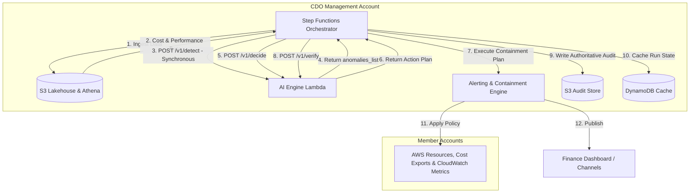
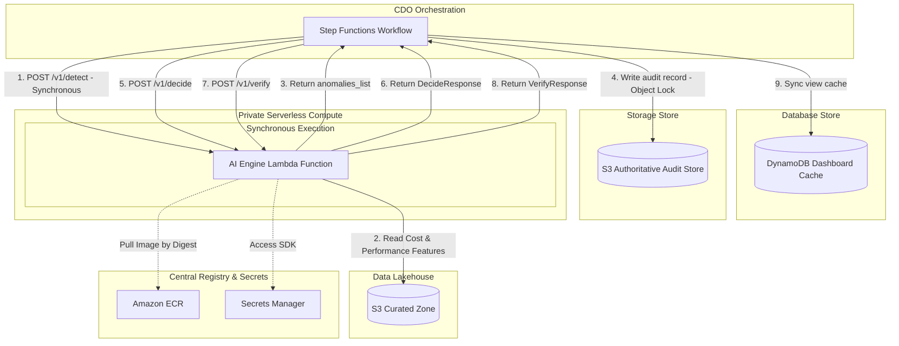
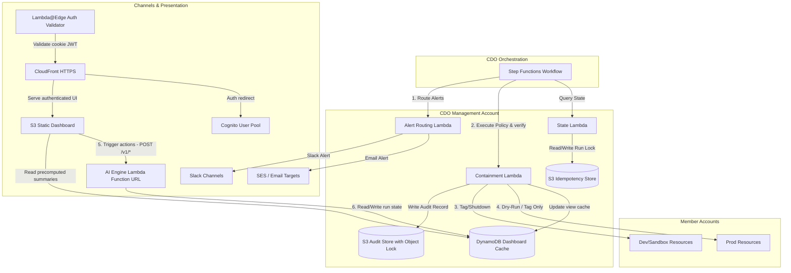
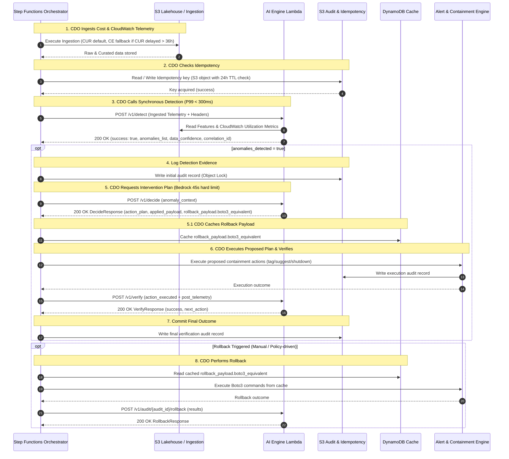

# Infrastructure Design - Task Force 2 · FinOps Watch CDO

<!-- Doc owner: CDO Team
     Status: Final (W11 T6 Pack #1) -> Updated (W12 T4 Pack #2)
-->

> [!IMPORTANT]
> **Safety Boundary**: All containment actions executed by this infrastructure must conform to the absolute hard boundaries: **NEVER terminate prod, delete data, or modify IAM**.


## 1. Architecture diagram

The CDO platform is designed around a lakehouse-centric data plane for ingest and analysis, orchestrated by serverless workflows, and integrated with a shared AIOps-provided AI Engine hosted on AWS Lambda container images. The serverless compute tier utilizes Lambda functions running within private subnets. The central Step Functions orchestrator coordinates the execution flow by invoking the AI Engine Lambda directly and synchronously. Note that `/v1/detect`, `/v1/status/{id}`, `/v1/decide`, `/v1/verify`, and `/v1/audit/{audit_id}/rollback` represent logical contract semantics for model integration, not deployed REST/HTTP routes in this baseline batch workflow, as no Private API Gateway is deployed.

The architecture is sized around recurring CDO platform responsibilities, not around the AIOps model-training dataset. CDO must reliably pull cost and performance data from approved AWS sources, normalize it into a contract-ready shape, invoke the AIOps-owned AI Engine, and preserve the returned decision evidence. Any synthetic historical dataset used to train, enhance, or backtest the model remains AIOps-owned. Detection telemetry includes CUR data, Cost Explorer API queries, and CloudWatch performance metrics (`resource_utilization_metrics` such as CPU, memory, network, disk, database connections, and GPU metrics). If CloudWatch metrics are unavailable, the platform automatically falls back to CUR-only mode, setting `data_confidence = LOW` and forcing dry-run/alert-only containment.

```mermaid
graph TB
    subgraph "AWS Member Accounts"
        MemberS3[CUR S3 Export Buckets]
        MemberCE[Cost Explorer API Endpoints]
        MemberCW[CloudWatch Metrics Endpoints]
    end

    subgraph "CDO Management Account VPC (ap-southeast-1)"
        subgraph "Ingestion & Orchestration"
            S3CURArrival[EventBridge: S3 CUR Object-Arrival] -->|Trigger (Default, No Polling)| SF[Step Functions Workflow]
            EB[EventBridge Scheduler] -->|Trigger Daily Fallback / Delayed > 36h| SF
            SF -->|Invoke Puller| LambdaPull[Ingestion Lambda]
            SF -->|Evaluate Run| LambdaState[State Lambda]
            SF -->|Trigger Containment| LambdaCont[Containment Lambda]
            SF -->|Route Alerts| LambdaAlert[Alert Routing Lambda]
        end

        subgraph "Data Lakehouse Tier"
            S3Raw[(S3 Raw Zone)]
            S3Cur[(S3 Curated Zone)]
            GlueCat[Glue Data Catalog]
            Athena[Athena Query Engine]
        end

        subgraph "Private Subnets (Serverless Compute)"
            AILambda[AI Engine Lambda Function]
            VPCEndpoints[Private VPC Endpoints: S3, ECR, KMS, Logs, STS, Secrets]
        end

        subgraph "Storage & Database Tier"
            DDB[(DynamoDB Dashboard Cache)]
            S3Audit[(S3 Authoritative Audit & Idempotency Store)]
        end
    end

    subgraph "Alerting & Presentation"
        Slack[Slack Notification Engine]
        Email[SES Email Target]
        S3Dashboard[S3 Static Dashboard Assets]
        CloudFront[CloudFront HTTPS Ingress]
        Cognito[Cognito User Pool & Hosted UI]
        LambdaEdge["Lambda@Edge Auth Validator"]
    end

    %% Ingestion flows
    LambdaPull -->|Fetch Cost Data| MemberCE
    LambdaPull -->|Pull CUR Files| MemberS3
    LambdaPull -->|Fetch Performance Metrics| MemberCW
    LambdaPull -->|Write raw cost| S3Raw

    %% Transformation flows
    S3Raw -->|Partition/Schema Validation| S3Cur
    GlueCat -->|Catalog schemas| S3Cur
    Athena -->|Query data| S3Cur

    %% Orchestration & Database/S3 interactions
    LambdaState -->|Idempotency key check & write lock| S3Audit
    LambdaCont -->|Write immutable audit record| S3Audit
    LambdaCont -->|Assume role & tag/suggest/shutdown| MemberAccounts[Member Accounts Resources]
    LambdaAlert -->|Route alert payload| Slack
    LambdaAlert -->|Route alert payload| Email
    SF -->|Sync view updates to cache| DDB

    %% AI Engine Integration
    SF -->|1. POST /v1/detect - Direct Synchronous Invoke| AILambda
    AILambda -->|2. Read cost & CloudWatch metrics| S3Cur
    AILambda -->|3. Return anomalies_list & data_confidence - Synchronous| SF
    SF -->|4. Write audit record| S3Audit
    SF -->|5. POST /v1/decide - Retrieve plan| AILambda
    AILambda -->|6. Return DecideResponse (with rollback_payload.boto3_equivalent)| SF
    SF -->|6.1. Cache rollback payload in DynamoDB| DDB
    SF -->|7. POST /v1/verify| AILambda
    AILambda -->|8. Return VerifyResponse| SF
    SF -->|9. Execute rollback from Cache (Boto3)| MemberAccounts
    SF -->|10. POST /v1/audit/{audit_id}/rollback - Report results| AILambda
```

*Caption: The CDO pipeline is triggered by default by S3 CUR object-arrival EventBridge notifications (no polling), or by EventBridge Scheduler daily as a fallback if CUR data is delayed by more than 36 hours. The Step Functions workflow coordinates ingestion from member accounts, writes raw CUR, Cost Explorer, and CloudWatch performance data to S3, and catalogs it. The workflow invokes the AIOps-owned AI Engine Lambda synchronously (`POST /v1/detect`, with target P99 latency < 300 ms as it operates without LLM calls), which returns anomalies and `data_confidence` directly in the response. Step Functions then requests decisions (`POST /v1/decide`) for any detected anomalies (subject to a Bedrock 45s hard limit for RCA generation), immediately caching `rollback_payload.boto3_equivalent` in DynamoDB. It coordinates alerting, triggers approved containment actions, writes authoritative audit records to S3, and verifies outcomes (`POST /v1/verify`) synchronously. Rollbacks are CDO-executed from the DynamoDB cache using Boto3, then reported via `POST /v1/audit/{audit_id}/rollback`.*

---

To provide a clearer view of the CDO platform's operations, the overall architecture is broken down into a high-level overview followed by three detailed zoom-in diagrams below:

### 1.1 High-Level Architecture Overview

This diagram represents the high-level macro interactions between the central orchestrator, the lakehouse data plane, the Lambda container compute, and the alerting/containment engines.



*Caption: The central Step Functions Orchestrator drives the entire FinOps loop: extracting cost and CloudWatch telemetry (utilizing EventBridge S3 object-arrival triggers by default, or Cost Explorer API fallback if CUR is delayed > 36 hours), calling the AI Engine Lambda synchronously (`POST /v1/detect` with P99 latency < 300 ms), calling `POST /v1/decide` to retrieve containment plans and caching `rollback_payload.boto3_equivalent` in DynamoDB, executing approved actions, verifying outcomes via `POST /v1/verify`, performing Boto3 rollbacks from cache and reporting them via `POST /v1/audit/{audit_id}/rollback`, and committing tamper-proof compliance logs directly to S3.*

Operationally, Step Functions is the control boundary between deterministic CDO logic and probabilistic AI output. Every transition records a `run_id`, cost window, account scope, and contract version so that Finance can trace a dashboard anomaly back to the exact ingestion batch and AI decision. This design also prevents the AI Engine from directly touching member accounts; all alerting and containment actions are mediated by CDO policy workers.

### 1.2 Ingestion & Data Lakehouse Workflow

This diagram zooms in on the ingestion pipeline and the lakehouse storage/query layers.

```mermaid
graph TB
    subgraph "Member Accounts"
        CUR[CUR S3 Export Buckets]
        CE[Cost Explorer API]
        CW[CloudWatch Metrics]
    end

    subgraph "CDO Ingestion & Lakehouse"
        S3CURArrival[EventBridge: S3 CUR Object-Arrival] -->|Trigger Ingestion (Default, No Polling)| SF[Step Functions Workflow]
        Scheduler[EventBridge Scheduler] -->|Trigger Fallback if Delayed > 36h| SF
        SF -->|1. Run Puller| Puller[Ingestion Lambda]
        Puller -->|Fetch API Cost| CE
        Puller -->|Copy CUR Files| CUR
        Puller -->|Fetch Performance Metrics| CW
        Puller -->|2. Write Raw| RawS3[(S3 Raw Zone)]
        
        RawS3 -->|3. Partition & Convert| CuratedS3[(S3 Curated Zone)]
        Catalog[Glue Data Catalog] -->|4. Catalog Schemas| CuratedS3
        Athena[Athena Query Engine] -->|5. Run SQL Query| CuratedS3
        
        SF -->|6. Consume cost & performance queries| Athena
    end
    
    classDef external fill:#f9f,stroke:#333,stroke-width:2px;
    class CUR,CE,CW external;
```

*Caption: The default ingestion flow is triggered dynamically by EventBridge upon S3 CUR object-arrival (no polling). If the CUR delivery is delayed by more than 36 hours, a daily EventBridge Scheduler triggers the fallback path, pulling daily data via the Cost Explorer API (with `telemetry_delay_event = true`). Raw cost data and CloudWatch utilization metrics (including the `cpu_utilization_hourly` array) are stored in the S3 Raw Zone, normalized and cataloged in the S3 Curated Zone, and queryable via Athena to feed the AI Engine.*

The ingestion workflow normalizes the two operational billing shapes (CUR as default daily detection source; Cost Explorer daily data as fallback when `telemetry_delay_event = true` if CUR is delayed > 36 hours) and CloudWatch performance metrics before invoking the AI Engine. CUR provides resource-level fields such as account ID, product code, resource ID, unblended cost, and resource tags. Cost Explorer provides aggregate fields such as linked account, service name, service code, region, unblended cost, and estimated/final status. CloudWatch provides resource utilization metrics (including CPU via `cpu_utilization_hourly` array replacing the old `idle_hours_continuous`, memory, net, disk, DB connections, and GPU metrics). The curated layer keeps normalized display name and service code fields so CDO can build dashboard views without taking ownership of model training data.

### 1.3 AI Engine Lambda Container Hosting Platform

This diagram zooms in on the AWS Lambda container architecture, showing the Step Functions invocation of the AI Engine Lambda function directly and synchronously.



*Caption: The AI Engine detection request from the Step Functions orchestrator is sent via direct Lambda invocation to the AI Engine Lambda function (`POST /v1/detect`). The AI Engine Lambda processes cost and CloudWatch utilization metrics synchronously from S3 and returns the detection results immediately. The orchestrator then requests decisions (`POST /v1/decide`), executes containment actions, writes the audit records to S3, and verifies the remediation actions (`POST /v1/verify`) synchronously.*

The Lambda-based platform hosts the containerized AI Engine to perform cost anomaly detection synchronously. By invoking the AI Engine Lambda function directly, the Step Functions orchestrator receives the `anomalies_list` and `data_confidence` within the same request lifecycle (target P99 latency for `/v1/detect` is < 300 ms as it performs direct analysis without LLM processing; the Bedrock 45s hard limit is isolated to `/v1/decide` for generating root cause analysis and action plans), eliminating the overhead of status polling loops and queues. The orchestrator records authoritative idempotency keys and compliance audit records directly in Amazon S3, using Object Lock for WORM immutability. DynamoDB is used as a cache to support low-latency finance dashboard queries and to store the rollback payloads (`rollback_payload.boto3_equivalent`) for direct Boto3 execution by CDO workers. This contract-first approach provides predictable, synchronous execution while enforcing strict security boundaries via IAM execution roles and Private VPC Endpoints.

### 1.4 Alerting & Containment Engine

This diagram zooms in on the alerting and containment flow, detailing how policy is enforced safely across production and non-production environments with an authoritative S3-backed compliance audit trail.



*Caption: The Step Functions workflow triggers separate alerting and containment Lambdas based on the AI Engine's decisions. Containment Lambdas read run state, write authoritative audit logs to S3 (protected by Object Lock), apply active containment (tag/shutdown) on Dev/Sandbox accounts, and execute dry-run actions (tag/suggest only) on Prod. An S3 + CloudFront static web dashboard reads precomputed JSON audit and spend summaries from the DynamoDB read-cache layer to present containment status directly to Finance stakeholders. Dashboard action controls (such as manual rollbacks or remediation verification) are routed securely from the S3 Static Dashboard to the singular AI Engine Lambda container function via its secure AWS Lambda Function URL mapped under CloudFront. All other CDO Lambdas are strictly internal resources orchestrated by Step Functions; they do not have public endpoints or separate Function URLs. CDO calls `POST /v1/verify` to verify containment, executes Boto3 rollbacks from cached `rollback_payload.boto3_equivalent` records in DynamoDB, and reports rollback status via `POST /v1/audit/{audit_id}/rollback`.*

The containment engine treats `execution_mode` as a mandatory policy input, not a runtime convenience. Production resources can only receive tag, suggest, or dry-run outcomes, while dev/sandbox resources may receive apply-mode actions only when policy and approval requirements are satisfied. Each proposed or executed action writes an authoritative audit record to S3 before attempting any member-account operation. Once completed, CDO invokes `POST /v1/verify` to report the telemetry outcome. Manual or policy-driven rollbacks are CDO-executed directly from the DynamoDB cache (using `rollback_payload.boto3_equivalent`), then reported to the AI Engine via `POST /v1/audit/{audit_id}/rollback` to update the audit ledger. Operationally, `GET /v1/status/{id}` is retained exclusively to check the remediation/self-healing status of a specific containment action using the `audit_id` or `anomaly_id`, and is not used for polling active detection progress.

### 1.5 Programmatic API Sequence Workflow

The detailed programmatic sequence between the Step Functions orchestrator, Lakehouse, S3 Audit / Idempotency Store, and the hosted AI Engine function is represented below:



*Caption: The programmatic API sequence diagram outlines the synchronous anomaly detection and remediation validation loop, showing synchronous detection, plan generation, caching of rollback payloads, execution of rollback from cache, verification, and S3-based audit ledger commits.*

---

## 2. Component table

The following infrastructure components are deployed in `ap-southeast-1` to operate the FinOps Watch platform:

| Component | AWS Service | Reason | Cost note |
|---|---|---|---|
| Ingestion Trigger | EventBridge Scheduler | Triggers the ingestion pipeline daily on a serverless, managed cron schedule. | Free tier covers 14M invocations/month, then $1.00 per million. |
| Orchestration Layer | Step Functions | Serverless state machine executing workflow logic, conditional branches, wait states, and error retries. | $0.025 per 1,000 state transitions. |
| Compute (Adapters) | Lambda | Runs lightweight, serverless adapter code to pull Cost Explorer API data, copy CUR 2.0 exports, and handle alerts/containment. | Pay-per-use, ~$0.00001667 per GB-second. |
| Data Lake (Raw) | Amazon S3 | Stores immutable daily CUR 2.0 files and Cost Explorer JSON dumps. | $0.023 per GB/month + request fees. |
| Data Lake (Curated) | Amazon S3 | Stores partitioned, schema-validated cost files in Parquet format, optimized for querying. | $0.0125 per GB/month (Infrequent Access) + transition fees. |
| Metadata Catalog | Glue Data Catalog | Stores deterministic schema definitions defined in IaC (Terraform), utilizing Athena Partition Projection (ADR-014). | First 1M cataloged objects are free; zero runtime crawler costs (ADR-014). |
| Query Engine | Amazon Athena | Allows serverless SQL queries on S3 files to build materialized views and drive dashboards. | $5.00 per TB of data scanned. |
| Dashboard Cache | Amazon DynamoDB | Caches run state, anomalies metadata, and dashboard-friendly materialized query views. | On-demand capacity: $1.25 per million write units, $0.25 per million read units. |
| AI Engine Hosting | AWS Lambda (Container Image) | Hosts the AIOps-provided AI Engine using container images packaged in ECR with up to 10 GB storage size support. | Pay-per-use execution costs: ~$0.00001667 per GB-second. |
| Alert Delivery Retry Buffer | Amazon SQS & DLQ | Buffers failed alert messages to Slack/Email for automatic retries and logs failures to DLQ. | $0.40 per million messages (first 1M free). |
| Container Registry | Amazon ECR | Hosts versioned Docker container images for AIOps models, referenced in deployment by immutable image digest hashes. | $0.10 per GB/month (first 500 MB free). |
| Secrets Provider | Secrets Manager | Securely manages API keys, DB credentials, and Slack webhooks, accessed dynamically via the AWS SDK inside Lambda functions. | $0.40 per secret/month + $0.05 per 10,000 requests. |
| Private VPC Traffic | VPC Endpoints | Enables secure, private access to AWS services (ECR, S3, DynamoDB, KMS, Logs, Secrets Manager) from within private VPC subnets. | ~$7.20 per endpoint/month per AZ + data processing charges. |
| Finance Dashboard | Amazon S3 + CloudFront | A lightweight internal web dashboard hosted as static assets in S3 and delivered through CloudFront. Assets are secured via OAC (Origin Access Control) and verified by Lambda@Edge. | CloudFront egress/request fees, S3 storage, and OAC (typically <$3/month). |
| Dashboard Auth Gateway | Amazon Cognito | Deploys Cognito User Pool, Hosted UI, and groups (finops-finance-readonly, finops-engineering-operator, finops-cdo-admin) to authenticate and authorize dashboard users. | User Pool feature is free up to 50,000 monthly active users (MAUs). |
| Viewer-Request Auth Gate | Lambda@Edge | Viewer-request handler checking secure HTTP-only cookies and validating JWT signatures against Cognito JWKS before forwarding requests to private S3 bucket. | ~$0.60 per million invocations + execution duration charges. |
| AI Engine API Endpoint | AWS Lambda Function URL | Exposes a secure public HTTPS endpoint on the AI Engine Lambda for interactive actions (remediation verification, manual rollbacks) and queries. Secures the endpoint via Amazon Cognito JWT authorization at the CloudFront gateway. | Lambda Function URL execution is free. |
| Alert Channels | Amazon SNS / Slack API | Delivers separate routing paths for alerts (Finance alerts via Slack/Email, Eng alerts via Slack/Jira). | SNS is free up to 100k email notifications/month; Slack API is free. |
| Containment Worker | AWS Lambda | Assumes roles in member accounts to apply tags or shut down dev/sandbox resources, strictly executing in `dry-run` or `apply` modes. | Pay-per-use. |

> [!NOTE]
> Actual run costs for the CDO pipeline during the build period are tracked with: `Evidence needed: CDO pipeline actual operational costs`.

The component model maps directly to the three data contracts used by the platform:

| Contract | CDO component responsible | Minimum evidence retained |
|---|---|---|
| Cost data pull contract | EventBridge Scheduler, Step Functions, Ingestion Lambda, S3, Glue, Athena | Source object URI, cost window, account, service, region, tag owner, unblended cost, estimated/final flag. |
| AI decision output contract | AI Engine Lambda, Step Functions, S3 | Model version, anomaly ID, confidence, severity, expected vs actual spend, evidence window, explanation, recommended route. |
| Alert and containment contract | Alert Lambda, Containment Lambda, S3 audit store | Route target, approval requirement, execution mode, before/after state, rollback path, audit record ID. |

---

## 3. Differentiation angle deep-dive

### 3.1 Why this angle?

The CDO platform implements a **lakehouse-centric FinOps control plane with serverless orchestration and AWS Lambda container image hosting for the AI Engine**.
1. **Lakehouse Fit**: Production FinOps operates on a natural 24h cadence dictated by AWS CUR export frequencies. A lakehouse pattern (S3 + Glue + Athena) avoids the high fixed costs of an always-on data warehouse (like Redshift) or relational databases, while keeping historical cost data fully structured, audit-ready, and partition-queried.
2. **Serverless Orchestration**: EventBridge and Step Functions manage the flow serverless-first, keeping the operational overhead of the pipeline orchestrator near zero.
3. **AWS Lambda Container Hosting for AI**: The AIOps-provided AI Engine is hosted on AWS Lambda container images. CDO invokes the AI Engine Lambda synchronously (`POST /v1/detect`) to retrieve anomalies directly in the request-response cycle. This eliminates the overhead of status polling loops and queues, keeping the execution path fully serverless while isolating compute consumption via reserved concurrency limits. Offline model training, retraining, and heavy offline analysis remain outside the CDO runtime scope.

The practical reason this matters is operational independence. AIOps can iterate on model logic, feature engineering, and false-positive handling without changing the CDO workflow. CDO keeps the lakehouse, scheduler, API invocation path, alert routing, and containment policy stable, while the Lambda-container-hosted AI Engine can evolve behind a versioned contract.

### 3.2 Strengths (with metrics)

The metrics below highlight the trade-offs of the lakehouse-centric + Lambda container architecture compared to alternative CDO approaches:

| Axis | Chosen Angle (Lakehouse + Lambda Container) | Alternative A (ECS Cluster on EC2 + RDS Aurora) | Alternative B (Third-Party SaaS Platform) |
|---|---|---|---|
| **Cost per daily run (Ingest + Query)** | ~$0.15 (S3 + Athena pay-per-query) | ~$5.00 (Fixed daily rate of RDS instance) | N/A (Included in subscription fees) |
| **AI compute cost (Hosting/Month)** | ~$40 (Lambda pay-per-use + SQS queueing) | ~$240 (ECS cluster management + Spot instance scaling) | N/A |
| **Operational overhead (Hours/Week)** | ~0.5 hours (Managing serverless Terraform Lambdas) | ~8 hours (ECS cluster on EC2 and Terraform ECS configuration updates) | ~1 hour (SaaS connection updates) |
| **Account onboarding time** | < 10 mins (Terraform IAM cross-account stack) | ~25 mins (Manual DB schema setup + VPC peering) | > 60 mins (Manual setup + IAM configs) |
| **Scalability for model retraining** | N/A (Offline; training stays offline / AIOps-managed) | Excellent (ECS Spot task pools scaled via AWS Application Auto Scaling) | Poor (AIOps model cannot run locally) |

### 3.3 Accepted weaknesses

- **Lambda Cold Start and Scale Concurrency Limits**: Running inference workloads on Lambda container images can introduce cold-start latency (pulling container images on initialization) and risk concurrency limit exhaustion. This is accepted because detection runs on a daily batch cadence (not real-time), and API concurrency is isolated via Reserved Concurrency constraints.
- **VPC Endpoints Cost**: Routing all traffic privately within the VPC requires interface endpoints (ECR, S3, DynamoDB, KMS, Logs, Secrets Manager), adding fixed charges (~$7.20/endpoint/month per AZ). This is accepted to meet the strict security requirement of zero public transit of cost/audit data.
- **CUR Ingestion Latency**: AWS CUR exports lag by 8 to 24 hours. This lag is accepted since the platform runs on a 24-hour cadence, meaning real-time streaming is not required for daily anomaly detection.

---

## 4. Multi-account approach

### 4.1 Account model

The CDO platform is deployed in a central **CDO Management Account**. It ingests cost data from and triggers containment actions in multiple **Member Accounts** within the AWS Organization.
- **Cross-Account Cost Ingestion**: The central `LambdaCURPuller` assumes the read-only role `FinOpsCURPullerRole` in each target member account. This role grants access to retrieve local Cost Explorer API data and copy CUR files from the member account's S3 export bucket.
- **Cross-Account Containment**: The central `LambdaContainment` assumes `FinOpsContainmentWorkerRole` in the target member account. The assumed role contains tightly scoped permissions to tag resources or adjust Auto Scaling Groups (ASGs) in that specific member account.

The account model must preserve environment context because the same anomaly type has different action limits depending on environment. A runaway GPU workload in a non-prod research account may be eligible for containment after approval; a similar signal in a production payments account must remain tag/suggest/dry-run only.

### 4.2 Isolation pattern

- **Data Isolation**: Cost data collected from member accounts is stored in a single S3 bucket partitioned by Account ID: `s3://tf2-cdo{NN}-telemetry-{region}/curated/account_id=123456789012/year=2026/month=06/`.
- **Query Isolation**: Athena table definitions use Glue partition projection. Athena queries executed for dashboard materialized views are restricted by the `account_id` partition key.
- **Ownership Resolution**: Resources are mapped to specific engineering squads using the standardized metadata tags `owner` and `squad`. When the ingestion pipeline encounters resources lacking these tags, it automatically assigns them to a default squad (`unassigned-resources`) and routes alerts to the CDO infrastructure channel for manual remediation.

Partitioning by account and period is the primary performance control, while tags provide the business ownership view. The platform must keep untagged spend visible instead of dropping it during normalization, because missing ownership tags are an important Finance escalation path even when AIOps owns the final anomaly classification.

### 4.3 Onboarding flow

When onboarding a new AWS account or squad to the FinOps Watch platform, the following automated pipeline is executed:

```
1. Add account ID and owner mapping to the Terraform 'accounts.tfvars' configuration.
2. Terraform execution applies IAM Stack:
   - Provisions 'FinOpsCrossAccountAccessRole' in the target member account.
   - Configures trust policy allowing the central CDO Lambda and the AI Engine Lambda execution roles to assume it.
   - Updates target account CUR export configuration to deliver data to S3.
3. Partition Projection dynamically maps new partitions inside Athena using date/period configurations defined in IaC (ADR-014).
4. E2E Validation run:
   - Ingestion Lambda makes a test API call to target account Cost Explorer.
   - Verifies IAM cross-account permission assumption and direct Lambda invocation.
5. Account status marked as 'ACTIVE' in the DynamoDB registry.
```

### 4.4 Idempotency

To prevent duplicate runs for the same cost period (which would skew dashboard data and incur duplicate Cost Explorer API fees), the CDO platform implements an idempotency mechanism using Amazon S3:
- Every daily execution generates a composite idempotency key: `{tenant_id}:{billing_period_date}:{batch_type}` (e.g., `tenant_id:2026-06-25:daily_batch`).
- The Step Functions workflow begins by checking for the existence of this key as an empty object in the authoritative idempotency store: `s3://tf2-cdo{NN}-telemetry-{region}/idempotency/{key}`.
- If the object exists, the execution is aborted gracefully to prevent double-processing.
- If the object does not exist, the workflow writes it to lock the run. The object is configured with an S3 Lifecycle rule that automatically deletes it after 24 hours.

### 4.5 Cost Data Caching & Cost Explorer Rate Limit Control

To protect the AWS Cost Explorer API from exceeding its strict rate limit of **5 requests per second**, the CDO platform implements a DynamoDB-based caching strategy as described in the telemetry contract:
- **CDO Cache Storage**: The Ingestion Lambda queries daily Cost Explorer metrics and caches the result payload inside a dedicated DynamoDB table (`cdo-cost-cache-table`) keyed by `AccountID:DateRange`.
- **Fallback Data Source**: Cost Explorer daily data serves as the fallback cache when CUR data exports are delayed (>36 hours), triggered when the orchestrator sets `telemetry_delay_event = true` to query the Cost Explorer API and cache the results in the DynamoDB table.
- **AI Engine Offline Consumption**: When the AIOps-provided AI Engine executes and requires historical baseline cost data (such as 7-day or 30-day trailing spends for feature engineering and anomaly analysis), it reads the cached cost records directly from the CDO DynamoDB store (or S3 curated parquet files via Athena) using direct SDK calls under its execution role.
- **Benefits**: This prevents the AI Engine and multiple platform Lambdas from calling the Cost Explorer API concurrently, ensuring the platform remains well below the 5 requests/sec threshold and eliminating any chance of AWS throttling.

### 4.6 Telemetry Ingestion Compliance & Validation

The CDO platform enforces all data-plane validation and security controls defined in `telemetry-contract.md` and `ai-api-contract.md`:
- **Schema & Ingestion Types**: Telemetry complies with schema version 3 (`telemetry://finops-watch/v3`). Ingestion supports `RAW_JSON` (<10MB Cost Explorer API data) and `S3_POINTER` (<500MB compressed CUR exports stored in S3) data ingestion types. CloudWatch performance telemetry is sent to the AI Engine for detection (including `cpu_utilization_hourly` as a raw 24-hourly CPU array replacing the old `idle_hours_continuous`, `memory_mib`, `network_in_bytes`, `network_out_bytes`, `disk_io_ops`, `database_connections`, and `gpu_utilization`). If CloudWatch performance metrics are missing, the platform automatically falls back to CUR-only mode, setting `data_confidence = LOW`.
- **Request & Integrity Fields**: Every direct Lambda invocation payload to the AI Engine includes standard cross-cutting metadata fields representing the contract headers: `X-Tenant-Id` (`tenant_id`), `X-Idempotency-Key` (format: `{tenant_id}:{billing_period_date}:{batch_type}` stored in `s3://tf2-cdo{NN}-telemetry-{region}/idempotency/` with a 24-hour Object Lifecycle Expiry), `X-Correlation-Id`, `X-Payload-SHA256` (`payload_sha256`), and `X-Request-Timestamp` (`request_timestamp`).
- **Response Fields**: The synchronous `/v1/detect` response returns standard fields: `success` (boolean), `correlation_id` (UUID v4), `anomalies_detected` (boolean), `anomalies_list` (containing `anomaly_id`, `anomaly_type`, `severity`, `confidence_score`, `resource_id`, `environment`, `responsible_team`, `unblended_cost_24h_usd`, `cost_ratio_to_7d_avg`, `ai_model_used`, and `alert_routing`), `data_confidence` (HIGH/LOW), optional `callback_url`, and `error_message` (optional).
- **Control Flags**: 
  - `is_ad_hoc`: Bypasses 24h idempotency limits for emergency scans (capped at 5 requests/day).
  - `is_estimated`: Indicates AWS estimated data; lowers AI confidence score (<0.50), sets actions to review-only, and bypasses automatic containment.
  - `is_forced_dry_run`: Automatically set by the AI Engine if telemetry completeness score is `< 0.8`, forcing dry-run containment to prevent wrong actions on dirty data.
- **Audit Trail Chain**: Authoritative containment logs and audit records are written directly to S3 with Object Lock enabled (WORM compliance) and retained for at least 90 days. A read-optimized summary cache is maintained in DynamoDB to serve the finance dashboard.
- **Request & Time Integrity**:
  - **Replay Protection**: The AI Lambda payload checks enforce a 300-second request window (requests with a timestamp difference > 300s result in an error state with code `ERR_REPLAY_DETECTED`).
  - **Clock Skew Control**: Requests with a clock skew exceeding 10 seconds (`clock_skew_ms > 10000`) are rejected immediately.
- **Data Normalization & PII Scrubbing**: CDO anonymizes all PII at the ingestion layer, mapping CUR `line_item_unblended_cost` and reconciling CUR `service_code` (e.g., `AmazonEC2`) with Cost Explorer display names (`service`).
- **Business Context Signals**: Daily batches package external context markers (flash-sale, load test, or migration active flags) to provide the AI Engine with the business insights necessary to avoid benign false positive classifications.

---

## 5. Alternatives considered

### 5.1 Orchestration layer

- **Option A**: Apache Airflow on AWS (MWAA).
  - *Pros*: Excellent Python integration, native complex dependency trees, detailed task visualizer.
  - *Cons*: High fixed cost (~$350/month minimum), slow startup time (20+ minutes), complex infrastructure configuration.
- **Option B**: Lambda Direct Cron Trigger.
  - *Pros*: Simple, runs natively as an EventBridge schedule target calling a single Lambda function.
  - *Cons*: Difficult to orchestrate complex multi-step cross-account workflows, manage intermediate states, handle 15-minute timeout limitations, and implement custom error handlers compared to AWS Step Functions.
- **Chosen**: EventBridge Scheduler + Step Functions Standard.
  - *Reason*: 100% serverless, zero idle costs, native integration with AWS Lambda and S3/DynamoDB, and robust out-of-the-box error retry handlers.

### 5.2 Data layer

- **Option A**: Amazon Redshift.
  - *Pros*: Ultra-fast relational SQL query performance on petabyte-scale datasets.
  - *Cons*: High minimum cost (~$180/month for a small provisioned node), excessive overhead for a mid-size company running 24h batch cycles.
- **Option B**: Amazon RDS PostgreSQL.
  - *Pros*: Structured queries, familiar transaction support, easy index management.
  - *Cons*: Fixed monthly instance charge, manual storage scaling, and lacks direct, performant integration with raw S3 parquet files.
- **Chosen**: Amazon S3 + Glue Data Catalog + Amazon Athena.
  - *Reason*: Leverages the true lakehouse model. Storage costs are minimal (S3), query costs are pay-per-use (Athena), and it supports raw semi-structured JSON alongside optimized Parquet data cataloging.

---

## 6. Scaling strategy

The CDO platform scales dynamically to handle increases in data volume and cost line-item workloads without relying on unlimited or unconstrained Lambda execution concurrency. The scaling controls are defined as follows:

- **Controlled Batch Scaling**: Rather than designing for real-time web-scale ingestion or unlimited Lambda fan-out, the platform schedules ingestion and processing windows using EventBridge Scheduler and controls concurrent execution via Step Functions state machine triggers.
- **AI Engine Lambda Concurrency**: The AI Engine Lambda container function is configured with a baseline Reserved Concurrency limit of 5–10 concurrent executions. This acts as a strict blast-radius and cost guardrail to protect downstream systems and AWS account limits. This limit is tuned based on observed model execution duration, Bedrock latency, API throttles, and function timeouts.
- **Step Functions Fan-Out & Retries**: Parallel processing of multiple member accounts or billing periods in Step Functions utilizes Map states or scheduled batch windows configured with `MaxConcurrency` less than or equal to the AI Engine Lambda's Reserved Concurrency limit. Invocations that encounter throttling or execution timeouts are retried using exponential backoff with random jitter, failing closed (aborting automatic remediation, alerting operators, and writing audit records) if retries are exhausted.
- **Provisioned Concurrency**: Disabled by default to minimize fixed baseline costs. Provisioned Concurrency is an optional production optimization that can be dynamically scheduled around known cadence run times or demo execution windows only if CloudWatch or AWS X-Ray telemetry demonstrates that Lambda container cold-start latency violates platform performance SLOs.
- **Payload Strategy**: To prevent hitting Lambda invocation payload size limits (6 MB synchronous / 256 KB asynchronous), the ingestion pipeline utilizes S3 pointers for large CUR/telemetry windows. Instead of embedding large raw payloads directly in the Step Functions state payload or Lambda invocation request, the pipeline writes the telemetry data to S3 and passes the S3 object URIs (S3 pointers) to the AI Engine Lambda function.
- **Athena Partitioning & Partition Projection**: Athena queries used for dashboard summaries utilize client-side Partition Projection on Glue Data Catalog schemas. Database queries restrict data scans using bounded partitions (by `account_id`, `year`, and `month`), keeping queries fast and cost-effective as the volume of cost records scales.
- **DynamoDB On-Demand & Key Design**: The dashboard materialized read-caches and run-state tables on DynamoDB are configured in On-Demand Capacity Mode to scale instantly from zero to thousands of requests. S3 remains the authoritative store for compliance audits (using Object Lock) and idempotency locks. To prevent DynamoDB partition hot keys, tables use high-cardinality keys combining `tenant_id`, `account_id`, `date`, and `run_id`.

The production scaling assumption is that cost line-item volume grows faster than account count. Therefore, S3 pointer payloads, S3 partitioning, Athena query partition scans, and Step Functions concurrency control are more critical for system stability than increasing raw Lambda execution limits.

---

## 7. Failure modes + recovery

The following table outlines the failure modes, detection mechanisms, and recovery runbooks for the CDO platform:

| Failure | Detection | Recovery | RTO | RPO |
|---|---|---|---|---|
| **CUR Export Delay** | Step Functions validation Lambda returns empty or missing daily Parquet partition in S3. | Step Functions enters a wait state and retries every 2 hours. If delay exceeds 24 hours, it alerts the operator. | N/A | 24 hours |
| **Cost Explorer Throttling** | Ingestion Lambda catches `LimitExceededException` from AWS API. | Exponential backoff with random jitter in Lambda code; retries up to 5 times. | 30 mins | 0 |
| **AI Engine Timeout / Function Error** | Orchestrator receives Lambda execution error, SDK timeout, or Bedrock timeout (Nova LLM hard limit). | **CDO fails closed**: Ingestion workflow terminates, containment actions are blocked, a failed run is logged, and CDO immediately falls back to static rule-based SRE alerting. | 4 hours | 24 hours |
| **Failed Run Workflow** | Step Functions execution status updates to `FAILED`; triggers CloudWatch Alarm. | Step Functions logs the error block to the S3 audit store and updates the cache. Engineers resolve the issue and trigger a manual redrive of the state machine from the failed step. | 2 hours | 24 hours |
| **Duplicate Run Attempt** | S3 object check indicates that the composite idempotency key already exists. | CDO pipeline execution aborts immediately to prevent double-processing and logs the duplicate attempt in S3 audit. | < 5s | 0 |
| **Mismatched Idempotency Payload** | API returns HTTP `400` with `ERR_IDEMPOTENCY_MISMATCH` due to different payload on same key. | CDO logs critical alert, blocks run, and SRE fixes the key generation logic. | 2 hours | 0 |
| **Dashboard Stale Data** | CloudWatch Alarm triggers if the latest curated partition timestamp is >26 hours old. | Alerts engineers to review the pipeline logs and manually trigger a redrive of the daily ingestion run. | 1 hour | 24 hours |
| **Alert Delivery Failure** | `LambdaAlertRouting` catches connection timeout or HTTP 5xx error from Slack API. | The Lambda function sends the alert payload to an SQS Dead Letter Queue (DLQ) and attempts delivery via SES email fallback. | 10 mins | 0 |
| **Containment Action Denial** | Member account cross-account role assumption returns `AccessDeniedException`. | **CDO fails closed**: The incident is logged in the S3 audit store as `DENIED`, and a critical alert is sent to the security channel. | 1 hour | 0 |
| **AI Contract Version Mismatch** | Pre-run validation finds that the deployed AI Engine API Lambda contract version differs from the Step Functions expected schema. | Block the run before detection, mark the run as `FAILED_CONTRACT_CHECK`, notify CDO and AIOps, and do not execute containment. | 2 hours | 24 hours |
| **Alert Routing SQS Failure** | Alert Lambda fails to deliver messages to Slack/SNS targets. | The failed alert messages are enqueued to the Alert Routing SQS Queue for retries. If retries are exhausted, they are sent to the DLQ and SES email fallback is triggered. | 30 mins | 0 |

---

## Related documents

- [`01_requirements_analysis.md`](01_requirements_analysis.md) - Business context, NFR targets, and CDO/AIOps boundaries.
- [`03_security_design.md`](03_security_design.md) - IAM roles, Security Groups, Lambda execution roles, and KMS encryption keys.
- [`04_deployment_design.md`](04_deployment_design.md) - Terraform IaC modular configurations, GitHub Actions (CI/CD) deployment pipelines.
- [`05_cost_analysis.md`](05_cost_analysis.md) - Estimated pipeline operational budget and cadence comparisons.
- [`08_adrs.md`](08_adrs.md) - Architectural decisions regarding 24h cadence, Lambda container images, and direct Lambda/SQS invocation.
