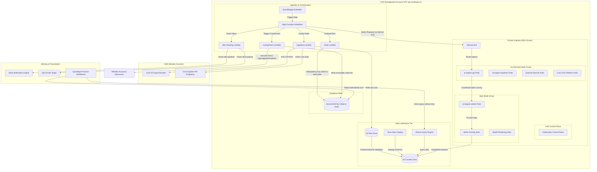
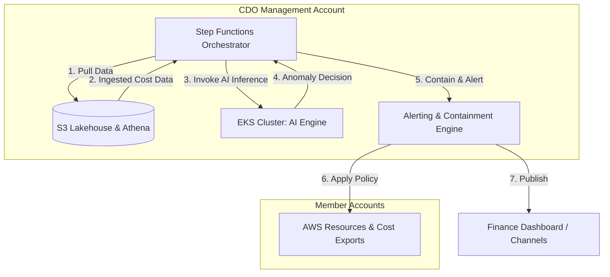
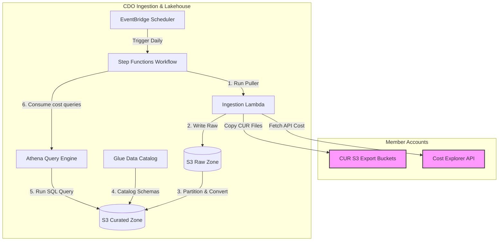
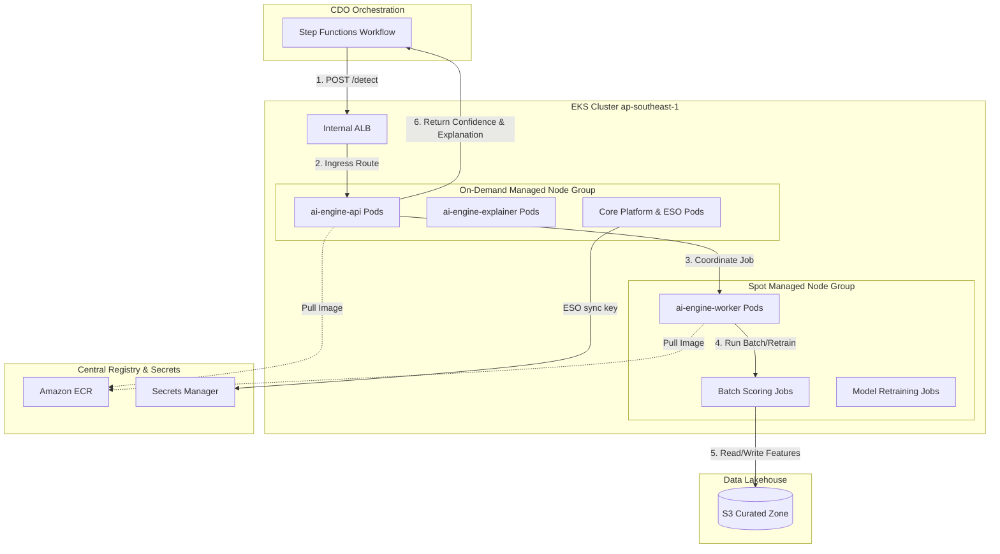
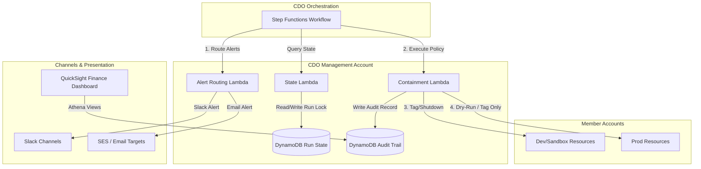

# Infrastructure Design - Task Force 2 · FinOps Watch CDO

<!-- Doc owner: CDO Team
     Status: Final (W11 T6 Pack #1) → Updated (W12 T4 Pack #2)
-->

## 1. Architecture diagram

The CDO platform is designed around a lakehouse-centric data plane for ingest and analysis, orchestrated by serverless workflows, and integrated with an AIOps-owned AI Engine hosted on a managed EKS cluster. The EKS compute tier uses a hybrid configuration of on-demand and spot node groups to optimize execution costs.



*Caption: The CDO pipeline is triggered daily by EventBridge Scheduler. The Step Functions workflow coordinates ingestion from member accounts, writes raw CUR and Cost Explorer data to S3, and catalogs it. The workflow requests anomaly detection from the AIOps-owned AI Engine via the EKS internal ALB. The EKS cluster isolates stable APIs on an on-demand node group and batch-scoring/training tasks on a cost-optimized spot node group. Dashboard views and containment workflows pull clean state from Athena and DynamoDB.*

---

To provide a clearer view of the CDO platform's operations, the overall architecture is broken down into a high-level overview followed by three detailed zoom-in diagrams below:

### 1.1 High-Level Architecture Overview

This diagram represents the high-level macro interactions between the central orchestrator, the lakehouse data plane, the EKS compute cluster, and the alerting/containment engines.



*Caption: The central Step Functions Orchestrator drives the entire FinOps loop: extracting data to the Lakehouse, calling the EKS-hosted AI Engine for anomaly decisions, and invoking alerting and containment workflows based on the results.*

### 1.2 Ingestion & Data Lakehouse Workflow

This diagram zooms in on the ingestion pipeline and the lakehouse storage/query layers.



*Caption: Step Functions invokes the Ingestion Lambda daily via EventBridge Scheduler. Raw cost data from Member Accounts is stored in the S3 Raw Zone, transitioned and cataloged into Parquet format in the S3 Curated Zone, and made queryable via Athena. The query results are passed back to the Step Functions orchestrator to feed the AI Engine.*

### 1.3 AI Engine EKS Hosting Platform

This diagram zooms in on the EKS cluster layout, illustrating the separation of stable API nodes (On-Demand) from batch-processing and retraining nodes (Spot).



*Caption: The AI Engine `/detect` request from the Step Functions orchestrator is routed via the Internal ALB to the `ai-engine-api` running on On-Demand nodes. Heavy-duty jobs are coordinated on Spot nodes to read/write curated features from S3. Credentials and configurations are synced from Secrets Manager using the External Secrets Operator (ESO).*

### 1.4 Alerting & Containment Engine

This diagram zooms in on the alerting and containment flow, detailing how policy is enforced safely across production and non-production environments with a compliance audit trail.



*Caption: The Step Functions workflow triggers separate alerting and containment Lambdas based on the AI Engine's decisions. Containment Lambdas read run state, write audit logs to DynamoDB, apply active containment (tag/shutdown) on Dev/Sandbox accounts, and execute dry-run actions (tag/suggest only) on Prod. QuickSight presents spend and containment status directly to Finance stakeholders.*

---

## 2. Component table

The following infrastructure components are deployed in `ap-southeast-1` to operate the FinOps Watch platform:

| Component | AWS Service | Reason | Cost note |
|---|---|---|---|
| Ingestion Trigger | EventBridge Scheduler | Triggers the ingestion pipeline daily on a serverless, managed cron schedule. | Free tier covers 14M invocations/month, then $1.00 per million. |
| Orchestration Layer | Step Functions | Serverless state machine executing workflow logic, conditional branches, wait states, and error retries. | $0.025 per 1,000 state transitions. |
| Compute (Adapters) | Lambda | Runs lightweight, serverless adapter code to pull Cost Explorer API data, copy CUR 2.0 exports, and handle alerts/containment. | Pay-per-use, ~$0.00001667 per GB-second. |
| Data Lake (Raw) | Amazon S3 | Stores immutable daily CUR 2.0 files and Cost Explorer JSON dumps. | $0.023 per GB/month + request fees. |
| Data Lake (Curated) | Amazon S3 | Stores partitioned, schema-validated cost files in Parquet format, optimized for querying. | $0.0125 per GB/month (Infrequent Access) + transition fees. |
| Metadata Catalog | Glue Data Catalog | Automatically registers table partitions and maintains the schema definitions for Athena. | First 1M cataloged objects are free; crawler runs cost $0.44 per DPU-hour. |
| Query Engine | Amazon Athena | Allows serverless SQL queries on S3 files to build materialized views and drive dashboards. | $5.00 per TB of data scanned. |
| State & Audit Database | Amazon DynamoDB | Stores run state, idempotency keys, containment audit logs, and dashboard materialized views. | On-demand capacity: $1.25 per million write units, $0.25 per million read units. |
| AI Engine Hosting | Amazon EKS | Hosts the AIOps-provided AI Engine (API + worker workloads) with managed node groups. | $0.10 per hour for EKS cluster control plane. |
| Stable Workload Nodes | Managed Node Group (On-Demand EC2) | Runs stable, always-on pods (`ai-engine-api`, `ai-engine-explainer`, monitoring, ingress controllers) on `m5.xlarge` instances across multiple AZs. | EC2 On-Demand rate (~$0.192/hour per instance in `ap-southeast-1`). |
| Batch Workload Nodes | Managed Node Group (Spot EC2) | Runs batch detection jobs, heavy feature engineering, and model training/retraining (`ai-engine-worker`) on `m5.xlarge` or `g5.xlarge` instances. | Spot rate with up to 60-70% savings compared to on-demand. |
| Container Registry | Amazon ECR | Hosts versioned Docker container images for AIOps models. | $0.10 per GB/month (first 500 MB free). |
| Secrets Provider | Secrets Manager | Securely manages API keys, DB credentials, and Slack webhooks with automated rotation. | $0.40 per secret/month + $0.05 per 10,000 requests. |
| Load Balancer | Application Load Balancer (Internal) | Exposes EKS AI Engine API service internally to Step Functions/Lambda functions over private subnets. | ~$0.0225 per LCU-hour. |
| Finance Dashboard | Amazon QuickSight | Provides a finance-readable, serverless dashboard built on Athena views with zero SQL queries required. | $18-$24/user/month (Reader sessions capped at $5/reader/month). |
| Alert Channels | Amazon SNS / Slack API | Delivers separate routing paths for alerts (Finance alerts via Slack/Email, Eng alerts via Slack/Jira). | SNS is free up to 100k email notifications/month; Slack API is free. |
| Containment Worker | AWS Lambda | Assumes roles in member accounts to apply tags or shut down dev/sandbox resources, strictly executing in `dry-run` or `apply` modes. | Pay-per-use. |

> [!NOTE]
> Actual run costs for the CDO pipeline during the build period are tracked with: `Evidence needed: CDO pipeline actual operational costs`.

---

## 3. Differentiation angle deep-dive

### 3.1 Why this angle?

The CDO platform implements a **lakehouse-centric FinOps control plane with serverless orchestration and EKS hybrid hosting for the AI Engine**.
1. **Lakehouse Fit**: Production FinOps operates on a natural 24h cadence dictated by AWS CUR export frequencies. A lakehouse pattern (S3 + Glue + Athena) avoids the high fixed costs of an always-on data warehouse (like Redshift) or relational databases, while keeping historical cost data fully structured, audit-ready, and partition-queried.
2. **Serverless Orchestration**: EventBridge and Step Functions manage the flow serverless-first, keeping the operational overhead of the pipeline orchestrator near zero.
3. **EKS Hybrid Compute for AI**: The AIOps-provided AI Engine contains two distinct workloads:
   - Stable inference endpoints (`ai-engine-api`, `ai-engine-explainer`) that must remain highly available and low-latency.
   - Heavy batch jobs (`ai-engine-worker` for feature engineering, batch scoring, and model retraining) that are computationally intensive but interruptible.
   Hosting the AI Engine on EKS enables the CDO to place stable APIs on **on-demand managed node groups** to guarantee SLOs, and batch workers on **spot node groups** with automatic node selectors and tolerations. This achieves a 60-70% reduction in AI compute cost. Fargate does not support this level of granular node-affinity control, while a pure serverless container model would lead to idle compute wastes during non-run hours.

### 3.2 Strengths (with metrics)

The metrics below highlight the trade-offs of the lakehouse-centric + EKS hybrid architecture compared to alternative CDO approaches:

| Axis | Chosen Angle (Lakehouse + EKS Hybrid) | Alternative A (ECS Fargate + RDS Aurora) | Alternative B (Third-Party SaaS Platform) |
|---|---|---|---|
| **Cost per daily run (Ingest + Query)** | ~$0.15 (S3 + Athena pay-per-query) | ~$5.00 (Fixed daily rate of RDS instance) | N/A (Included in subscription fees) |
| **AI compute cost (Hosting/Month)** | ~$120 (EKS control plane + Spot node scaling) | ~$320 (Fargate always-on equivalent) | N/A |
| **Operational overhead (Hours/Week)** | ~4 hours (Managing EKS config, Helm updates) | ~2 hours (ECS managed task groups) | ~1 hour (SaaS connection updates) |
| **Account onboarding time** | < 10 mins (Terraform IAM cross-account stack) | ~25 mins (Manual DB schema setup + VPC peering) | > 60 mins (Manual setup + IAM configs) |
| **Scalability for model retraining** | Excellent (Spot node pools scaled via Karpenter) | Limited (Fargate max memory/CPU constraints) | Poor (AIOps model cannot run locally) |

### 3.3 Accepted weaknesses

- **EKS Control Plane Overhead**: Running EKS incurs a fixed control plane charge of $0.10/hour (~$73/month). This overhead is accepted because the same cluster hosts the stable API pods and scales the batch workers, which saves significant computing budget through Spot execution.
- **VPC Endpoints Cost**: Routing all traffic privately within the VPC requires interface endpoints (Secrets Manager, ECR, CloudWatch), adding fixed charges (~$7.20/endpoint/month). This is accepted to meet the strict security requirement of zero public transit of cost/audit data.
- **CUR Ingestion Latency**: AWS CUR exports lag by 8 to 24 hours. This lag is accepted since the platform runs on a 24-hour cadence, meaning real-time streaming is not required for daily anomaly detection.

---

## 4. Multi-account approach

### 4.1 Account model

The CDO platform is deployed in a central **CDO Management Account**. It ingests cost data from and triggers containment actions in multiple **Member Accounts** within the AWS Organization.
- **Cross-Account Cost Ingestion**: The central `LambdaCURPuller` assumes the read-only role `FinOpsCURPullerRole` in each target member account. This role grants access to retrieve local Cost Explorer API data and copy CUR files from the member account's S3 export bucket.
- **Cross-Account Containment**: The central `LambdaContainment` assumes `FinOpsContainmentWorkerRole` in the target member account. The assumed role contains tightly scoped permissions to tag resources or adjust Auto Scaling Groups (ASGs) in that specific member account.

### 4.2 Isolation pattern

- **Data Isolation**: Cost data collected from member accounts is stored in a single S3 bucket partitioned by Account ID: `s3://cdo-curated-bucket/account_id=123456789012/year=2026/month=06/`.
- **Query Isolation**: Athena table definitions use Glue partition projection. Athena queries executed for dashboard materialized views are restricted by the `account_id` partition key.
- **Ownership Resolution**: Resources are mapped to specific engineering squads using the standardized metadata tags `owner` and `squad`. When the ingestion pipeline encounters resources lacking these tags, it automatically assigns them to a default squad (`unassigned-resources`) and routes alerts to the CDO infrastructure channel for manual remediation.

### 4.3 Onboarding flow

When onboarding a new AWS account or squad to the FinOps Watch platform, the following automated pipeline is executed:

```
1. Add account ID and owner mapping to the Terraform 'accounts.tfvars' configuration.
2. Terraform execution applies IAM Stack:
   - Provisions 'FinOpsCrossAccountAccessRole' in the target member account.
   - Configures trust policy allowing the central CDO Lambda and EKS roles to assume it.
   - Updates target account CUR export configuration to deliver data to S3.
3. Glue crawler is triggered to update partitions in the Glue Data Catalog.
4. E2E Validation run:
   - Ingestion Lambda makes a test API call to target account Cost Explorer.
   - Verifies OIDC connection to EKS internal service endpoint.
5. Account status marked as 'ACTIVE' in the DynamoDB registry.
```

### 4.4 Idempotency

To prevent duplicate runs for the same cost period (which would skew dashboard data and incur duplicate Cost Explorer API fees), the CDO platform implements an idempotency mechanism:
- Every daily execution generates an idempotency key: `account_id:billing_period:execution_date` (e.g., `123456789012:2026-06:2026-06-22`).
- The Step Functions workflow begins by querying the DynamoDB `cdo-run-state-table` for the key.
- If the key exists with `Status = COMPLETED` or `Status = IN_PROGRESS`, the Step Functions workflow aborts gracefully, recording the duplicate attempt in the audit logs.
- If the key does not exist, a new record is created with `Status = IN_PROGRESS` and a TTL of 48 hours to lock the run.

---

## 5. Alternatives considered

### 5.1 Orchestration layer

- **Option A**: Apache Airflow on AWS (MWAA).
  - *Pros*: Excellent Python integration, native complex dependency trees, detailed task visualizer.
  - *Cons*: High fixed cost (~$350/month minimum), slow startup time (20+ minutes), complex infrastructure configuration.
- **Option B**: Kubernetes CronJobs inside EKS.
  - *Pros*: Runs inside the EKS cluster, no external AWS service dependencies.
  - *Cons*: Difficult to orchestrate external Lambda functions, no native cross-account workflow state machine, and harder to monitor execution state from outside the cluster.
- **Chosen**: EventBridge Scheduler + Step Functions Standard.
  - *Reason*: 100% serverless, zero idle costs, native integration with AWS Lambda and DynamoDB, and robust out-of-the-box error retry handlers.

### 5.2 Data layer

- **Option A**: Amazon Redshift.
  - *Pros*: Ultra-fast relational SQL query performance on petabyte-scale datasets.
  - *Cons*: High minimum cost (~$180/month for a small provisioned node), excessive overhead for a mid-size company running 24h batch cycles.
- **Option B**: Amazon RDS PostgreSQL.
  - *Pros*: Structured queries, familiar transaction support, easy index management.
  - *Cons*: Fixed monthly instance charge, manual storage scaling, and lacks direct, performant integration with raw S3 parquet files.
- **Chosen**: Amazon S3 + Glue Data Catalog + Amazon Athena.
  - *Reason*: Leverages the true lakehouse model. Storage costs are minimal (S3), query costs are pay-per-use (Athena), and it supports raw semi-structured JSON alongside optimized Parquet data cataloging.

---

## 6. Scaling strategy

The CDO platform scales dynamically to handle increases in data volume and compute requirements:

- **EKS Pod Autoscaling**: The `ai-engine-api` and `ai-engine-explainer` pods use Kubernetes **Horizontal Pod Autoscalers (HPA)** to scale out (based on target CPU utilization of 70%) if concurrent request volume spikes.
- **EKS Node Autoscaling**: The EKS cluster utilizes **Karpenter** for node autoscaling. Karpenter dynamically provisions additional EC2 nodes when pending pods are detected. It schedules `ai-engine-worker` batch scoring jobs onto Spot nodes and stable API pods onto On-Demand nodes. It terminates idle nodes within 30 seconds of workload completion.
- **Athena Query Optimization**: S3 buckets are partitioned by `account_id`, `year`, and `month`. Athena queries limit data scans to specific partitions, preventing execution bottlenecks.
- **DynamoDB Scaling**: The `cdo-run-state-table` is configured in **On-Demand Capacity Mode**, allowing it to scale instantly from zero to thousands of read/write requests without manual intervention.

---

## 7. Failure modes + recovery

The following table outlines the failure modes, detection mechanisms, and recovery runbooks for the CDO platform:

| Failure | Detection | Recovery | RTO | RPO |
|---|---|---|---|---|
| **CUR Export Delay** | Step Functions validation Lambda returns empty or missing daily Parquet partition in S3. | Step Functions enters a wait state and retries every 2 hours. If delay exceeds 24 hours, it alerts the operator. | N/A | 24 hours |
| **Cost Explorer Throttling** | Ingestion Lambda catches `LimitExceededException` from AWS API. | Exponential backoff with random jitter in Lambda code; retries up to 5 times. | 30 mins | 0 |
| **AI Engine Timeout / Unavailability** | EKS internal ALB returns `504 Gateway Timeout` or `503 Service Unavailable`. | **CDO fails closed**: Ingestion workflow terminates, no automated containment actions are triggered, operators are alerted, and a run failure state is logged. | 4 hours | 24 hours |
| **Failed Run Workflow** | Step Functions execution status updates to `FAILED`; triggers CloudWatch Alarm. | Step Functions logs the error block to DynamoDB. Engineers resolve the issue and trigger a manual redrive of the state machine from the failed step. | 2 hours | 24 hours |
| **Duplicate Run Attempt** | DynamoDB write returns unique key constraint violation on the idempotency key. | The duplicate execution is terminated immediately without executing queries or calling the AI Engine API. | < 10s | 0 |
| **Dashboard Stale Data** | CloudWatch Alarm triggers if the latest curated partition timestamp is >26 hours old. | Alerts engineers to review the pipeline logs and manually trigger a redrive of the daily ingestion run. | 1 hour | 24 hours |
| **Alert Delivery Failure** | `LambdaAlertRouting` catches connection timeout or HTTP 5xx error from Slack API. | The Lambda function sends the alert payload to an SQS Dead Letter Queue (DLQ) and attempts delivery via SES email fallback. | 10 mins | 0 |
| **Containment Action Denial** | Member account cross-account role assumption returns `AccessDeniedException`. | **CDO fails closed**: The incident is logged in the DynamoDB audit table as `DENIED`, and a critical alert is sent to the security channel. | 1 hour | 0 |

---

## Related documents

- [`01_requirements_analysis.md`](01_requirements_analysis.md) - Business context, NFR targets, and CDO/AIOps boundaries.
- [`03_security_design.md`](03_security_design.md) - IAM roles, Security Groups, OIDC IRSA, and KMS encryption keys.
- [`04_deployment_design.md`](04_deployment_design.md) - Terraform IaC modular configurations, GitOps/Helm deployment stages.
- [`05_cost_analysis.md`](05_cost_analysis.md) - Estimated pipeline operational budget and cadence comparisons.
- [`08_adrs.md`](08_adrs.md) - Architectural decisions regarding 24h cadence and EKS node group selection.
