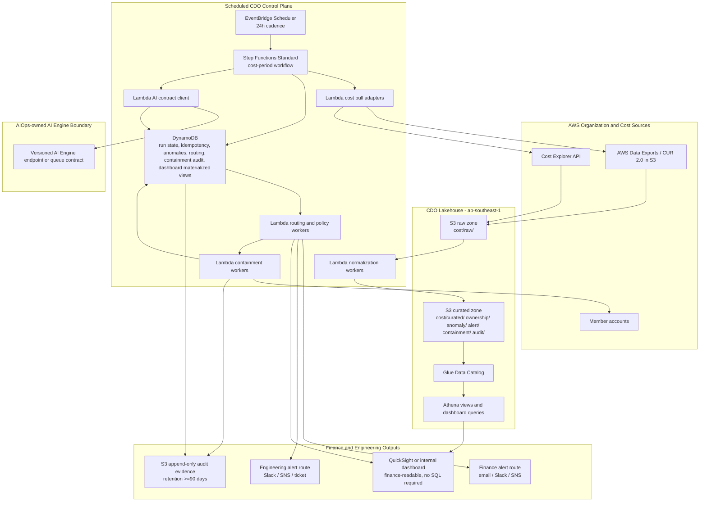
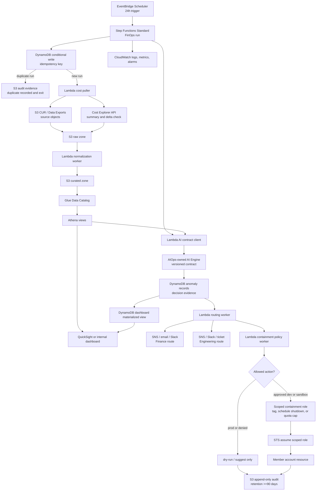

# Thiết kế hạ tầng - TF2 FinOps Watch CDO

## 1. Định hướng kiến trúc

Nền tảng CDO cho TF2 FinOps Watch là một mặt phẳng điều khiển FinOps trên AWS, theo hướng lakehouse-centric, đặt ví dụ tại `ap-southeast-1`. Hệ thống được thiết kế cho xử lý theo chu kỳ chi phí đã lên lịch, không phải lưu lượng request-response liên tục. Cadence mặc định là 24h vì đây là điểm cân bằng giữa độ trễ của Cost and Usage Report, khả năng sẵn sàng của Cost Explorer, chi phí vận hành và kiểm soát false-positive tốt hơn so với 12h hoặc 48h trong phạm vi capstone này.

Nền tảng dùng dữ liệu tổng hợp, trừ khi người dùng cung cấp quyền truy cập hóa đơn AWS thật. Nguồn dữ liệu là AWS Data Exports/CUR 2.0 hoặc file CUR trong S3, kết hợp với Cost Explorer API. CDO sở hữu phần kéo dữ liệu chi phí, chuẩn hóa cửa sổ chi phí, metadata sở hữu, orchestration, idempotency, materialize dữ liệu dashboard, route alert, guardrail containment và bằng chứng audit. Đội AIOps sở hữu logic phát hiện anomaly, lựa chọn model, version model, confidence scoring, explanation text, runtime của AI Engine và metric backtest AI.

Ranh giới an toàn cứng cho production là: NEVER terminate prod, delete data, or modify IAM. Tất cả đường containment đều hỗ trợ `dry-run`; prod chỉ được tag, suggest hoặc dry-run. Nếu AIOps-owned AI Engine không khả dụng, CDO phải fail closed cho containment, alert operator, giữ lại run lỗi và ghi audit record.

## 2. Kiến trúc mục tiêu



Bố cục này giữ data plane bền vững và có thể truy vấn bằng S3, Glue và Athena, đồng thời lưu trạng thái workflow và idempotency trong DynamoDB. Step Functions Standard được ưu tiên hơn việc nối Lambda thủ công vì workflow cần retry rõ ràng, trạng thái lỗi quan sát được và bằng chứng cho từng cost period. Lambda là lựa chọn compute mặc định cho các adapter CDO ngắn và policy worker. Fargate chỉ được giữ làm phương án tương lai nếu contract AI Engine cuối cùng yêu cầu kết nối lâu dài hoặc xử lý batch nặng hơn.

### Sơ đồ workflow dịch vụ AWS



Sơ đồ workflow này thể hiện thứ tự runtime của các dịch vụ AWS cho một cost period đã lên lịch. Step Functions execution là trục điều khiển chính, DynamoDB ngăn xử lý trùng, S3/Glue/Athena cung cấp đường bằng chứng lakehouse, và mọi quyết định alert hoặc containment đều kết thúc bằng audit evidence dạng append-only trong S3.

## 3. Luồng dữ liệu

1. **Bắt đầu lịch chạy**: EventBridge Scheduler khởi chạy một Step Functions Standard execution cho cost period đủ điều kiện theo cadence 24h đã chọn.
2. **Kiểm tra idempotency**: Workflow ghi một item trạng thái run có điều kiện vào DynamoDB trước khi xử lý. Nếu cùng cost period và data version đã tồn tại, workflow ghi audit event cho duplicate run và thoát mà không xử lý lại.
3. **Kéo dữ liệu chi phí**: Lambda adapter kéo object CUR/Data Exports tổng hợp từ S3 và query Cost Explorer để xác thực summary, tổng chi phí theo service và delta chi phí gần đây.
4. **Chuẩn hóa**: Worker chuẩn hóa account, service, region, owner tag, environment, usage date, cost period, cost amount và currency USD vào các prefix S3 curated và bảng Athena.
5. **Gọi AI**: AI contract client gửi cửa sổ chi phí đã chuẩn hóa và evidence URI tới AIOps-owned AI Engine. CDO validate các field response bắt buộc, timeout, retry lỗi transient và bật circuit breaker khi lỗi lặp lại.
6. **Lưu bằng chứng**: Output quyết định AI được lưu vào anomaly record trong DynamoDB và prefix evidence trong S3. CDO chỉ lưu model version và backtest metrics như integration evidence do AIOps cung cấp.
7. **Materialize dashboard**: Athena views và DynamoDB materialized dashboard records cập nhật spend trend, anomaly overlay, confidence display, owner routing, containment status và audit links.
8. **Route alert**: Routing worker gửi Finance alert cho tác động kinh doanh và Engineering alert cho owner xử lý. Route dựa trên anomaly type, severity, owner tags, account, environment và approval requirement.
9. **Quyết định containment**: Policy worker đánh giá action có được phép hay không. Prod chỉ nhận tag, suggest hoặc dry-run. Dev và sandbox có thể cho phép schedule shutdown hoặc quota cap nếu được policy phê duyệt.
10. **Ghi audit**: Mọi containment proposal hoặc action đều ghi actor, timestamp, correlation ID, idempotency key, anomaly ID, owner, before state, proposed hoặc applied after state, execution mode, rollback path, approval status, retention location và retention period.

## 4. Bảng thành phần

| Thành phần | Dịch vụ AWS | Trách nhiệm | Lý do | Ghi chú chi phí |
|---|---|---|---|---|
| Lưu trữ cost export | S3 cho AWS Data Exports/CUR 2.0 | Nhận file cost and usage chi tiết | Nguồn billing export native của AWS và input batch bền vững | Dung lượng tăng theo lịch sử synthetic và số partition; cần lifecycle policy |
| Truy cập cost summary | Cost Explorer API | Cung cấp summary chi phí gần đây theo service/account và dữ liệu cross-check | Bổ sung cho độ trễ CUR bằng xác thực ở mức API | Nên giữ tần suất API thấp với cadence 24h; cần theo dõi throttling |
| Raw data lake | S3 raw zone | Lưu dữ liệu nguồn immutable theo cost period và ingestion time | Giữ bằng chứng nguồn để replay và audit | Dùng prefix có partition và lifecycle control |
| Curated data lake | S3 curated zone | Lưu dataset chi phí, ownership, anomaly, alert, containment và audit đã chuẩn hóa | Giữ dashboard và job downstream không query trực tiếp raw file | Evidence needed: dung lượng GB-tháng dự kiến cho synthetic dataset 3 tháng |
| Metadata catalog | Glue Data Catalog | Định nghĩa schema và partition cho Athena | Giúp dữ liệu S3 có thể query mà không cần warehouse cluster | Tần suất Glue crawler nên khớp cadence, hoặc dùng đăng ký partition rõ ràng |
| Query layer | Athena | Phục vụ dashboard và query điều tra | Query layer serverless phù hợp với bằng chứng FinOps dạng batch | Cần giới hạn query và partition pruning để kiểm soát chi phí |
| Scheduler | EventBridge Scheduler | Khởi chạy workflow cost-period 24h | Cadence managed đơn giản, ít overhead vận hành | Tần suất thấp hơn 12h giúp giảm xử lý trùng và API call |
| Workflow engine | Step Functions Standard | Điều phối pull, normalize, AI call, routing, containment và audit | Có lịch sử execution bền vững, retry và trạng thái lỗi rõ ràng | Standard workflow phù hợp với batch run tần suất thấp |
| Compute ngắn | Lambda | Thực thi adapter, validator, route worker và policy worker | Chi phí cố định thấp và scale đơn giản cho task CDO ngắn | Evidence needed: Lambda duration và memory đo được sau test W12 |
| Tùy chọn connector dài | ECS Fargate | Worker tùy chọn cho AI connector chạy lâu hoặc batch job nặng | Chỉ dùng nếu vượt giới hạn Lambda | Không thuộc default path vì tạo thêm chi phí runtime cố định |
| Trạng thái vận hành | DynamoDB | Lưu run state, idempotency key, anomaly record, routing state, containment audit index và materialized dashboard views | Conditional write latency thấp và metadata storage serverless | On-demand mode phù hợp cho tới khi access pattern ổn định |
| Tích hợp AI | AIOps-owned AI Engine endpoint hoặc queue | Nhận cửa sổ chi phí đã chuẩn hóa và trả về anomaly decision contract | Giữ quyền sở hữu model bên ngoài CDO nhưng vẫn lưu integration evidence | Chi phí runtime AI thuộc AIOps, không thuộc chi phí CDO platform |
| Dashboard | QuickSight hoặc dashboard nội bộ nhẹ | Hiển thị spend trend, anomaly overlay, confidence, owner và audit link theo ngôn ngữ dễ đọc cho Finance | Người dùng Finance không cần biết SQL | Cadence refresh QuickSight nên theo workflow 24h |
| Alerting | SNS cộng email hoặc Slack webhook targets | Tách đường thông báo Finance và Engineering | Giữ escalation kinh doanh tách khỏi remediation của owner | Cần budget và throttle alert volume |
| Observability | CloudWatch Logs, metrics, alarms | Theo dõi workflow failure, API throttling, stale dashboard và containment denial | Visibility native của AWS cho vận hành capstone | Nên giới hạn log retention và review trong cost analysis |
| Cross-account access | IAM roles và STS assume-role | Cung cấp quyền cost read-only và quyền containment có scope chặt | Hỗ trợ AWS multi-account mà không dùng static credential | Cần kiểm soát role sprawl bằng naming và policy boundary |
| Audit evidence | Prefix S3 append-only audit với retention control | Lưu containment và run evidence ít nhất 90 days | Evidence trail dễ đọc cho Finance và phù hợp compliance | Dùng lifecycle tier sau giai đoạn review nóng |

## 5. Truy cập multi-account

Management account host CDO control plane và cost lakehouse. Member account expose role read-only cho cost metadata, tag inventory và tra cứu ownership theo environment. Truy cập cost data được tập trung qua CUR/Data Exports trong S3 và quyền Cost Explorer API. Không member account nào cấp quyền quản trị rộng cho CDO workflow.

Containment role tách riêng khỏi cost-read role. Các role này được scope chặt theo account, environment, action type và resource pattern:

| Environment | Hành vi containment CDO được phép | Hành vi bị từ chối |
|---|---|---|
| Prod | Tag for review, tạo recommendation, gửi alert, ghi dry-run result | Termination, deletion, IAM modification, schedule shutdown apply, quota cap apply |
| Staging | Tag for review, dry-run schedule shutdown, dry-run quota cap, recommendation | Deletion và IAM modification |
| Dev và sandbox | Tag for review, approved schedule shutdown, approved quota cap, right-sizing suggestion | Data deletion, IAM modification, unapproved apply action |

Tất cả role assumption nên chứa correlation ID và run ID trong session tag nếu dịch vụ hỗ trợ. CloudTrail management event và CDO audit record phải liên kết được bằng correlation ID.

## 6. Idempotency và trạng thái run

Workflow phải bảo đảm cùng một cost period không bị xử lý hai lần. Định dạng idempotency key là:

```text
finops-watch:{cadence}:{cost-period-start}:{cost-period-end}:{account-scope}:{source-data-version}
```

`source-data-version` được suy ra từ CUR/Data Exports object manifest, tập object ETag hoặc synthetic dataset version. Bước đầu tiên của workflow ghi một DynamoDB item bằng conditional expression chỉ thành công khi key chưa tồn tại. Item lưu:

| Field | Mục đích |
|---|---|
| `idempotency_key` | Guard chính để chặn duplicate run |
| `run_id` | Liên kết Step Functions execution, alert, AI request và audit record |
| `cost_period_start` và `cost_period_end` | Xác định cửa sổ chi phí |
| `cadence` | Ghi lại quyết định schedule 24h |
| `source_data_version` | Phát hiện source file có thay đổi hay không |
| `status` | `started`, `completed`, `failed`, `duplicate`, hoặc `ai_unavailable` |
| `ai_contract_version` | Ghi contract version AIOps mà CDO đã consume |
| `dashboard_refresh_status` | Cho biết dashboard materialization đã hoàn tất hay chưa |
| `audit_uri` | Trỏ tới S3 evidence của run |

Nếu một run thất bại, status vẫn có thể query và replay cần thao tác operator rõ ràng với source data version mới hoặc lý do manual replay. Duplicate run không gọi AI Engine, không gửi alert trùng và không trigger containment.

## 7. Kiến trúc containment

Containment là policy-driven và dry-run-first. Mỗi action được đánh giá theo account, environment, owner, anomaly type, approval requirement và danh sách action được phép trước khi xem xét bất kỳ apply path nào.

| Pattern | Trạng thái capstone | Phạm vi apply | Mô tả |
|---|---|---|---|
| Tag for review | Implemented design pattern | Dev, sandbox, staging; prod chỉ tag/suggest | Thêm hoặc đề xuất review tag như `FinOpsWatch=ReviewRequired` kèm anomaly ID và owner context. Trong prod, hành vi này vẫn chỉ là tag/suggest/dry-run theo phê duyệt của client. |
| Schedule shutdown | Designed containment pattern | Chỉ dev và sandbox sau khi policy approval | Với resource non-prod idle hoặc runaway, đề xuất hoặc áp dụng lịch stop window. Không bao giờ terminate resource và rollback bằng cách gỡ schedule. |
| Quota cap | Designed containment pattern | Chỉ dev và sandbox sau khi policy approval | Với runaway training hoặc spend spike, đề xuất service quota hoặc budget guardrail action. IAM modification không được phép; mọi quota action phải dùng cơ chế đã pre-approved. |

Mỗi containment action ghi actor, timestamp, correlation ID, idempotency key, anomaly ID, resource/account/squad owner, before state, proposed hoặc applied after state, execution mode, rollback path, approval status, retention location và retention period. Audit retention là >=90 days.

## 8. Failure mode và recovery

| Failure mode | Cách phát hiện | Hành vi recovery | Hành vi containment | Evidence |
|---|---|---|---|---|
| CUR/Data Exports delay | Object hoặc manifest kỳ vọng bị thiếu cho cost period | Đánh dấu run là waiting hoặc failed tùy theo độ trễ; retry ở lịch chạy kế tiếp | Không containment | Run-state item và CloudWatch alarm |
| Cost Explorer throttling | API 429 hoặc throttling exception | Exponential backoff với số lần retry có giới hạn; dùng dữ liệu suy ra từ CUR khi đủ tin cậy | Không apply action cho tới khi độ tin cậy dữ liệu chấp nhận được | Error metric và run audit event |
| AI Engine timeout | AI contract client vượt timeout | Retry transient, sau đó mở circuit breaker cho run | Fail closed; không automatic apply action | `ai_unavailable` run status và operator alert |
| AI Engine unavailable | 5xx, network failure, authentication failure hoặc circuit open | Giữ failed run, alert operator, ghi audit event | Fail closed; không automatic apply action | S3 audit record và DynamoDB status |
| Failed workflow step | Step Functions task failure sau retry | Đánh dấu run failed và giữ partial artifacts | Không tạo containment action mới | Step Functions execution history |
| Duplicate scheduled run | DynamoDB conditional write thất bại cho idempotency key | Thoát dưới dạng duplicate mà không gọi AI hoặc gửi alert | Không containment | Duplicate-run audit record |
| Dashboard stale data | Timestamp của materialized dashboard view cũ hơn last completed run | Bắn stale-dashboard alarm và hiển thị last refresh time | Containment không phụ thuộc dashboard freshness | Dashboard status field và CloudWatch alarm |
| Alert delivery failure | SNS, email, Slack hoặc webhook delivery failure | Retry route, sau đó gửi fallback operator alert | Containment vẫn bị gate bởi policy và approval | Routing-state record |
| Containment denial | Policy từ chối action do prod, thiếu approval, unknown owner hoặc unsupported resource | Ghi denial và route recommendation tới owner | Chỉ dry-run hoặc suggest | Containment audit record |
| Audit write failure | S3 put hoặc DynamoDB audit index write thất bại | Xem là workflow failure; không apply containment nếu audit write chưa thành công | Fail closed | Failed audit metric và run status |

## 9. Operational scaling và giới hạn

Workload kỳ vọng là batch processing tần suất thấp, không phải API phục vụ high-RPS. Áp lực scale đến từ số account, kích thước file CUR, chi phí query Athena và alert volume. Cách tiếp cận mặc định là partition dữ liệu S3 theo cost period, account, service và environment; dùng Athena partition pruning; giữ access pattern DynamoDB theo run ID, anomaly ID và owner route; đồng thời giới hạn dashboard refresh theo cadence workflow đã hoàn tất.

Cadence 24h giảm Cost Explorer call, Step Functions execution, dashboard refresh và rủi ro alert trùng so với 12h. Cadence 48h rẻ hơn nhưng làm yếu time-to-detection cho runaway non-prod spend như training cluster. Evidence needed: workflow duration, Athena bytes scanned, Lambda duration và dashboard refresh time đo được từ các W12 synthetic demo run.

## 10. Câu hỏi mở

| Câu hỏi | Chủ sở hữu cần xác nhận | Vì sao quan trọng |
|---|---|---|
| Hình dạng contract AI Engine cuối cùng: endpoint hay queue, authentication, timeout và response schema | Đội AIOps | CDO phải implement đúng invocation, retry và validation behavior |
| Định dạng versioning của synthetic dataset | Client hoặc mentor | Idempotency phụ thuộc vào cách tính source-data-version ổn định |
| Mapping account và squad ownership cuối cùng | Client | Routing và containment policy cần owner metadata đáng tin cậy |
| Chủ sở hữu phê duyệt cho apply action trên dev/sandbox | Client | Schedule shutdown và quota cap apply path cần authority phê duyệt rõ ràng |
| Lựa chọn triển khai dashboard: QuickSight hay dashboard web nội bộ | Đội CDO và client | Quyết định refresh mechanism, access control và evidence screenshot |
| Alert target cho Finance và Engineering | Client | CDO cần route destination và kỳ vọng escalation |

## Tài liệu liên quan

- `01_requirements_analysis.md` định nghĩa vấn đề CFO, yêu cầu CDO và ranh giới sở hữu CDO/AIOps.
- `03_security_design.md` mở rộng IAM least privilege, encryption, secrets, network boundaries và audit controls.
- `04_deployment_design.md` định nghĩa IaC, CI/CD, environment separation, deployment gates và rollback.
- `05_cost_analysis.md` ước tính chi phí CDO platform tách khỏi chi phí runtime của AIOps AI Engine.
- `06_dashboard_alerting_design.md` định nghĩa dashboard view dễ đọc cho Finance và alert payload.
- `08_adrs.md` ghi lại quyết định cadence 24h, kiến trúc lakehouse-centric, dry-run-first containment và audit retention.
