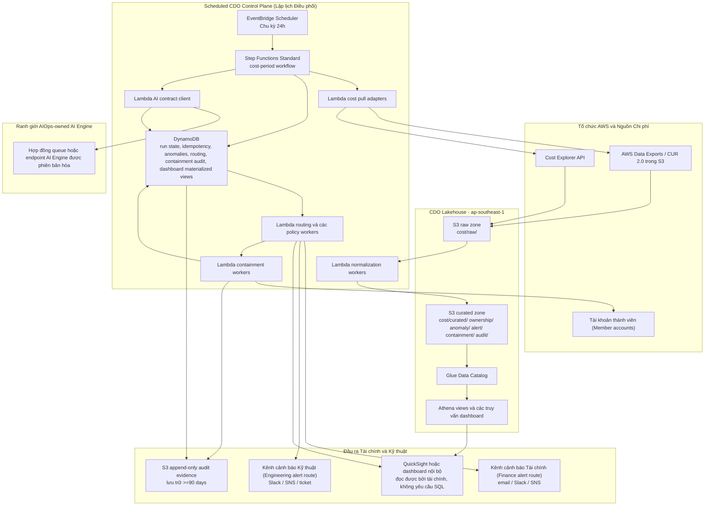
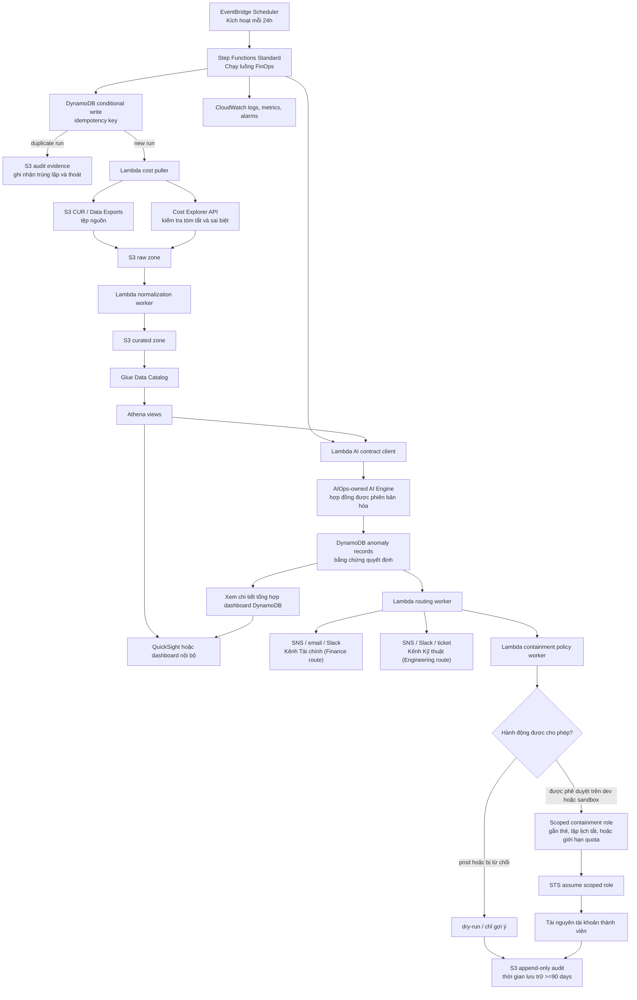

# Thiết kế Hạ tầng - TF2 FinOps Watch CDO06

## 1. Hướng tiếp cận Kiến trúc (Architecture Direction)

Nền tảng CDO cho TF2 FinOps Watch là một control plane FinOps dạng lakehouse-centric chạy hoàn toàn trên AWS trong vùng `ap-southeast-1`. Nó được thiết kế để xử lý dữ liệu chi phí theo chu kỳ lập lịch thay vì lưu lượng yêu cầu-phản hồi (request-response). Tần suất chu kỳ mặc định là 24h vì nó cân bằng giữa độ trễ phân phối của Báo cáo Chi phí và Sử dụng (Cost and Usage Report - CUR), tính khả dụng của Cost Explorer API, chi phí vận hành và việc kiểm soát cảnh báo giả tốt hơn so với chu kỳ 12h hoặc 48h trong phạm vi dự án này.

Nền tảng nạp dữ liệu chi phí giả lập (synthetic cost data) trừ khi có quyền truy cập hóa đơn AWS thực tế được cung cấp rõ ràng. Các nguồn dữ liệu là AWS Data Exports/CUR 2.0 hoặc các tệp CUR trong S3 cùng với Cost Explorer API. CDO sở hữu việc kéo dữ liệu chi phí, các khoảng thời gian chi phí chuẩn hóa, siêu dữ liệu sở hữu, điều phối (orchestration), tính bất biến/trùng lặp (idempotency), tổng hợp dữ liệu dashboard, định tuyến cảnh báo, các rào cản ngăn chặn (containment guardrails) và bằng chứng kiểm toán. Đội ngũ AIOps sở hữu logic phát hiện bất thường, lựa chọn mô hình, phiên bản mô hình, tính điểm tin cậy, văn bản giải thích, runtime của AI Engine và các chỉ số backtest AI (thuộc ranh giới AIOps-owned AI Engine).

Ranh giới an toàn tuyệt đối cho môi trường production là: KHÔNG BAO GIỜ được hủy prod, xóa dữ liệu hoặc sửa đổi IAM (`NEVER terminate prod, delete data, or modify IAM`). Tất cả các luồng ngăn chặn đều hỗ trợ chế độ `dry-run`; prod bị giới hạn ở hành vi gắn thẻ (tag), đề xuất (suggest) hoặc chạy thử (`dry-run`). Nếu AI Engine do AIOps sở hữu (AIOps-owned AI Engine) không khả dụng, hệ thống CDO sẽ đóng luồng an toàn cho hoạt động ngăn chặn (fail closed), cảnh báo cho người vận hành, lưu giữ phiên chạy bị lỗi và ghi lại bản ghi kiểm toán.

## 2. Kiến trúc Mục tiêu (Target Architecture)



Sơ đồ này giữ cho dữ liệu bền vững và có thể truy vấn được trong S3, Glue và Athena, trong khi vẫn lưu giữ trạng thái chạy và tính bất biến (idempotency) trong DynamoDB. Step Functions Standard được ưu tiên sử dụng thay vì kết nối chuỗi Lambda ad-hoc vì quy trình công việc cần hiển thị rõ ràng cơ chế thử lại, trạng thái lỗi và bằng chứng cho từng chu kỳ chi phí. Lambda là lựa chọn tính toán mặc định cho các adapter CDO ngắn hạn và các worker chính sách. ECS Fargate được dự phòng cho các cổng kết nối chạy lâu dài trong tương lai nếu hợp đồng AI Engine cuối cùng yêu cầu kết nối liên tục hoặc xử lý lô nặng.

### Sơ đồ Quy trình Dịch vụ AWS (AWS Services Workflow Diagram)



Sơ đồ quy trình này hiển thị thứ tự runtime của các dịch vụ AWS cho một chu kỳ chi phí được lập lịch. Việc thực thi Step Functions đóng vai trò cột xương sống điều phối, DynamoDB ngăn chặn xử lý trùng lặp, S3/Glue/Athena cung cấp đường dẫn bằng chứng lakehouse, và mọi quyết định cảnh báo hoặc ngăn chặn đều kết thúc bằng việc ghi bằng chứng kiểm toán append-only vào S3.

## 3. Luồng dữ liệu (Data Flow)

1. **Lập lịch bắt đầu (Schedule start)**: EventBridge Scheduler khởi chạy một thực thi Step Functions Standard cho chu kỳ chi phí hợp lệ hiện tại theo tần suất 24h đã chọn.
2. **Kiểm tra trùng lặp (Idempotency check)**: Quy trình ghi một bản ghi trạng thái chạy có điều kiện vào DynamoDB trước khi xử lý. Nếu cùng một chu kỳ chi phí và phiên bản dữ liệu nguồn đã tồn tại, quy trình sẽ ghi lại sự kiện kiểm toán chạy trùng lặp và kết thúc mà không xử lý lại.
3. **Kéo dữ liệu chi phí (Cost data pull)**: Các Lambda adapter kéo các đối tượng synthetic CUR / Data Exports từ S3 và truy vấn Cost Explorer để xác thực tóm tắt, tổng chi phí theo dịch vụ và các thay đổi chi phí gần đây.
4. **Chuẩn hóa (Normalization)**: Các worker chuẩn hóa tài khoản, dịch vụ, vùng, thẻ sở hữu (owner tag), môi trường, ngày sử dụng, chu kỳ chi phí, số tiền chi phí và đơn vị tiền tệ USD vào các tiền tố S3 curated và các bảng Athena.
5. **Gọi AI (AI invocation)**: AI contract client gửi cửa sổ chi phí đã chuẩn hóa và URI bằng chứng đến AIOps-owned AI Engine. CDO xác thực các trường phản hồi bắt buộc, thời gian chờ (timeout), thử lại đối với các lỗi tạm thời (transient errors) và ngắt mạch (circuit breaker) đối với các lỗi lặp đi lặp lại.
6. **Lưu trữ bằng chứng (Evidence persistence)**: Các đầu ra quyết định của AI được lưu trữ trong các bản ghi bất thường DynamoDB và các tiền tố bằng chứng S3. CDO chỉ lưu trữ phiên bản mô hình và các chỉ số backtest AI dưới dạng bằng chứng tích hợp do đội ngũ AIOps cung cấp.
7. **Tổng hợp dữ liệu Dashboard (Dashboard materialization)**: Các Athena view và bản ghi DynamoDB tổng hợp được cập nhật để hiển thị xu hướng chi tiêu, lớp phủ bất thường (anomaly overlay), hiển thị độ tin cậy, định tuyến chủ sở hữu, trạng thái ngăn chặn (containment status) và liên kết kiểm toán.
8. **Định tuyến cảnh báo (Alert routing)**: Các worker định tuyến gửi cảnh báo Tài chính đối với các tác động kinh doanh và cảnh báo Kỹ thuật để chủ sở hữu hành động. Việc định tuyến dựa trên loại bất thường, mức độ nghiêm trọng, thẻ sở hữu, tài khoản, môi trường và yêu cầu phê duyệt.
9. **Quyết định ngăn chặn (Containment decision)**: Các policy worker đánh giá xem một hành động có được cho phép hay không. Môi trường Prod chỉ nhận gắn thẻ, đề xuất hoặc chạy thử (`dry-run`). Các môi trường Dev và sandbox có thể cho phép lập lịch tắt tài nguyên hoặc áp dụng giới hạn quota sau khi được phê duyệt.
10. **Ghi kiểm toán (Audit write)**: Mọi đề xuất hoặc hành động ngăn chặn đều ghi lại tác nhân thực hiện (actor), dấu thời gian (timestamp), ID tương quan (correlation ID), mã chống trùng lặp (idempotency key), ID bất thường (anomaly ID), chủ sở hữu, trạng thái trước đó (before state), trạng thái đề xuất hoặc đã áp dụng sau đó (after state), chế độ thực thi (`dry-run` hoặc `apply`), đường dẫn khôi phục (rollback path), trạng thái phê duyệt, vị trí lưu trữ và thời hạn lưu giữ (yêu cầu lưu giữ tối thiểu >=90 days).

## 4. Bảng thành phần hạ tầng (Component Table)

| Thành phần | Dịch vụ AWS | Trách nhiệm | Lý do chọn | Lưu ý về chi phí |
|---|---|---|---|---|
| Lưu trữ xuất chi phí (Cost export storage) | S3 cho AWS Data Exports/CUR 2.0 | Nhận các tệp chi tiết về chi phí và sử dụng | Nguồn xuất hóa đơn AWS gốc và đầu vào lô bền vững | Dung lượng tăng theo lịch sử giả lập và số phân vùng; yêu cầu chính sách vòng đời (lifecycle policy) |
| Truy cập tóm tắt chi phí | Cost Explorer API | Cung cấp tóm tắt chi phí theo dịch vụ/tài khoản gần đây và đối chiếu chéo | Bổ sung cho độ trễ của CUR bằng xác thực cấp API | Tần suất sử dụng API thấp ở chu kỳ 24h; theo dõi giới hạn truy vấn (throttling) |
| Hồ dữ liệu thô (Raw data lake) | S3 raw zone | Lưu trữ dữ liệu nguồn thô bất biến được kéo theo chu kỳ chi phí và thời gian nạp | Bảo toàn bằng chứng nguồn để chạy lại và kiểm toán | Sử dụng tiền tố phân vùng và các kiểm soát vòng đời |
| Hồ dữ liệu tinh chế (Curated data lake) | S3 curated zone | Lưu trữ các tập dữ liệu chuẩn hóa về chi phí, sở hữu, bất thường, cảnh báo, ngăn chặn và kiểm toán | Giúp dashboard và các tác vụ hạ nguồn không phải đọc trực tiếp tệp thô | Evidence needed: Số GB-tháng dự kiến cho tập dữ liệu giả lập 3 tháng |
| Danh mục siêu dữ liệu | Glue Data Catalog | Định nghĩa schema và phân vùng cho Athena | Cho phép truy vấn dữ liệu S3 mà không cần cụm kho dữ liệu | Tần suất Glue crawler nên khớp với chu kỳ vận hành, hoặc đăng ký phân vùng rõ ràng |
| Lớp truy vấn | Athena | Phục vụ các truy vấn dashboard và điều tra | Lớp truy vấn serverless phù hợp với dữ liệu FinOps theo lô | Áp dụng giới hạn truy vấn và lọc phân vùng (partition pruning) để kiểm soát chi tiêu |
| Lập lịch | EventBridge Scheduler | Khởi động quy trình chu kỳ chi phí 24h | Chu kỳ quản lý đơn giản với chi phí vận hành thấp | Tần suất thấp hơn 12h giúp giảm xử lý trùng lặp và các lệnh gọi API |
| Công cụ quy trình công việc | Step Functions Standard | Điều phối các bước kéo dữ liệu, chuẩn hóa, gọi AI, định tuyến, ngăn chặn và kiểm toán | Lịch sử thực thi bền vững, cơ chế thử lại và hiển thị rõ trạng thái lỗi | Workflow Standard phù hợp với các lượt chạy theo lô tần suất thấp |
| Tính toán ngắn hạn | Lambda | Triển khai các adapter, trình xác thực, worker định tuyến và worker chính sách | Chi phí cố định thấp và mở rộng đơn giản cho các tác vụ CDO ngắn hạn | Evidence needed: Thời gian thực thi Lambda và bộ nhớ đo được sau các bài kiểm thử W12 |
| Tùy chọn kết nối dài hạn | ECS Fargate | Worker tùy chọn cho cổng kết nối AI chạy lâu hoặc tác vụ lô nặng | Chỉ sử dụng nếu vượt quá giới hạn của Lambda | Không thuộc luồng mặc định vì làm tăng chi phí chạy cố định |
| Trạng thái vận hành | DynamoDB | Lưu trữ trạng thái chạy, mã chống trùng lặp (idempotency keys), bản ghi bất thường, trạng thái định tuyến, chỉ mục kiểm toán ngăn chặn và view tổng hợp của dashboard | Ghi có điều kiện với độ trễ thấp và lưu trữ siêu dữ liệu serverless | Chế độ on-demand phù hợp cho đến khi các mẫu truy cập ổn định |
| Tích hợp AI | Endpoint hoặc hàng đợi AI Engine do AIOps sở hữu | Nhận cửa sổ chi phí chuẩn hóa và trả về hợp đồng quyết định bất thường | Giữ quyền sở hữu mô hình bên ngoài CDO trong khi vẫn bảo toàn bằng chứng tích hợp | Chi phí vận hành AI thuộc về AIOps, không tính vào chi phí nền tảng CDO |
| Dashboard | QuickSight hoặc dashboard nội bộ nhẹ | Hiển thị xu hướng chi tiêu thân thiện với tài chính, lớp phủ bất thường, độ tin cậy, chủ sở hữu và liên kết kiểm toán | Người dùng tài chính không cần kiến thức SQL | Tần suất làm mới của QuickSight nên theo chu kỳ của workflow 24h |
| Cảnh báo | SNS cùng các đích nhận email hoặc Slack webhook | Phân tách các luồng thông báo dành cho Tài chính và Kỹ thuật | Giữ sự leo thang kinh doanh độc lập với việc khắc phục của chủ sở hữu | Khối lượng cảnh báo cần được lập ngân sách và điều tiết (throttled) |
| Khả năng giám sát | CloudWatch Logs, metrics, alarms | Theo dõi các lỗi luồng công việc, nghẽn API, dashboard lỗi thời và từ chối ngăn chặn | Khả năng giám sát gốc của AWS cho các hoạt động của dự án | Thời gian lưu giữ nhật ký (log retention) nên được giới hạn và xem xét trong phân tích chi phí |
| Truy cập chéo tài khoản | IAM roles và STS assume-role | Cung cấp quyền truy cập chi phí chỉ đọc và quyền ngăn chặn được thu hẹp phạm vi | Hỗ trợ mô hình AWS đa tài khoản mà không dùng thông tin xác thực tĩnh | Số lượng role phải được kiểm soát bằng quy tắc đặt tên và ranh giới chính sách |
| Bằng chứng kiểm toán | Tiền tố kiểm toán append-only trên S3 với các kiểm soát lưu trữ | Lưu trữ bằng chứng ngăn chặn và chạy quy trình trong ít nhất 90 days | Chuỗi bằng chứng dễ đọc với tài chính và tuân thủ các quy định | Sử dụng các lớp lưu trữ vòng đời sau giai đoạn rà soát nóng |

## 5. Truy cập đa tài khoản (Multi-Account Access)

Tài khoản quản trị (management account) lưu trữ control plane CDO và hồ dữ liệu chi phí (cost lakehouse). Các tài khoản thành viên (member accounts) cung cấp các role chỉ đọc đối với siêu dữ liệu chi phí, danh mục thẻ (tag inventory) và tra cứu chủ sở hữu môi trường. Việc truy cập dữ liệu chi phí được tập trung thông qua CUR/Data Exports trong S3 và các quyền của Cost Explorer API. Không có tài khoản thành viên nào cấp quyền truy cập quản trị rộng rãi cho quy trình công việc CDO.

Các role thực thi ngăn chặn được tách biệt khỏi các role đọc chi phí. Chúng được giới hạn chặt chẽ theo tài khoản, môi trường, loại hành động và mẫu tài nguyên:

| Môi trường | Hành vi ngăn chặn CDO được cho phép | Hành vi bị cấm |
|---|---|---|
| Prod | Gắn thẻ để xem xét, tạo đề xuất, gửi cảnh báo, ghi lại kết quả dry-run | Dừng/hủy tài nguyên (termination), xóa dữ liệu (delete data), sửa đổi IAM (modify IAM), áp dụng lập lịch tắt (schedule shutdown apply), áp dụng giới hạn quota (quota cap apply) |
| Staging | Gắn thẻ để xem xét, chạy thử lập lịch tắt (dry-run schedule shutdown), chạy thử giới hạn quota (dry-run quota cap), đề xuất | Xóa dữ liệu (delete data) và sửa đổi IAM (modify IAM) |
| Dev và sandbox | Gắn thẻ để xem xét, áp dụng lập lịch tắt được phê duyệt, áp dụng giới hạn quota được phê duyệt, gợi ý tối ưu hóa quy mô (right-sizing) | Xóa dữ liệu (delete data), sửa đổi IAM (modify IAM), hành động áp dụng chưa được phê duyệt |

Mọi thao tác assume role đều bao gồm ID tương quan (correlation ID) và ID chạy (run ID) trong các thẻ phiên làm việc (session tags) nếu được hỗ trợ. Các sự kiện quản trị CloudTrail và bản ghi kiểm toán CDO phải có khả năng liên kết chéo thông qua ID tương quan.

## 6. Tính bất biến/trùng lặp và Trạng thái chạy (Idempotency and Run State)

Quy trình công việc phải đảm bảo rằng cùng một chu kỳ chi phí không thể bị xử lý hai lần. Định dạng của mã chống trùng lặp (idempotency key) là:

```text
finops-watch:{cadence}:{cost-period-start}:{cost-period-end}:{account-scope}:{source-data-version}
```

`source-data-version` được lấy từ manifest của đối tượng CUR/Data Exports, thực thể ETag, hoặc phiên bản tập dữ liệu giả lập. Bước đầu tiên của quy trình sẽ ghi một bản ghi vào DynamoDB với một biểu thức điều kiện chỉ thành công khi khóa này chưa tồn tại. Bản ghi lưu trữ:

| Trường | Mục đích |
|---|---|
| `idempotency_key` | Khóa chính bảo vệ chống chạy trùng lặp |
| `run_id` | Liên kết thực thi Step Functions, cảnh báo, yêu cầu AI và bản ghi kiểm toán |
| `cost_period_start` và `cost_period_end` | Xác định cửa sổ chi phí |
| `cadence` | Ghi nhận quyết định tần suất lập lịch 24h |
| `source_data_version` | Phát hiện xem các tệp nguồn có thay đổi hay không |
| `status` | Trạng thái: `started`, `completed`, `failed`, `duplicate`, hoặc `ai_unavailable` |
| `ai_contract_version` | Ghi nhận phiên bản hợp đồng AIOps được tiêu thụ bởi CDO |
| `dashboard_refresh_status` | Cho biết việc cập nhật tổng hợp dashboard đã hoàn thành chưa |
| `audit_uri` | Trỏ tới bằng chứng lưu trữ trên S3 cho phiên chạy |

Nếu một phiên chạy bị lỗi, trạng thái vẫn có thể truy vấn được và việc chạy lại yêu cầu hành động rõ ràng từ người vận hành với một phiên bản dữ liệu nguồn mới hoặc lý do chạy lại thủ công. Các lượt chạy trùng lặp không gọi AI Engine, không gửi cảnh báo trùng lặp và không kích hoạt ngăn chặn.

## 7. Kiến trúc ngăn chặn (Containment Architecture)

Việc ngăn chặn dựa trên chính sách và ưu tiên chạy thử (`dry-run-first`). Mỗi hành động được đánh giá dựa trên tài khoản, môi trường, chủ sở hữu, loại bất thường, yêu cầu phê duyệt và danh sách hành động được cho phép trước khi bất kỳ luồng áp dụng (`apply`) nào được xem xét.

| Mẫu ngăn chặn (Pattern) | Trạng thái dự án | Phạm vi áp dụng | Mô tả |
|---|---|---|---|
| Gắn thẻ để xem xét (Tag for review) | Đã triển khai mẫu thiết kế (Implemented design pattern) | Dev, sandbox, staging; prod chỉ ở dạng gắn thẻ/gợi ý | Thêm hoặc đề xuất một thẻ xem xét như `FinOpsWatch=ReviewRequired` cùng với ID bất thường và ngữ cảnh chủ sở hữu. Trong prod, hành vi này duy trì ở dạng gắn thẻ/gợi ý/chạy thử (dry-run) dựa trên phê duyệt của khách hàng. |
| Lập lịch tắt (Schedule shutdown) | Mẫu ngăn chặn đã thiết kế (Designed containment pattern) | Chỉ dành cho Dev và sandbox sau khi có phê duyệt chính sách | Đối với các tài nguyên không sản xuất nhàn rỗi hoặc chi tiêu vượt tầm kiểm soát, đề xuất hoặc áp dụng khung giờ dừng lập lịch. Mẫu này không bao giờ hủy tài nguyên và hỗ trợ khôi phục bằng cách gỡ bỏ lịch dừng. |
| Giới hạn quota (Quota cap) | Mẫu ngăn chặn đã thiết kế (Designed containment pattern) | Chỉ dành cho Dev và sandbox sau khi có phê duyệt chính sách | Đối với các tác vụ huấn luyện mô hình hoặc chi phí tăng vọt đột ngột, đề xuất một hạn mức dịch vụ hoặc rào cản ngân sách. Sửa đổi IAM là không được phép; mọi hành động hạn mức phải sử dụng các cơ chế được phê duyệt trước. |

Mọi hành động ngăn chặn đều ghi lại tác nhân (actor), dấu thời gian (timestamp), ID tương quan (correlation ID), mã chống trùng lặp (idempotency key), ID bất thường (anomaly ID), chủ sở hữu tài nguyên/tài khoản/squad, trạng thái trước đó (before state), trạng thái đề xuất hoặc đã áp dụng sau đó (after state), chế độ thực thi (`dry-run` hoặc `apply`), đường dẫn khôi phục (rollback path), trạng thái phê duyệt, vị trí lưu giữ và thời hạn lưu giữ. Thời gian lưu giữ kiểm toán tối thiểu là 90 days.

## 8. Các kịch bản lỗi và Khôi phục (Failure Modes and Recovery)

| Kịch bản lỗi | Phát hiện | Hành vi khôi phục | Hành vi ngăn chặn | Bằng chứng |
|---|---|---|---|---|
| Trễ CUR/Data Exports | Thiếu đối tượng hoặc tệp manifest dự kiến cho chu kỳ chi phí | Đánh dấu phiên chạy là đang chờ hoặc thất bại tùy thuộc vào thời gian; thử lại vào chu kỳ lập lịch tiếp theo | Không ngăn chặn | Bản ghi trạng thái chạy và cảnh báo CloudWatch |
| Nghẽn Cost Explorer | Lỗi API 429 hoặc ngoại lệ nghẽn (throttling exception) | Thực hiện hàng đợi lùi lũy thừa (exponential backoff) với số lần thử lại có giới hạn; sử dụng dữ liệu từ CUR khi đủ điều kiện | Không thực hiện áp dụng cho đến khi độ tin cậy dữ liệu đạt mức chấp nhận | Chỉ số lỗi và sự kiện kiểm toán phiên chạy |
| AI Engine quá thời gian chờ (timeout) | AI contract client vượt quá thời gian chờ | Thử lại với lỗi tạm thời, sau đó kích hoạt ngắt mạch (circuit breaker) cho phiên chạy | Đóng an toàn (fail closed); không tự động thực hiện hành động áp dụng | Trạng thái chạy `ai_unavailable` và cảnh báo người vận hành |
| AI Engine không khả dụng | Lỗi 5xx, lỗi mạng, lỗi xác thực, hoặc mạch đang ngắt | Bảo toàn phiên chạy lỗi, cảnh báo người vận hành, ghi sự kiện kiểm toán | Đóng an toàn (fail closed); không tự động thực hiện hành động áp dụng | Bản ghi kiểm toán S3 và trạng thái DynamoDB |
| Lỗi bước quy trình | Lỗi tác vụ Step Functions sau các lần thử lại | Đánh dấu chạy lỗi và bảo toàn các hiện vật (artifacts) đã hoàn thành một phần | Không thực hiện hành động ngăn chặn mới | Lịch sử thực thi Step Functions |
| Chạy trùng lặp lập lịch | Lỗi ghi có điều kiện DynamoDB cho idempotency key | Thoát dưới dạng trùng lặp mà không gọi AI hoặc gửi cảnh báo | Không ngăn chặn | Bản ghi kiểm toán chạy trùng lặp |
| Dữ liệu dashboard cũ | Dấu thời gian của dashboard materialized view cũ hơn lần chạy hoàn thành gần nhất | Kích hoạt cảnh báo dashboard cũ và hiển thị thời gian làm mới cuối cùng | Hoạt động ngăn chặn không phụ thuộc vào độ mới của dashboard | Trường trạng thái dashboard và cảnh báo CloudWatch |
| Lỗi phân phối cảnh báo | Lỗi gửi qua SNS, email, Slack, hoặc webhook | Thử lại việc định tuyến, sau đó gửi cảnh báo dự phòng cho người vận hành | Việc ngăn chặn vẫn bị kiểm soát bởi chính sách và sự phê duyệt | Bản ghi trạng thái định tuyến |
| Từ chối ngăn chặn | Chính sách từ chối hành động do là prod, thiếu phê duyệt, không rõ chủ sở hữu hoặc tài nguyên không hỗ trợ | Ghi lại sự từ chối và định tuyến đề xuất tới chủ sở hữu | Chỉ chạy thử (`dry-run`) hoặc gợi ý | Bản ghi kiểm toán ngăn chặn |
| Lỗi ghi kiểm toán | Thất bại khi ghi vào S3 hoặc chỉ mục kiểm toán DynamoDB | Xử lý như một lỗi quy trình công việc; không áp dụng ngăn chặn khi không ghi được kiểm toán | Đóng an toàn (fail closed) | Chỉ số kiểm toán lỗi và trạng thái chạy |

## 9. Mở rộng vận hành và Các giới hạn (Operational Scaling and Limits)

Khối lượng công việc dự kiến là xử lý theo lô tần suất thấp, không phải phục vụ API với số lượng yêu cầu mỗi giây (RPS) cao. Áp lực mở rộng đến từ số lượng tài khoản, kích thước tệp CUR, chi phí truy vấn Athena và khối lượng cảnh báo. Phương pháp mặc định là phân vùng dữ liệu S3 theo chu kỳ chi phí, tài khoản, dịch vụ và môi trường; sử dụng Athena lọc phân vùng (partition pruning); giữ các mẫu truy cập DynamoDB theo run ID, ID bất thường và định tuyến chủ sở hữu; và giới hạn thời gian làm mới dashboard theo tần suất hoàn thành quy trình công việc.

Tần suất 24h giúp giảm số cuộc gọi Cost Explorer, lượt thực thi Step Functions, số lần làm mới dashboard và nguy cơ gửi cảnh báo trùng lặp so với chu kỳ 12h. Chu kỳ 48h rẻ hơn nhưng làm suy giảm thời gian phát hiện chi tiêu không kiểm soát ở môi trường non-prod như các cụm huấn luyện mô hình. Evidence needed: Thời lượng quy trình đo được, dung lượng Athena đã quét, thời gian chạy Lambda và thời gian làm mới dashboard từ các lượt chạy thử nghiệm giả lập trong tuần W12.

## 10. Các câu hỏi mở (Open Questions)

| Câu hỏi | Chủ sở hữu cần làm rõ | Tại sao điều này quan trọng |
|---|---|---|
| Hình thái hợp đồng AI Engine cuối cùng: endpoint hay hàng đợi (queue), phương thức xác thực, thời gian chờ (timeout) và schema phản hồi | Đội ngũ AIOps | CDO phải triển khai chính xác hành vi gọi, thử lại và xác thực |
| Định dạng phiên bản tập dữ liệu giả lập (synthetic dataset versioning format) | Khách hàng hoặc Người hướng dẫn | Tính bất biến (idempotency) phụ thuộc vào việc tính toán source-data-version ổn định |
| Sơ đồ ánh xạ chủ sở hữu tài khoản và squad cuối cùng | Khách hàng | Chính sách định tuyến và ngăn chặn yêu cầu siêu dữ liệu chủ sở hữu đáng tin cậy |
| Người phê duyệt là con người cho các hành động áp dụng trên dev/sandbox | Khách hàng | Các luồng áp dụng tắt lập lịch và giới hạn quota yêu cầu quyền phê duyệt rõ ràng |
| Lựa chọn triển khai dashboard: QuickSight hay dashboard web nội bộ | Đội ngũ CDO và Khách hàng | Quyết định cơ chế làm mới, kiểm soát truy cập và ảnh chụp bằng chứng |
| Các đích nhận cảnh báo cho Tài chính và Kỹ thuật | Khách hàng | CDO cần các điểm đến định tuyến và kỳ vọng leo thang cảnh báo |

## Tài liệu liên quan (Related Documents)

- [01_requirements_analysis.md](file:///E:/code-folder/xbrain_projects/capstone_phase2_main/tf2-finops-docs/docs/tf2-finops/01_requirements_analysis.md) định nghĩa bài toán của CFO, các yêu cầu CDO và ranh giới sở hữu CDO/AIOps.
- [03_security_design.md](file:///E:/code-folder/xbrain_projects/capstone_phase2_main/tf2-finops-docs/docs/tf2-finops/03_security_design.md) mở rộng về quyền tối thiểu IAM, mã hóa, bí mật, ranh giới mạng và kiểm soát kiểm toán.
- [04_deployment_design.md](file:///E:/code-folder/xbrain_projects/capstone_phase2_main/tf2-finops-docs/docs/tf2-finops/04_deployment_design.md) định nghĩa IaC, CI/CD, phân tách môi trường, các cổng triển khai và khôi phục.
- [05_cost_analysis.md](file:///E:/code-folder/xbrain_projects/capstone_phase2_main/tf2-finops-docs/docs/tf2-finops/05_cost_analysis.md) ước tính chi phí nền tảng CDO tách biệt với chi phí chạy AI Engine của AIOps.
- [06_dashboard_alerting_design.md](file:///E:/code-folder/xbrain_projects/capstone_phase2_main/tf2-finops-docs/docs/tf2-finops/06_dashboard_alerting_design.md) định nghĩa các chế độ xem dashboard thân thiện với tài chính và cấu trúc cảnh báo.
- [08_adrs.md](file:///E:/code-folder/xbrain_projects/capstone_phase2_main/tf2-finops-docs/docs/tf2-finops/08_adrs.md) ghi lại các quyết định về tần suất 24h, kiến trúc hướng lakehouse, ngăn chặn ưu tiên chạy thử (`dry-run-first`) và thời gian lưu giữ kiểm toán.
