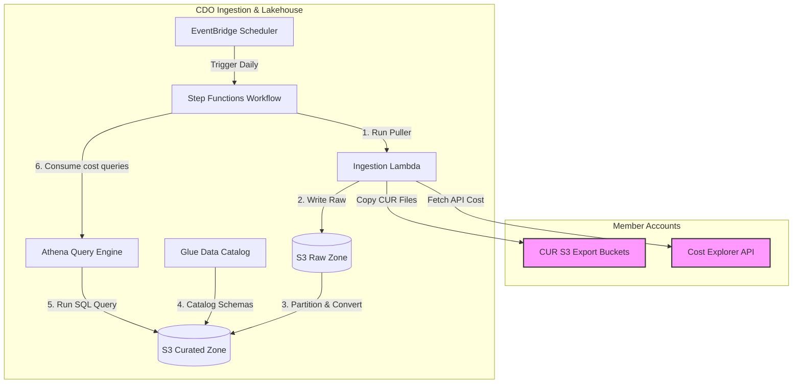
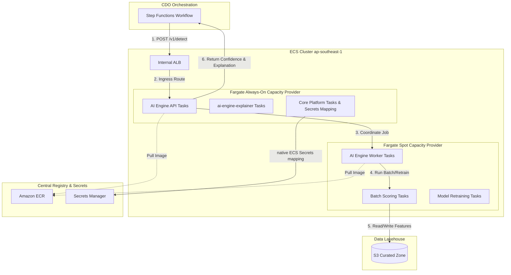
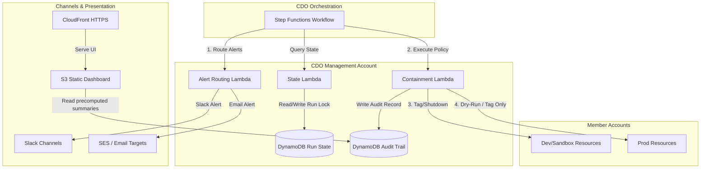

# Thiết kế Hạ tầng (Infrastructure Design) - Task Force 2 · FinOps Watch CDO

<!-- Doc owner: CDO Team
     Status: Final (W11 T6 Pack #1) -> Updated (W12 T4 Pack #2)
-->

## 1. Sơ đồ kiến trúc (Architecture diagram)

Nền tảng CDO được thiết kế xoay quanh hồ dữ liệu (lakehouse-centric) để thu thập và phân tích dữ liệu chi phí, được điều phối bởi các luồng công việc serverless và tích hợp với một endpoint AI Engine của Task Force dùng chung được lưu trữ một lần duy nhất trên cụm ECS được quản lý (`tf-2-aiops-cluster`). Lớp tính toán ECS sử dụng cấu hình lai (hybrid) giữa các Fargate always-on capacity provider tasks và Fargate Spot capacity provider tasks để tối ưu hóa chi phí thực thi. Endpoint dùng chung này được truy cập qua `https://ai-engine.tf-2.internal/` với xác thực IAM SigV4.

Kiến trúc này được định cỡ xoay quanh các trách nhiệm lặp lại của nền tảng CDO, chứ không xoay quanh bộ dữ liệu huấn luyện mô hình của AIOps. CDO phải kéo dữ liệu thanh toán một cách đáng tin cậy từ các nguồn AWS được phê duyệt, chuẩn hóa nó thành dạng sẵn sàng cho hợp đồng, gọi AI Engine do AIOps sở hữu và lưu giữ bằng chứng quyết định được trả về. Mọi bộ dữ liệu lịch sử tổng hợp được sử dụng để huấn luyện, nâng cao hoặc backtest mô hình đều thuộc sở hữu của AIOps. Telemetry thu thập để gửi sang AI Engine phát hiện bất thường là dữ liệu chi phí CUR-only (quét phân vùng S3 CUR và API Cost Explorer) và loại bỏ hoàn toàn các metric hiệu năng CloudWatch (CPU, memory, database connections) vốn chỉ dành riêng cho việc giám sát vận hành của CDO (cảnh báo, logging, metrics, dashboard).

```mermaid
graph TB
    subgraph "AWS Member Accounts"
        MemberS3[CUR S3 Export Buckets]
        MemberCE[Cost Explorer API Endpoints]
    end

    subgraph "CDO Management Account VPC (ap-southeast-1)"
        subgraph "Ingestion & Orchestration"
            EB[EventBridge Scheduler] -->|Trigger Daily| SF[Step Functions Workflow]
            SF -->|Invoke Puller| LambdaPull[Ingestion Lambda]
            SF -->|Evaluate Run| LambdaState[State Lambda]
            SF -->|Trigger Containment| LambdaCont[Containment Lambda]
            SF -->|Route Alerts| LambdaAlert[Alert Routing Lambda]
        end

        subgraph "Data Lakehouse Tier"
            S3Raw[(S3 Raw Zone)]
            S3Cur[(S3 Curated Zone)]
            GlueCat[Glue Data Catalog]
            Athena[Athena Query Engine]
        end

        subgraph "Private Subnets (ECS Cluster)"
            subgraph "ECS Cluster Services"
                ControlPlane[ECS Control Plane]
            end
            
            subgraph "Fargate Always-On Capacity Provider"
                API_P[AI Engine API Tasks]
                EXP_P[ai-engine-explainer Tasks]
                SecretsMap[ECS Task Definition Secrets Mapping]
                Core_P[Core CDO Platform Tasks]
            end

            subgraph "Fargate Spot Capacity Provider"
                WRK_P[AI Engine Worker Tasks]
                Batch_J[Batch Scoring Tasks]
                Train_J[Model Retraining Tasks]
            end

            InternalALB[Internal ALB]
        end

        subgraph "Database Store"
            DDB[(DynamoDB Run State & Audit)]
        end
    end

    subgraph "Alerting & Presentation"
        Slack[Slack Notification Engine]
        Email[SES Email Target]
        S3Dashboard[S3 Static Dashboard Assets]
        CloudFront[CloudFront HTTPS Ingress]
    end

    %% Ingestion flows
    LambdaPull -->|Fetch Cost Data| MemberCE
    LambdaPull -->|Pull CUR Files| MemberS3
    LambdaPull -->|Write raw cost| S3Raw

    %% Transformation flows
    S3Raw -->|Partition/Schema Validation| S3Cur
    GlueCat -->|Catalog schemas| S3Cur
    Athena -->|Query data| S3Cur

    %% Orchestration & Database interactions
    LambdaState -->|Idempotency key check & write state| DDB
    LambdaCont -->|Write immutable audit trail| DDB
    LambdaCont -->|Assume role & tag/suggest/shutdown| MemberAccounts[Member Accounts Resources]
    LambdaAlert -->|Route alert payload| Slack
    LambdaAlert -->|Route alert payload| Email

    %% AI Engine Integration
    SF -->|Detect Request via Internal ALB| InternalALB
    InternalALB -->|Route Ingress| API_P
    API_P -->|Coordinate batch scoring| WRK_P
    WRK_P -->|Process logs| Batch_J
    Batch_J -->|Read/Write features| S3Cur
    
    %% Dashboard presentation
    CloudFront -->|Serve Static Files & JSON| FinanceUsers[Finance Users]
    S3Dashboard -->|Deliver Assets| CloudFront
    SF -->|Write precomputed JSON summaries| S3Dashboard
    SF -->|Write run summaries| DDB
```



*Chú thích: Quy trình CDO được kích hoạt hàng ngày bởi EventBridge Scheduler. Luồng Step Functions điều phối việc thu thập dữ liệu từ các tài khoản thành viên (member accounts), ghi dữ liệu CUR và Cost Explorer thô vào S3, rồi thực hiện phân mục (catalog). Luồng này gửi yêu cầu phát hiện bất thường tới AI Engine (do AIOps sở hữu) thông qua internal ALB của ECS. Cụm ECS cô lập các API ổn định trên các Fargate always-on capacity provider tasks và các tác vụ tính toán batch scoring hoặc training trên các Fargate Spot capacity provider tasks tối ưu chi phí. Các chế độ xem bảng điều khiển (dashboard) và luồng xử lý containment lấy trạng thái sạch từ các bản tóm tắt được tính toán trước trong S3 và DynamoDB.*

---

Để kiến trúc dễ tiếp cận hơn, sơ đồ được chia nhỏ thành một sơ đồ tổng quan mức cao, tiếp nối bởi ba sơ đồ chi tiết đi sâu vào từng phân hệ như bên dưới:

### 1.1 Tổng quan Kiến trúc ở Mức Cao (High-Level Architecture Overview)

Sơ đồ này thể hiện các tương tác vĩ mô ở mức cao giữa bộ điều phối trung tâm, phân hệ hồ dữ liệu (lakehouse), cụm tính toán ECS và động cơ cảnh báo/containment.


*Chú thích: Bộ điều phối trung tâm Step Functions Orchestrator vận hành toàn bộ vòng lặp FinOps: trích xuất dữ liệu vào Lakehouse, gọi ECS-hosted AI Engine để lấy quyết định bất thường và kích hoạt các luồng cảnh báo cũng như containment dựa trên kết quả.*

Về mặt vận hành, Step Functions là ranh giới kiểm soát giữa logic CDO mang tính xác định và đầu ra AI mang tính xác suất. Mỗi quá trình chuyển đổi trạng thái đều ghi lại `run_id`, cửa sổ chi phí, phạm vi tài khoản và phiên bản hợp đồng để Finance có thể truy vết một bất thường trên dashboard về đúng lô thu thập dữ liệu và quyết định của AI. Thiết kế này cũng ngăn AI Engine tác động trực tiếp đến các tài khoản thành viên; tất cả các hành động cảnh báo và containment đều được điều phối thông qua các worker chính sách của CDO.

### 1.2 Quy trình Thu thập & Hồ dữ liệu (Ingestion & Data Lakehouse Workflow)

Sơ đồ này đi sâu vào quy trình thu thập dữ liệu (ingestion pipeline) và các lớp lưu trữ/truy vấn của hồ dữ liệu (lakehouse).



*Chú thích: Step Functions kích hoạt hàm Ingestion Lambda hàng ngày thông qua EventBridge Scheduler. Dữ liệu chi phí thô từ các tài khoản thành viên (Member Accounts) được lưu trữ trong S3 Raw Zone, được chuyển tiếp và catalog hóa thành định dạng Parquet trong S3 Curated Zone, rồi được truy vấn thông qua Athena. Kết quả truy vấn được truyền ngược lại bộ điều phối Step Functions để cung cấp cho AI Engine.*

Workflow thu thập chuẩn hóa hai dạng dữ liệu thanh toán vận hành trước khi gọi AI Engine. CUR cung cấp các trường ở cấp độ tài nguyên như account ID, product code, resource ID, unblended cost và các thẻ tài nguyên. Cost Explorer cung cấp các trường tổng hợp như linked account, service name, service code, region, unblended cost và trạng thái estimated/final. Lớp curated lưu trữ cả trường mã dịch vụ đã chuẩn hóa và tên hiển thị để CDO có thể chuyển các payload nhất quán tới AIOps và xây dựng các chế độ xem dashboard mà không cần sở hữu dữ liệu huấn luyện mô hình.

### 1.3 Nền tảng Lưu trữ AI Engine trên ECS (AI Engine ECS Hosting Platform)

Sơ đồ này chi tiết về bố cục của cụm ECS, minh họa việc cô lập các tác vụ API ổn định (Always-On) khỏi các tác vụ xử lý theo lô và huấn luyện lại mô hình (Spot).



*Chú thích: Yêu cầu `/v1/detect` của AI Engine từ bộ điều phối Step Functions được định tuyến qua Internal ALB đến AI Engine API Tasks chạy trên các Fargate always-on capacity provider tasks. Các tác vụ chạy theo lô nặng được điều phối trên các Fargate Spot capacity provider tasks để đọc/ghi các đặc trưng đã được lọc (curated features) từ S3. Thông tin xác thực và cấu hình được đồng bộ hóa từ Secrets Manager bằng cách sử dụng native ECS Task Definition Secrets Manager mapping.*

Nền tảng ECS tách biệt độ tin cậy thời gian chạy khỏi việc thực thi hàng loạt (batch) hiệu quả về chi phí. AI Engine API Tasks và `ai-engine-explainer` vẫn chạy dưới dạng Fargate always-on capacity provider tasks vì Step Functions phụ thuộc vào hành vi phản hồi có thể dự đoán được trong suốt lượt chạy hàng ngày. AI Engine Worker Tasks, các tác vụ scoring theo lô, tác vụ kỹ nghệ đặc trưng và tác vụ huấn luyện lại được đặt trên các Fargate Spot capacity provider tasks vì chúng có thể lưu checkpoint vào S3 và thử lại sau khi bị gián đoạn. Sự phân biệt này là bắt buộc đối với cả việc kiểm soát chi phí và khôi phục lỗi chính xác.

### 1.4 Động cơ Cảnh báo & Containment (Alerting & Containment Engine)

Sơ đồ này đi sâu vào luồng cảnh báo và containment, mô tả cách thức chính sách được thực thi an sau trên các môi trường production và phi production với một nhật ký kiểm toán tuân thủ.



*Chú thích: Luồng Step Functions kích hoạt các hàm Lambda cảnh báo và containment riêng biệt dựa trên quyết định của AI Engine. Các Lambda containment đọc trạng thái chạy, ghi nhật ký kiểm toán vào DynamoDB, áp dụng containment chủ động (gắn nhãn/tắt máy) trên các tài khoản Dev/Sandbox và thực thi các hành động dry-run (gắn nhãn/đề xuất) trên Prod. Bảng điều khiển web tĩnh S3 + CloudFront đọc các bản tóm tắt kiểm toán và chi tiêu DynamoDB/S3 JSON được tính toán trước để hiển thị trạng thái containment trực tiếp cho các bên liên quan của bộ phận Tài chính.*

Động cơ containment coi `execution_mode` là một đầu vào chính sách bắt buộc, không phải là một sự tiện lợi khi chạy. Các tài nguyên production chỉ có thể nhận các kết quả tag, gợi ý (suggest) hoặc dry-run, trong khi các tài nguyên dev/sandbox có thể nhận các hành động ở chế độ apply chỉ khi các yêu cầu về chính sách và phê duyệt được thỏa mãn. Mỗi hành động được đề xuất hoặc thực thi đều ghi lại một bản ghi kiểm toán trước khi thực hiện bất kỳ thao tác nào trên tài khoản thành viên.

---

## 2. Bảng thành phần (Component table)

Các thành phần hạ tầng sau đây được triển khai tại vùng `ap-southeast-1` để vận hành nền tảng FinOps Watch:

| Thành phần | Dịch vụ AWS | Lý do | Ghi chú chi phí |
|---|---|---|---|
| Bộ kích hoạt thu thập (Ingestion Trigger) | EventBridge Scheduler | Kích hoạt quy trình thu thập dữ liệu hàng ngày theo lịch trình cron serverless được quản lý. | Gói miễn phí bao gồm 14 triệu lượt gọi/tháng, sau đó là 1,00 USD trên mỗi triệu lượt. |
| Lớp điều phối (Orchestration) | Step Functions | State machine serverless thực thi logic luồng công việc, các nhánh điều kiện, trạng thái chờ và thử lại khi có lỗi. | 0,025 USD trên mỗi 1.000 lần chuyển đổi trạng thái. |
| Tính toán (Adapters) | Lambda | Chạy mã adapter serverless gọn nhẹ để lấy dữ liệu từ Cost Explorer API, sao chép các bản xuất CUR 2.0 và xử lý cảnh báo/containment. | Thanh toán theo mức sử dụng, ~0,00001667 USD mỗi GB-giây. |
| Hồ dữ liệu (Raw Zone) | Amazon S3 | Lưu trữ các tệp CUR 2.0 hàng ngày và các tệp kết xuất JSON từ Cost Explorer không thể sửa đổi. | 0,023 USD mỗi GB/tháng + phí yêu cầu. |
| Hồ dữ liệu (Curated Zone) | Amazon S3 | Lưu trữ các tệp chi phí đã được phân vùng và xác thực schema dưới định dạng Parquet, được tối ưu hóa cho truy vấn. | 0,0125 USD mỗi GB/tháng (Infrequent Access) + phí chuyển đổi lớp lưu trữ. |
| Danh mục siêu dữ liệu (Metadata Catalog) | Glue Data Catalog | Tự động đăng ký các phân vùng bảng và duy trì định nghĩa schema cho Athena. | 1 triệu đối tượng được phân mục đầu tiên là miễn phí; các lượt chạy crawler có chi phí 0,44 USD mỗi DPU-giờ. |
| Công cụ truy vấn (Query Engine) | Amazon Athena | Cho phép chạy truy vấn SQL serverless trên các tệp S3 để xây dựng các materialized view và cung cấp dữ liệu cho bảng điều khiển. | 5,00 USD trên mỗi TB dữ liệu được quét. |
| Cơ sở dữ liệu trạng thái & kiểm toán (State & Audit Database) | Amazon DynamoDB | Lưu trữ trạng thái chạy, các khóa idempotency, nhật ký kiểm toán containment và các materialized view của bảng điều khiển. | Dung lượng on-demand: 1,25 USD trên mỗi triệu đơn vị ghi (write unit), 0,25 USD trên mỗi triệu đơn vị đọc (read unit). |
| Nền tảng lưu trữ AI Engine (AI Engine Hosting) | Amazon ECS | Lưu trữ AI Engine dùng chung do nhóm AIOps cung cấp (dịch vụ `ai-engine` trên cluster `tf-2-aiops-cluster`) với task size 2 vCPU và 4 GB memory, và timeout 300s. | Nền tảng điều phối ECS được AWS quản lý hoàn toàn miễn phí. |
| Tính toán tác vụ ổn định (Stable Workload Compute) | Fargate always-on capacity provider tasks | Chạy các tác vụ ổn định, luôn bật (AI Engine API Tasks, ai-engine-explainer, giám sát, tích hợp load balancer) trên Fargate always-on capacity provider. Tự động scale qua AWS Application Auto Scaling (min 2 / max 10 tasks, kích hoạt khi CPU >70% hoặc SQS backlog >100). | Giá Fargate On-Demand (tính theo vCPU và memory mỗi giờ tại ap-southeast-1). |
| Tính toán tác vụ theo lô (Batch Workload Compute) | Fargate Spot capacity provider tasks | Chạy các tác vụ phát hiện theo lô, kỹ nghệ đặc trưng nặng và huấn luyện/huấn luyện lại mô hình (AI Engine Worker Tasks) trên Fargate Spot capacity provider. Các tác vụ Spot có thể bị ngắt quãng, hỗ trợ lưu checkpoint và cơ chế retry/backoff. | Giá Fargate Spot tiết kiệm tới 60-70% so với Fargate on-demand tasks thông thường. |
| Kho lưu trữ container (Container Registry) | Amazon ECR | Lưu trữ các hình ảnh container Docker được gắn phiên bản cho các mô hình của AIOps. | 0,10 USD mỗi GB/tháng (500 MB đầu tiên miễn phí). |
| Nhà cung cấp bí mật (Secrets Provider) | Secrets Manager | Quản lý an toàn các khóa API, thông tin xác thực cơ sở dữ liệu và Slack webhook với tính năng tự động xoay vòng bí mật. | 0,40 USD mỗi bí mật/tháng + 0,05 USD cho mỗi 10.000 yêu cầu. |
| Bộ cân bằng tải (Load Balancer) | Application Load Balancer (Internal) | Công khai dịch vụ ECS AI Engine API trong nội bộ tới các hàm Step Functions/Lambda qua các subnet riêng tư tại `https://ai-engine.tf-2.internal/` (cổng 443 HTTPS, TLS 1.3, SG-to-SG ingress; cổng 8080 `/health` check). | ~0,0225 USD mỗi LCU-giờ. |
| Bảng điều khiển Tài chính (Finance Dashboard) | Amazon S3 + CloudFront | Bảng điều khiển web tĩnh nội bộ nhẹ được lưu trữ dưới dạng tài sản tĩnh trong Amazon S3 và phân phối qua Amazon CloudFront. Bảng điều khiển đọc các bản tóm tắt thân thiện với tài chính được tính toán trước từ các đối tượng S3 JSON hoặc bản ghi DynamoDB. | Chi phí lưu trữ S3 và phí yêu cầu HTTPS/truyền dữ liệu CloudFront (thường dưới 5 USD/tháng). QuickSight được giữ lại như một tùy chọn BI trong tương lai. |
| Kênh cảnh báo (Alert Channels) | Amazon SNS / Slack API | Cung cấp các đường định tuyến riêng biệt cho cảnh báo (cảnh báo Tài chính qua Slack/Email, cảnh báo Kỹ thuật qua Slack/Jira). | SNS miễn phí tới 100 nghìn thông báo email/tháng; Slack API miễn phí. |
| Tác nhân thực thi containment (Containment Worker) | AWS Lambda | Giả lập vai trò (assume role) trong các tài khoản thành viên để áp dụng nhãn (tag) hoặc tắt các tài nguyên dev/sandbox, thực thi nghiêm ngặt trong các chế độ dry-run hoặc apply. | Thanh toán theo mức sử dụng. |

> [!NOTE]
> Chi phí chạy thực tế cho CDO pipeline trong giai đoạn xây dựng hệ thống được theo dõi bằng: `Cần bằng chứng: Chi phí vận hành thực tế của pipeline CDO`.

Mô hình thành phần bản đồ trực tiếp tới ba hợp đồng dữ liệu được sử dụng bởi nền tảng:

| Hợp đồng | Thành phần CDO chịu trách nhiệm | Bằng chứng tối thiểu được lưu giữ |
|---|---|---|
| Hợp đồng kéo dữ liệu chi phí | EventBridge Scheduler, Step Functions, Ingestion Lambda, S3, Glue, Athena | URI đối tượng nguồn, cửa sổ chi phí, tài khoản, dịch vụ, vùng, tag chủ sở hữu, chi phí chưa pha trộn (unblended cost), cờ estimated/final. |
| Hợp đồng đầu ra quyết định của AI | Internal ALB, AI Engine API Tasks, Step Functions, DynamoDB | Phiên bản mô hình, mã bất thường (anomaly ID), độ tin cậy (confidence), mức độ nghiêm trọng (severity), chi tiêu dự kiến so với thực tế, cửa sổ bằng chứng, giải thích, định tuyến được khuyến nghị. |
| Hợp đồng cảnh báo và containment | Alert Lambda, Containment Lambda, DynamoDB, nhật ký kiểm toán S3 | Mục tiêu định tuyến, yêu cầu phê duyệt, chế độ thực thi, trạng thái trước/sau, đường dẫn rollback, ID bản ghi kiểm toán. |

---

## 3. Phân tích sâu về khía cạnh khác biệt (Differentiation angle deep-dive)

### 3.1 Tại sao chọn hướng đi này? (Why this angle?)

Nền tảng CDO triển khai một **kiến trúc FinOps control plane theo mô hình lakehouse-centric kết hợp điều phối serverless và hạ tầng ECS Fargate Hybrid để lưu trữ AI Engine**.
1. **Sự phù hợp của mô hình Lakehouse**: Môi trường FinOps trong sản xuất vận hành theo chu kỳ tự nhiên 24 giờ dựa trên tần suất xuất tệp CUR của AWS. Mô hình lakehouse (S3 + Glue + Athena) giúp tránh được chi phí cố định cao của các kho dữ liệu luôn bật (như Redshift) hoặc các cơ sở dữ liệu quan hệ, trong khi vẫn giữ dữ liệu chi phí lịch sử có cấu trúc đầy đủ, sẵn sàng cho việc kiểm toán và được truy vấn hiệu quả theo phân vùng.
2. **Điều phối Serverless**: EventBridge Scheduler và Step Functions quản lý luồng xử lý theo mô hình serverless-first, giữ cho chi phí vận hành của bộ điều phối pipeline gần như bằng không.
3. **Tính toán ECS Fargate Hybrid cho AI**: AI Engine do nhóm AIOps cung cấp chứa hai khối lượng công việc riêng biệt:
   - Các endpoint suy luận ổn định (AI Engine API Tasks, `ai-engine-explainer`) đòi hỏi độ khả dụng cao và độ trễ thấp.
   - Các tác vụ chạy theo lô nặng (AI Engine Worker Tasks phục vụ kỹ nghệ đặc trưng, chấm điểm theo lô và huấn luyện lại mô hình) tiêu tốn nhiều tài nguyên tính toán nhưng có thể bị ngắt quãng.
   Việc lưu trữ AI Engine trên ECS cho phép CDO đặt các API ổn định trên các **Fargate always-on capacity provider tasks** để đảm bảo các cam kết SLO, và các worker chạy theo lô trên các **Fargate Spot capacity provider tasks**. Thiết kế này giúp giảm 60-70% chi phí tính toán cho AI. Trong môi trường ECS Fargate, chúng tôi cấu hình Capacity Providers để phân bổ công việc tự động giữa Fargate (always-on) và Fargate Spot, đạt hiệu quả tối ưu chi phí và tự động quản lý vòng đời tác vụ mà không cần quản lý hạ tầng EC2 thủ công.

Lý do thực tế điều này quan trọng là tính độc lập vận hành. AIOps có thể lặp lại logic mô hình, kỹ nghệ đặc trưng và xử lý false-positive mà không cần thay đổi workflow của CDO. CDO giữ cho lakehouse, bộ lập lịch, đường dẫn gọi API, định tuyến cảnh báo và chính sách containment luôn ổn định, trong khi AI Engine do ECS host có thể phát triển đằng sau một hợp đồng có phiên bản.

### 3.2 Các điểm vượt trội (kèm số liệu) (Strengths (with metrics))

Các số liệu dưới đây nêu bật sự đánh đổi của kiến trúc lakehouse-centric và ECS Fargate Hybrid so với các phương pháp tiếp cận CDO khác:

| Tiêu chí | Phương án lựa chọn (Lakehouse + ECS Fargate Hybrid) | Phương án thay thế A (ECS Cluster trên EC2 + RDS Aurora) | Phương án thay thế B (Nền tảng SaaS bên thứ ba) |
|---|---|---|---|
| **Chi phí cho mỗi lượt chạy hàng ngày (Ingest + Query)** | ~0,15 USD (Thanh toán theo lượt truy vấn S3 + Athena) | ~5,00 USD (Chi phí cố định hàng ngày của thực thể RDS) | N/A (Đã bao gồm trong phí đăng ký thuê bao) |
| **Chi phí tính toán AI (Lưu trữ/Tháng)** | ~80 USD (ECS Fargate always-on + Fargate Spot tasks) | ~240 USD (Quản lý cụm ECS + Tự động mở rộng phiên bản Spot) | N/A |
| **Chi phí vận hành (Giờ/Tuần)** | ~2 giờ (Quản lý Terraform ECS, cấu hình task) | ~8 giờ (Quản lý ECS cluster trên EC2 và cập nhật cấu hình Terraform ECS) | ~1 giờ (Cập nhật kết nối SaaS) |
| **Thời gian onboard tài khoản mới** | < 10 phút (Triển khai stack IAM cross-account bằng Terraform) | ~25 phút (Thiết lập schema DB thủ công + VPC peering) | > 60 phút (Thiết lập thủ công + cấu hình IAM) |
| **Khả năng mở rộng cho huấn luyện lại** | Rất tốt (Fargate Spot task pools được scale bằng AWS Application Auto Scaling) | Rất tốt (ECS Spot task pools được scale bằng AWS Application Auto Scaling) | Kém (Không thể chạy mô hình của AIOps trên hạ tầng local) |

### 3.3 Các điểm yếu chấp nhận (Accepted weaknesses)

- **Rủi ro gián đoạn của ECS Fargate Spot**: Việc thực thi các tác vụ huấn luyện và scoring theo lô lớn trên các Fargate Spot capacity provider tasks có rủi ro bị thu hồi tác vụ. Điều này được chấp nhận vì ECS Fargate tự động xử lý việc lập lịch lại tác vụ, và AIOps worker hỗ trợ lưu checkpoint vào S3 giúp giảm thiểu khối lượng công việc bị mất, đồng thời mang lại mức tiết kiệm chi phí 60-70%.
- **Chi phí cho VPC Endpoints**: Định tuyến riêng tư tất cả lưu lượng trong VPC yêu cầu sử dụng các interface endpoint (Secrets Manager, ECR, CloudWatch), gây ra chi phí cố định khoảng ~7,20 USD/endpoint/tháng. Điều này được chấp nhận nhằm đáp ứng yêu cầu bảo mật nghiêm ngặt là không truyền dữ liệu chi phí và kiểm toán qua mạng internet công cộng.
- **Độ trễ thu thập dữ liệu CUR**: Các bản xuất CUR của AWS bị trễ từ 8 đến 24 giờ. Độ trễ này được chấp nhận vì hệ thống vận hành theo chu kỳ 24 giờ, nghĩa là không yêu cầu truyền phát dữ liệu thời gian thực (real-time streaming) cho việc phát hiện bất thường hàng ngày.

---

## 4. Phương pháp tiếp cận multi-account (Multi-account approach)

### 4.1 Mô hình tài khoản (Account model)

Nền tảng CDO được triển khai tại một tài khoản trung tâm **CDO Management Account**. Hệ thống thực hiện thu thập dữ liệu chi phí từ và kích hoạt các hành động containment tại nhiều tài khoản thành viên **Member Accounts** thuộc AWS Organization.
- **Thu thập chi phí Cross-Account**: Hàm `LambdaCURPuller` trung tâm giả lập vai trò (assume role) đọc dữ liệu `FinOpsCURPullerRole` tại mỗi tài khoản thành viên đích. Vai trò này cấp quyền truy xuất dữ liệu Cost Explorer API cục bộ và sao chép các tệp CUR từ bucket S3 xuất của tài khoản thành viên.
- **Containment Cross-Account**: Hàm `LambdaContainment` trung tâm giả lập vai trò `FinOpsContainmentWorkerRole` tại tài khoản thành viên đích. Vai trò giả lập này chứa các quyền được giới hạn chặt chẽ để gắn nhãn (tag) tài nguyên hoặc điều chỉnh Auto Scaling Groups (ASGs) tại tài khoản thành viên cụ thể đó.

Mô hình tài khoản phải bảo toàn ngữ cảnh môi trường vì cùng một loại bất thường sẽ có các giới hạn hành động khác nhau tùy thuộc vào môi trường. Một workload GPU chạy quá mức kiểm soát trong tài khoản nghiên cứu non-prod có thể đủ điều kiện để containment sau khi phê duyệt; một tín hiệu tương tự trong tài khoản thanh toán production phải giữ ở mức chỉ tag/suggest/dry-run.

### 4.2 Mô hình cô lập (Isolation pattern)

- **Cô lập dữ liệu**: Dữ liệu chi phí thu thập từ các tài khoản thành viên được lưu trữ trong một bucket S3 duy nhất, được phân vùng theo mã tài khoản (Account ID): `s3://cdo-curated-bucket/account_id=123456789012/year=2026/month=06/`.
- **Cô lập truy vấn**: Các định nghĩa bảng trong Athena sử dụng tính năng chiếu phân vùng (partition projection) của Glue. Các truy vấn Athena được thực thi để phục vụ các materialized view của bảng điều khiển được giới hạn chặt chẽ theo khóa phân vùng `account_id`.
- **Xác định sở hữu (Ownership)**: Tài nguyên được ánh xạ tới các nhóm kỹ thuật (squad) cụ thể bằng cách sử dụng các thẻ siêu dữ liệu tiêu chuẩn là `owner` và `squad`. Khi pipeline thu thập dữ liệu phát hiện các tài nguyên thiếu các thẻ này, hệ thống sẽ tự động gán chúng vào một nhóm mặc định (`unassigned-resources`) và định tuyến cảnh báo đến kênh hạ tầng của CDO để xử lý thủ công.

Phân vùng theo tài khoản và kỳ chi phí là biện pháp kiểm soát hiệu năng chính, trong khi thẻ tag cung cấp góc nhìn sở hữu kinh doanh. Nền tảng phải giữ cho chi tiêu không có tag hiển thị được thay vì loại bỏ nó trong quá trình chuẩn hóa, vì các tag sở hữu bị thiếu là một lộ trình leo thang quan trọng đối với Finance ngay cả khi AIOps sở hữu việc phân loại bất thường cuối cùng.

### 4.3 Quy trình onboard (Onboarding flow)

Khi thực hiện onboard một tài khoản AWS hoặc squad mới vào nền tảng FinOps Watch, pipeline tự động dưới đây sẽ được thực thi:

```
1. Add account ID and owner mapping to the Terraform 'accounts.tfvars' configuration.
2. Terraform execution applies IAM Stack:
   - Provisions 'FinOpsCrossAccountAccessRole' in the target member account.
   - Configures trust policy allowing the central CDO Lambda and ECS task roles to assume it.
   - Updates target account CUR export configuration to deliver data to S3.
3. Glue crawler is triggered to update partitions in the Glue Data Catalog.
4. E2E Validation run:
   - Ingestion Lambda makes a test API call to target account Cost Explorer.
   - Verifies connectivity to ECS internal service endpoint.
5. Account status marked as 'ACTIVE' in the DynamoDB registry.
```

### 4.4 Tính bất biến (Idempotency)

Nhằm ngăn chặn việc chạy trùng lặp cho cùng một kỳ chi phí (điều này sẽ làm sai lệch dữ liệu trên bảng điều khiển và phát sinh thêm chi phí gọi Cost Explorer API trùng lặp), nền tảng CDO triển khai cơ chế idempotency:
- Mỗi lượt thực thi hàng ngày tạo ra một khóa idempotency: `account_id:billing_period:execution_date` (ví dụ: `123456789012:2026-06:2026-06-22`).
- Luồng Step Functions bắt đầu bằng cách truy vấn bảng `cdo-run-state-table` trên DynamoDB theo khóa này.
- Nếu khóa này đã tồn tại với trạng thái `Status = COMPLETED` or `Status = IN_PROGRESS`, luồng Step Functions sẽ dừng lại một cách an sau và ghi lại nỗ lực chạy trùng lặp này vào nhật ký kiểm toán (audit logs).
- Nếu khóa chưa tồn tại, một bản ghi mới được tạo với trạng thái `Status = IN_PROGRESS` cùng thời gian sống (TTL) là 48 giờ để khóa lượt chạy.

### 4.5 Cache dữ liệu chi phí & Kiểm soát giới hạn tần suất Cost Explorer (Cost Explorer Rate Limit Control)

Để bảo vệ AWS Cost Explorer API khỏi việc vượt quá giới hạn tần suất nghiêm ngặt **5 requests/second**, nền tảng CDO triển khai chiến lược cache dựa trên DynamoDB như mô tả trong hợp đồng telemetry:
- **Lưu trữ Cache CDO**: Lambda Ingestion thực hiện truy vấn các chỉ số Cost Explorer hàng ngày và cache payload kết quả vào một bảng DynamoDB chuyên dụng (`cdo-cost-cache-table`) với khóa chính là `AccountID:DateRange`.
- **AI Engine đọc dữ liệu offline**: Khi AI Engine do đội AIOps vận hành thực thi và yêu cầu dữ liệu chi phí baseline lịch sử (chẳng hạn như dữ liệu chi phí 7 ngày hoặc 30 ngày qua để trích xuất đặc trưng và phân tích bất thường), nó sẽ đọc trực tiếp các bản ghi chi phí đã cache từ DynamoDB của CDO thông qua ranh giới ALB nội bộ.
- **Lợi ích**: Thiết kế này ngăn việc AI Engine và nhiều Lambda của nền tảng thực hiện gọi trực tiếp Cost Explorer API đồng thời, đảm bảo hệ thống luôn hoạt động dưới ngưỡng 5 requests/second và loại bỏ hoàn toàn khả năng bị AWS throttling.

### 4.6 Tuân thủ & Xác thực Thu thập Telemetry (Telemetry Ingestion Compliance & Validation)

Nền tảng CDO thực thi tất cả các kiểm soát bảo mật và xác thực trên mặt phẳng dữ liệu (data-plane) được quy định trong `telemetry-contract.md` và `ai-api-contract.md`:
- **Schema & Kiểu Ingestion**: Telemetry tuân thủ schema phiên bản 3 (`telemetry://finops-watch/v3`). Quá trình nạp dữ liệu hỗ trợ kiểu `RAW_JSON` (dưới 10MB cho dữ liệu Cost Explorer API) và `S3_POINTER` (dưới 500MB cho dữ liệu CUR nén lưu trên S3). Tuyệt đối không gửi telemetry hiệu năng CloudWatch (CPU, memory, connections) cho AI Engine phát hiện bất thường; các tín hiệu này chỉ dùng riêng cho lớp giám sát vận hành CDO (cảnh báo, logs, dashboard).
- **Request Headers tiêu chuẩn**: Mọi yêu cầu gửi tới endpoint dùng chung (`https://ai-engine.tf-2.internal/`) phải đính kèm: `X-Tenant-Id` (UUID v4), `X-Idempotency-Key` (composite key: `tenant_id:YYYY-MM-DD` có TTL 24h trên DynamoDB), `X-Correlation-Id` (UUID), `X-Payload-SHA256`, và `X-Request-Timestamp`.
- **Trường dữ liệu phản hồi**: Trả về các trường chuẩn gồm `audit_id`, `status` (`processing` | `completed` | `failed`), mảng `anomalies_list` (chứa `anomaly_metadata`, `finance_dashboard_data`, và `engineering_dashboard_data`), và `pagination` (`next_token` và `limit`).
- **Các cờ điều khiển**:
  - `is_ad_hoc`: Bỏ qua khóa idempotency 24h khi quét khẩn cấp (tối đa 5 lần/ngày).
  - `is_estimated`: Đánh dấu dữ liệu tạm tính; AI Engine sẽ tự động giảm confidence score (<0.50), gán nhãn chỉ xem xét (review-only) và bỏ qua tự động containment.
  - `is_forced_dry_run`: AI Engine tự động bật nếu chỉ số completeness score `< 0.8`, ép hệ thống về chế độ dry-run để bảo vệ an toàn production khi dữ liệu bị lỗi/thiếu.
- **Chuỗi liên kết kiểm toán (Audit Trail Chain)**: Bản ghi containment được lưu vào DynamoDB/S3 dưới dạng chuỗi băm chống giả mạo: `sha256(current_payload + previous_hash)` với thời gian lưu trữ $\ge 90$ ngày.
- **Bảo vệ Tính toàn vẹn Thời gian & Yêu cầu**: Nhằm ngăn chặn các cuộc tấn công replay (replay attacks) và đảm bảo tính nhân quả trong môi trường phân tán:
  - **Bảo vệ chống Replay**: Lớp xác thực API của CDO áp dụng cửa sổ kiểm tra 300 giây (`abs(now - timestamp) > 300s` sẽ trả về lỗi `400 Bad Request` cùng mã `ERR_REPLAY_DETECTED`).
  - **Kiểm soát lệch giờ**: Các yêu cầu có độ lệch đồng hồ hệ thống vượt quá 10 giây (`clock_skew_ms > 10000`) sẽ bị từ chối ngay lập tức.
- **Chuẩn hóa dữ liệu & Loại bỏ PII**: CDO đóng vai trò là nguồn sự thật (source of truth) duy nhất và thực hiện lọc bỏ toàn bộ thông tin định danh cá nhân (PII) ngay tại lớp ingestion. CDO thực hiện ánh xạ các trường hóa đơn sang schema thống nhất, đồng thời đối soát mã dịch vụ của CUR (`service_code` như `AmazonEC2`) với tên hiển thị của Cost Explorer (`service`).
- **Tín hiệu bối cảnh nghiệp vụ**: Các lô dữ liệu hàng ngày được đóng gói kèm các chỉ số bối cảnh nghiệp vụ (các cờ chiến dịch marketing, load test hoặc đang migration dữ liệu) để cung cấp cho AI Engine, giúp mô hình AI tối ưu hóa độ chính xác và giảm thiểu tỷ lệ cảnh báo sai (false positive).

---

## 5. Các phương án thay thế được cân nhắc (Alternatives considered)

### 5.1 Lớp điều phối (Orchestration layer)

- **Phương án A**: Apache Airflow trên AWS (MWAA).
  - *Ưu điểm*: Tích hợp Python tuyệt vời, hỗ trợ cây phụ thuộc phức tạp gốc, giao diện trực quan hóa tác vụ chi tiết.
  - *Nhược điểm*: Chi phí cố định cao (tối thiểu ~350 USD/tháng), thời gian khởi động lâu (trên 20 phút), cấu hình hạ tầng phức tạp.
- **Phương án B**: Các tác vụ theo lịch trình của ECS (ECS Scheduled Tasks).
  - *Ưu điểm*: Chạy tự động trong cụm ECS sử dụng trình lập lịch EventBridge Scheduler.
  - *Nhược điểm*: Khó khăn trong việc thiết lập và điều phối các workflow cross-account nhiều bước phức tạp, quản lý trạng thái chuyển giao trung gian và thực hiện các bộ xử lý lỗi so với AWS Step Functions.
- **Lựa chọn**: EventBridge Scheduler + Step Functions Standard.
  - *Lý do*: 100% serverless, không phát sinh chi phí khi không chạy, tích hợp sẵn có với AWS Lambda và DynamoDB, cùng bộ xử lý thử lại lỗi cực kỳ mạnh mẽ.

### 5.2 Lớp dữ liệu (Data layer)

- **Phương án A**: Amazon Redshift.
  - *Ưu điểm*: Hiệu năng truy vấn SQL quan hệ cực nhanh trên các tập dữ liệu quy mô petabyte.
  - *Nhược điểm*: Chi phí tối thiểu cao (~180 USD/tháng cho một nút nhỏ), vận hành quá mức cần thiết đối với một công ty quy mô trung bình chạy theo chu kỳ batch 24 giờ.
- **Phương án B**: Amazon RDS PostgreSQL.
  - *Ưu điểm*: Truy vấn có cấu trúc, hỗ trợ giao dịch quen thuộc, dễ quản lý chỉ mục.
  - *Nhược điểm*: Phí thực thể cố định hàng tháng, phải mở rộng lưu trữ thủ công và thiếu tích hợp trực tiếp, hiệu năng cao với các tệp parquet thô trên S3.
- **Lựa chọn**: Amazon S3 + Glue Data Catalog + Amazon Athena.
  - *Lý do*: Tận dụng mô hình lakehouse thực thụ. Chi phí lưu trữ ở mức tối thiểu (S3), chi phí truy vấn tính theo mức sử dụng thực tế (Athena), đồng thời hỗ trợ cả dữ liệu JSON bán cấu trúc thô và định dạng Parquet tối ưu.

---

## 6. Chiến lược mở rộng (Scaling strategy)

Nền tảng CDO tự động mở rộng linh hoạt để xử lý lưu lượng dữ liệu và yêu cầu tính toán gia tăng:

- **Tự động mở rộng ECS Task (ECS Task Autoscaling)**: Các dịch vụ AI Engine API Tasks và `ai-engine-explainer` sử dụng tính năng ECS Service Auto Scaling (sử dụng CPU target tracking 70%) để tự động scale-out nếu yêu cầu đồng thời tăng đột biến.
- **Mở rộng năng lực ECS qua Capacity Providers**: ECS cluster sử dụng AWS Application Auto Scaling và Fargate Capacity Providers. Hệ thống tự động cấp phát và giải phóng các Fargate tasks, lập lịch đưa các tác vụ batch AI Engine Worker Tasks vào Fargate Spot capacity provider tasks và các API tasks ổn định vào Fargate always-on capacity provider tasks.
- **Tối ưu hóa truy vấn Athena**: S3 bucket được phân vùng theo `account_id`, `year` và `month`. Các truy vấn Athena giới hạn quét dữ liệu trong các phân vùng cụ thể, giúp tránh nghẽn khi thực thi.
- **Mở rộng DynamoDB**: Bảng `cdo-run-state-table` được cấu hình ở chế độ dung lượng **On-Demand Capacity Mode**, cho phép mở rộng tức thì từ không lên hàng nghìn yêu cầu đọc/ghi mà không cần can thiệp thủ công.

Giả định mở rộng quy mô trong production là số lượng dòng chi tiết chi phí tăng nhanh hơn số lượng tài khoản. Do đó, phân vùng S3, giới hạn quét Athena và tự động mở rộng AI batch worker quan trọng hơn việc tăng tính đồng thời của Lambda. Kích thước bộ dữ liệu huấn luyện mô hình hoặc backtest do AIOps xử lý; CDO mở rộng quy mô thu thập vận hành, cuộc gọi API, dashboard và đường dẫn kiểm toán.

---

## 7. Các chế độ lỗi và khôi phục (Failure modes + recovery)

Bảng dưới đây trình bày các chế độ lỗi, cơ chế phát hiện và quy trình khôi phục của nền tảng CDO:

| Lỗi | Cách phát hiện | Quy trình khôi phục | RTO | RPO |
|---|---|---|---|---|
| **Độ trễ xuất dữ liệu CUR** | Hàm Lambda xác thực của Step Functions trả về kết quả trống hoặc thiếu phân vùng Parquet hàng ngày trên S3. | Step Functions chuyển sang trạng thái chờ và thử lại mỗi 2 giờ. Nếu độ trễ vượt quá 24 giờ, hệ thống sẽ cảnh báo cho điều hành viên. | N/A | 24 giờ |
| **Giới hạn tần suất Cost Explorer (Throttling)** | Hàm Ingestion Lambda bắt được lỗi `LimitExceededException` từ AWS API. | Áp dụng thuật toán exponential backoff với random jitter trong mã nguồn Lambda; thử lại tối đa 5 lần. | 30 phút | 0 |
| **AI Engine hết thời gian phản hồi hoặc Lỗi API** | Client nhận được lỗi `500 Internal Error` với `ERR_LLM_TIMEOUT` (Bedrock xử lý vượt quá 45s) hoặc `503 Service Unavailable` với `ERR_SERVICE_DOWN`. | **CDO fail closed**: Quy trình thu thập kết thúc, khóa các hành động containment tự động, ghi log thất bại và ngay lập tức chuyển sang hệ thống cảnh báo tĩnh Fallback đến SRE. | 4 giờ | 24 giờ |
| **Quy trình chạy bị lỗi** | Trạng thái thực thi của Step Functions chuyển sang `FAILED`; kích hoạt CloudWatch Alarm. | Step Functions ghi log khối lỗi vào DynamoDB. Kỹ sư khắc phục sự cố và kích hoạt tính năng chạy lại thủ công (redrive) của state machine từ bước bị lỗi. | 2 giờ | 24 giờ |
| **Nỗ lực chạy trùng lặp** | Ghi DynamoDB vi phạm khóa duy nhất, hoặc API trả về mã lỗi `409` kèm header `Retry-After: 30`. | CDO worker sẽ sleep 30 giây và thực hiện polling kết quả, tránh gọi lặp lại. | < 10s | 0 |
| **Sai lệch dữ liệu payload trùng khóa** | API trả về mã lỗi `400` với mã lỗi nội bộ `ERR_IDEMPOTENCY_MISMATCH`. | Ghi log cảnh báo nghiêm trọng, chặn lượt chạy và thông báo SRE kiểm tra logic tạo khóa. | 2 giờ | 0 |
| **Dữ liệu bảng điều khiển bị cũ** | CloudWatch Alarm kích hoạt nếu mốc thời gian phân vùng curated mới nhất cũ hơn 26 giờ. | Cảnh báo cho kỹ sư để kiểm tra log của pipeline và kích hoạt thủ công chạy lại lượt thu thập dữ liệu hàng ngày. | 1 giờ | 24 giờ |
| **Lỗi gửi cảnh báo** | `LambdaAlertRouting` bắt được lỗi hết thời gian kết nối hoặc mã lỗi HTTP 5xx từ Slack API. | Hàm Lambda gửi payload cảnh báo vào hàng đợi SQS Dead Letter Queue (DLQ) và thử gửi qua kênh dự phòng email SES. | 10 phút | 0 |
| **Từ chối hành động Containment** | Việc giả lập vai trò cross-account tại tài khoản thành viên trả về lỗi `AccessDeniedException`. | **CDO fail closed**: Sự cố được ghi nhận vào bảng kiểm toán DynamoDB dưới trạng thái `DENIED`, đồng thời một cảnh báo khẩn cấp được gửi tới kênh bảo mật. | 1 giờ | 0 |
| **Sai lệch phiên bản hợp đồng AI** | Xác thực trước khi chạy phát hiện phiên bản hợp đồng AI Engine API Tasks được triển khai khác với schema mong đợi của Step Functions. | Block lượt chạy trước khi phát hiện, đánh dấu lượt chạy là `FAILED_CONTRACT_CHECK`, thông báo cho CDO và AIOps, và không thực thi containment. | 2 giờ | 24 giờ |
| **Gián đoạn Spot Worker** | Tác vụ ECS Task nhận được tín hiệu thu hồi hoặc ngắt quãng tác vụ Fargate Spot. | Thử lại batch job từ checkpoint S3 mới nhất trên tác vụ Fargate Spot khỏe mạnh hoặc Fargate on-demand dự phòng nếu hết cửa sổ thử lại. | 1 giờ | 0 cho công việc đã lưu checkpoint |

---

## Các tài liệu liên quan (Related documents)

- [`01_requirements_analysis_vi.md`](01_requirements_analysis_vi.md) - Bối cảnh doanh nghiệp, chỉ tiêu NFR và ranh giới CDO/AIOps.
- [`03_security_design_vi.md`](03_security_design_vi.md) - Các vai trò IAM, Security Groups, các vai trò ECS Task Roles, và khóa mã hóa KMS.
- [`04_deployment_design_vi.md`](04_deployment_design_vi.md) - Cấu hình Terraform IaC dạng mô-đun, các pipeline triển khai GitHub Actions (CI/CD).
- [`05_cost_analysis_vi.md`](05_cost_analysis_vi.md) - Dự toán ngân sách vận hành pipeline và so sánh chu kỳ chạy.
- [`08_adrs.md`](08_adrs.md) - Các quyết định kiến trúc liên quan đến chu kỳ chạy 24 giờ và lựa chọn ECS Fargate capacity provider.
