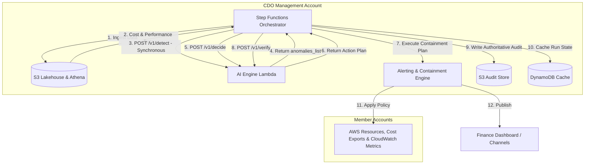
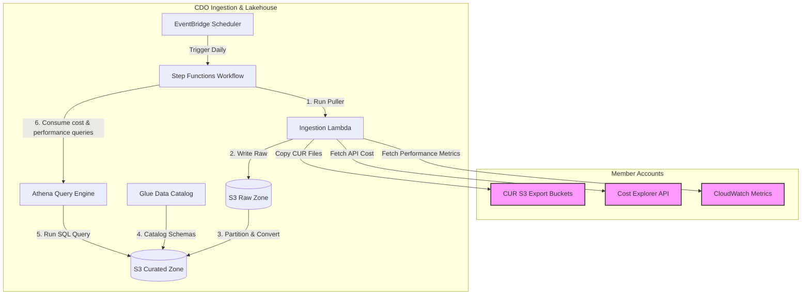
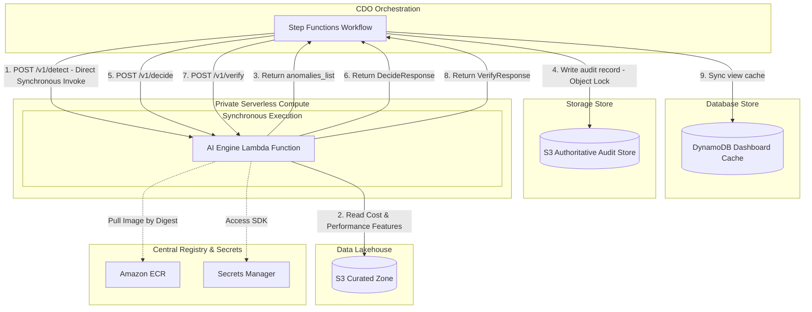
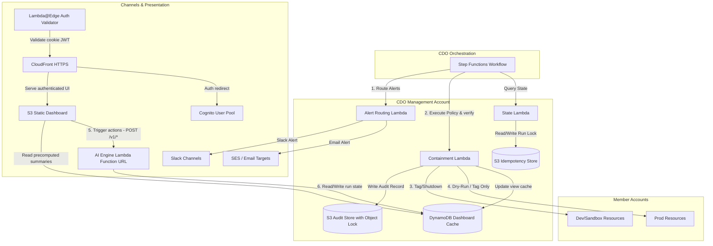
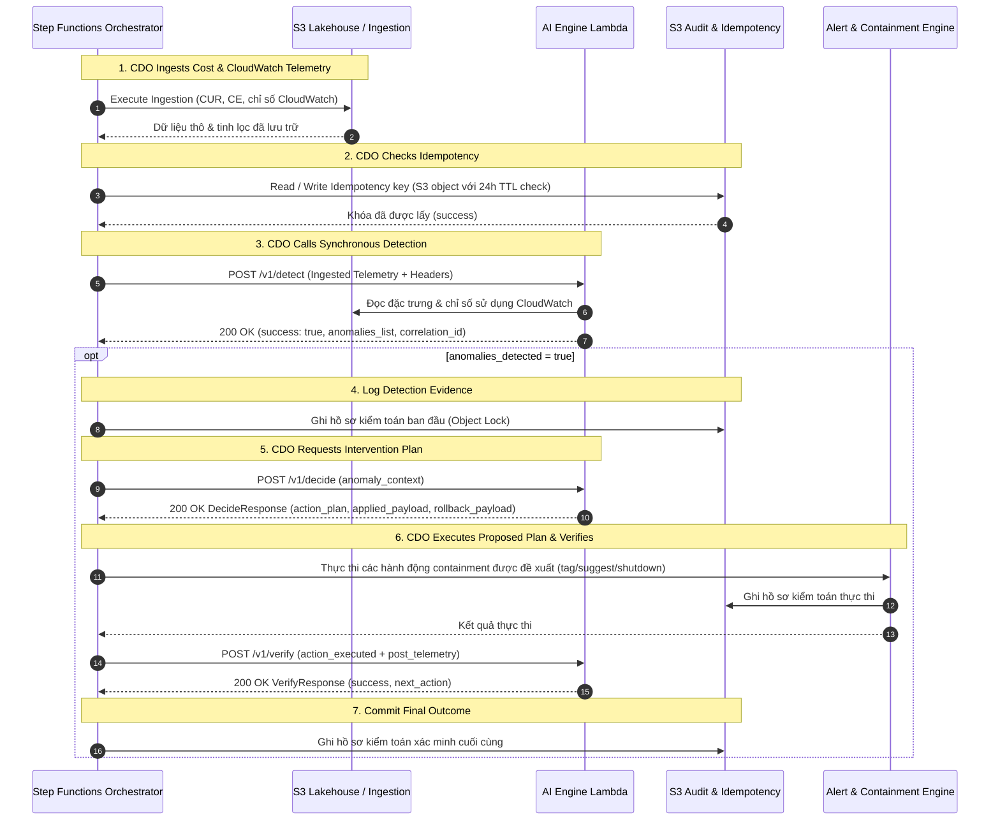

# Thiết kế Hạ tầng (Infrastructure Design) - Task Force 2 · FinOps Watch CDO

<!-- Doc owner: CDO Team
     Status: Final (W11 T6 Pack #1) -> Updated (W12 T4 Pack #2)
-->

> [!IMPORTANT]
> **Ranh giới Bảo mật**: Mọi hành động containment được thực thi bởi hạ tầng này phải tuân thủ nghiêm ngặt ranh giới cứng: **NEVER terminate prod, delete data, hoặc modify IAM**.


## 1. Sơ đồ kiến trúc (Architecture diagram)

Nền tảng CDO được thiết kế xoay quanh hồ dữ liệu (lakehouse-centric) ở mặt phẳng dữ liệu để thu thập và phân tích chi phí, được điều phối bởi các luồng công việc serverless và tích hợp với một AI Engine dùng chung do AIOps cung cấp được lưu trữ trên các hình ảnh container AWS Lambda. Lớp tính toán serverless sử dụng các hàm Lambda chạy trong các subnet riêng tư. Bộ điều phối Step Functions trung tâm gọi trực tiếp và đồng bộ AI Engine Lambda. Lưu ý rằng `/v1/detect`, `/v1/status/{id}`, `/v1/decide`, `/v1/verify`, và `/v1/audit/{audit_id}/rollback` đại diện cho các ngữ nghĩa hợp đồng logic để tích hợp mô hình, chứ không phải các tuyến đường REST/HTTP được triển khai trong luồng công việc chạy theo lô cơ bản này, vì không có Private API Gateway nào được triển khai.

Kiến trúc này được định cỡ xoay quanh các trách nhiệm lặp lại của nền tảng CDO, chứ không xoay quanh bộ dữ liệu huấn luyện mô hình của AIOps. CDO phải kéo dữ liệu thanh toán và hiệu suất một cách đáng tin cậy từ các nguồn AWS được phê duyệt, chuẩn hóa nó thành dạng sẵn sàng cho hợp đồng, gọi AI Engine do AIOps sở hữu và lưu giữ bằng chứng quyết định được trả về. Mọi bộ dữ liệu lịch sử tổng hợp được sử dụng để huấn luyện, nâng cao hoặc backtest mô hình đều thuộc sở hữu của AIOps. Telemetry phát hiện bao gồm dữ liệu CUR, các truy vấn API Cost Explorer, và các chỉ số hiệu suất CloudWatch (`resource_utilization_metrics` như CPU, bộ nhớ, mạng, đĩa, kết nối cơ sở dữ liệu, và chỉ số GPU). Nếu không có sẵn các chỉ số CloudWatch, nền tảng sẽ tự động kích hoạt chế độ dự phòng CUR-only, làm giảm một nửa điểm tin cậy của mô hình (`confidence *= 0.5`) và giới hạn các biện pháp can thiệp ở chế độ dry-run/cảnh báo thuần túy.

```mermaid
graph TB
    subgraph "AWS Member Accounts"
        MemberS3[CUR S3 Export Buckets]
        MemberCE[Cost Explorer API Endpoints]
        MemberCW[CloudWatch Metrics Endpoints]
    end

    subgraph "CDO Management Account VPC (ap-southeast-1)"
        subgraph "Ingestion & Orchestration"
            EB[EventBridge Scheduler] -->|Trigger Daily| SF[Step Functions Workflow]
            SF -->|Invoke Puller| LambdaPull[Ingestion Lambda]
            SF -->|Evaluate Run| LambdaState[State Lambda]
            SF -->|Trigger Containment| LambdaCont[Containment Lambda]
            SF -->|Route Alerts| LambdaAlert[Alert Routing Lambda]
        end

        subgraph "Data Lakehouse Tier"
            S3Raw[(S3 Raw Zone)]
            S3Cur[(S3 Curated Zone)]
            GlueCat[Glue Data Catalog]
            Athena[Athena Query Engine]
        end

        subgraph "Private Subnets (Serverless Compute)"
            AILambda[AI Engine Lambda Function]
            VPCEndpoints[Private VPC Endpoints: S3, ECR, KMS, Logs, STS, Secrets]
        end

        subgraph "Storage & Database Tier"
            DDB[(DynamoDB Dashboard Cache)]
            S3Audit[(S3 Authoritative Audit & Idempotency Store)]
        end
    end

    subgraph "Alerting & Presentation"
        Slack[Slack Notification Engine]
        Email[SES Email Target]
        S3Dashboard[S3 Static Dashboard Assets]
        CloudFront[CloudFront HTTPS Ingress]
        Cognito[Cognito User Pool & Hosted UI]
        LambdaEdge["Lambda@Edge Auth Validator"]
    end

    %% Ingestion flows
    LambdaPull -->|Fetch Cost Data| MemberCE
    LambdaPull -->|Pull CUR Files| MemberS3
    LambdaPull -->|Fetch Performance Metrics| MemberCW
    LambdaPull -->|Write raw cost| S3Raw

    %% Transformation flows
    S3Raw -->|Partition/Schema Validation| S3Cur
    GlueCat -->|Catalog schemas| S3Cur
    Athena -->|Query data| S3Cur

    %% Orchestration & Database/S3 interactions
    LambdaState -->|Idempotency key check & write lock| S3Audit
    LambdaCont -->|Write immutable audit record| S3Audit
    LambdaCont -->|Assume role & tag/suggest/shutdown| MemberAccounts[Member Accounts Resources]
    LambdaAlert -->|Route alert payload| Slack
    LambdaAlert -->|Route alert payload| Email
    SF -->|Sync view updates to cache| DDB

    %% AI Engine Integration
    SF -->|1. POST /v1/detect - Direct Synchronous Invoke| AILambda
    AILambda -->|2. Read cost & CloudWatch metrics| S3Cur
    AILambda -->|3. Return anomalies_list - Synchronous| SF
    SF -->|4. Write audit record| S3Audit
    SF -->|5. POST /v1/decide - Retrieve plan| AILambda
    AILambda -->|6. Return DecideResponse| SF
    SF -->|7. POST /v1/verify| AILambda
    AILambda -->|8. Return VerifyResponse| SF
```



*Chú thích: Quy trình CDO được kích hoạt hàng ngày bởi EventBridge Scheduler. Luồng Step Functions điều phối việc thu thập dữ liệu từ các tài khoản thành viên, ghi dữ liệu CUR, Cost Explorer, và dữ liệu hiệu năng CloudWatch thô vào S3, rồi tạo danh mục Glue Catalog. Luồng này gọi trực tiếp và đồng bộ AI Engine Lambda do AIOps sở hữu (POST /v1/detect), hàm này trả về các bất thường trực tiếp trong phản hồi. Step Functions sau đó gửi yêu cầu quyết định (POST /v1/decide) cho bất kỳ bất thường nào được phát hiện, điều phối cảnh báo, kích hoạt các hành động containment được phê duyệt, ghi nhận nhật ký kiểm toán có thẩm quyền vào S3 (với tính năng Object Lock), cập nhật DynamoDB cache, và xác minh kết quả (POST /v1/verify) một cách đồng bộ.*

---

Để kiến trúc dễ tiếp cận hơn, sơ đồ được chia nhỏ thành một sơ đồ tổng quan mức cao, tiếp nối bởi ba sơ đồ chi tiết đi sâu vào từng phân hệ như bên dưới:

### 1.1 Tổng quan Kiến trúc ở Mức Cao (High-Level Architecture Overview)

Sơ đồ này thể hiện các tương tác vĩ mô ở mức cao giữa bộ điều phối trung tâm, phân hệ hồ dữ liệu (lakehouse), tính toán Lambda Container, và động cơ cảnh báo/containment.



*Chú thích: Bộ điều phối trung tâm Step Functions Orchestrator vận hành toàn bộ vòng lặp FinOps: trích xuất dữ liệu chi phí và telemetry CloudWatch vào Lakehouse, gọi hàm AI Engine Lambda một cách đồng bộ (`POST /v1/detect`), gọi `POST /v1/decide` để lấy kế hoạch can thiệp, thực thi các hành động đã được duyệt qua các worker chính sách, xác minh kết quả qua `POST /v1/verify`, và ghi nhận nhật ký kiểm toán tuân thủ chống giả mạo trực tiếp vào S3.*

Về mặt vận hành, Step Functions là ranh giới kiểm soát giữa logic CDO mang tính xác định và đầu ra AI mang tính xác suất. Mỗi quá trình chuyển đổi trạng thái đều ghi lại `run_id`, cửa sổ chi phí, phạm vi tài khoản và phiên bản hợp đồng để Finance có thể truy vết một bất thường trên dashboard về đúng lô thu thập dữ liệu và quyết định của AI. Thiết kế này cũng ngăn AI Engine tác động trực tiếp đến các tài khoản thành viên; tất cả các hành động cảnh báo và containment đều được điều phối thông qua các worker chính sách của CDO.

### 1.2 Quy trình Thu thập & Hồ dữ liệu (Ingestion & Data Lakehouse Workflow)

Sơ đồ này đi sâu vào quy trình thu thập dữ liệu (ingestion pipeline) và các lớp lưu trữ/truy vấn của hồ dữ liệu (lakehouse).



*Chú thích: Step Functions kích hoạt hàm Ingestion Lambda hàng ngày thông qua EventBridge Scheduler. Dữ liệu chi phí thô và chỉ số hiệu năng CloudWatch từ các tài khoản thành viên (Member Accounts) được lưu trữ trong S3 Raw Zone, được chuyển tiếp và catalog hóa thành định dạng Parquet trong S3 Curated Zone, rồi được truy vấn thông qua Athena. Kết quả truy vấn được truyền ngược lại bộ điều phối Step Functions để cung cấp cho AI Engine.*

Workflow thu thập chuẩn hóa hai dạng dữ liệu thanh toán vận hành trước khi gọi AI Engine. CUR cung cấp các trường ở cấp độ tài nguyên như account ID, product code, resource ID, unblended cost và các thẻ tài nguyên. Cost Explorer cung cấp các trường tổng hợp như linked account, service name, service code, region, unblended cost và trạng thái estimated/final. Lớp curated lưu trữ cả trường mã dịch vụ đã chuẩn hóa và tên hiển thị để CDO có thể chuyển các payload nhất quán tới AIOps và xây dựng các chế độ xem dashboard mà không cần sở hữu dữ liệu huấn luyện mô hình.

### 1.3 Nền tảng Lưu trữ AI Engine trên Lambda Container (AI Engine Lambda Container Hosting Platform)

Sơ đồ này đi sâu vào kiến trúc AWS Lambda container, mô tả việc Step Functions gọi trực tiếp và đồng bộ hàm AI Engine Lambda.



*Chú thích: Yêu cầu phát hiện dị thường từ bộ điều phối Step Functions được gửi qua cuộc gọi Lambda trực tiếp đến hàm AI Engine Lambda (`POST /v1/detect`). AI Engine Lambda xử lý đồng bộ dữ liệu chi phí và các chỉ số hiệu năng CloudWatch từ S3 và trả về kết quả phát hiện ngay lập tức. Bộ điều phối sau đó gửi yêu cầu quyết định (`POST /v1/decide`), thực thi các hành động can thiệp, ghi nhận hồ sơ kiểm toán vào S3, và xác minh hành động khắc phục (`POST /v1/verify`) một cách đồng bộ.*

Nền tảng dựa trên Lambda lưu trữ AI Engine container hóa để phát hiện bất thường chi phí đồng bộ. Bằng cách gọi trực tiếp hàm Lambda AI Engine, bộ điều phối Step Functions nhận được `anomalies_list` trong cùng chu kỳ yêu cầu (thường là 30-45 giây), loại bỏ hoàn toàn các vòng lặp và hàng đợi truy vấn trạng thái. Bộ điều phối ghi nhận các khóa idempotency có thẩm quyền và nhật ký kiểm toán tuân thủ trực tiếp vào Amazon S3, sử dụng tính năng Object Lock để đảm bảo tính bất biến WORM. DynamoDB được sử dụng thuần túy như một bộ đệm đọc (cache) phục vụ các truy vấn độ trễ thấp của bảng điều khiển tài chính. Hướng tiếp cận ưu tiên hợp đồng này cung cấp khả năng thực thi đồng bộ có thể dự đoán trong khi thực thi các ranh giới bảo mật nghiêm ngặt qua các vai trò thực thi IAM và VPC Endpoint riêng tư.

### 1.4 Động cơ Cảnh báo & Containment (Alerting & Containment Engine)

Sơ đồ này đi sâu vào luồng cảnh báo và containment, mô tả cách thức chính sách được thực thi an toàn trên các môi trường production và phi production với một nhật ký kiểm toán tuân thủ có thẩm quyền được hỗ trợ bởi S3.



*Chú thích: Luồng Step Functions kích hoạt các hàm Lambda cảnh báo và containment riêng biệt dựa trên quyết định của AI Engine. Các Lambda containment đọc trạng thái chạy, ghi nhật ký kiểm toán có thẩm quyền vào S3 (được bảo vệ bằng Object Lock), áp dụng containment chủ động (gắn nhãn/tắt máy) trên các tài khoản Dev/Sandbox và thực thi các hành động dry-run (gắn nhãn/đề xuất) trên Prod. Bảng điều khiển web tĩnh S3 + CloudFront đọc các bản tóm tắt kiểm toán và chi tiêu từ lớp cache đọc DynamoDB để hiển thị trạng thái containment trực tiếp cho các bên liên quan của bộ phận Tài chính. Các nút tương tác trên bảng điều khiển (như rollback thủ công hoặc xác minh can thiệp) được định tuyến bảo mật từ S3 Static Dashboard đến hàm Lambda container AI Engine duy nhất qua endpoint AWS Lambda Function URL bảo mật được ánh xạ dưới CloudFront. Tất cả các hàm Lambda khác của CDO đều hoàn toàn là các tài nguyên hỗ trợ nội bộ được gọi bởi Step Functions; các hàm này không có endpoint công khai hoặc Function URL riêng biệt. CDO gọi `POST /v1/verify` để xác minh containment và hỗ trợ rollback thủ công qua `POST /v1/audit/{audit_id}/rollback`.*

Động cơ containment coi `execution_mode` là một đầu vào chính sách bắt buộc, không phải là một sự tiện lợi khi chạy. Các tài nguyên production chỉ có thể nhận các kết quả tag, gợi ý (suggest) hoặc dry-run, trong khi các tài nguyên dev/sandbox có thể nhận các hành động ở chế độ apply chỉ khi các yêu cầu về chính sách và phê duyệt được thỏa mãn. Mỗi hành động được đề xuất hoặc thực thi đều ghi lại một bản ghi kiểm toán có thẩm quyền vào S3 trước khi thực hiện bất kỳ thao tác nào trên tài khoản thành viên. Sau khi hoàn thành, CDO gọi `POST /v1/verify` để báo cáo kết quả đo lường từ xa, hoặc kích hoạt rollback thủ công qua `POST /v1/audit/{audit_id}/rollback` để bắt đầu khôi phục lại thẻ (tag) của tài nguyên. Về mặt vận hành, `GET /v1/status/{id}` được giữ lại duy nhất để kiểm tra trạng thái khắc phục/tự phục hồi của một hành động containment cụ thể bằng `audit_id` hoặc `anomaly_id`, và không được dùng để poll tiến trình detect hoạt động.

### 1.5 Quy trình tuần tự API có lập trình (Programmatic API Sequence Workflow)

Quy trình tuần tự có lập trình chi tiết giữa bộ điều phối Step Functions, Lakehouse, Kho lưu trữ S3 Kiểm toán & Idempotency và các hàm AI Engine được mô tả dưới đây:



*Chú thích: Sơ đồ tuần tự API có lập trình phác thảo luồng phát hiện bất thường và xác thực khắc phục đồng bộ, cho thấy việc phát hiện đồng bộ, tạo kế hoạch, xác minh và ghi nhận nhật ký kiểm toán có thẩm quyền trên S3.*


---

## 2. Bảng thành phần (Component table)

Các thành phần hạ tầng sau đây được triển khai tại vùng `ap-southeast-1` để vận hành nền tảng FinOps Watch:

| Thành phần | Dịch vụ AWS | Lý do | Ghi chú chi phí |
|---|---|---|---|
| Bộ kích hoạt thu thập (Ingestion Trigger) | EventBridge Scheduler | Kích hoạt quy trình thu thập dữ liệu hàng ngày theo lịch trình cron serverless được quản lý. | Gói miễn phí bao gồm 14 triệu lượt gọi/tháng, sau đó là 1,00 USD trên mỗi triệu lượt. |
| Lớp điều phối (Orchestration) | Step Functions | State machine serverless thực thi logic luồng công việc, các nhánh điều kiện, trạng thái chờ và thử lại khi có lỗi. | 0,025 USD trên mỗi 1.000 lần chuyển đổi trạng thái. |
| Tính toán (Adapters) | Lambda | Chạy mã adapter serverless gọn nhẹ để lấy dữ liệu từ Cost Explorer API, sao chép các bản xuất CUR 2.0 và xử lý cảnh báo/containment. | Thanh toán theo mức sử dụng, ~0,00001667 USD mỗi GB-giây. |
| Hồ dữ liệu (Raw Zone) | Amazon S3 | Lưu trữ các tệp CUR 2.0 hàng ngày và các tệp kết xuất JSON từ Cost Explorer không thể sửa đổi. | 0,023 USD mỗi GB/tháng + phí yêu cầu. |
| Hồ dữ liệu (Curated Zone) | Amazon S3 | Lưu trữ các tệp chi phí đã được phân vùng và xác thực schema dưới định dạng Parquet, được tối ưu hóa cho truy vấn. | 0,0125 USD mỗi GB/tháng (Infrequent Access) + phí chuyển đổi lớp lưu trữ. |
| Danh mục siêu dữ liệu (Metadata Catalog) | Glue Data Catalog | Lưu trữ định nghĩa schema xác định được cấu hình trong IaC (Terraform), sử dụng tính năng Athena Partition Projection (ADR-014). | 1 triệu đối tượng được phân mục đầu tiên là miễn phí; không phát sinh chi phí chạy crawler ở runtime (ADR-014). |
| Công cụ truy vấn (Query Engine) | Amazon Athena | Cho phép chạy truy vấn SQL serverless trên các tệp S3 để xây dựng các materialized view và cung cấp dữ liệu cho bảng điều khiển. | 5,00 USD trên mỗi TB dữ liệu được quét. |
| Bộ đệm Dashboard (Dashboard Cache) | Amazon DynamoDB | Lưu trữ tạm thời (cache) trạng thái chạy, siêu dữ liệu bất thường và các chế độ xem truy vấn materialized được tối ưu hóa cho bảng điều khiển. | Dung lượng on-demand: 1,25 USD trên mỗi triệu đơn vị ghi (write unit), 0,25 USD trên mỗi triệu đơn vị đọc (read unit). |
| AI Engine Hosting | AWS Lambda (Container Image) | Lưu trữ AI Engine dùng chung do nhóm AIOps cung cấp bằng cách sử dụng các hình ảnh container được đóng gói trong ECR hỗ trợ kích thước lưu trữ lên đến 10 GB. | Chi phí chạy theo mức sử dụng thực tế: ~0,00001667 USD mỗi GB-giây. |
| Bộ đệm Thử lại Gửi Cảnh báo (Alert Delivery Retry Buffer) | Amazon SQS & DLQ | Bộ đệm cho các tin nhắn cảnh báo thất bại gửi đến Slack/Email để tự động thử lại và ghi nhận lỗi vào DLQ. | 0,40 USD trên mỗi triệu tin nhắn (1 triệu tin nhắn đầu miễn phí). |
| Kho lưu trữ container (Container Registry) | Amazon ECR | Lưu trữ các hình ảnh container Docker được gắn phiên bản cho các mô hình của AIOps, được tham chiếu trong triển khai bằng mã băm digest hình ảnh không thay đổi. | 0,10 USD mỗi GB/tháng (500 MB đầu tiên miễn phí). |
| Nhà cung cấp bí mật (Secrets Provider) | Secrets Manager | Quản lý an toàn các khóa API, thông tin xác thực cơ sở dữ liệu và Slack webhook, được truy cập động qua AWS SDK bên trong các hàm Lambda. | 0,40 USD mỗi bí mật/tháng + 0,05 USD cho mỗi 10.000 yêu cầu. |
| Private VPC Traffic | VPC Endpoints | Cho phép truy cập an toàn, riêng tư vào các dịch vụ AWS (ECR, S3, DynamoDB, KMS, Logs, Secrets Manager) từ bên trong các subnet VPC riêng tư. | ~7,20 USD trên mỗi endpoint/tháng cho mỗi AZ + phí xử lý dữ liệu. |
| Bảng điều khiển Tài chính (Finance Dashboard) | Amazon S3 + CloudFront | Bảng điều khiển web tĩnh nội bộ nhẹ được lưu trữ dưới dạng tài sản tĩnh trong S3 và phân phối qua CloudFront. Tài sản được bảo vệ bằng OAC (Origin Access Control) và được xác thực bởi Lambda@Edge. | Phí CloudFront truyền dữ liệu/request, lưu trữ S3, và OAC (thường dưới 3 USD/tháng). |
| Dashboard Auth Gateway | Amazon Cognito | Triển khai Cognito User Pool, Hosted UI, và các nhóm (finops-finance-readonly, finops-engineering-operator, finops-cdo-admin) để xác thực và ủy quyền người dùng bảng điều khiển. | Tính năng User Pool miễn phí tối đa 50.000 người dùng hoạt động hàng tháng (MAUs). |
| Viewer-Request Auth Gate | Lambda@Edge | Hàm xử lý viewer-request kiểm tra secure HTTP-only cookies và xác thực chữ ký JWT đối với Cognito JWKS trước khi chuyển tiếp yêu cầu đến bucket S3 riêng tư. | ~0,60 USD trên mỗi triệu lượt gọi + chi phí thời gian thực thi. |
| AI Engine API Endpoint | AWS Lambda Function URL | Cung cấp một HTTPS endpoint công cộng bảo mật trên AI Engine Lambda để kích hoạt các hành động tương tác (như xác minh can thiệp hoặc rollback thủ công) và các truy vấn. Bảo mật endpoint qua Cognito JWT authorizer tại CloudFront gateway. | Lambda Function URL chạy miễn phí. |
| Kênh cảnh báo (Alert Channels) | Amazon SNS / Slack API | Cung cấp các đường định tuyến riêng biệt cho cảnh báo (cảnh báo Tài chính qua Slack/Email, cảnh báo Kỹ thuật qua Slack/Jira). | SNS miễn phí tới 100 nghìn thông báo email/tháng; Slack API miễn phí. |
| Tác nhân thực thi containment (Containment Worker) | AWS Lambda | Giả lập vai trò (assume role) trong các tài khoản thành viên để áp dụng nhãn (tag) hoặc tắt các tài nguyên dev/sandbox, thực thi nghiêm ngặt trong các chế độ dry-run hoặc apply. | Thanh toán theo mức sử dụng. |

> [!NOTE]
> Chi phí chạy thực tế cho CDO pipeline trong giai đoạn xây dựng hệ thống được theo dõi bằng: `Cần bằng chứng: Chi phí vận hành thực tế của pipeline CDO`.

Mô hình thành phần bản đồ trực tiếp tới ba hợp đồng dữ liệu được sử dụng bởi nền tảng:

| Hợp đồng | Thành phần CDO chịu trách nhiệm | Bằng chứng tối thiểu được lưu giữ |
|---|---|---|
| Hợp đồng kéo dữ liệu chi phí | EventBridge Scheduler, Step Functions, Ingestion Lambda, S3, Glue, Athena | URI đối tượng nguồn, cửa sổ chi phí, tài khoản, dịch vụ, vùng, tag chủ sở hữu, chi phí chưa pha trộn (unblended cost), cờ estimated/final. |
| Hợp đồng đầu ra quyết định của AI | AI Engine Lambda, Step Functions, S3 | Phiên bản mô hình, mã bất thường (anomaly ID), độ tin cậy (confidence), mức độ nghiêm trọng (severity), chi tiêu dự kiến so với thực tế, cửa sổ bằng chứng, giải thích, định tuyến được khuyến nghị. |
| Hợp đồng cảnh báo và containment | Alert Lambda, Containment Lambda, kho lưu trữ kiểm toán S3 | Mục tiêu định tuyến, yêu cầu phê duyệt, chế độ thực thi, trạng thái trước/sau, đường dẫn rollback, ID bản ghi kiểm toán. |

---

## 3. Phân tích sâu về khía cạnh khác biệt (Differentiation angle deep-dive)

### 3.1 Tại sao chọn hướng đi này? (Why this angle?)

Nền tảng CDO triển khai một **kiến trúc FinOps control plane theo mô hình lakehouse-centric kết hợp điều phối serverless và hosting hình ảnh container AWS Lambda cho AI Engine**.
1. **Sự phù hợp của mô hình Lakehouse**: Môi trường FinOps trong sản xuất vận hành theo chu kỳ tự nhiên 24 giờ dựa trên tần suất xuất tệp CUR của AWS. Mô hình lakehouse (S3 + Glue + Athena) giúp tránh được chi phí cố định cao của các kho dữ liệu luôn bật (như Redshift) hoặc các cơ sở dữ liệu quan hệ, trong khi vẫn giữ dữ liệu chi phí lịch sử có cấu trúc đầy đủ, sẵn sàng cho việc kiểm toán và được truy vấn hiệu quả theo phân vùng.
2. **Điều phối Serverless**: EventBridge Scheduler và Step Functions quản lý luồng xử lý theo mô hình serverless-first, giữ cho chi phí vận hành của bộ điều phối pipeline gần như bằng không.
3. **AWS Lambda Container Hosting cho AI**: AI Engine do AIOps cung cấp được lưu trữ trên các hình ảnh container AWS Lambda. CDO gọi trực tiếp và đồng bộ AI Engine Lambda (`POST /v1/detect`) để lấy danh sách bất thường trực tiếp trong chu kỳ yêu cầu - phản hồi. Điều này loại bỏ hoàn toàn chi phí của các vòng lặp truy vấn trạng thái và hàng đợi, giữ cho đường truyền thực thi hoàn toàn serverless trong khi cô lập dung lượng tính toán tiêu thụ thông qua các giới hạn Reserved Concurrency. Việc huấn luyện, huấn luyện lại mô hình và phân tích ngoại tuyến nặng vẫn nằm ngoài phạm vi chạy của CDO.

Lý do thực tế điều này quan trọng là tính độc lập vận hành. AIOps có thể lặp lại logic mô hình, kỹ nghệ đặc trưng và xử lý false-positive mà không cần thay đổi workflow của CDO. CDO giữ cho lakehouse, bộ lập lịch, đường dẫn gọi trực tiếp, định tuyến cảnh báo và chính sách containment luôn ổn định, trong khi AI Engine do Lambda container host có thể phát triển đằng sau một hợp đồng có phiên bản.

### 3.2 Các điểm vượt trội (kèm số liệu) (Strengths (with metrics))

Các số liệu dưới đây nêu bật sự đánh đổi của kiến trúc lakehouse-centric và Lambda container so với các phương pháp tiếp cận CDO khác:

| Tiêu chí | Phương án lựa chọn (Lakehouse + Lambda Container) | Phương án thay thế A (ECS Cluster trên EC2 + RDS Aurora) | Phương án thay thế B (Nền tảng SaaS bên thứ ba) |
|---|---|---|---|
| **Chi phí cho mỗi lượt chạy hàng ngày (Ingest + Query)** | ~0,15 USD (Thanh toán theo lượt truy vấn S3 + Athena) | ~5,00 USD (Chi phí cố định hàng ngày của thực thể RDS) | N/A (Đã bao gồm trong phí đăng ký thuê bao) |
| **Chi phí tính toán AI (Lưu trữ/Tháng)** | ~40 USD (Thanh toán theo mức sử dụng Lambda + hàng đợi SQS) | ~240 USD (Quản lý cụm ECS + Tự động mở rộng phiên bản Spot) | N/A |
| **Chi phí vận hành (Giờ/Tuần)** | ~0.5 giờ (Quản lý các Lambda Terraform serverless) | ~8 giờ (Quản lý ECS cluster trên EC2 và cập nhật cấu hình Terraform ECS) | ~1 giờ (Cập nhật kết nối SaaS) |
| **Thời gian onboard tài khoản mới** | < 10 phút (Triển khai stack IAM cross-account bằng Terraform) | ~25 phút (Thiết lập schema DB thủ công + VPC peering) | > 60 phút (Thiết lập thủ công + cấu hình IAM) |
| **Khả năng mở rộng cho huấn luyện lại** | N/A (Ngoại tuyến; việc huấn luyện nằm ngoài phạm vi chạy/do AIOps quản lý) | Rất tốt (ECS Spot task pools được scale bằng AWS Application Auto Scaling) | Kém (Không thể chạy mô hình của AIOps trên hạ tầng local) |

### 3.3 Các điểm yếu chấp nhận (Accepted weaknesses)

- **Lambda Cold Start và Giới hạn Concurrency**: Chạy khối lượng công việc suy luận trên các hình ảnh Lambda container có thể gây ra độ trễ khởi động lạnh (khi kéo hình ảnh container trong lần đầu khởi tạo) và rủi ro hết tài nguyên concurrency dùng chung của tài khoản. Điều này được chấp nhận vì quá trình phát hiện chạy theo lô hàng ngày (không phải thời gian thực), và concurrency được cô lập qua các ràng buộc Reserved Concurrency.
- **Chi phí cho VPC Endpoints**: Định tuyến riêng tư tất cả lưu lượng trong VPC yêu cầu sử dụng các interface endpoint (ECR, S3, DynamoDB, KMS, Logs, Secrets Manager), gây ra chi phí cố định khoảng ~7,20 USD/endpoint/tháng cho mỗi AZ. Điều này được chấp nhận nhằm đáp ứng yêu cầu bảo mật nghiêm ngặt là không truyền dữ liệu chi phí và kiểm toán qua mạng internet công cộng.
- **Độ trễ thu thập dữ liệu CUR**: Các bản xuất CUR của AWS bị trễ từ 8 đến 24 giờ. Độ trễ này được chấp nhận vì hệ thống vận hành theo chu kỳ 24 giờ, nghĩa là không yêu cầu truyền phát dữ liệu thời gian thực (real-time streaming) cho việc phát hiện bất thường hàng ngày.

---

## 4. Phương pháp tiếp cận multi-account (Multi-account approach)

### 4.1 Mô hình tài khoản (Account model)

Nền tảng CDO được triển khai tại một tài khoản trung tâm **CDO Management Account**. Hệ thống thực hiện thu thập dữ liệu chi phí từ và kích hoạt các hành động containment tại nhiều tài khoản thành viên **Member Accounts** thuộc AWS Organization.
- **Thu thập chi phí Cross-Account**: Hàm `LambdaCURPuller` trung tâm giả lập vai trò (assume role) đọc dữ liệu `FinOpsCURPullerRole` tại mỗi tài khoản thành viên đích. Vai trò này cấp quyền truy xuất dữ liệu Cost Explorer API cục bộ và sao chép các tệp CUR từ bucket S3 xuất của tài khoản thành viên.
- **Containment Cross-Account**: Hàm `LambdaContainment` trung tâm giả lập vai trò `FinOpsContainmentWorkerRole` tại tài khoản thành viên đích. Vai trò giả lập này chứa các quyền được giới hạn chặt chẽ để gắn nhãn (tag) tài nguyên hoặc điều chỉnh Auto Scaling Groups (ASGs) tại tài khoản thành viên cụ thể đó.

Mô hình tài khoản phải bảo toàn ngữ cảnh môi trường vì cùng một loại bất thường sẽ có các giới hạn hành động khác nhau tùy thuộc vào môi trường. Một workload GPU chạy quá mức kiểm soát trong tài khoản nghiên cứu non-prod có thể đủ điều kiện để containment sau khi phê duyệt; một tín hiệu tương tự trong tài khoản thanh toán production phải giữ ở mức chỉ tag/suggest/dry-run.

### 4.2 Mô hình cô lập (Isolation pattern)

- **Cô lập dữ liệu**: Dữ liệu chi phí thu thập từ các tài khoản thành viên được lưu trữ trong một bucket S3 duy nhất, được phân vùng theo mã tài khoản (Account ID): `s3://cdo-curated-bucket/account_id=123456789012/year=2026/month=06/`.
- **Cô lập truy vấn**: Các định nghĩa bảng trong Athena sử dụng tính năng chiếu phân vùng (partition projection) của Glue. Các truy vấn Athena được thực thi để phục vụ các materialized view của bảng điều khiển được giới hạn chặt chẽ theo khóa phân vùng `account_id`.
- **Xác định sở hữu (Ownership)**: Tài nguyên được ánh xạ tới các nhóm kỹ thuật (squad) cụ thể bằng cách sử dụng các thẻ siêu dữ liệu tiêu chuẩn là `owner` và `squad`. Khi pipeline thu thập dữ liệu phát hiện các tài nguyên thiếu các thẻ này, hệ thống sẽ tự động gán chúng vào một nhóm mặc định (`unassigned-resources`) và định tuyến cảnh báo đến kênh hạ tầng của CDO để xử lý thủ công.

Phân vùng theo tài khoản và kỳ chi phí là biện pháp kiểm soát hiệu năng chính, trong khi thẻ tag cung cấp góc nhìn sở hữu kinh doanh. Nền tảng phải giữ cho chi tiêu không có tag hiển thị được thay vì loại bỏ nó trong quá trình chuẩn hóa, vì các tag sở hữu bị thiếu là một lộ trình leo thang quan trọng đối với Finance ngay cả khi AIOps sở hữu việc phân loại bất thường cuối cùng.

### 4.3 Quy trình onboard (Onboarding flow)

Khi thực hiện onboard một tài khoản AWS hoặc squad mới vào nền tảng FinOps Watch, pipeline tự động dưới đây sẽ được thực thi:

```
1. Add account ID and owner mapping to the Terraform 'accounts.tfvars' configuration.
2. Terraform execution applies IAM Stack:
   - Provisions 'FinOpsCrossAccountAccessRole' in the target member account.
   - Configures trust policy allowing the central CDO Lambda and the AI Engine Lambda execution roles to assume it.
   - Updates target account CUR export configuration to deliver data to S3.
3. Partition Projection tự động ánh xạ các phân vùng mới bên trong Athena thông qua các cấu hình ngày/chu kỳ được định nghĩa trong IaC (ADR-014).
4. E2E Validation run:
   - Ingestion Lambda makes a test API call to target account Cost Explorer.
   - Xác thực việc giả lập quyền IAM cross-account và gọi Lambda trực tiếp.
5. Account status marked as 'ACTIVE' in the DynamoDB registry.
```

### 4.4 Tính bất biến (Idempotency)

Nhằm ngăn chặn việc chạy trùng lặp cho cùng một kỳ chi phí (điều này sẽ làm sai lệch dữ liệu trên bảng điều khiển và phát sinh thêm chi phí gọi Cost Explorer API trùng lặp), nền tảng CDO triển khai cơ chế idempotency sử dụng Amazon S3:
- Mỗi lượt thực thi hàng ngày tạo ra một khóa idempotency tổng hợp: `{tenant_id}:{billing_period_date}:{batch_type}` (ví dụ: `tenant_id:2026-06-25:daily_batch`).
- Luồng Step Functions bắt đầu bằng cách kiểm tra sự tồn tại của khóa này dưới dạng một đối tượng trống trong kho lưu trữ idempotency có thẩm quyền: `s3://company-cdo-telemetry/idempotency/{key}`.
- Nếu đối tượng đã tồn tại, lượt chạy sẽ dừng lại một cách an toàn để tránh xử lý trùng lặp.
- Nếu đối tượng chưa tồn tại, luồng công việc sẽ ghi đối tượng đó để khóa lượt chạy. Đối tượng được cấu hình với quy tắc S3 Lifecycle để tự động xóa sau 24 giờ.
### 4.5 Cache dữ liệu chi phí & Kiểm soát giới hạn tần suất Cost Explorer (Cost Explorer Rate Limit Control)

Để bảo vệ AWS Cost Explorer API khỏi việc vượt quá giới hạn tần suất nghiêm ngặt **5 requests/second**, nền tảng CDO triển khai chiến lược cache dựa trên DynamoDB như mô tả trong hợp đồng telemetry:
- **Lưu trữ Cache CDO**: Lambda Ingestion thực hiện truy vấn các chỉ số Cost Explorer hàng ngày và cache payload kết quả vào một bảng DynamoDB chuyên dụng (`cdo-cost-cache-table`) với khóa chính là `AccountID:DateRange`.
- **AI Engine đọc dữ liệu offline**: Khi AI Engine do đội AIOps cung cấp thực thi và yêu cầu dữ liệu chi phí baseline lịch sử (chẳng hạn như dữ liệu chi phí 7 ngày hoặc 30 ngày qua để trích xuất đặc trưng và phân tích bất thường), nó sẽ đọc trực tiếp các bản ghi chi phí đã cache từ DynamoDB của CDO (hoặc các tệp parquet đã lọc trên S3 thông qua Athena) bằng cách sử dụng các cuộc gọi SDK trực tiếp dưới vai trò execution role của nó.
- **Lợi ích**: Thiết kế này ngăn việc AI Engine và nhiều Lambda của nền tảng thực hiện gọi trực tiếp Cost Explorer API đồng thời, đảm bảo hệ thống luôn hoạt động dưới ngưỡng 5 requests/second và loại bỏ hoàn toàn khả năng bị AWS throttling.

### 4.6 Tuân thủ & Xác thực Thu thập Telemetry (Telemetry Ingestion Compliance & Validation)

Nền tảng CDO thực thi tất cả các kiểm soát bảo mật và xác thực trên mặt phẳng dữ liệu (data-plane) được quy định trong `telemetry-contract.md` và `ai-api-contract.md`:
- **Schema & Kiểu Ingestion**: Telemetry tuân thủ schema phiên bản 3 (`telemetry://finops-watch/v3`). Ingestion hỗ trợ kiểu `RAW_JSON` (<10MB Cost Explorer API data) và `S3_POINTER` (<500MB compressed CUR exports stored in S3) data ingestion types. Không có telemetry hiệu năng CloudWatch (các tính hiệu sử dụng như CPUUtilization, DatabaseConnections, memory_mib) nào được gửi đến AI Engine để phát hiện; những dữ liệu này được dành riêng cho việc quan sát hoạt động của nền tảng (cảnh báo, nhật ký, chỉ số, bảng điều khiển).
- **Trường Request & Toàn vẹn (Request & Integrity Fields)**: Mọi payload gọi trực tiếp đến AI Engine phải đính kèm các trường siêu dữ liệu chuẩn đại diện cho các header hợp đồng: `X-Tenant-Id` (`tenant_id`), `X-Idempotency-Key` (định dạng: `{tenant_id}:{billing_period_date}:{batch_type}` được lưu trong `s3://company-cdo-telemetry/idempotency/` với chu kỳ tự động xóa 24 giờ của S3 Object Lifecycle), `X-Correlation-Id`, `X-Payload-SHA256` (`payload_sha256`), và `X-Request-Timestamp` (`request_timestamp`).
- **Trường dữ liệu phản hồi (Response Fields)**: Phản hồi đồng bộ `/v1/detect` trả về các trường chuẩn: `success` (boolean), `correlation_id` (UUID v4), `anomalies_detected` (boolean), `anomalies_list` (chứa `anomaly_id`, `anomaly_type`, `severity`, `confidence_score`, `resource_id`, `environment`, `responsible_team`, `unblended_cost_24h_usd`, `cost_ratio_to_7d_avg`, `ai_model_used`, và `alert_routing`), và `error_message` (tùy chọn).
- **Các cờ điều khiển**:
  - `is_ad_hoc`: Bỏ qua khóa idempotency 24h khi quét khẩn cấp (tối đa 5 lần/ngày).
  - `is_estimated`: Đánh dấu dữ liệu tạm tính; AI Engine sẽ tự động giảm confidence score (<0.50), gán nhãn chỉ xem xét (review-only) và bỏ qua tự động containment.
  - `is_forced_dry_run`: AI Engine tự động bật nếu chỉ số completeness score `< 0.8`, ép hệ thống về chế độ dry-run để bảo vệ an toàn production khi dữ liệu bị lỗi/thiếu.
- **Chuỗi liên kết kiểm toán (Audit Trail Chain)**: Các nhật ký kiểm toán có thẩm quyền và hồ sơ containment được ghi trực tiếp vào S3 với tính năng Object Lock được kích hoạt (tuân thủ WORM) và được giữ lại trong ít nhất 90 ngày. Một bộ nhớ cache tóm tắt được tối ưu hóa cho việc đọc được duy trì trong DynamoDB để phục vụ bảng điều khiển tài chính.
- **Bảo vệ Tính toàn vẹn Thời gian & Yêu cầu**: Nhằm ngăn chặn các cuộc tấn công replay (replay attacks) và đảm bảo tính nhân quả trong môi trường phân tán:
  - **Bảo vệ chống Replay**: Các kiểm tra payload của AI Lambda áp dụng cửa sổ kiểm tra 300 giây (các yêu cầu có sự chênh lệch mốc thời gian > 300s sẽ dẫn đến trạng thái lỗi thực thi với mã lỗi `ERR_REPLAY_DETECTED`).
  - **Kiểm soát lệch giờ**: Các yêu cầu có độ lệch đồng hồ hệ thống vượt quá 10 giây (`clock_skew_ms > 10000`) sẽ bị từ chối ngay lập tức.
- **Chuẩn hóa dữ liệu & Loại bỏ PII**: CDO đóng vai trò là nguồn sự thật (source of truth) duy nhất và thực hiện lọc bỏ toàn bộ thông tin định danh cá nhân (PII) ngay tại lớp ingestion. CDO thực hiện ánh xạ các trường hóa đơn sang schema thống nhất, đồng thời đối soát mã dịch vụ của CUR (`service_code` như `AmazonEC2`) với tên hiển thị của Cost Explorer (`service`).
- **Tín hiệu bối cảnh nghiệp vụ**: Các lô dữ liệu hàng ngày được đóng gói kèm các chỉ số bối cảnh nghiệp vụ (các cờ chiến dịch marketing, load test hoặc đang migration dữ liệu) để cung cấp cho AI Engine, giúp mô hình AI tối ưu hóa độ chính xác và giảm thiểu tỷ lệ cảnh báo sai (false positive).

---

## 5. Các phương án thay thế được cân nhắc (Alternatives considered)

### 5.1 Lớp điều phối (Orchestration layer)

- **Phương án A**: Apache Airflow trên AWS (MWAA).
  - *Ưu điểm*: Tích hợp Python tuyệt vời, hỗ trợ cây phụ thuộc phức tạp gốc, giao diện trực quan hóa tác vụ chi tiết.
  - *Nhược điểm*: Chi phí cố định cao (tối thiểu ~350 USD/tháng), thời gian khởi động lâu (trên 20 phút), cấu hình hạ tầng phức tạp.
- **Phương án B**: Kích hoạt Lambda trực tiếp bằng Cron (Lambda Direct Cron Trigger).
  - *Ưu điểm*: Đơn giản, chạy trực tiếp dưới dạng mục tiêu của EventBridge cron gọi một hàm Lambda duy nhất.
  - *Nhược điểm*: Khó khăn trong việc thiết lập và điều phối các workflow cross-account nhiều bước phức tạp, quản lý trạng thái chuyển giao trung gian, xử lý các giới hạn timeout 15 phút của Lambda và thực hiện các bộ xử lý lỗi so với AWS Step Functions.
- **Lựa chọn**: EventBridge Scheduler + Step Functions Standard.
  - *Lý do*: 100% serverless, không tốn chi phí nhàn rỗi, tích hợp sẵn có với AWS Lambda và S3/DynamoDB, cùng bộ xử lý thử lại lỗi cực kỳ mạnh mẽ.

### 5.2 Lớp dữ liệu (Data layer)

- **Phương án A**: Amazon Redshift.
  - *Ưu điểm*: Hiệu năng truy vấn SQL quan hệ cực nhanh trên các tập dữ liệu quy mô petabyte.
  - *Nhược điểm*: Chi phí tối thiểu cao (~180 USD/tháng cho một nút nhỏ), vận hành quá mức cần thiết đối với một công ty quy mô trung bình chạy theo chu kỳ batch 24 giờ.
- **Phương án B**: Amazon RDS PostgreSQL.
  - *Ưu điểm*: Truy vấn có cấu trúc, hỗ trợ giao dịch quen thuộc, dễ quản lý chỉ mục.
  - *Nhược điểm*: Phí thực thể cố định hàng tháng, phải mở rộng lưu trữ thủ công và thiếu tích hợp trực tiếp, hiệu năng cao với các tệp parquet thô trên S3.
- **Lựa chọn**: Amazon S3 + Glue Data Catalog + Amazon Athena.
  - *Lý do*: Tận dụng mô hình lakehouse thực thụ. Chi phí lưu trữ ở mức tối thiểu (S3), chi phí truy vấn tính theo mức sử dụng thực tế (Athena), đồng thời hỗ trợ cả dữ liệu JSON bán cấu trúc thô và định dạng Parquet tối ưu.

---

## 6. Chiến lược mở rộng (Scaling strategy)

Nền tảng CDO tự động mở rộng quy mô linh hoạt để xử lý lưu lượng dữ liệu và khối lượng công việc chi tiết chi phí ngày càng tăng mà không phụ thuộc vào việc chạy đồng thời Lambda không giới hạn. Các cơ chế kiểm soát mở rộng được định nghĩa như sau:

- **Mở rộng Quy mô Batch có Kiểm soát (Controlled Batch Scaling)**: Thay vì thiết kế cho việc thu nhận dữ liệu thời gian thực quy mô lớn hoặc phân nhánh Lambda (fan-out) không giới hạn, nền tảng lập lịch các cửa sổ thu nhận và xử lý bằng EventBridge Scheduler và kiểm soát thực thi đồng thời thông qua các kích hoạt state machine của Step Functions.
- **Giới hạn Đồng thời của AI Engine Lambda (AI Engine Lambda Concurrency)**: Hàm Lambda container AI Engine được cấu hình với giới hạn Reserved Concurrency cơ sở từ 5–10 thực thi đồng thời. Đây đóng vai trò như một cơ chế bảo vệ nghiêm ngặt về chi phí và ranh giới ảnh hưởng (blast-radius) để bảo vệ các hệ thống hạ nguồn và giới hạn tài khoản AWS. Giới hạn này được điều chỉnh dựa trên thời gian thực thi mô hình thực tế, độ trễ Bedrock, tình trạng throttle API và lỗi quá thời gian (timeout) của hàm.
- **Phân nhánh Step Functions & Cơ chế Thử lại (Step Functions Fan-Out & Retries)**: Việc xử lý song song nhiều tài khoản thành viên hoặc kỳ thanh toán trong Step Functions sử dụng các trạng thái Map hoặc các cửa sổ chạy batch được cấu hình với `MaxConcurrency` nhỏ hơn hoặc bằng giới hạn Reserved Concurrency của AI Engine Lambda. Các lần gọi gặp lỗi throttle hoặc timeout thực thi sẽ được thử lại bằng thuật toán exponential backoff với random jitter, và sẽ fail closed (hủy bỏ can thiệp tự động, cảnh báo điều hành viên và ghi lại nhật ký kiểm toán) nếu số lần thử lại vượt quá giới hạn.
- **Provisioned Concurrency**: Bị tắt theo mặc định để giảm thiểu chi phí cơ sở cố định. Provisioned Concurrency là một tùy chọn tối ưu hóa sản xuất có thể được lập lịch linh hoạt xung quanh thời gian chạy chu kỳ đã biết hoặc các cửa sổ chạy demo, chỉ khi dữ liệu CloudWatch hoặc AWS X-Ray chứng minh rằng độ trễ khởi động lạnh (cold-start) của Lambda container vi phạm các SLO hiệu năng của nền tảng.
- **Chiến lược Payload (Payload Strategy)**: Để ngăn chặn việc vượt quá giới hạn kích thước payload của cuộc gọi Lambda (6 MB đồng bộ / 256 KB bất đồng bộ), pipeline thu nhận sử dụng các con trỏ S3 (S3 pointers) cho các khung dữ liệu CUR/telemetry lớn. Thay vì nhúng trực tiếp dữ liệu thô lớn vào payload của Step Functions hoặc yêu cầu gọi Lambda, pipeline ghi dữ liệu telemetry vào S3 và truyền URI của đối tượng S3 (S3 pointers) cho hàm Lambda của AI Engine.
- **Phân vùng Athena & Partition Projection (Athena Partitioning & Partition Projection)**: Các truy vấn Athena được sử dụng cho báo cáo tổng hợp dashboard áp dụng Partition Projection phía client trên các schema của Glue Data Catalog. Các truy vấn cơ sở dữ liệu giới hạn dữ liệu quét bằng cách sử dụng các phân vùng có biên giới (theo `account_id`, `year`, và `month`), giúp các truy vấn luôn nhanh và hiệu quả về mặt chi phí khi số lượng bản ghi chi phí tăng lên.
- **DynamoDB On-Demand & Thiết kế Khóa (DynamoDB On-Demand & Key Design)**: Các bảng lưu trữ run-state và materialized read-cache cho dashboard trên DynamoDB được cấu hình ở chế độ On-Demand Capacity Mode để mở rộng quy mô tức thì từ không đến hàng nghìn yêu cầu. S3 vẫn là kho lưu trữ có thẩm quyền cho kiểm toán tuân thủ (sử dụng Object Lock) và khóa idempotency. Để ngăn chặn các điểm nóng phân vùng (hot keys) trên DynamoDB, các bảng sử dụng các khóa có độ phân biệt cao (high-cardinality keys) kết hợp từ `tenant_id`, `account_id`, `date`, và `run_id`.

Giả định mở rộng quy mô trong sản xuất là số lượng dòng chi tiết chi phí tăng nhanh hơn số lượng tài khoản. Do đó, payload con trỏ S3, phân vùng S3, quét phân vùng truy vấn Athena và kiểm soát đồng thời của Step Functions quan trọng đối với sự ổn định của hệ thống hơn là việc tăng giới hạn thực thi Lambda thô.

---

## 7. Các chế độ lỗi và khôi phục (Failure modes + recovery)

Bảng dưới đây trình bày các chế độ lỗi, cơ chế phát hiện và quy trình khôi phục của nền tảng CDO:

| Lỗi | Cách phát hiện | Quy trình khôi phục | RTO | RPO |
|---|---|---|---|---|
| **Độ trễ xuất dữ liệu CUR** | Hàm Lambda xác thực của Step Functions trả về kết quả trống hoặc thiếu phân vùng Parquet hàng ngày trên S3. | Step Functions chuyển sang trạng thái chờ và thử lại mỗi 2 giờ. Nếu độ trễ vượt quá 24 giờ, hệ thống sẽ cảnh báo cho điều hành viên. | N/A | 24 giờ |
| **Giới hạn tần suất Cost Explorer (Throttling)** | Hàm Ingestion Lambda bắt được lỗi `LimitExceededException` từ AWS API. | Áp dụng thuật toán exponential backoff với random jitter trong mã nguồn Lambda; thử lại tối đa 5 lần. | 30 phút | 0 |
| **Lỗi Hàm / Hết thời gian phản hồi AI Engine** | Bộ điều phối nhận được lỗi thực thi Lambda, hết thời gian SDK, hoặc hết thời gian Bedrock (Nova LLM hard limit). | **CDO fail closed**: Quy trình thu thập kết thúc, khóa các hành động containment tự động, ghi log thất bại và ngay lập tức chuyển sang hệ thống cảnh báo tĩnh Fallback đến SRE. | 4 giờ | 24 giờ |
| **Quy trình chạy bị lỗi** | Trạng thái thực thi của Step Functions chuyển sang `FAILED`; kích hoạt CloudWatch Alarm. | Step Functions ghi log khối lỗi vào kho lưu trữ kiểm toán S3 và cập nhật bộ nhớ cache. Kỹ sư khắc phục sự cố và kích hoạt tính năng chạy lại thủ công (redrive) của state machine từ bước bị lỗi. | 2 giờ | 24 giờ |
| **Nỗ lực chạy trùng lặp** | Kiểm tra đối tượng S3 chỉ ra rằng khóa idempotency tổng hợp đã tồn tại. | Quy trình CDO dừng lại ngay lập tức để ngăn xử lý trùng lặp và ghi nhận nỗ lực chạy trùng lặp vào kho kiểm toán S3. | < 5 giây | 0 |
| **Sai lệch dữ liệu payload trùng khóa** | API trả về mã lỗi `400` với mã lỗi nội bộ `ERR_IDEMPOTENCY_MISMATCH`. | Ghi log cảnh báo nghiêm trọng, chặn lượt chạy và thông báo SRE kiểm tra logic tạo khóa. | 2 giờ | 0 |
| **Dữ liệu bảng điều khiển bị cũ** | CloudWatch Alarm kích hoạt nếu mốc thời gian phân vùng curated mới nhất cũ hơn 26 giờ. | Cảnh báo cho kỹ sư để kiểm tra log của pipeline và kích hoạt thủ công chạy lại lượt thu thập dữ liệu hàng ngày. | 1 giờ | 24 giờ |
| **Lỗi gửi cảnh báo** | `LambdaAlertRouting` bắt được lỗi hết thời gian kết nối hoặc mã lỗi HTTP 5xx từ Slack API. | Hàm Lambda gửi payload cảnh báo vào hàng đợi SQS Dead Letter Queue (DLQ) và thử gửi qua kênh dự phòng email SES. | 10 phút | 0 |
| **Từ chối hành động Containment** | Việc giả lập vai trò cross-account tại tài khoản thành viên trả về lỗi `AccessDeniedException`. | **CDO fail closed**: Sự cố được ghi nhận vào kho lưu trữ kiểm toán S3 dưới trạng thái `DENIED`, đồng thời một cảnh báo khẩn cấp được gửi tới kênh bảo mật. | 1 giờ | 0 |
| **Sai lệch phiên bản hợp đồng AI** | Xác thực trước khi chạy phát hiện phiên bản hợp đồng AI Engine API Lambda được triển khai khác với schema mong đợi của Step Functions. | Block lượt chạy trước khi phát hiện, đánh dấu lượt chạy là `FAILED_CONTRACT_CHECK`, thông báo cho CDO và AIOps, và không thực thi containment. | 2 giờ | 24 giờ |
| **Lỗi Hàng đợi SQS Định tuyến Cảnh báo (Alert Routing SQS Failure)** | Alert Lambda thất bại trong việc gửi tin nhắn tới các mục tiêu Slack/SNS targets. | Các tin nhắn cảnh báo thất bại được đưa vào Hàng đợi SQS Định tuyến Cảnh báo để thử lại. Nếu số lần thử lại hết, chúng sẽ được gửi tới DLQ và kích hoạt SES email dự phòng. | 30 phút | 0 |

---

## Các tài liệu liên quan (Related documents)

- [`01_requirements_analysis_vi.md`](01_requirements_analysis_vi.md) - Bối cảnh doanh nghiệp, chỉ tiêu NFR và ranh giới CDO/AIOps.
- [`03_security_design_vi.md`](03_security_design_vi.md) - Các vai trò IAM, Security Groups, các vai trò Lambda execution roles, và khóa mã hóa KMS.
- [`04_deployment_design_vi.md`](04_deployment_design_vi.md) - Cấu hình Terraform IaC dạng mô-đun, các pipeline triển khai GitHub Actions (CI/CD).
- [`05_cost_analysis_vi.md`](05_cost_analysis_vi.md) - Dự toán ngân sách vận hành pipeline và so sánh chu kỳ chạy.
- [`08_adrs_vi.md`](08_adrs_vi.md) - Các quyết định kiến trúc liên quan đến chu kỳ chạy 24 giờ, các hình ảnh Lambda container và gọi trực tiếp Lambda.
