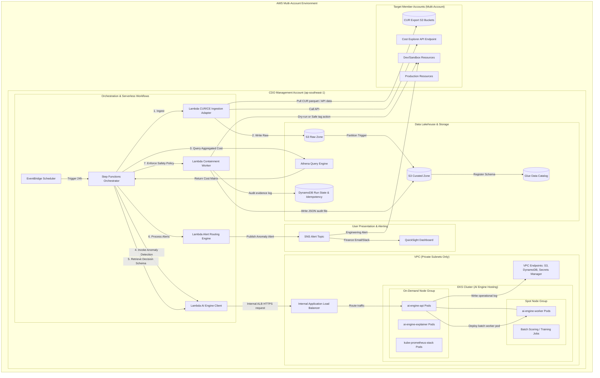

# Thiết kế Hạ tầng (Infrastructure Design) - Task Force 2 · FinOps Watch CDO

<!-- Doc owner: CDO Team
     Status: Final (W11 T6 Pack #1) → Updated (W12 T4 Pack #2)
-->

## 1. Architecture diagram

Hệ thống CDO sử dụng một control plane dạng lakehouse-centric kết hợp với các serverless orchestration workflows và một cụm EKS managed để host runtime của AI Engine. Quy trình xử lý dữ liệu và phát hiện bất thường chạy theo chu kỳ (cadence) 24h tự động.



*Caption: VPC quản trị của CDO chỉ chứa các subnet riêng tư (private subnets) không có route table công cộng. Dữ liệu chi phí bên ngoài được pull từ các tài khoản thành viên thông qua các IAM role tin cậy OIDC. Các endpoint của AI Engine được expose nội bộ thông qua AWS ALB định tuyến đến các Kubernetes service trong EKS, phân chia rõ ràng các API chạy ổn định trên các on-demand nodes và các batch workers chạy trên spot nodes. Quy trình hoạt động được lập lịch và giám sát bởi Step Functions.*

## 2. Component table

Các thành phần hạ tầng sau đây được triển khai cho CDO platform và các workload được host:

| Thành phần (Component) | AWS Service | Lý do lựa chọn (Reason) | Ghi chú chi phí (Cost note) |
|---|---|---|---|
| Ingestion & Storage | S3 Standard + S3 Glacier | Lưu trữ dữ liệu chi phí thô, tệp parquet đã chuẩn hóa, model artifacts, và nhật ký kiểm toán. | Chi phí lưu trữ thấp ($0.023/GB/tháng). Thiết lập lifecycle. |
| Schema Registry | Glue Data Catalog | Quản lý định nghĩa schema cho dữ liệu thô (raw) và dữ liệu đã chuẩn hóa (curated). | Serverless, miễn phí 1 triệu đối tượng đầu tiên. |
| Serverless Query | Athena | Cho phép truy vấn SQL ad-hoc để tổng hợp dữ liệu CUR mà không cần chạy máy chủ chuyên dụng. | Thanh toán theo lượng quét ($5.00/TB quét). Hỗ trợ materialized views. |
| Ingestion & Logic | Lambda | Các adapter serverless thời gian chạy ngắn để nạp dữ liệu, gọi endpoint, định tuyến alert và thực thi containment. | Thanh toán theo lượt thực thi. Giới hạn concurrency cao. |
| Orchestration | Step Functions | Các workflow chuẩn cung cấp cơ chế quản lý trạng thái, retry tự động khi lỗi, và logic phân nhánh. | $0.000025 mỗi lượt chuyển đổi trạng thái. |
| Hosting Cluster | AWS EKS | Host runtime và các batch jobs của AI Engine được quản lý theo phiên bản với tính năng cô lập container. | Phí cluster cố định $0.10/giờ. |
| Stable Compute | EC2 On-Demand Nodes | Managed Node Group (ví dụ: `m5.large`) dành cho các pod chạy ổn định (`ai-engine-api`, monitoring). | Tối thiểu 2 node hoạt động. Runtime ổn định. |
| Batch Compute | EC2 Spot Nodes | Managed Node Group (ví dụ: `c5.large`) dành cho các tác vụ batch scoring, feature engineering, và retraining. | Tiết kiệm từ 60-90% so với on-demand. |
| Container Registry | ECR | Lưu trữ bảo mật các Docker images do AIOps đóng gói cho các deployment trên EKS. | Phí lưu trữ $0.10/GB, miễn phí chuyển dữ liệu nội bộ đến EKS. |
| Ingress / Service | internal ALB / NLB | Định tuyến traffic từ Step Functions một cách bảo mật đến các endpoint AI API trong VPC. | ~1 load balancer hoạt động (phí cơ bản ~$20/tháng). |
| Configuration Store | Secrets Manager | Lưu trữ bảo mật các API keys, OIDC credentials, và chuỗi kết nối cơ sở dữ liệu. | $0.40/secret/tháng + chi phí gọi API. |
| Operational State | DynamoDB | Lưu trữ trạng thái run state, khóa idempotency, index của anomaly, và nhật ký kiểm toán. | Cấu hình on-demand capacity mode, dung lượng lưu trữ thấp. |
| Presentation | QuickSight | Dashboard BI trực quan thân thiện với Finance hiển thị xu hướng chi phí và các chỉ số anomaly. | Phí bản quyền theo người dùng ($18-$24/user/tháng). |
| Alerting Engine | SNS | Công cụ gửi thông báo phân tán tới email, Slack webhooks, và các HTTP targets. | Miễn phí 1 triệu thông báo đầu tiên mỗi tháng. |
| Observability | CloudWatch / Container Insights | Thu thập VPC flow logs, Lambda traces, metrics của EKS, và nhật ký hoạt động của cụm container. | Phí tính theo dung lượng nạp dữ liệu ($0.50/GB). Lưu trữ 14 ngày. |
| Private Transport | VPC NAT Gateway / Endpoints | Các endpoint giao diện (interface endpoints) cho phép Lambda và EKS gọi AWS APIs nội bộ mà không cần đi qua internet. | Phí theo giờ + phí xử lý dữ liệu trên mỗi GB. |

## 3. Differentiation angle deep-dive

### 3.1 Why this angle?

Sự kết hợp giữa FinOps control plane dạng lakehouse-centric theo chu kỳ và cụm EKS AI hosting hoàn toàn đáp ứng được các yêu cầu cấp sản xuất (production-grade). Trong thực tế, dữ liệu hóa đơn (CUR) thay đổi theo chu kỳ batch hàng ngày, do đó việc phát hiện theo thời gian thực (real-time streaming) là không cần thiết. Việc tổ chức dữ liệu thành các phân vùng raw và curated trong S3 được catalog bởi Glue giúp thực hiện các truy vấn Athena nhanh chóng và có khả năng mở rộng.

Bằng cách host AI Engine của AIOps trên EKS thay vì các serverless containers thông thường (như Fargate), CDO platform đạt được hiệu quả hạ tầng tối đa. Các managed node groups của EKS phân chia workload rõ ràng: các service chạy liên tục với độ trễ thấp (như API model và các công cụ giám sát) chạy trên on-demand nodes ổn định. Các workload nặng về tính toán và có thể bị ngắt quãng (như retraining model, feature extraction, và batch cost scoring) được chạy dưới dạng Kubernetes Jobs trên spot nodes giá rẻ. Thiết kế lai này giúp chúng ta scale tự động mà không phải trả phí máy chủ đắt đỏ khi hệ thống nhàn rỗi.

### 3.2 Vượt trội ở đâu (số liệu)

Bảng so sánh chi tiết giữa kiến trúc EKS + Lakehouse của CDO so với các kiến trúc thay thế:

| Chỉ số (Metric) | Lakehouse + EKS (CDO) | Pure Serverless (Lambda) | Serverless Container (Fargate) |
|---|---|---|---|
| **Chi phí cố định (Fixed Cost)** | Trung bình (~$150/tháng phí cluster cơ bản) | Cực thấp (pay-per-use, ~$0) | Thấp-Trung bình (~$60/tháng phí ALB cơ bản) |
| **Chi phí biến đổi trên mỗi lượt chạy** | Thấp (tiết kiệm 90% nhờ spot nodes cho worker jobs) | Trung bình (phí tính toán ML serverless cao) | Trung bình (phí tính toán container chuẩn) |
| **Thời gian chạy tác vụ tối đa** | Không giới hạn (Hỗ trợ các tác vụ ML chạy nhiều giờ) | Giới hạn 15 phút (Không đáp ứng được retraining) | Không giới hạn (Không có cơ chế tối ưu hóa spot) |
| **Cô lập Workload** | Mức Pod (sử dụng EKS Network Policies + namespaces) | Mức IAM role của function (Cơ bản) | Mức Task (chỉ sử dụng Security groups) |
| **Độ trễ khi Scale Model** | <5s (HPA scale-out các pod replica có sẵn trên node) | 10-30s (Trễ do cold start khi tải file ZIP ML lớn) | 30-90s (Thời gian provision và khởi tạo container task) |
| **Công sức vận hành (Ops Overhead)** | ~4 giờ/tuần (Nâng cấp managed nodes) | ~1 giờ/tuần (Không cần quản lý hạ tầng) | ~2 giờ/tuần (Quản lý cấu hình task) |
| **Thời gian Onboard Account** | <5 phút (Khởi tạo namespace + SQS routing) | <2 phút (Cập nhật dynamic config) | <10 phút (Cập nhật cấu hình task) |

### 3.3 Weakness chấp nhận

- **Độ phức tạp vận hành**: Đòi hỏi phải quản lý các Helm charts, các vòng lặp đồng bộ GitOps (ArgoCD/Flux), và cơ chế phân quyền Kubernetes RBAC.
- **Thời gian khởi tạo ban đầu (Bootstrapping)**: Việc provision cụm EKS và thiết lập Kubernetes ban đầu mất khoảng 15 phút, khiến việc thiết lập các môi trường sandbox thử nghiệm nhanh bị chậm hơn.
- **Rủi ro thu hồi Spot Nodes**: Các spot workers chạy batch scoring hoặc retraining có thể bị AWS thu hồi bất kỳ lúc nào với cảnh báo trước 2 phút. Hệ thống phải thiết kế cơ chế lưu checkpoint của ứng dụng và tự động chạy lại job (retry).

## 4. Multi-account approach

### 4.1 Account model

CDO platform được tập trung hóa tại một **FinOps Management Account** duy nhất. Việc thu thập dữ liệu chi phí từ các tài khoản thành viên (member accounts) sử dụng các IAM role read-only tin cậy chéo tài khoản.
- **FinOps Management Account**: Host Step Functions orchestrator, S3 Data Lake, Glue Data Catalog, EKS cluster, QuickSight dashboard, và DynamoDB.
- **Target Member Accounts**: Duy trì một role read-only (`FinOpsCostReaderRole`) để cấp quyền truy cập S3 cho các bản xuất CUR và quyền gọi Cost Explorer API cục bộ. Nơi này cũng host execution role (`FinOpsContainmentWorkerRole`) để thực hiện gắn thẻ tag, thiết lập lịch tắt tài nguyên, và cấu hình hạn ngạch quota.

### 4.2 Isolation pattern

- **S3 Data Lake**: Các tiền tố (prefixes) phân chia dữ liệu chi phí theo Account ID (ví dụ: `s3://cdo-curated-zone/account_id=123456789012/year=2026/`).
- **Glue Catalog**: Phân vùng dữ liệu (partitioning) để áp dụng predicate pushdown tối ưu hóa tốc độ truy vấn khi Athena quét dữ liệu.
- **EKS AI Hosting**: Các pod được cô lập bằng Kubernetes namespaces (ví dụ: `ai-inference`, `ai-batch-jobs`). Network policies ngăn chặn các route mạng chéo namespace, đảm bảo các batch worker pods không thể kết nối tới cơ sở dữ liệu hoặc hệ thống monitoring cốt lõi.
- **DynamoDB State Table**: Phân vùng sử dụng compound key (`account_id#cost_period`) để tránh xung đột trạng thái vận hành giữa các account.

### 4.3 Onboarding flow

Để onboarding một tài khoản AWS mới vào FinOps Watch platform, các bước tự động sau sẽ diễn ra:
```
1. Triển khai các FinOps IAM roles (Reader & Worker) tại tài khoản đích qua CloudFormation StackSet.
2. Đăng ký metadata tài khoản (Account ID, Squad Owner, Slack Endpoint) vào bảng 'Accounts' của DynamoDB.
3. Cấu hình điểm xuất CUR 2.0 xuất trực tiếp về S3 Raw bucket của CDO qua cross-account policies.
4. Chạy workflow Step Functions onboarding để kiểm tra (Verify quyền đọc, pull dữ liệu 24h đầu, ghi raw).
5. Xác nhận dữ liệu chuẩn hóa trong Glue và kiểm tra dashboard hiển thị.
```

### 4.4 Idempotency

Để tránh việc chạy trùng lặp dữ liệu chi phí cho cùng một khoảng thời gian (dẫn đến cảnh báo lặp và thực thi containment sai), orchestrator sẽ đăng ký một khóa idempotency trước khi gọi AI Engine.
- **Định dạng Idempotency key**: `{account_id}:{cost_period_start}:{cost_period_end}` (ví dụ: `123456789012:2026-06-22T00:00:00Z:2026-06-23T00:00:00Z`).
- **Bảng DynamoDB Run State (`finops-run-state`)**:
  - `IdempotencyKey` (Partition Key - String)
  - `RunId` (String - UUID)
  - `Status` (String - PENDING, RUNNING, COMPLETED, FAILED)
  - `StartedAt` (Number - Epoch)
  - `CompletedAt` (Number - Epoch)
  - `EvidenceUri` (String - Đường dẫn S3 chứa file JSON output)
  - `ErrorDetails` (String - chi tiết lỗi nếu trạng thái là FAILED)

Khi một schedule run kích hoạt, hành động conditional write vào DynamoDB sẽ kiểm tra xem `IdempotencyKey` đã tồn tại chưa. Nếu status là `RUNNING` hoặc `COMPLETED`, workflow sẽ dừng lại. Nếu status là `FAILED`, workflow sẽ chuyển trạng thái về `PENDING` và thực hiện chạy lại.

## 5. Alternatives considered

### 5.1 Orchestration layer

- **Phương án A - Apache Airflow / AWS MWAA**: Đã xem xét để chạy pipeline. Bị loại bỏ do chi phí cố định tối thiểu cao ($200+/tháng cho môi trường managed), việc quản lý thư viện Python phức tạp, và chu kỳ triển khai thay đổi chậm.
- **Phương án B - AWS Batch**: Được phân tích để chạy các script ingestion. Bị loại bỏ vì thiếu tính năng trực quan hóa trạng thái của các bước workflow và khả năng xử lý rẽ nhánh phức tạp (ví dụ: timeout fallback, kênh cảnh báo tách biệt).
- Yes **Lựa chọn: EventBridge Scheduler + Step Functions Standard**: Cung cấp các workflow serverless trực quan, tích hợp trực tiếp với các AWS services, tích hợp sẵn cơ chế retry khi lỗi, và không phát sinh chi phí khi không chạy.

### 5.2 Data layer

- **Phương án A - Amazon Redshift Serverless**: Đã đánh giá để làm kho lưu trữ dữ liệu phân tích chi phí chính. Bị loại bỏ vì quá dư thừa cho chu kỳ batch 24h, phát sinh chi phí truy vấn tối thiểu cao không cần thiết.
- **Phương án B - Chỉ dùng DynamoDB**: Đã xem xét để lưu lịch sử chi phí. Bị loại bỏ vì DynamoDB không hỗ trợ các truy vấn SQL phức tạp (ví dụ: tính toán standard deviation lịch sử) cần thiết cho AIOps mà không tốn phí quét toàn bộ bảng.
- Yes **Lựa chọn: S3 + Glue Data Catalog + Athena**: Cung cấp một engine lakehouse serverless chi phí thấp, cho phép truy vấn trực tiếp trên các phân vùng Parquet trên S3 và kết nối trực tiếp với dashboard.

## 6. Scaling strategy

Hệ thống scale linh hoạt ở tất cả các tầng hạ tầng:
- **Data Ingestion**: EventBridge kích hoạt Step Functions chạy song song qua Step Functions map states. Khi công ty tăng từ 12 squad lên 120 squad, các tác vụ nạp dữ liệu tài khoản thành viên sẽ được chạy concurrent lên tới giới hạn mặc định của Lambda (1000).
- **Athena Query Engine**: Scale ngang tự động. Athena phân bổ dữ liệu lớn qua các node truy vấn nội bộ, chỉ tính phí dựa trên số bytes quét. Giới hạn quét dữ liệu được quản lý hiệu quả qua cơ chế S3 Partition Projection.
- **EKS AI Inference**: Các pod `ai-engine-api` tự động scale thông qua Kubernetes **Horizontal Pod Autoscaler (HPA)** dựa trên ngưỡng sử dụng trung bình CPU/Memory (70%). Lượng tải gọi API đồng thời lớn sẽ tự động scale-out các pod replica trên các on-demand nodes.
- **EKS Worker Jobs**: Các tác vụ batch scoring, training, và feature engineering được kích hoạt động. Cụm sử dụng **Karpenter** hoặc **Cluster Autoscaler** để provision tự động các spot instances EC2 tạm thời khi có pod worker ở trạng thái pending, và tự động thu hồi ngay khi job hoàn thành.

## 7. Failure modes + recovery

Bảng sau chi tiết các kịch bản lỗi, phương án phục hồi tự động, và các chỉ tiêu vận hành:

| Lỗi gặp phải (Failure) | Phát hiện (Detection) | Hướng phục hồi (Recovery) | RTO | RPO |
|---|---|---|---|---|
| Trễ CUR ở tài khoản thành viên | Bước validate dữ liệu trả về bản ghi rỗng hoặc bị cắt cụt | Ghi nhận trạng thái run state là `INCOMPLETE_DATA`, gửi cảnh báo về Engineering Slack, bỏ qua các containment trigger, sử dụng cache dữ liệu từ lượt chạy trước. | 1 giờ | 24 giờ |
| Throttling Cost Explorer API | Lambda CUR/CE adapter nhận mã lỗi HTTP 429 throttling | Thực hiện retry với cơ chế exponential backoff kèm jitter. Fallback sử dụng dữ liệu xuất từ CUR. | 15 phút | 0 |
| Timeout hosted AI API | Lambda client của Step Functions phát hiện timeout quá 60 giây | Thực hiện gọi lại 3 lần. Nếu lỗi tiếp diễn, kích hoạt circuit-breaker và chuyển sang chế độ fail-closed: ghi log trạng thái anomaly là `AI_UNAVAILABLE`. | 5 phút | 0 |
| Crash Pod AI Engine | Cụm Kubernetes phát hiện replica target không đạt | Kubelet tự động khởi động lại Pod. HPA lên lịch chạy pod mới trên node group on-demand khỏe mạnh. | < 10s | 0 |
| Thu hồi Spot Node | Nhận cảnh báo ngắt Spot từ EC2 (cảnh báo trước 2 phút) | Karpenter bắt sự kiện, đánh dấu cordon node, di chuyển (drain) các pod sang node khác, và khởi chạy node thay thế. Batch job chạy lại từ checkpoint trước đó. | < 2 phút | Điểm checkpoint |
| Lỗi workflow Step Functions | Quy tắc CloudWatch bắt sự kiện `State Entered: FAILED` | Đổi trạng thái chạy thành `FAILED` trong DynamoDB để giải phóng khóa idempotency. Gửi thông báo debug chi tiết cho DevOps qua Slack. | 10 phút | 24 giờ |
| Kích hoạt chạy trùng lặp | Gặp lỗi DynamoDB conditional put exception khi kiểm tra idempotency | Dừng lượt chạy ngay lập tức. Ghi lại cảnh báo trong log và truy vết theo mã chạy UUID bị trùng. | < 5s | 0 |
| Dashboard QuickSight bị cũ | Nhãn thời gian cập nhật dữ liệu trên dashboard > 26h | Kích hoạt CloudWatch alarm, chạy Lambda helper để trigger làm mới dashboard thủ công, gửi thông báo qua email cho Finance. | 30 phút | 24 giờ |
| Lỗi gửi alert qua SNS | Nhật ký SNS ghi nhận lỗi phân phát (ví dụ: lỗi SMTP) | SNS tự động gửi lại với cơ chế backoff. Nếu lỗi kéo dài, chuyển cảnh báo vào hàng đợi email backup. | 5 phút | 0 |
| Từ chối thực thi containment | IAM role tại tài khoản đích bị sửa đổi từ chối quyền gắn thẻ tag | Ghi nhận trạng thái containment là `DENIED`, ghi log sự cố kiểm toán, và lập tức gửi thông báo khẩn cho Squad owner cùng đội bảo mật. | 1 giờ | 0 |

## Related documents

- [`03_security_design_vi.md`](03_security_design_vi.md) - Bảo mật mức pod, network policies, IAM/IRSA roles, và ranh giới an toàn cứng.
- [`04_deployment_design_vi.md`](04_deployment_design_vi.md) - Các IaC modules, cấu hình Helm workload, và chất lượng đầu ra CI/CD.
- [`05_cost_analysis_vi.md`](05_cost_analysis_vi.md) - Phân tích chi phí dự kiến cho EKS hosting và serverless data pipelines.
- [`08_adrs_vi.md`](08_adrs_vi.md) - Tài liệu ghi nhận các quyết định kiến trúc cốt lõi (ADRs).
