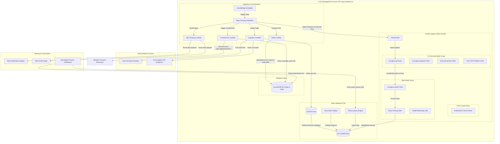
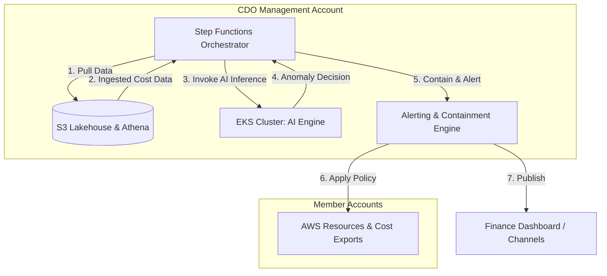
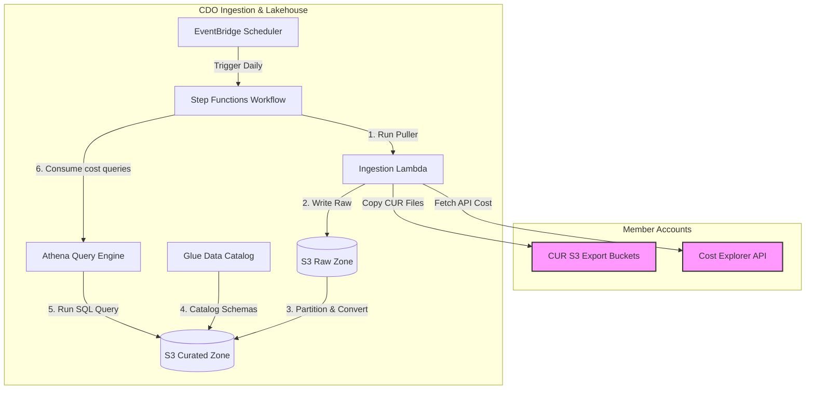
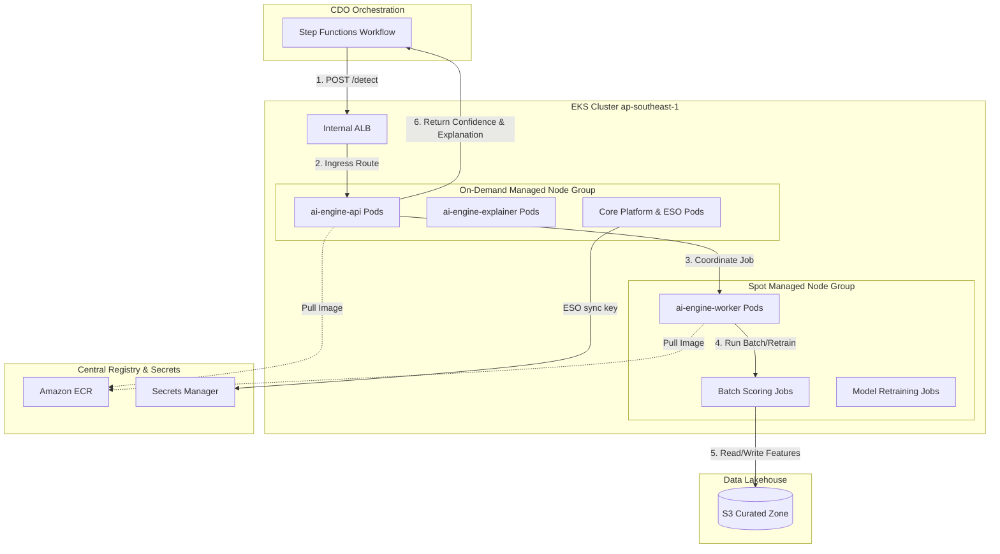
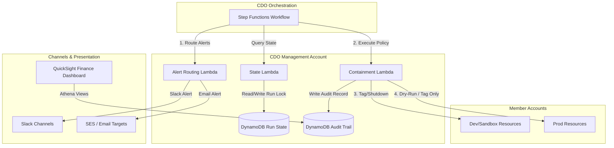

# Thiết kế Hạ tầng (Infrastructure Design) - Task Force 2 · FinOps Watch CDO

<!-- Doc owner: CDO Team
     Status: Final (W11 T6 Pack #1) → Updated (W12 T4 Pack #2)
-->

## 1. Sơ đồ kiến trúc (Architecture diagram)

Nền tảng CDO được thiết kế xoay quanh hồ dữ liệu (lakehouse-centric) để thu thập và phân tích dữ liệu chi phí, được điều phối bởi các luồng công việc serverless và tích hợp với AI Engine do nhóm AIOps sở hữu được lưu trữ trên cụm EKS được quản lý. Lớp tính toán EKS sử dụng cấu hình lai (hybrid) giữa các nhóm nút on-demand và spot để tối ưu hóa chi phí thực thi.



*Chú thích: Quy trình CDO được kích hoạt hàng ngày bởi EventBridge Scheduler. Luồng Step Functions điều phối việc thu thập dữ liệu từ các tài khoản thành viên (member accounts), ghi dữ liệu CUR và Cost Explorer thô vào S3, rồi thực hiện phân mục (catalog). Luồng này gửi yêu cầu phát hiện bất thường tới AI Engine (do AIOps sở hữu) thông qua internal ALB của EKS. EKS cluster cô lập các API ổn định trên một on-demand node group và các tác vụ tính toán batch scoring hoặc training trên một spot node group tối ưu chi phí. Các chế độ xem bảng điều khiển (dashboard) và luồng xử lý containment lấy trạng thái sạch từ Athena và DynamoDB.*

---

Để kiến trúc dễ tiếp cận hơn, sơ đồ được chia nhỏ thành một sơ đồ tổng quan mức cao, tiếp nối bởi ba sơ đồ chi tiết đi sâu vào từng phân hệ như bên dưới:

### 1.1 Tổng quan Kiến trúc ở Mức Cao (High-Level Architecture Overview)

Sơ đồ này thể hiện các tương tác vĩ mô ở mức cao giữa bộ điều phối trung tâm, phân hệ hồ dữ liệu (lakehouse), cụm tính toán EKS và động cơ cảnh báo/containment.



*Chú thích: Bộ điều phối trung tâm Step Functions Orchestrator vận hành toàn bộ vòng lặp FinOps: trích xuất dữ liệu vào Lakehouse, gọi EKS-hosted AI Engine để lấy quyết định bất thường và kích hoạt các luồng cảnh báo cũng như containment dựa trên kết quả.*

### 1.2 Quy trình Thu thập & Hồ dữ liệu (Ingestion & Data Lakehouse Workflow)

Sơ đồ này đi sâu vào quy trình thu thập dữ liệu (ingestion pipeline) và các lớp lưu trữ/truy vấn của hồ dữ liệu (lakehouse).



*Chú thích: Step Functions kích hoạt hàm Ingestion Lambda hàng ngày thông qua EventBridge Scheduler. Dữ liệu chi phí thô từ các tài khoản thành viên (Member Accounts) được lưu trữ trong S3 Raw Zone, được chuyển tiếp và catalog hóa thành định dạng Parquet trong S3 Curated Zone, rồi được truy vấn thông qua Athena. Kết quả truy vấn được truyền ngược lại bộ điều phối Step Functions để cung cấp cho AI Engine.*

### 1.3 Nền tảng Lưu trữ AI Engine trên EKS (AI Engine EKS Hosting Platform)

Sơ đồ này chi tiết về bố cục của cụm EKS, minh họa việc cô lập các nút API ổn định (On-Demand) khỏi các nút xử lý theo lô và huấn luyện lại mô hình (Spot).



*Chú thích: Yêu cầu `/detect` của AI Engine từ bộ điều phối Step Functions được định tuyến qua Internal ALB đến `ai-engine-api` chạy trên các nút On-Demand. Các tác vụ chạy theo lô nặng được điều phối trên các nút Spot để đọc/ghi các đặc trưng đã được lọc (curated features) từ S3. Thông tin xác thực và cấu hình được đồng bộ hóa từ Secrets Manager bằng cách sử dụng External Secrets Operator (ESO).*

### 1.4 Động cơ Cảnh báo & Containment (Alerting & Containment Engine)

Sơ đồ này đi sâu vào luồng cảnh báo và containment, mô tả cách thức chính sách được thực thi an toàn trên các môi trường production và phi production với một nhật ký kiểm toán tuân thủ.



*Chú thích: Luồng Step Functions kích hoạt các hàm Lambda cảnh báo và containment riêng biệt dựa trên quyết định của AI Engine. Các Lambda containment đọc trạng thái chạy, ghi nhật ký kiểm toán vào DynamoDB, áp dụng containment chủ động (gắn nhãn/tắt máy) trên các tài khoản Dev/Sandbox và thực thi các hành động dry-run (gắn nhãn/đề xuất) trên Prod. QuickSight hiển thị chi tiêu và trạng thái containment trực tiếp cho các bên liên quan của bộ phận Tài chính.*

---

## 2. Bảng thành phần (Component table)

Các thành phần hạ tầng sau đây được triển khai tại vùng `ap-southeast-1` để vận hành nền tảng FinOps Watch:

| Thành phần | Dịch vụ AWS | Lý do | Ghi chú chi phí |
|---|---|---|---|
| Bộ kích hoạt thu thập (Ingestion Trigger) | EventBridge Scheduler | Kích hoạt quy trình thu thập dữ liệu hàng ngày theo lịch trình cron serverless được quản lý. | Gói miễn phí bao gồm 14 triệu lượt gọi/tháng, sau đó là 1,00 USD trên mỗi triệu lượt. |
| Lớp điều phối (Orchestration) | Step Functions | State machine serverless thực thi logic luồng công việc, các nhánh điều kiện, trạng thái chờ và thử lại khi có lỗi. | 0,025 USD trên mỗi 1.000 lần chuyển đổi trạng thái. |
| Tính toán (Adapters) | Lambda | Chạy mã adapter serverless gọn nhẹ để lấy dữ liệu từ Cost Explorer API, sao chép các bản xuất CUR 2.0 và xử lý cảnh báo/containment. | Thanh toán theo mức sử dụng, ~0,00001667 USD mỗi GB-giây. |
| Hồ dữ liệu (Raw Zone) | Amazon S3 | Lưu trữ các tệp CUR 2.0 hàng ngày và các tệp kết xuất JSON từ Cost Explorer không thể sửa đổi. | 0,023 USD mỗi GB/tháng + phí yêu cầu. |
| Hồ dữ liệu (Curated Zone) | Amazon S3 | Lưu trữ các tệp chi phí đã được phân vùng và xác thực schema dưới định dạng Parquet, được tối ưu hóa cho truy vấn. | 0,0125 USD mỗi GB/tháng (Infrequent Access) + phí chuyển đổi lớp lưu trữ. |
| Danh mục siêu dữ liệu (Metadata Catalog) | Glue Data Catalog | Tự động đăng ký các phân vùng bảng và duy trì định nghĩa schema cho Athena. | 1 triệu đối tượng được phân mục đầu tiên là miễn phí; các lượt chạy crawler có chi phí 0,44 USD mỗi DPU-giờ. |
| Công cụ truy vấn (Query Engine) | Amazon Athena | Cho phép chạy truy vấn SQL serverless trên các tệp S3 để xây dựng các materialized view và cung cấp dữ liệu cho bảng điều khiển. | 5,00 USD trên mỗi TB dữ liệu được quét. |
| Cơ sở dữ liệu trạng thái & kiểm toán (State & Audit Database) | Amazon DynamoDB | Lưu trữ trạng thái chạy, các khóa idempotency, nhật ký kiểm toán containment và các materialized view của bảng điều khiển. | Dung lượng on-demand: 1,25 USD trên mỗi triệu đơn vị ghi (write unit), 0,25 USD trên mỗi triệu đơn vị đọc (read unit). |
| Nền tảng lưu trữ AI Engine (AI Engine Hosting) | Amazon EKS | Lưu trữ AI Engine do nhóm AIOps cung cấp (API + các tác vụ xử lý của worker) với các nhóm nút được quản lý (managed node groups). | 0,10 USD mỗi giờ cho control plane của EKS cluster. |
| Các nút tác vụ ổn định (Stable Workload Nodes) | Managed Node Group (On-Demand EC2) | Chạy các pod ổn định, luôn bật (`ai-engine-api`, `ai-engine-explainer`, giám sát, ingress controller) trên các thực thể `m5.xlarge` trên nhiều vùng sẵn sàng (AZ). | Giá EC2 On-Demand (~0,192 USD/giờ cho mỗi thực thể tại `ap-southeast-1`). |
| Các nút tác vụ theo lô (Batch Workload Nodes) | Managed Node Group (Spot EC2) | Chạy các tác vụ phát hiện theo lô, kỹ nghệ đặc trưng nặng và huấn luyện/huấn luyện lại mô hình (`ai-engine-worker`) trên các thực thể `m5.xlarge` hoặc `g5.xlarge`. | Giá Spot tiết kiệm tới 60-70% so với on-demand. |
| Kho lưu trữ container (Container Registry) | Amazon ECR | Lưu trữ các hình ảnh container Docker được gắn phiên bản cho các mô hình của AIOps. | 0,10 USD mỗi GB/tháng (500 MB đầu tiên miễn phí). |
| Nhà cung cấp bí mật (Secrets Provider) | Secrets Manager | Quản lý an toàn các khóa API, thông tin xác thực cơ sở dữ liệu và Slack webhook với tính năng tự động xoay vòng bí mật. | 0,40 USD mỗi bí mật/tháng + 0,05 USD cho mỗi 10.000 yêu cầu. |
| Bộ cân bằng tải (Load Balancer) | Application Load Balancer (Internal) | Công khai dịch vụ EKS AI Engine API trong nội bộ tới các hàm Step Functions/Lambda qua các subnet riêng tư. | ~0,0225 USD mỗi LCU-giờ. |
| Bảng điều khiển Tài chính (Finance Dashboard) | Amazon QuickSight | Cung cấp bảng điều khiển serverless dễ đọc cho bộ phận Tài chính dựa trên các Athena view mà không yêu cầu kiến thức về SQL. | 18-24 USD/người dùng/tháng (Các phiên của Reader được giới hạn tối đa 5 USD/reader/tháng). |
| Kênh cảnh báo (Alert Channels) | Amazon SNS / Slack API | Cung cấp các đường định tuyến riêng biệt cho cảnh báo (cảnh báo Tài chính qua Slack/Email, cảnh báo Kỹ thuật qua Slack/Jira). | SNS miễn phí tới 100 nghìn thông báo email/tháng; Slack API miễn phí. |
| Tác nhân thực thi containment (Containment Worker) | AWS Lambda | Giả lập vai trò (assume role) trong các tài khoản thành viên để áp dụng nhãn (tag) hoặc tắt các tài nguyên dev/sandbox, thực thi nghiêm ngặt trong các chế độ dry-run hoặc apply. | Thanh toán theo mức sử dụng. |

> [!NOTE]
> Chi phí chạy thực tế cho CDO pipeline trong giai đoạn xây dựng hệ thống được theo dõi bằng: `Cần bằng chứng: CDO pipeline actual operational costs`.

---

## 3. Phân tích sâu về khía cạnh khác biệt (Differentiation angle deep-dive)

### 3.1 Tại sao chọn hướng đi này? (Why this angle?)

Nền tảng CDO triển khai một **kiến trúc FinOps control plane theo mô hình lakehouse-centric kết hợp điều phối serverless và hạ tầng hybrid EKS để lưu trữ AI Engine**.
1. **Sự phù hợp của mô hình Lakehouse**: Môi trường FinOps trong sản xuất vận hành theo chu kỳ tự nhiên 24 giờ dựa trên tần suất xuất tệp CUR của AWS. Mô hình lakehouse (S3 + Glue + Athena) giúp tránh được chi phí cố định cao của các kho dữ liệu luôn bật (như Redshift) hoặc các cơ sở dữ liệu quan hệ, trong khi vẫn giữ dữ liệu chi phí lịch sử có cấu trúc đầy đủ, sẵn sàng cho việc kiểm toán và được truy vấn hiệu quả theo phân vùng.
2. **Điều phối Serverless**: EventBridge Scheduler và Step Functions quản lý luồng xử lý theo mô hình serverless-first, giữ cho chi phí vận hành của bộ điều phối pipeline gần như bằng không.
3. **Tính toán Hybrid trên EKS cho AI**: AI Engine do nhóm AIOps cung cấp chứa hai khối lượng công việc riêng biệt:
   - Các endpoint suy luận ổn định (`ai-engine-api`, `ai-engine-explainer`) đòi hỏi độ khả dụng cao và độ trễ thấp.
   - Các tác vụ chạy theo lô nặng (`ai-engine-worker` phục vụ kỹ nghệ đặc trưng, chấm điểm theo lô và huấn luyện lại mô hình) tiêu tốn nhiều tài nguyên tính toán nhưng có thể bị ngắt quãng.
   Việc lưu trữ AI Engine trên EKS cho phép CDO đặt các API ổn định trên các **on-demand managed node groups** để đảm bảo các cam kết SLO, và các worker chạy theo lô trên các **spot node groups** sử dụng các cấu hình node selector và toleration tự động. Thiết kế này giúp giảm 60-70% chi phí tính toán cho AI. Fargate không hỗ trợ mức độ kiểm soát chi tiết về node affinity này, trong khi mô hình container serverless thuần túy sẽ gây lãng phí tài nguyên tính toán khi không có luồng công việc chạy.

### 3.2 Các điểm vượt trội (kèm số liệu) (Strengths (with metrics))

Các số liệu dưới đây nêu bật sự đánh đổi của kiến trúc lakehouse-centric và hybrid EKS so với các phương pháp tiếp cận CDO khác:

| Tiêu chí | Phương án lựa chọn (Lakehouse + EKS Hybrid) | Phương án thay thế A (ECS Fargate + RDS Aurora) | Phương án thay thế B (Nền tảng SaaS bên thứ ba) |
|---|---|---|---|
| **Chi phí cho mỗi lượt chạy hàng ngày (Ingest + Query)** | ~0,15 USD (Thanh toán theo lượt truy vấn S3 + Athena) | ~5,00 USD (Chi phí cố định hàng ngày của thực thể RDS) | N/A (Đã bao gồm trong phí đăng ký thuê bao) |
| **Chi phí tính toán AI (Lưu trữ/Tháng)** | ~120 USD (Control plane EKS + Tự động mở rộng nút Spot) | ~320 USD (Chi phí tương đương của Fargate luôn bật) | N/A |
| **Chi phí vận hành (Giờ/Tuần)** | ~4 giờ (Quản lý cấu hình EKS, cập nhật Helm) | ~2 giờ (Quản lý các nhóm tác vụ trong ECS) | ~1 giờ (Cập nhật kết nối SaaS) |
| **Thời gian onboard tài khoản mới** | < 10 phút (Triển khai stack IAM cross-account bằng Terraform) | ~25 phút (Thiết lập schema DB thủ công + VPC peering) | > 60 phút (Thiết lập thủ công + cấu hình IAM) |
| **Khả năng mở rộng cho huấn luyện lại** | Rất tốt (Các nhóm nút Spot được mở rộng qua Karpenter) | Bị giới hạn (Giới hạn tài nguyên CPU/Memory tối đa của Fargate) | Kém (Không thể chạy mô hình của AIOps trên hạ tầng local) |

### 3.3 Các điểm yếu chấp nhận (Accepted weaknesses)

- **Chi phí cố định cho EKS Control Plane**: Vận hành EKS gây ra chi phí cố định cho control plane là 0,10 USD/giờ (~73 USD/tháng). Chi phí này được chấp nhận vì cùng một cụm EKS sẽ vừa lưu trữ các pod API ổn định vừa mở rộng các worker chạy theo lô, giúp tiết kiệm ngân sách tính toán đáng kể thông qua việc thực thi trên nút Spot.
- **Chi phí cho VPC Endpoints**: Định tuyến riêng tư tất cả lưu lượng trong VPC yêu cầu sử dụng các interface endpoint (Secrets Manager, ECR, CloudWatch), gây ra chi phí cố định khoảng ~7,20 USD/endpoint/tháng. Điều này được chấp nhận nhằm đáp ứng yêu cầu bảo mật nghiêm ngặt là không truyền dữ liệu chi phí và kiểm toán qua mạng internet công cộng.
- **Độ trễ thu thập dữ liệu CUR**: Các bản xuất CUR của AWS bị trễ từ 8 đến 24 giờ. Độ trễ này được chấp nhận vì hệ thống vận hành theo chu kỳ 24 giờ, nghĩa là không yêu cầu truyền phát dữ liệu thời gian thực (real-time streaming) cho việc phát hiện bất thường hàng ngày.

---

## 4. Phương pháp tiếp cận multi-account (Multi-account approach)

### 4.1 Mô hình tài khoản (Account model)

Nền tảng CDO được triển khai tại một tài khoản trung tâm **CDO Management Account**. Hệ thống thực hiện thu thập dữ liệu chi phí từ và kích hoạt các hành động containment tại nhiều tài khoản thành viên **Member Accounts** thuộc AWS Organization.
- **Thu thập chi phí Cross-Account**: Hàm `LambdaCURPuller` trung tâm giả lập vai trò (assume role) đọc dữ liệu `FinOpsCURPullerRole` tại mỗi tài khoản thành viên đích. Vai trò này cấp quyền truy xuất dữ liệu Cost Explorer API cục bộ và sao chép các tệp CUR từ bucket S3 xuất của tài khoản thành viên.
- **Containment Cross-Account**: Hàm `LambdaContainment` trung tâm giả lập vai trò `FinOpsContainmentWorkerRole` tại tài khoản thành viên đích. Vai trò giả lập này chứa các quyền được giới hạn chặt chẽ để gắn nhãn (tag) tài nguyên hoặc điều chỉnh Auto Scaling Groups (ASGs) tại tài khoản thành viên cụ thể đó.

### 4.2 Mô hình cô lập (Isolation pattern)

- **Cô lập dữ liệu**: Dữ liệu chi phí thu thập từ các tài khoản thành viên được lưu trữ trong một bucket S3 duy nhất, được phân vùng theo mã tài khoản (Account ID): `s3://cdo-curated-bucket/account_id=123456789012/year=2026/month=06/`.
- **Cô lập truy vấn**: Các định nghĩa bảng trong Athena sử dụng tính năng chiếu phân vùng (partition projection) của Glue. Các truy vấn Athena được thực thi để phục vụ các materialized view của bảng điều khiển được giới hạn chặt chẽ theo khóa phân vùng `account_id`.
- **Xác định sở hữu (Ownership)**: Tài nguyên được ánh xạ tới các nhóm kỹ thuật (squad) cụ thể bằng cách sử dụng các thẻ siêu dữ liệu tiêu chuẩn là `owner` và `squad`. Khi pipeline thu thập dữ liệu phát hiện các tài nguyên thiếu các thẻ này, hệ thống sẽ tự động gán chúng vào một nhóm mặc định (`unassigned-resources`) và định tuyến cảnh báo đến kênh hạ tầng của CDO để xử lý thủ công.

### 4.3 Quy trình onboard (Onboarding flow)

Khi thực hiện onboard một tài khoản AWS hoặc squad mới vào nền tảng FinOps Watch, pipeline tự động dưới đây sẽ được thực thi:

```
1. Thêm account ID và ánh xạ squad/owner vào cấu hình Terraform 'accounts.tfvars'.
2. Thực thi Terraform để áp dụng Stack IAM:
   - Cấp role 'FinOpsCrossAccountAccessRole' tại tài khoản thành viên đích.
   - Cấu hình trust policy cho phép các vai trò Lambda và EKS trung tâm giả lập vai trò đó.
   - Cập nhật cấu hình xuất dữ liệu CUR của tài khoản thành viên sang bucket S3.
3. Kích hoạt Glue crawler để cập nhật các phân vùng trong Glue Data Catalog.
4. Lượt chạy kiểm tra E2E:
   - Hàm Ingestion Lambda gọi thử nghiệm đến API Cost Explorer của tài khoản đích.
   - Xác thực kết nối OIDC đến endpoint dịch vụ nội bộ của EKS.
5. Đánh dấu trạng thái tài khoản là 'ACTIVE' trong DynamoDB registry.
```

### 4.4 Tính bất biến (Idempotency)

Nhằm ngăn chặn việc chạy trùng lặp cho cùng một kỳ chi phí (điều này sẽ làm sai lệch dữ liệu trên bảng điều khiển và phát sinh thêm chi phí gọi Cost Explorer API trùng lặp), nền tảng CDO triển khai cơ chế idempotency:
- Mỗi lượt thực thi hàng ngày tạo ra một khóa idempotency: `account_id:billing_period:execution_date` (ví dụ: `123456789012:2026-06:2026-06-22`).
- Luồng Step Functions bắt đầu bằng cách truy vấn bảng `cdo-run-state-table` trên DynamoDB theo khóa này.
- Nếu khóa này đã tồn tại với trạng thái `Status = COMPLETED` hoặc `Status = IN_PROGRESS`, luồng Step Functions sẽ dừng lại một cách an toàn và ghi lại nỗ lực chạy trùng lặp này vào nhật ký kiểm toán (audit logs).
- Nếu khóa chưa tồn tại, một bản ghi mới được tạo với trạng thái `Status = IN_PROGRESS` cùng thời gian sống (TTL) là 48 giờ để khóa lượt chạy.

---

## 5. Các phương án thay thế được cân nhắc (Alternatives considered)

### 5.1 Lớp điều phối (Orchestration layer)

- **Phương án A**: Apache Airflow trên AWS (MWAA).
  - *Ưu điểm*: Tích hợp Python tuyệt vời, hỗ trợ cây phụ thuộc phức tạp gốc, giao diện trực quan hóa tác vụ chi tiết.
  - *Nhược điểm*: Chi phí cố định cao (tối thiểu ~350 USD/tháng), thời gian khởi động lâu (trên 20 phút), cấu hình hạ tầng phức tạp.
- **Phương án B**: Kubernetes CronJobs bên trong EKS.
  - *Ưu điểm*: Chạy ngay bên trong EKS cluster, không phụ thuộc vào các dịch vụ AWS bên ngoài.
  - *Nhược điểm*: Khó điều phối các hàm Lambda bên ngoài, không có state machine cho luồng công việc cross-account gốc và khó giám sát trạng thái thực thi từ bên ngoài cụm.
- **Lựa chọn**: EventBridge Scheduler + Step Functions Standard.
  - *Lý do*: 100% serverless, không phát sinh chi phí khi không chạy, tích hợp sẵn có với AWS Lambda và DynamoDB, cùng bộ xử lý thử lại lỗi cực kỳ mạnh mẽ.

### 5.2 Lớp dữ liệu (Data layer)

- **Phương án A**: Amazon Redshift.
  - *Ưu điểm*: Hiệu năng truy vấn SQL quan hệ cực nhanh trên các tập dữ liệu quy mô petabyte.
  - *Nhược điểm*: Chi phí tối thiểu cao (~180 USD/tháng cho một nút nhỏ), vận hành quá mức cần thiết đối với một công ty quy mô trung bình chạy theo chu kỳ batch 24 giờ.
- **Phương án B**: Amazon RDS PostgreSQL.
  - *Ưu điểm*: Truy vấn có cấu trúc, hỗ trợ giao dịch quen thuộc, dễ quản lý chỉ mục.
  - *Nhược điểm*: Phí thực thể cố định hàng tháng, phải mở rộng lưu trữ thủ công và thiếu tích hợp trực tiếp, hiệu năng cao với các tệp parquet thô trên S3.
- **Lựa chọn**: Amazon S3 + Glue Data Catalog + Amazon Athena.
  - *Lý do*: Tận dụng mô hình lakehouse thực thụ. Chi phí lưu trữ ở mức tối thiểu (S3), chi phí truy vấn tính theo mức sử dụng thực tế (Athena), đồng thời hỗ trợ cả dữ liệu JSON bán cấu trúc thô và định dạng Parquet tối ưu.

---

## 6. Chiến lược mở rộng (Scaling strategy)

Nền tảng CDO tự động mở rộng linh hoạt để xử lý lưu lượng dữ liệu và yêu cầu tính toán gia tăng:

- **Mở rộng Pod trong EKS**: Các pod `ai-engine-api` và `ai-engine-explainer` sử dụng Kubernetes **Horizontal Pod Autoscalers (HPA)** để mở rộng số lượng bản sao (dựa trên mức sử dụng CPU mục tiêu là 70%) nếu số lượng yêu cầu đồng thời tăng đột biến.
- **Mở rộng Nút trong EKS**: EKS cluster sử dụng **Karpenter** để tự động mở rộng nút. Karpenter tự động cấp phát các nút EC2 bổ sung khi phát hiện các pod đang ở trạng thái chờ (pending). Nó điều phối các tác vụ chạy theo lô `ai-engine-worker` lên các nút Spot và các pod API ổn định lên các nút On-Demand. Nó sẽ thu hồi các nút nhàn rỗi trong vòng 30 giây sau khi công việc hoàn thành.
- **Tối ưu hóa truy vấn Athena**: S3 bucket được phân vùng theo `account_id`, `year` và `month`. Các truy vấn Athena giới hạn quét dữ liệu trong các phân vùng cụ thể, giúp tránh nghẽn khi thực thi.
- **Mở rộng DynamoDB**: Bảng `cdo-run-state-table` được cấu hình ở chế độ dung lượng **On-Demand Capacity Mode**, cho phép mở rộng tức thì từ không lên hàng nghìn yêu cầu đọc/ghi mà không cần can thiệp thủ công.

---

## 7. Các chế độ lỗi và khôi phục (Failure modes + recovery)

Bảng dưới đây trình bày các chế độ lỗi, cơ chế phát hiện và quy trình khôi phục của nền tảng CDO:

| Lỗi | Cách phát hiện | Quy trình khôi phục | RTO | RPO |
|---|---|---|---|---|
| **Độ trễ xuất dữ liệu CUR** | Hàm Lambda xác thực của Step Functions trả về kết quả trống hoặc thiếu phân vùng Parquet hàng ngày trên S3. | Step Functions chuyển sang trạng thái chờ và thử lại mỗi 2 giờ. Nếu độ trễ vượt quá 24 giờ, hệ thống sẽ cảnh báo cho điều hành viên. | N/A | 24 giờ |
| **Giới hạn tần suất Cost Explorer (Throttling)** | Hàm Ingestion Lambda bắt được lỗi `LimitExceededException` từ AWS API. | Áp dụng thuật toán exponential backoff với random jitter trong mã nguồn Lambda; thử lại tối đa 5 lần. | 30 phút | 0 |
| **AI Engine hết thời gian phản hồi hoặc không khả dụng** | Internal ALB của EKS trả về mã lỗi `504 Gateway Timeout` hoặc `503 Service Unavailable`. | **CDO fail closed**: Quy trình thu thập kết thúc, không kích hoạt bất kỳ hành động containment tự động nào, cảnh báo điều hành viên và ghi nhật ký trạng thái chạy thất bại. | 4 giờ | 24 giờ |
| **Quy trình chạy bị lỗi** | Trạng thái thực thi của Step Functions chuyển sang `FAILED`; kích hoạt CloudWatch Alarm. | Step Functions ghi log khối lỗi vào DynamoDB. Kỹ sư khắc phục sự cố và kích hoạt tính năng chạy lại thủ công (redrive) của state machine từ bước bị lỗi. | 2 giờ | 24 giờ |
| **Nỗ lực chạy trùng lặp** | Yêu cầu ghi vào DynamoDB trả về lỗi vi phạm ràng buộc khóa duy nhất đối với khóa idempotency. | Lượt thực thi trùng lặp bị hủy ngay lập tức mà không chạy truy vấn hoặc gọi đến AI Engine API. | < 10s | 0 |
| **Dữ liệu bảng điều khiển bị cũ** | CloudWatch Alarm kích hoạt nếu mốc thời gian phân vùng curated mới nhất cũ hơn 26 giờ. | Cảnh báo cho kỹ sư để kiểm tra log của pipeline và kích hoạt thủ công chạy lại lượt thu thập dữ liệu hàng ngày. | 1 giờ | 24 giờ |
| **Lỗi gửi cảnh báo** | `LambdaAlertRouting` bắt được lỗi hết thời gian kết nối hoặc mã lỗi HTTP 5xx từ Slack API. | Hàm Lambda gửi payload cảnh báo vào hàng đợi SQS Dead Letter Queue (DLQ) và thử gửi qua kênh dự phòng email SES. | 10 phút | 0 |
| **Từ chối hành động Containment** | Việc giả lập vai trò cross-account tại tài khoản thành viên trả về lỗi `AccessDeniedException`. | **CDO fail closed**: Sự cố được ghi nhận vào bảng kiểm toán DynamoDB dưới trạng thái `DENIED`, đồng thời một cảnh báo khẩn cấp được gửi tới kênh bảo mật. | 1 giờ | 0 |

---

## Các tài liệu liên quan (Related documents)

- [`01_requirements_analysis.md`](01_requirements_analysis.md) - Bối cảnh doanh nghiệp, chỉ tiêu NFR và ranh giới CDO/AIOps.
- [`03_security_design.md`](03_security_design.md) - Các vai trò IAM, Security Groups, OIDC IRSA và khóa mã hóa KMS.
- [`04_deployment_design.md`](04_deployment_design.md) - Cấu hình Terraform IaC dạng mô-đun, các giai đoạn triển khai GitOps/Helm.
- [`05_cost_analysis.md`](05_cost_analysis.md) - Dự toán ngân sách vận hành pipeline và so sánh chu kỳ chạy.
- [`08_adrs.md`](08_adrs.md) - Các quyết định kiến trúc liên quan đến chu kỳ chạy 24 giờ và lựa chọn nhóm nút EKS.
