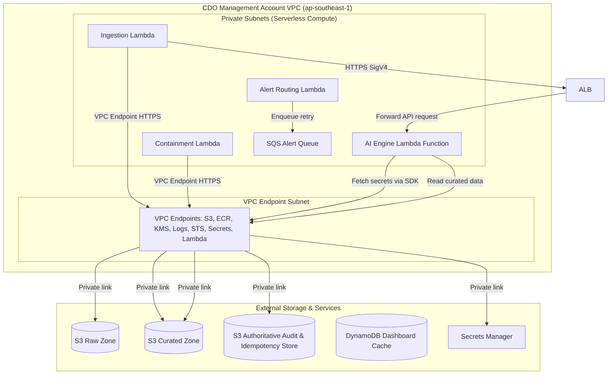

# Security Design - Task Force 2 · FinOps Watch CDO

<!-- Doc owner: CDO Team
     Status: Final (W11 T6 Pack #1) -> Updated (W12 T4 Pack #2)
-->

## 1. Network Security

### 1.1 Network Diagram

The CDO platform enforces isolation within a dedicated VPC. All compute resources run in isolated private subnets with no internet gateway route. All AWS API communications occur privately using AWS VPC Endpoints.

The security design assumes two primary trust boundaries: the CDO management account boundary and the member account boundary. Cost data, AI decision payloads, alert payloads, and containment audit records stay inside the CDO-controlled AWS network path. The Step Functions orchestrator interacts with the AI Engine Lambda function (running in a private container execution environment) through a private internal Application Load Balancer (ALB) or equivalent HTTPS adapter using AWS SigV4 signatures. The private endpoints `/v1/detect`, `/v1/decide`, `/v1/verify`, `/v1/status/{id}`, `/v1/audit/{audit_id}/rollback`, and `/health` are fully exposed via this secure private ALB compute target. The AI Engine does not receive direct credentials for member account containment actions. SQS/DLQ are used only for alert routing retry buffers rather than the detection flow.



*Caption: The AI Engine Lambda function, Application Load Balancer (ALB), and other platform compute tasks run in private-only subnets. They utilize dedicated AWS VPC Interface/Gateway Endpoints (PrivateLink) to connect to AWS services privately. Step Functions and platform compute access the AI Engine through the internal ALB using HTTPS and AWS SigV4 authentication. SQS/DLQ are used only for alert routing retry buffers rather than the detection flow.*

### 1.2 Security Groups

Traffic between compute components is regulated using stateful security groups enforcing the principle of least privilege:

| SG name | Inbound | Outbound | Attached to |
|---|---|---|---|
| `alb-sg` | TCP 443 (from orchestration/compute) | TCP 8080 (to `lambda-sg`) | Private Internal ALB / HTTPS Adapter |
| `lambda-sg` | TCP 8080 (from `alb-sg` only, for AI Engine Lambda) | TCP 443 (to `vpce-sg`) | Ingestion, Containment, Alert Routing, and AI Engine Lambda functions |
| `vpce-sg` | TCP 443 (from `lambda-sg`) | None | VPC endpoints (S3, DynamoDB, ECR, Secrets Mgr, KMS, Logs, STS) |

### 1.3 Network ACL / VPC Endpoint

VPC interface endpoints are configured with private DNS enabled, routing all traffic to:
- `com.amazonaws.ap-southeast-1.s3` (Gateway Endpoint)
- `com.amazonaws.ap-southeast-1.dynamodb` (Gateway Endpoint)
- `com.amazonaws.ap-southeast-1.secretsmanager` (Interface Endpoint)
- `com.amazonaws.ap-southeast-1.ecr.api` (Interface Endpoint)
- `com.amazonaws.ap-southeast-1.ecr.dkr` (Interface Endpoint)
- `com.amazonaws.ap-southeast-1.logs` (Interface Endpoint - CloudWatch logs)
- `com.amazonaws.ap-southeast-1.kms` (Interface Endpoint - Key Management Service)
- `com.amazonaws.ap-southeast-1.sts` (Interface Endpoint - Security Token Service)
- `com.amazonaws.ap-southeast-1.lambda` (Interface Endpoint - Lambda execution)

Security groups and IAM resource policies are deployed to restrict communications (e.g., the AI Engine Lambda only accepts invocation actions initiated by the Step Functions role, and the SQS Alert Queue policy allows message publishing exclusively from the Alert Routing Lambda role).

Endpoint policies are scoped to the smallest practical action set. The S3 gateway endpoint allows reads from approved CUR export prefixes, writes only to the CDO raw/curated buckets, and reads/writes to the authoritative `s3_audit_bucket`. The DynamoDB endpoint allows access only to the dashboard-materialization read cache tables. Interface endpoints for Secrets Manager, ECR, and CloudWatch Logs are restricted to the CDO VPC security groups and execution roles. Network ACLs remain simple and stateless, with public ingress denied and ephemeral return traffic allowed only inside private subnet ranges.

## 2. IAM & Access Control

### 2.1 Service Roles

AWS IAM service roles enforce strict separation. Crucially, no service role has administrative permissions or access to destructive functions on production environments:

| Role | Used by | Permissions |
|---|---|---|
| `FinOpsStepFunctionsRole` | Step Functions | `states:StartExecution`, `states:DescribeExecution` |
| `FinOpsCURPullerRole` | `LambdaCURPuller` | `s3:GetObject` (on target account CUR S3 bucket), `s3:PutObject` (on raw S3 bucket), `ce:GetCostAndUsage` |
| `FinOpsAiExecutionRole` | AI Engine Lambda | `ecr:BatchGetImage`, `ecr:GetDownloadUrlForLayer`, `secretsmanager:GetSecretValue` (via SDK), `s3:GetObject` (read cost data from curated S3 bucket), `s3:PutObject` / `s3:GetObject` (read/write telemetry & audit checks to S3 Authoritative store), `dynamodb:PutItem` / `dynamodb:UpdateItem` / `dynamodb:GetItem` (DynamoDB conditional writes on `finops-idempotency-{env}` and read/write to `finops-rollback-cache` and DynamoDB Dashboard Cache) |
| `FinOpsContainmentRole` | `LambdaContainment` | `ec2:CreateTags` (non-prod), `asg:UpdateAutoScalingGroup` (non-prod). Explicit deny for `iam:*`, `s3:Delete*`, and prod resource termination. |

> [!IMPORTANT]
> **Hard Security Boundary**: Every CDO execution role has an attached Service Control Policy (SCP) ensuring it can **NEVER terminate prod, delete data, or modify IAM**. Production containment tasks are strictly restricted to tag, suggest, or dry-run audits.

### 2.2 Lambda Execution Roles

AWS Lambda functions utilize Execution Roles to enforce the principle of least privilege:
1. **Lambda Execution Role** (`FinOpsAiExecutionRole`): Used by the Lambda service to run the function code, pull container images from ECR, and write execution logs to CloudWatch.
2. **Access Isolation**: Application code running inside the Lambda function uses this role to query Secrets Manager (via SDK), read/write to S3 curated cost data, and read/write to S3 Authoritative store. The CDO team owns these execution roles as part of the hosting platform, while the AIOps team provides the versioned container image artifacts.

Workloads do not inherit host permissions. Each Lambda function is explicitly associated with its own execution role in the function configuration.

- **Lambda Function Role Mappings**:

| Function Name | IAM Execution Role | Managed Policies / Custom Scoped Policies |
|---|---|---|
| AI Engine Lambda | `FinOpsAiExecutionRole` | Read-only Secrets Manager (contract keys), S3 read/write (cost files, audit, and idempotency checks), CloudWatch Logs write, and optional DynamoDB write (read cache). |

### 2.3 Cross-account Access

Cross-account access to member account CUR buckets is governed by target account S3 bucket policies allowing read access to the centralized `FinOpsCURPullerRole` using External IDs.
Containment actions in member accounts are triggered via cross-account IAM Role Assumption (`AssumeRole`). The management account `LambdaContainment` role assumes `FinOpsContainmentWorkerRole` in the target account, executing tag additions or scaling down sandbox ASGs.

Every cross-account role trust policy includes an external ID, source account condition, and session tagging requirement so audit logs can map each action back to a CDO run. Production roles include explicit deny statements for termination, destructive storage operations, and IAM mutation. Non-production roles may allow limited containment actions only when the incoming request includes an approved `execution_mode`, environment tag, anomaly ID, and policy decision ID. If any of those fields are missing, the containment worker records a denied audit event and exits without retrying.

### 2.4 Dashboard Authentication & Authorization (Cognito)

Access control for the static S3 + CloudFront Finance Dashboard is enforced through integration with Amazon Cognito and Lambda@Edge viewer-request authorization:
- **CloudFront OAC Protection**: The S3 bucket containing dashboard assets is completely private. Direct public access is blocked using Origin Access Control (OAC). The only access path is through the CloudFront distribution, which enforces authentication.
- **Hosted UI Code Flow**: Users access the Hosted UI endpoints via CloudFront redirects. Authentication is processed using the Authorization Code Flow with PKCE. Cognito issues ID, Access, and Refresh JWT tokens upon successful login.
- **Secure Token Storage**: The application exchanges the authorization code for tokens, storing them as secure cookies (`Secure`, `HttpOnly`, `SameSite=Strict` flags) with a short 1-hour session lifetime.
- **Lambda@Edge Token Validation**: The CloudFront viewer-request Lambda@Edge function intercepts all requests, parses JWT cookies, checks signatures against the Cognito JWKS endpoint, and validates claims (expiration, audience, issuer). Invalid or expired tokens trigger automatic redirects to the Hosted UI login page.
- **Group-Based Access Policies**:
  - `finops-finance-readonly`: Members are authorized for read-only visualization of spend trends, anomaly summaries, and audit trail records. The UI blocks rendering of CLI commands, raw rollback scripts, or containment execution triggers.
  - `finops-engineering-operator`: Members are authorized to access technical detail, view raw execution plans, and trigger approved programmatic validation (representing `/v1/verify` semantics) and manual rollback (representing `/v1/audit/{audit_id}/rollback` semantics) actions.
  - `finops-cdo-admin`: Members are granted permissions to manage access policies, adjust user group assignments, and configure global platform control flags.

### 2.5 Error Budget Security Lock (LOCKED_MODE)

To prevent automated containment runaways and protect resource availability, the platform enforces an automatic Error Budget Security Lock with tiered thresholds:
1. **Trigger Condition**: Transitions the tenant to `LOCKED_MODE` based on the environment tier:
   - `prod`, `prod-core`, and `prod-payments` lock if the rollback rate (manually triggered rollbacks due to false positives) exceeds **1% within a 30-day rolling window**.
   - `staging` locks if the rollback rate exceeds **10% within a 30-day rolling window**.
   - `dev`, `sandbox`, `ml-research`, and `data-analytics` do not trigger locks (error budget checks are disabled).
2. **Behavior**:
   - Every request to `/v1/decide` automatically returns `dry_run_mode: true`, and the AI Engine refuses to provide active remediation payloads.
   - All response headers include the `X-Containment-Status: LOCKED` and `X-Lock-Reason: error_budget_exceeded_threshold` fields.
   - The CDO platform forces all downstream containment executions to dry-run (alert-only) mode, ignoring any manual override attempts.
3. **Recovery**: Transitioning out of `LOCKED_MODE` requires manual review and approval by the AI Team Lead, who must explicitly reset the error budget parameters.

### 2.6 S3 Telemetry Bucket Naming & IAM Access Modes

To store operational telemetry, intermediate anomaly evidence, and run audit logs, S3 buckets follow the standardized naming convention:
- `company-cdo-{account_id}-telemetry` (where `{account_id}` represents the member AWS account ID).

Access to these telemetry buckets across accounts supports two distinct IAM configuration modes:
1. **Per-CDO Mode (Default)**: A strict, single-tenant isolation model where each CDO platform instance has dedicated read-write permissions scoped exclusively to its own account bucket (`company-cdo-{account_id}-telemetry`).
2. **Shared Skeleton Mode**: A multi-tenant orchestration model allowing cross-account telemetry sharing. Access is governed via either:
   - A wildcard S3 resource policy restricted by AWS conditions to specific organization OUs.
   - Cross-account `STS AssumeRole` with an `ExternalId` dynamically generated based on the tenant's `X-Tenant-Id` header, ensuring strict tenant boundaries during multi-account ingestion.

## 3. Secrets Management

### 3.1 Secrets Inventory

The following secrets are stored in AWS Secrets Manager:

| Secret | Storage | Rotation | Accessed by |
|---|---|---|---|
| `finops/ai-engine/api-key` (Deprecated) | Deprecated | N/A | Superseded by AWS IAM SigV4 credentials |
| `finops/dashboard/db-creds` | AWS Secrets Manager | 60 days automatic | Athena Query Engine / Future QuickSight dataset engine |
| `finops/alerting/slack-webhook` | AWS Secrets Manager | 90 days manual | `LambdaAlertRouting` |
| `finops/ai-engine/contract-signing-key` (Deprecated) | Deprecated | N/A | Superseded by request payload integrity checks (`X-Payload-SHA256`) |
| `finops/containment/external-id-seed` | AWS Secrets Manager | Manual rotation on incident | Containment role provisioning workflow |

### 3.2 Inject Pattern & Integrity Verification

Because the platform uses AWS IAM SigV4 for service-to-service authentication instead of static API keys, requests are signed using SigV4. The private ALB itself acts as the private entry point handling VPC routing and TLS termination, while the SigV4 signatures are validated at the compute runtime execution layer (inside the target AI Engine Lambda container via AWS IAM validation logic, or using a dedicated auth adapter / gateway target group). The AI Engine container function validates request integrity, clock skew drift, and tenant boundaries directly from cross-cutting headers: `X-Tenant-Id`, `X-Idempotency-Key`, `X-Payload-SHA256`, `X-Request-Timestamp`, and `X-Dry-Run-Mode`.

The platform enforces a clock-skew split policy:
1. **API Requests Clock Skew**: The `X-Request-Timestamp` header skew limit is strictly set to **300 seconds** to prevent replay attacks. Requests outside this window are automatically rejected.
2. **Ingestion Data Telemetry Delay**: A time delay of up to **36 hours** for cost data (CUR exports in S3) is normal and accepted as part of standard cloud billing latency, and does not trigger replay or clock-skew validation errors.

Hot-path idempotency checks are performed against the DynamoDB table `finops-idempotency-{env}` using conditional writes and a 24-hour TTL (`ttl_expiry`), rather than storing idempotency keys in S3. S3/Object Lock is reserved for long-term audit logs, telemetry backups, and rollback evidence.

For example, the Lambda container function validates the incoming request and performs the DynamoDB conditional write using the following Python logic:

```python
import time
import hashlib
import boto3
from datetime import datetime
from botocore.exceptions import ClientError

dynamodb = boto3.resource('dynamodb')

def validate_request_integrity(event):
    headers = event.get("headers", {})
    body = event.get("body", "")
    
    # 1. Verify Contract Headers
    req_timestamp_str = headers.get("X-Request-Timestamp")
    idempotency_key = headers.get("X-Idempotency-Key")
    payload_hash = headers.get("X-Payload-SHA256")
    tenant_id = headers.get("X-Tenant-Id")
    dry_run_mode = headers.get("X-Dry-Run-Mode", "true")
    
    if not all([req_timestamp_str, idempotency_key, payload_hash, tenant_id]):
        return {"statusCode": 400, "body": "Missing required contract headers"}
        
    # 2. Verify Clock Skew (max 300s)
    req_time = datetime.fromisoformat(req_timestamp_str.replace("Z", "+00:00"))
    now = datetime.now(req_time.tzinfo)
    drift = abs((now - req_time).total_seconds())
    if drift > 300:
        return {"statusCode": 400, "body": "ERR_REPLAY_DETECTED: Clock skew > 300 seconds"}
        
    # 3. Verify Payload Hash
    calculated_hash = hashlib.sha256(body.encode("utf-8")).hexdigest()
    if payload_hash != calculated_hash:
        return {"statusCode": 400, "body": "ERR_PAYLOAD_MISMATCH: Hash mismatch"}
        
    # 4. DynamoDB Conditional Write (Idempotency Hot Path)
    table = dynamodb.Table('finops-idempotency-prod')
    ttl_expiry = int(time.time()) + 86400  # 24h TTL
    
    try:
        table.put_item(
            Item={
                'idempotency_key': idempotency_key,
                'payload_sha256': payload_hash,
                'status': 'IN_PROGRESS',
                'tenant_id': tenant_id,
                'ttl_expiry': ttl_expiry
            },
            ConditionExpression='attribute_not_exists(idempotency_key)'
        )
    except ClientError as e:
        if e.response['Error']['Code'] == 'ConditionalCheckFailedException':
            return {"statusCode": 409, "body": "ERR_IDEMPOTENCY_CONFLICT: Key already exists"}
        raise e
        
    return {"statusCode": 200}
```

The injection path uses secure runtime lookup. Lambda functions read secrets directly through the Secrets Manager SDK because they are short-lived, containerized tasks. Terraform creates secret containers and IAM permissions, but it does not store secret values in `.tfvars`, Terraform state, or build configurations.

### 3.3 Anti-leak Controls

- **CI/CD Scanning**: Gitleaks is integrated into GitHub Actions pipelines, blocking PR merges if plain-text credentials or key headers are detected.
- **VPC Endpoint Restriction**: Secrets Manager VPC Endpoints enforce policies restricting access to only the CDO management VPC CIDR.
- **Log Redaction**: Outbound application logs are passed through a regex-based masking filter, replacing API keys, tokens, and authorization headers with `[REDACTED]`.
- **Terraform State Control**: Terraform state is encrypted, access-controlled, and reviewed so sensitive values are modeled as secret references rather than plaintext outputs.
- **Container Boundary**: Lambda workloads run inside secure execution environments as non-root, mount ephemeral `/tmp` storage (which is encrypted) as read-only by default except for temp scratch directories, and avoid writing secret material to persistent volumes.
- **Incident Response**: Suspected secret exposure triggers secret rotation, Git history review, CloudTrail lookup for `GetSecretValue`, and temporary suspension of affected deployment credentials.

## 4. Encryption

### 4.1 At Rest

All platform data is encrypted at rest using Customer Managed Keys (CMKs) in AWS KMS:

| Data | Storage | KMS key | Notes |
|---|---|---|---|
| Raw/Curated Cost Data | S3 | `aws/s3` or custom CMK | S3 Bucket Key enabled to reduce KMS API costs. Scoped to `company-cdo-{account_id}-telemetry`. |
| Run State Cache & Dashboard Cache | DynamoDB | `aws/dynamodb` or custom CMK | Encrypted using KMS. Includes `finops-idempotency-{env}` and `finops-rollback-cache`. |
| Secrets Store | Secrets Manager | `finops-secrets-key` | Decryption requires role trust. |
| Lambda Ephemeral / Container Storage | Lambda Storage | `aws/lambda` or custom CMK | All function storage (including /tmp up to 10 GB) is encrypted by default. |
| Audit Trail Logs & Idempotency Store | S3 Object Lock / S3 | `finops-audit-key` | S3/Object Lock audit storage is authoritative; retained for 90 days. |

### 4.2 In Transit

- **TLS Requirements**: All ingress and egress traffic requires TLS 1.3 (with TLS 1.2 as a minimum fallback).
- **Internal Service Traffic**: Function-to-function communication and SQS messaging are fully encrypted in transit natively by AWS services using TLS.
- **AI Engine Invocations**: Step Functions and compute tasks invoke the private internal ALB endpoint using HTTPS and AWS SigV4, which routes requests to the AI Engine Lambda function inside private subnets. The request payload contains standard contract fields such as a version schema pointer and correlation ID, and the payload is validated within the execution environment.
- **Alert Webhooks**: Slack or email integrations are called from the alerting Lambda after payload minimization. Sensitive cost evidence is linked through internal dashboard/audit references instead of embedded directly in external messages.

### 4.3 Key Management

- **Rotation**: CMK keys rotate automatically every 365 days.
- **Access Policies**: Key policies enforce separation of duties, ensuring only the deployment pipelines can modify key settings, and only execution roles (Lambda container and platform functions) can call decrypt operations.
- **Audit**: All key usage is monitored and logged in AWS CloudTrail.
- **Blast-radius control**: Separate CMKs are preferred for cost data, audit records, secrets, and Lambda temporary storage unless Finance and Security approve consolidation for cost reasons.
- **Break-glass access**: Manual decrypt access is not granted to day-to-day developers. Temporary access requires incident approval, ticket reference, expiry time, and post-use review.

## 5. Audit Logging

### 5.1 What to Log

Every action taken by the CDO platform is documented. For containment actions, the following schema is logged to the centralized database and S3:
```json
{
  "actor": "cdo-platform-orchestrator",
  "timestamp": "2026-06-23T07:20:00Z",
  "correlation_id": "corr-uuid-4444-5555-6666",
  "idempotency_key": "123456789012:2026-06-22T00:00:00Z",
  "anomaly_id": "anom-9988-7766",
  "resource_owner": "squad-prediction-models",
  "resource_id": "arn:aws:ec2:ap-southeast-1:123456789012:instance/i-0abcdef123456",
  "before_state": {
    "instance_type": "g5.4xlarge",
    "status": "running",
    "tags": {
      "Environment": "sandbox"
    }
  },
  "proposed_after_state": {
    "tags": {
      "Environment": "sandbox",
      "FinOpsWatch": "ReviewRequired",
      "AnomalyDetected": "true"
    }
  },
  "execution_mode": "dry-run",
  "rollback_path": {
    "action": "remove_tags",
    "keys": ["FinOpsWatch", "AnomalyDetected"]
  },
  "rollback_status": "success",
  "rollback_executed_at": "2026-06-23T07:25:00Z",
  "boto3_result": {
    "HTTPStatusCode": 200,
    "ResponseMetadata": {
      "RequestId": "7f89b910-c123..."
    }
  },
  "approval_status": "pending_squad_response",
  "retention_location": "s3://cdo-audit-trail-bucket/audit/year=2026/month=06/",
  "retention_period_days": 90,
  "audit_chain": {
    "audit_id": "8f3b610c-18a4-4e2b-9801-bde901844b20",
    "event_hash": "673f8a0dc...",
    "previous_hash": "a4f891b0d..."
  }
}
```

The audit record is written before any apply-mode operation is attempted, and it is updated after the operation with the final status. Immediately after the `/v1/decide` response, the CDO platform extracts the `rollback_payload.boto3_equivalent` and caches it in the DynamoDB table `finops-rollback-cache` (with a 90-day TTL). When a rollback operation is executed, the CDO platform executes this cached boto3 payload directly using its own boto3 execution workers, ensuring rollback independence without depending on AI Engine availability. Once the rollback completes, a notification is written to the SQS queue `finops-watch-rollback` for audit trail completion only, not as a queue to execute the rollback. Every containment action record is cryptographically linked to the previous one in an append-only chain stored in the authoritative S3 bucket (with optional dashboard cache duplication in DynamoDB), with the integrity hash calculated as `sha256(current_payload + previous_hash)` to ensure tamper-evidence. Dry-run operations still generate audit logs because Finance needs to see what the platform would have done and why the action is safe. AI model training datasets are not logged by the CDO; the CDO only logs call metadata, returned decision fields, and operational evidence references required for alerting and containment. Telemetry sent to the AI Engine for anomaly detection is hybrid, containing S3 CUR exports, Cost Explorer API metrics, and CloudWatch performance indicators (`resource_utilization_metrics` such as CPU, memory, network, disk, database connections, and GPU metrics). If CloudWatch metrics are unavailable, the platform automatically falls back to CUR-only mode, setting `data_confidence = LOW` and forcing dry-run/alert-only containment. CloudWatch logs and metrics are also used for CDO platform operational health monitoring and SRE alerts. All dashboard authentication activities (successful logins, logouts, expired session renewals), authentication failures (failed login attempts, invalid token signatures, replay window breaches), and unauthorized group access attempts (such as a readonly Finance user attempting to invoke an operator action) are logged immediately to CloudWatch Logs and streamed to S3 for audit trail preservation.

### 5.2 Storage + Retention

Audit logs are stored securely with immutable controls:

| Log type | Storage | Retention | Query interface |
|---|---|---|---|
| Containment Audits | S3 + Object Lock | 90 days minimum | Athena / DynamoDB (read cache) |
| AWS API Calls | CloudTrail (S3 Raw) | 1 year | Athena |
| AI Engine Lambda Logs | CloudWatch Logs | 30 days | CloudWatch Logs Insights |
| App/Lambda Logs | CloudWatch Logs | 14 days | CloudWatch Logs Insights |

Containment audit storage is append-only by design. DynamoDB supports low-latency dashboard lookup, while S3 with Object Lock is the durable evidence store. The dashboard should link to the audit record ID rather than duplicating sensitive before/after state in alert messages. Retention shorter than 90 days is not allowed for containment records, even in sandbox, because the capstone requirement measures traceability of automated decisions.

### 5.3 Synthetic Data Handling

To prevent mixing synthetic anomaly logs with real account settings during testing:
- CDO-owned demo injections are marked with `source = "synthetic-demo"`.
- Dashboard filters (S3 + CloudFront UI) allow toggling between real and synthetic data displays.
- Synthetic containment actions are routed to a mock target endpoint, leaving real AWS resources untouched.
- AIOps-owned model training, enhancement, and backtest datasets remain outside CDO ownership. CDO may store AIOps-provided model metrics as integration evidence, but it does not copy or reclassify the AI team's training dataset as CDO operational data.

## 6. CI Security Controls

- **Image & Dependency Scanning**: Trivy is integrated into the CI/CD pipeline. Build actions fail automatically if container images contain `CRITICAL` or `HIGH` severity CVEs.
- **Non-Root Execution**: Container configurations enforce running workloads as a non-root user (e.g. running as user `1000` in the Dockerfile).
- **Lambda Function Isolation**: Lambda container functions run in isolated, read-only sandboxes (except for `/tmp` storage) and execute with minimal task permissions using distinct execution roles.
- **Resource Throttling**: Concurrency limits (Reserved Concurrency) are set on Lambda functions to prevent denial of service or resource exhaustion on the rest of the account.

## 7. Compliance Touchpoints

| Standard | Relevant controls (capstone scope) |
|---|---|
| **SOC 2 Type II** | Least privilege IAM roles, VPC private network boundaries, Secrets Manager rotation, encrypted S3 buckets. |
| **ISO 27001** | Weekly access audit reports, immutable containment logs, automatic key rotation. |
| **HIPAA** | Out of scope (Cost billing data contains no Protected Health Information). |

The compliance mapping is intentionally limited to capstone-relevant controls. The platform handles billing and operational metadata, not customer application payloads, but the data still reveals account structure, resource usage, and owner tags. That makes least privilege, audit retention, encryption, and alert minimization mandatory even when no regulated customer data is present.

## 8. Open Questions

- [ ] **Cross-Account KMS Strategy**: Should we use a centralized KMS key with cross-account access, or local target account keys for CUR S3 bucket encryption?
- [ ] **Operator Notification Channels**: When a containment action is denied, should the platform escalate alerts via PagerDuty or direct Slack webhook notifications?
- [ ] **External Alert Redaction**: Which cost fields are allowed in Slack/email, and which must remain dashboard-only?
- [ ] **Break-glass Approver**: Who approves temporary decrypt or production investigation access during an incident?

## 9. Security Implementation Handoff

To ensure smooth operational handover and contract compliance, the following implementation handoff details must be configured by the infrastructure engineers:

### 9.1 IAM Permissions & Least-Privilege
- **Containment Worker Execution Role**: Must possess only permissions for `ec2:CreateTags`, `ec2:DeleteTags`, and `ec2:StartInstances`/`ec2:StopInstances` (restricted to sandbox/development resource ARNs). It must not contain `iam:*` or data-destructive permissions.
- **AI Engine Lambda Execution Role**: Scoped only to access its own ECR repository, write to `s3://company-cdo-{account_id}-telemetry/features/`, and perform read/write queries to `finops-idempotency-{env}` and `finops-rollback-cache`.

### 9.2 VPC Private Access & Security Groups
- **Private Subnet Restrictions**: The AI Engine container function runs entirely within private subnets with no internet routes. All external services (S3, ECR, DynamoDB, Secrets Manager) must be accessed via Gateway/Interface VPC Endpoints.
- **Security Group Rules**: The ALB security group (`alb-sg`) accepts traffic only on Port 443 from within the CDO VPC CIDR block. The Lambda security group (`lambda-sg`) accepts Port 8080 traffic only from `alb-sg`.

### 9.3 CloudWatch Alarms & Observability
- **SigV4 Authentication Failures**: CloudWatch metric filters must monitor ALB logs for HTTP `403 Forbidden` or `401 Unauthorized` responses and trigger a `SigV4AuthFailureAlarm` if the count > 5 in 5 minutes.
- **Lambda Concurrency Throttle**: Alarms must trigger on `Throttles` metrics for the AI Engine container function.

### 9.4 Rate Limiting & Smoke-Test Probes
- **Rate Limiting**: Placed at the Application Load Balancer layer or using Lambda Reserved Concurrency limits (capped at 10 concurrent executions) to prevent resource starvation.
- **Smoke-Test Probes**: Post-deployment testing must run an automated runner inside the VPC to send signed HTTP requests using AWS SigV4 to the private ALB:
  - Probe `/health` to verify container availability.
  - Probe `/v1/detect` with a test payload to verify SigV4 validation, payload integrity checks (`X-Payload-SHA256`), and DynamoDB idempotency lock creation.

## Related documents

- [`02_infra_design.md`](02_infra_design.md) - Architecture design, VPC layout, and serverless compute integration.
- [`04_deployment_design.md`](04_deployment_design.md) - CI/CD pipeline, GitHub Actions deployment pipelines, and secret rotation gates.
