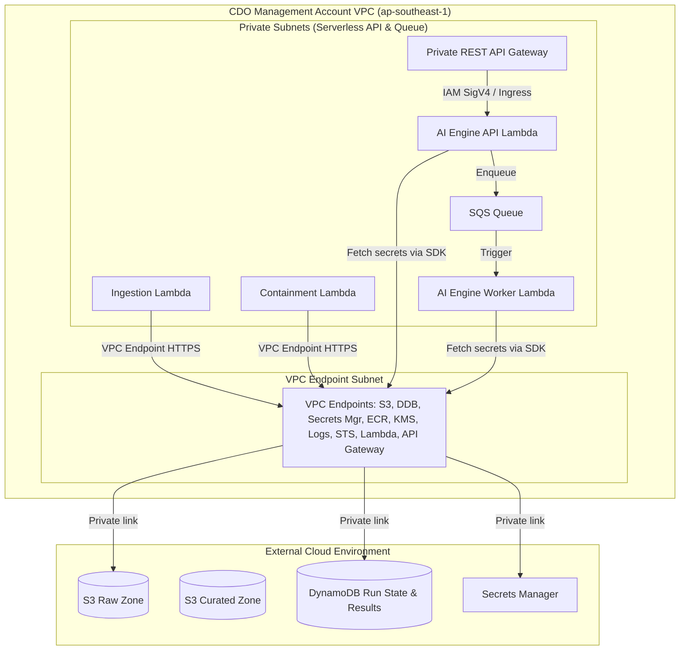

# Security Design - Task Force 2 · FinOps Watch CDO

<!-- Doc owner: CDO Team
     Status: Final (W11 T6 Pack #1) -> Updated (W12 T4 Pack #2)
-->

## 1. Network Security

### 1.1 Network Diagram

The CDO platform enforces isolation within a dedicated VPC. All compute resources run in isolated private subnets with no internet gateway route. All AWS API communications and external model endpoint calls occur privately using AWS VPC Endpoints.

The security design assumes two primary trust boundaries: the CDO management account boundary and the member account boundary. Cost data, AI decision payloads, alert payloads, and containment audit records stay inside the CDO-controlled AWS network path. The shared AIOps-provided AI Engine endpoint is exposed internally to the CDO platforms (both CDO-01 and CDO-02) via a Private REST API Gateway, reached at `https://ai-engine.tf-2.internal/` using IAM SigV4 authentication. The AI Engine does not receive direct credentials for member account containment actions.



*Caption: The Private REST API Gateway, AI Engine API & Worker Lambda functions, and orchestration Lambda functions are deployed within private-only subnets. They utilize dedicated AWS VPC Interface Endpoints (PrivateLink) to connect to AWS services, preventing data transmission over the public internet. The shared AI Engine endpoint is exposed privately via API Gateway and accessed via `https://ai-engine.tf-2.internal/` using IAM SigV4 authentication.*

### 1.2 Security Groups

Traffic between compute components is regulated using stateful security groups enforcing the principle of least privilege:

| SG name | Inbound | Outbound | Attached to |
|---|---|---|---|
| `apigw-vpce-sg` | TCP 443 (from VPC CIDR / Step Functions client) | TCP 443 (to `lambda-sg`) | VPC endpoint for API Gateway |
| `lambda-sg` | TCP 443 (from `apigw-vpce-sg`) | TCP 443 (to `vpce-sg`) | AI Engine API & Worker Lambda functions |
| `vpce-sg` | TCP 443 (from `lambda-sg`) | None | VPC endpoints (S3, DynamoDB, ECR, Secrets Mgr, KMS, Logs, STS, Lambda) |

### 1.3 Network ACL / VPC Endpoint

VPC interface endpoints are configured with private DNS enabled, routing all traffic to:
- `com.amazonaws.ap-southeast-1.s3` (Gateway Endpoint)
- `com.amazonaws.ap-southeast-1.dynamodb` (Gateway Endpoint)
- `com.amazonaws.ap-southeast-1.secretsmanager` (Interface Endpoint)
- `com.amazonaws.ap-southeast-1.ecr.api` (Interface Endpoint)
- `com.amazonaws.ap-southeast-1.ecr.dkr` (Interface Endpoint)
- `com.amazonaws.ap-southeast-1.logs` (Interface Endpoint - CloudWatch logs)
- `com.amazonaws.ap-southeast-1.kms` (Interface Endpoint - Key Management Service)
- `com.amazonaws.ap-southeast-1.sts` (Interface Endpoint - Security Token Service)
- `com.amazonaws.ap-southeast-1.lambda` (Interface Endpoint - Lambda execution)
- `com.amazonaws.ap-southeast-1.execute-api` (Interface Endpoint - API Gateway endpoint access)

Security groups and resource policies are deployed to restrict communications (e.g., the Private REST API Gateway enforces a resource policy that allows traffic only from the CDO VPC endpoints, and the API Lambda only accepts traffic routed via the API Gateway).

Endpoint policies are scoped to the smallest practical action set. The S3 gateway endpoint allows reads from approved CUR export prefixes and writes only to the CDO raw/curated buckets. The DynamoDB endpoint allows access only to run-state, idempotency, audit, and dashboard-materialization tables. Interface endpoints for Secrets Manager, ECR, and CloudWatch Logs are restricted to the CDO VPC security groups and execution roles. Network ACLs remain simple and stateless, with public ingress denied and ephemeral return traffic allowed only inside private subnet ranges.

## 2. IAM & Access Control

### 2.1 Service Roles

AWS IAM service roles enforce strict separation. Crucially, no service role has administrative permissions or access to destructive functions on production environments:

| Role | Used by | Permissions |
|---|---|---|
| `FinOpsStepFunctionsRole` | Step Functions | `states:StartExecution`, `states:DescribeExecution`, `lambda:InvokeFunction`, `execute-api:Invoke` (to call Private API Gateway) |
| `FinOpsCURPullerRole` | `LambdaCURPuller` | `s3:GetObject` (on target account CUR S3 bucket), `s3:PutObject` (on raw S3 bucket), `ce:GetCostAndUsage` |
| `FinOpsAiApiExecutionRole` | AI Engine API Lambda | `ecr:BatchGetImage`, `ecr:GetDownloadUrlForLayer`, `secretsmanager:GetSecretValue` (via SDK), `sqs:SendMessage` (to queue detect requests), `dynamodb:GetItem` / `dynamodb:Query` (to fetch result state) |
| `FinOpsAiWorkerExecutionRole` | AI Engine Worker Lambda | `ecr:BatchGetImage`, `ecr:GetDownloadUrlForLayer`, `secretsmanager:GetSecretValue` (via SDK), `sqs:ReceiveMessage` / `sqs:DeleteMessage` (to poll queue), `s3:GetObject` / `s3:PutObject` (read cost data and write checkpoints/features), `dynamodb:PutItem` (to store inference outputs) |
| `FinOpsContainmentRole` | `LambdaContainment` | `ec2:CreateTags` (non-prod), `asg:UpdateAutoScalingGroup` (non-prod). Explicit deny for `iam:*`, `s3:Delete*`, and prod resource termination. |

> [!IMPORTANT]
> **Hard Security Boundary**: Every CDO execution role has an attached Service Control Policy (SCP) ensuring it can **NEVER terminate prod, delete data, or modify IAM**. Production containment tasks are strictly restricted to tag, suggest, or dry-run audits.

### 2.2 Lambda Execution Roles

AWS Lambda functions utilize Execution Roles to enforce the principle of least privilege:
1. **Lambda Execution Role** (`FinOpsAiApiExecutionRole`, `FinOpsAiWorkerExecutionRole`): Used by the Lambda service to run the function code, pull container images from ECR, and write execution logs to CloudWatch.
2. **Access Isolation**: Application code running inside the Lambda functions uses these roles to query Secrets Manager (via SDK), read/write to S3 curated cost data, poll from SQS queues, or record results in DynamoDB. The CDO team owns these execution roles as part of the hosting platform, while the AIOps team provides the versioned container image artifacts.

Workloads do not inherit host permissions. Each Lambda function is explicitly associated with its own execution role in the function configuration.

- **Lambda Function Role Mappings**:

| Function Name | IAM Execution Role | Managed Policies / Custom Scoped Policies |
|---|---|---|
| AI Engine API Lambda | `FinOpsAiApiExecutionRole` | Read-only Secrets Manager (contract and API keys), SQS send messages, DynamoDB query run state, CloudWatch Logs write. |
| AI Engine Worker Lambda | `FinOpsAiWorkerExecutionRole` | Read-write S3 access (cost files & checkpoints), SQS poll messages, DynamoDB write results, CloudWatch Logs write. |

### 2.3 Cross-account Access

Cross-account access to member account CUR buckets is governed by target account S3 bucket policies allowing read access to the centralized `FinOpsCURPullerRole` using External IDs.
Containment actions in member accounts are triggered via cross-account IAM Role Assumption (`AssumeRole`). The management account `LambdaContainment` role assumes `FinOpsContainmentWorkerRole` in the target account, executing tag additions or scaling down sandbox ASGs.

Every cross-account role trust policy includes an external ID, source account condition, and session tagging requirement so audit logs can map each action back to a CDO run. Production roles include explicit deny statements for termination, destructive storage operations, and IAM mutation. Non-production roles may allow limited containment actions only when the incoming request includes an approved `execution_mode`, environment tag, anomaly ID, and policy decision ID. If any of those fields are missing, the containment worker records a denied audit event and exits without retrying.

## 3. Secrets Management

### 3.1 Secrets Inventory

The following secrets are stored in AWS Secrets Manager:

| Secret | Storage | Rotation | Accessed by |
|---|---|---|---|
| `finops/ai-engine/api-key` | AWS Secrets Manager (KMS CMK encrypted) | 30 days automatic | AI Engine API Lambda (via SDK during cold start) |
| `finops/dashboard/db-creds` | AWS Secrets Manager | 60 days automatic | Athena crawler / Future QuickSight dataset engine |
| `finops/alerting/slack-webhook` | AWS Secrets Manager | 90 days manual | `LambdaAlertRouting` |
| `finops/ai-engine/contract-signing-key` | AWS Secrets Manager | 90 days automatic | Step Functions validation Lambda and AI Engine API Lambda |
| `finops/containment/external-id-seed` | AWS Secrets Manager | Manual rotation on incident | Containment role provisioning workflow |

### 3.2 Inject Pattern

We use AWS Secrets Manager SDK to retrieve secrets in Lambda functions at runtime, rather than passing them as plaintext environment variables. Secrets are resolved during function cold-starts, cached in the function's global execution context, and checked against cache TTL policies (e.g. 5 minutes) to avoid direct API invocation overhead on subsequent requests.

For example, the Lambda container function retrieves its API key dynamically using the AWS SDK:
```python
import boto3
import os

def get_api_key():
    secret_name = os.environ["API_KEY_SECRET_ARN"]
    client = boto3.client("secretsmanager")
    response = client.get_secret_value(SecretId=secret_name)
    return response["SecretString"]
```

The injection path uses secure runtime lookup. Lambda functions read secrets directly through the Secrets Manager SDK because they are short-lived, containerized tasks. Terraform creates secret containers and IAM permissions, but it does not store secret values in `.tfvars`, Terraform state, or build configurations.

### 3.3 Anti-leak Controls

- **CI/CD Scanning**: Gitleaks is integrated into GitHub Actions pipelines, blocking PR merges if plain-text credentials or key headers are detected.
- **VPC Endpoint Restriction**: Secrets Manager VPC Endpoints enforce policies restricting access to only the CDO management VPC CIDR.
- **Log Redaction**: Outbound application logs are passed through a regex-based masking filter, replacing API keys, tokens, and authorization headers with `[REDACTED]`.
- **Terraform State Control**: Terraform state is encrypted, access-controlled, and reviewed so sensitive values are modeled as secret references rather than plaintext outputs.
- **Container Boundary**: Lambda workloads run inside secure execution environments as non-root, mount ephemeral `/tmp` storage (which is encrypted) as read-only by default except for temp scratch directories, and avoid writing secret material to persistent volumes.
- **Incident Response**: Suspected secret exposure triggers secret rotation, Git history review, CloudTrail lookup for `GetSecretValue`, and temporary suspension of affected deployment credentials.

## 4. Encryption

### 4.1 At Rest

All platform data is encrypted at rest using Customer Managed Keys (CMKs) in AWS KMS:

| Data | Storage | KMS key | Notes |
|---|---|---|---|
| Raw/Curated Cost Data | S3 | `aws/s3` or custom CMK | S3 Bucket Key enabled to reduce KMS API costs. |
| Run State & Metadata | DynamoDB | `aws/dynamodb` or custom CMK | Encrypted using KMS. |
| Secrets Store | Secrets Manager | `finops-secrets-key` | Decryption requires role trust. |
| Lambda Ephemeral / Container Storage | Lambda Storage | `aws/lambda` or custom CMK | All function storage (including /tmp up to 10 GB) is encrypted by default. |
| Audit Trail Logs | S3 Object Lock | `finops-audit-key` | Retained for 90 days with compliance lock. |

### 4.2 In Transit

- **TLS Requirements**: All ingress and egress traffic requires TLS 1.3 (with TLS 1.2 as a minimum fallback). Weak ciphers are disabled on the Private API Gateway.
- **Internal Service Traffic**: Function-to-function communication and SQS messaging are fully encrypted in transit natively by AWS services using TLS.
- **AI Engine Calls**: Step Functions and Lambda invoke the internal AI Engine endpoint via Private REST API Gateway through private networking VPC endpoints only. The request includes a contract version and correlation ID, and the response is rejected if the signature, schema, or required fields are invalid.
- **Alert Webhooks**: Slack or email integrations are called from the alerting Lambda after payload minimization. Sensitive cost evidence is linked through internal dashboard/audit references instead of embedded directly in external messages.

### 4.3 Key Management

- **Rotation**: CMK keys rotate automatically every 365 days.
- **Access Policies**: Key policies enforce separation of duties, ensuring only the deployment pipelines can modify key settings, and only execution roles (Lambda container and platform functions) can call decrypt operations.
- **Audit**: All key usage is monitored and logged in AWS CloudTrail.
- **Blast-radius control**: Separate CMKs are preferred for cost data, audit records, secrets, and Lambda temporary storage unless Finance and Security approve consolidation for cost reasons.
- **Break-glass access**: Manual decrypt access is not granted to day-to-day developers. Temporary access requires incident approval, ticket reference, expiry time, and post-use review.

## 5. Audit Logging

### 5.1 What to Log

Every action taken by the CDO platform is documented. For containment actions, the following schema is logged to the centralized database and S3:
```json
{
  "actor": "cdo-platform-orchestrator",
  "timestamp": "2026-06-23T07:20:00Z",
  "correlation_id": "corr-uuid-4444-5555-6666",
  "idempotency_key": "123456789012:2026-06-22T00:00:00Z",
  "anomaly_id": "anom-9988-7766",
  "resource_owner": "squad-prediction-models",
  "resource_id": "arn:aws:ec2:ap-southeast-1:123456789012:instance/i-0abcdef123456",
  "before_state": {
    "instance_type": "g5.4xlarge",
    "status": "running",
    "tags": {
      "Environment": "sandbox"
    }
  },
  "proposed_after_state": {
    "tags": {
      "Environment": "sandbox",
      "FinOpsWatch": "ReviewRequired",
      "AnomalyDetected": "true"
    }
  },
  "execution_mode": "dry-run",
  "rollback_path": {
    "action": "remove_tags",
    "keys": ["FinOpsWatch", "AnomalyDetected"]
  },
  "approval_status": "pending_squad_response",
  "retention_location": "s3://cdo-audit-trail-bucket/audit/year=2026/month=06/",
  "retention_period_days": 90,
  "audit_chain": {
    "audit_id": "8f3b610c-18a4-4e2b-9801-bde901844b20",
    "event_hash": "673f8a0dc...",
    "previous_hash": "a4f891b0d..."
  }
}
```

The audit record is written before any apply-mode operation is attempted, and it is updated after the operation with the final status. Every containment action record is cryptographically linked to the previous one in an append-only chain stored in DynamoDB and S3, with the integrity hash calculated as `sha256(current_payload + previous_hash)` to ensure tamper-evidence. Dry-run operations still produce audit records because Finance needs to see what the platform would have done and why the action remained safe. AI model training datasets are not logged by CDO; CDO logs only invocation metadata, returned decision fields, and operational evidence references needed for alerting and containment. Telemetry data sent to the AI Engine for detection is strictly CUR-only and excludes CloudWatch performance utilization signals. CloudWatch logs and metrics are used solely for CDO platform operational observability and SRE alerts.

### 5.2 Storage + Retention

Audit logs are stored securely with immutable controls:

| Log type | Storage | Retention | Query interface |
|---|---|---|---|
| Containment Audits | S3 + Object Lock | 90 days minimum | Athena / DynamoDB |
| AWS API Calls | CloudTrail (S3 Raw) | 1 year | Athena |
| AI Engine Lambda Logs | CloudWatch Logs | 30 days | CloudWatch Logs Insights |
| App/Lambda Logs | CloudWatch Logs | 14 days | CloudWatch Logs Insights |

Containment audit storage is append-only by design. DynamoDB supports low-latency dashboard lookup, while S3 with Object Lock is the durable evidence store. The dashboard should link to the audit record ID rather than duplicating sensitive before/after state in alert messages. Retention shorter than 90 days is not allowed for containment records, even in sandbox, because the capstone requirement measures traceability of automated decisions.

### 5.3 Synthetic Data Handling

To prevent mixing synthetic anomaly logs with real account settings during testing:
- CDO-owned demo injections are marked with `source = "synthetic-demo"`.
- Dashboard filters (S3 + CloudFront UI) allow toggling between real and synthetic data displays.
- Synthetic containment actions are routed to a mock target endpoint, leaving real AWS resources untouched.
- AIOps-owned model training, enhancement, and backtest datasets remain outside CDO ownership. CDO may store AIOps-provided model metrics as integration evidence, but it does not copy or reclassify the AI team's training dataset as CDO operational data.

## 6. CI Security Controls

- **Image & Dependency Scanning**: Trivy is integrated into the CI/CD pipeline. Build actions fail automatically if container images contain `CRITICAL` or `HIGH` severity CVEs.
- **Non-Root Execution**: Container configurations enforce running workloads as a non-root user (e.g. running as user `1000` in the Dockerfile).
- **Lambda Function Isolation**: Lambda container functions run in isolated, read-only sandboxes (except for `/tmp` storage) and execute with minimal task permissions using distinct execution roles.
- **Resource Throttling**: Concurrency limits (Reserved Concurrency) are set on Lambda functions to prevent denial of service or resource exhaustion on the rest of the account.

## 7. Compliance Touchpoints

| Standard | Relevant controls (capstone scope) |
|---|---|
| **SOC 2 Type II** | Least privilege IAM roles, VPC private network boundaries, Secrets Manager rotation, encrypted S3 buckets. |
| **ISO 27001** | Weekly access audit reports, immutable containment logs, automatic key rotation. |
| **HIPAA** | Out of scope (Cost billing data contains no Protected Health Information). |

The compliance mapping is intentionally limited to capstone-relevant controls. The platform handles billing and operational metadata, not customer application payloads, but the data still reveals account structure, resource usage, and owner tags. That makes least privilege, audit retention, encryption, and alert minimization mandatory even when no regulated customer data is present.

## 8. Open Questions

- [ ] **Cross-Account KMS Strategy**: Should we use a centralized KMS key with cross-account access, or local target account keys for CUR S3 bucket encryption?
- [ ] **Operator Notification Channels**: When a containment action is denied, should the platform escalate alerts via PagerDuty or direct Slack webhook notifications?
- [ ] **External Alert Redaction**: Which cost fields are allowed in Slack/email, and which must remain dashboard-only?
- [ ] **Break-glass Approver**: Who approves temporary decrypt or production investigation access during an incident?

## Related documents

- [`02_infra_design.md`](02_infra_design.md) - Architecture design, VPC layout, and serverless compute integration.
- [`04_deployment_design.md`](04_deployment_design.md) - CI/CD pipeline, GitHub Actions deployment pipelines, and secret rotation gates.
