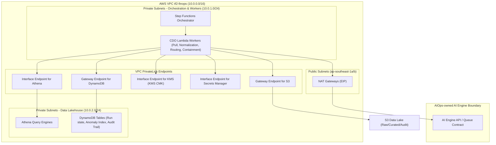

# Security Design - TF2 FinOps Watch CDO06 Platform

## 1. Network Security

The TF2 FinOps Watch CDO control plane operates in a serverless, batch-driven network architecture in `ap-southeast-1`. Rather than exposing open public APIs, the platform uses private networking, Gateway/Interface VPC Endpoints, and managed NAT Gateways to execute its scheduled 24h cadence workflows.

### 1.1 Network Diagram

The diagram below shows the VPC configuration, private subnets, security groups, and VPC Endpoints that isolate the data lakehouse, Step Functions orchestration, and Lambda workers from the public internet. It also highlights the outbound connection to the AIOps-owned AI Engine endpoint via the NAT Gateway.



### 1.2 Security Groups

Traffic flows are restricted using security groups configured on resources attached to the subnets. Because the CDO platform runs serverless components (Lambda and Athena queries) rather than persistent EC2 or EKS clusters, security groups are applied to VPC-connected Lambda functions and VPC interface endpoints.

| Security Group Name | Inbound Rules | Outbound Rules | Attached To |
|---|---|---|---|
| `tf2-finops-lambda-sg` | None | `HTTPS (443)` to VPC Endpoints; `HTTPS (443)` to NAT Gateway (for AI Engine) | All VPC-connected CDO Lambda functions |
| `tf2-finops-vpce-sg` | `HTTPS (443)` from `tf2-finops-lambda-sg` | None | VPC Interface Endpoints (KMS, Secrets Manager, Athena) |
| `tf2-finops-athena-sg` | `HTTPS (443)` from `tf2-finops-lambda-sg` | None | Athena query execution groups |

### 1.3 Network ACL / VPC Endpoints

To keep all internal data, credentials, and encryption key traffic within the AWS private backbone, network traffic does not route over the public internet except for the outbound calls to the external AIOps AI Engine API. 

- **S3 Gateway Endpoint**: Routing table entries in the private subnets redirect traffic destined for the CDO Lakehouse buckets directly to S3.
- **DynamoDB Gateway Endpoint**: Resolves traffic to the run-state, idempotency, and anomaly DynamoDB tables privately.
- **Secrets Manager Interface Endpoint (`com.amazonaws.ap-southeast-1.secretsmanager`)**: Resolves API calls to fetch synthetic credentials and API keys inside the VPC.
- **KMS Interface Endpoint (`com.amazonaws.ap-southeast-1.kms`)**: Resolves key operations (encrypt, decrypt, generate data key) for CMKs.
- **Athena Interface Endpoint (`com.amazonaws.ap-southeast-1.athena`)**: Secures internal analytics queries performed by the dashboard data connector.

---

## 2. IAM & Access Control

Identity and Access Management (IAM) is structured around least-privilege service roles and environment-aware containment permissions. 

### 2.1 Service Roles

The CDO platform enforces separation of duties between workflow orchestration, data normalization, AI engine integration, and containment action execution.

#### 1. CDO Platform Execution Role (`tf2-finops-cdo-workflow-role`)
Used by the Step Functions state machine. It is allowed to trigger and monitor CDO Lambda functions, read and update DynamoDB run-state records, and log execution metrics.

#### 2. CDO AI Client Role (`tf2-finops-ai-client-role`)
Used by the Lambda function that invokes the AIOps-owned AI Engine. It has permissions to read normalized cost files from S3, fetch the AI Engine API key from Secrets Manager, and write anomaly records to DynamoDB.

```json
{
    "Version": "2012-10-17",
    "Statement": [
        {
            "Sid": "ReadNormalizedCostData",
            "Effect": "Allow",
            "Action": [
                "s3:GetObject"
            ],
            "Resource": "arn:aws:s3:::tf2-finops-lakehouse/cost/curated/*"
        },
        {
            "Sid": "RetrieveAIEngineApiKey",
            "Effect": "Allow",
            "Action": [
                "secretsmanager:GetSecretValue"
            ],
            "Resource": "arn:aws:secretsmanager:ap-southeast-1:123456789012:secret:tf2-finops/ai-engine/api-key-*"
        },
        {
            "Sid": "WriteAnomalyRecords",
            "Effect": "Allow",
            "Action": [
                "dynamodb:PutItem",
                "dynamodb:UpdateItem"
            ],
            "Resource": "arn:aws:dynamodb:ap-southeast-1:123456789012:table/tf2-finops-anomaly-records"
        }
    ]
}
```

#### 3. CDO Containment Worker Role (`tf2-finops-containment-role`)
Used by the Lambda function that applies containment policies. This role has access to retrieve anomaly data and write audit records, but it must assume environment-specific roles in member accounts to trigger containment actions.

```json
{
    "Version": "2012-10-17",
    "Statement": [
        {
            "Sid": "ReadAuditAndAnomalyMetadata",
            "Effect": "Allow",
            "Action": [
                "dynamodb:GetItem",
                "dynamodb:UpdateItem",
                "s3:PutObject"
            ],
            "Resource": [
                "arn:aws:dynamodb:ap-southeast-1:123456789012:table/tf2-finops-anomaly-records",
                "arn:aws:s3:::tf2-finops-audit-log/*"
            ]
        },
        {
            "Sid": "AssumeScopedContainmentRoles",
            "Effect": "Allow",
            "Action": "sts:AssumeRole",
            "Resource": [
                "arn:aws:iam::*:role/tf2-finops-member-containment-role"
            ]
        }
    ]
}
```

### 2.2 Hard Security Boundary (Deny Policy)

To satisfy the client's absolute hard security requirements, the CDO platform attaches an IAM Permission Boundary or a Service Control Policy (SCP) to all automation roles. 

> [!IMPORTANT]
> **Hard production safety boundary**: `NEVER terminate prod, delete data, or modify IAM`. Under no circumstances will the CDO system terminate running production resources, delete persistent data stores, or modify IAM policy scopes.

The following policy snippet is attached as an explicit Deny boundary to the containment worker role and all assumed cross-account roles:

```json
{
    "Version": "2012-10-17",
    "Statement": [
        {
            "Sid": "DenyUnsafeActions",
            "Effect": "Deny",
            "Action": [
                "iam:*",
                "organizations:*",
                "ec2:TerminateInstances",
                "rds:DeleteDBInstance",
                "rds:DeleteDBCluster",
                "s3:DeleteBucket",
                "s3:DeleteObject",
                "dynamodb:DeleteTable",
                "dynamodb:DeleteBackup"
            ],
            "Resource": "*"
        }
    ]
}
```

### 2.3 Cross-Account Access Pattern

The CDO platform resides in a central FinOps Security/Management account. Member accounts are accessed using AWS Security Token Service (STS) cross-account role assumption:

1. **Read-only Cost and Metadata Access**: The cost puller and normalization worker assume a read-only role (`tf2-finops-member-read-role`) in member accounts. This allows them to list resource tags and read instance types for right-sizing recommendations.
2. **Environment-Aware Containment Access**: The containment worker assumes `tf2-finops-member-containment-role` in the target account. This role's permissions are tightly scoped depending on the environment tags of the resources in that account:

| Target Environment | Authorized Containment Actions | Denied Actions (Hard Block) |
|---|---|---|
| **Production** (`prod`) | `ec2:CreateTags` (Tag for review), Suggest recommendations | Terminate, Delete, Modify IAM, Stop instance, Quota cap |
| **Staging** (`staging`) | `ec2:CreateTags`, Dry-run schedule shutdown, Dry-run quota cap | Terminate, Delete, Modify IAM, Direct instance stopping |
| **Development** (`dev`) | `ec2:CreateTags`, `ec2:StopInstances` (Scheduled shutdown), Apply pre-defined Quota cap | Terminate, Delete, Modify IAM, Direct data deletion |
| **Sandbox** (`sandbox`) | `ec2:CreateTags`, `ec2:StopInstances` (Scheduled shutdown), Apply pre-defined Quota cap | Terminate, Delete, Modify IAM, Direct data deletion |

All cross-account API calls are executed with a `correlation_id` passed via session tags to ensure they can be tracked in member account CloudTrail trails.

---

## 3. Secrets Management

Credentials and keys must never be hardcoded or checked into source control.

### 3.1 Secrets Inventory

The following secrets are stored in AWS Secrets Manager:

| Secret Name | Storage / ARN | Rotation Cadence | Accessed By | Description |
|---|---|---|---|---|
| `tf2-finops/ai-engine/api-key` | Secrets Manager | Manual (rotated on key expiration) | `tf2-finops-ai-client-role` | API key to authenticate requests against AIOps AI Engine |
| `tf2-finops/platform/db-conn` | Secrets Manager | 30 days automatic rotation | Data normalization workers | Metadata or data warehouse credentials (when using external databases) |
| `tf2-finops/platform/webhook` | Secrets Manager | Manual (annual check) | Alert routing Lambda | Ingress/Egress authentication keys for Slack webhooks and SNS HTTP endpoints |

### 3.2 Injection Pattern

For AWS Lambda execution, secrets are retrieved dynamically at runtime using the **AWS Secrets Manager Lambda Layer (Caching Client)**. 

- Lambda code requests secrets from `localhost:2773` to retrieve cached secrets.
- This reduces API call counts, avoids hitting Secrets Manager throttling limits, and ensures that secrets are only stored in transient container memory.
- ECS Fargate tasks load secrets via task definition parameters using the `valueFrom` statement, ensuring credentials are never stored in plain text in container images or environment definitions:

```yaml
secrets:
  - name: AI_ENGINE_API_KEY
    valueFrom: "arn:aws:secretsmanager:ap-southeast-1:123456789012:secret:tf2-finops/ai-engine/api-key-abcde:api_key::"
```

### 3.3 Anti-Leak Controls

1. **Pre-commit Scan Hook**: Developers must use local pre-commit hooks configured with `Gitleaks` or `TruffleHog` to scan code blocks for passwords, private keys, or API tokens.
2. **CI Pipeline Secret Scan**: The CI/CD runner scans the repository on every pull request. If a secret is detected, the run immediately fails.
3. **Application Log Redaction**: CDO logging utilities employ regex patterns to intercept and scrub sensitive data from structured JSON logs before writing them to CloudWatch:
   - Pattern `Bearer\s+[A-Za-z0-9\-\._~\+\/]+=*` is replaced with `[REDACTED]`.
   - Pattern `(?i)password|api_key|token\s*:\s*"[^"]*"` is masked.

---

## 4. Encryption

All data stored within the CDO platform or moving across the network is protected by industry-standard encryption protocols.

### 4.1 Encryption at Rest

The data lakehouse and metadata catalogs use customer managed keys (CMK) configured in KMS rather than default AWS-managed keys.

| Data Component | Storage Medium | KMS Key / Type | Safety Controls |
|---|---|---|---|
| **Audit Logs** | S3 bucket `tf2-finops-audit` | `tf2-finops-audit-cmk` (CMK) | Object Lock enabled (Compliance mode, 90 days retention) |
| **Cost Raw Zone** | S3 bucket `tf2-finops-lakehouse` | `tf2-finops-data-cmk` (CMK) | SSE-KMS, Bucket policy enforcing encryption |
| **Cost Curated Zone**| S3 bucket `tf2-finops-lakehouse` | `tf2-finops-data-cmk` (CMK) | SSE-KMS, Bucket policy enforcing encryption |
| **Operational Metadata**| DynamoDB Tables | `tf2-finops-ddb-cmk` (CMK) | Table-level encryption using CMK |
| **Lambda Storage** | `/tmp` and Deployment package | AWS-managed key | Default KMS execution key |

### 4.2 Encryption in Transit

All data transmissions must use TLS 1.2 or TLS 1.3:

1. **VPC Endpoints**: Connections to KMS, Secrets Manager, S3, and DynamoDB are enforced via VPC gateway and interface routing, meaning traffic never routes through the public internet.
2. **Outbound to AI Engine**: All HTTP calls from the CDO AI client to the AI Engine endpoint must use HTTPS. Standard TLS verification is enforced; self-signed certificates are rejected.
3. **Internal Data Services**: Athena data connections and QuickSight dashboard integration enforce HTTPS with the cipher policy `ELBSecurityPolicy-TLS13-1-2-2021-06`.

### 4.3 Key Management

1. **CMK Rotation**: Automatic rotation is enabled for all custom keys (`tf2-finops-*-cmk`) with a 1-year rotation cycle managed by KMS.
2. **Least Privilege Key Policies**: Key policies restrict access to the specific execution role of the service. Even administrators are denied key decryption permissions, preventing out-of-band data access.
3. **KMS CloudTrail Auditing**: CloudTrail data events are enabled for the audit key, tracking every encrypt, decrypt, and key management transaction.

---

## 5. Audit Logging

A core requirement of the CDO platform is maintaining a complete, tampering-resistant audit trail.

### 5.1 What to Log

The platform logs two distinct types of data to structured locations:

#### 1. Ingestion and AI Decision Logs
Every batch run records telemetry payload details, model contract verification, query times, and AI Engine confidence outputs:
- Timestamp, Run ID, Correlation ID, and Model Version.
- Normalized dataset reference URI (S3 path).
- Anomaly classification, Confidence score, and Severity output.
- CDO action routing decisions (Finance vs Engineering routes).

#### 2. Containment Action Audit Trail
Every dry-run, suggestion, or approved containment action generates a JSON record containing the following schema fields:

```json
{
  "actor": "cdo-platform-containment-worker",
  "timestamp": "2026-06-22T14:45:00Z",
  "correlation_id": "run-f19472e3-bc12-4d56-a789-0123456789ab",
  "idempotency_key": "finops-watch:24h:2026-06-21:2026-06-22:global:v1",
  "anomaly_id": "anom-987654",
  "target_resource": "arn:aws:ec2:ap-southeast-1:999999999999:instance/i-0bcd1234ef5678a99",
  "account_id": "999999999999",
  "squad_owner": "squad-billing-analytics",
  "environment": "dev",
  "before_state": {
    "instance_state": "running",
    "tags": {
      "Environment": "dev",
      "Owner": "squad-billing-analytics"
    }
  },
  "proposed_action": "stop-instance",
  "after_state": {
    "instance_state": "stopping",
    "tags": {
      "Environment": "dev",
      "Owner": "squad-billing-analytics",
      "FinOpsContainmentAction": "ScheduledShutdown",
      "FinOpsAnomalyId": "anom-987654"
    }
  },
  "execution_mode": "apply",
  "rollback_path": {
    "action": "start-instance",
    "revert_tags": [
      "FinOpsContainmentAction",
      "FinOpsAnomalyId"
    ]
  },
  "approval_status": "approved_by_policy",
  "retention_location": "s3://tf2-finops-audit-log/containment/2026/06/",
  "retention_period_days": 90
}
```

### 5.2 Storage & Retention

The following table lists the retention and query patterns for all platform audit data:

| Log Category | Storage Location | Retention Constraint | Query Interface | Safety Controls |
|---|---|---|---|---|
| **Containment Audits** | S3 bucket `tf2-finops-audit-log` | **>=90 days** (90-day S3 Object Lock; transition to Glacier after 90 days) | Athena SQL / QuickSight Audit Tab | Append-only bucket policy, S3 Object Lock in compliance mode |
| **AI Decision Records** | DynamoDB & S3 | 90 days hot; 1 year cold in S3 | Athena SQL | KMS encryption with separate data CMK |
| **AWS CloudTrail Logs**| S3 bucket `tf2-finops-cloudtrail` | 1 year | Athena / CloudTrail Lake | Log file integrity validation enabled |
| **Application Debug Logs**| CloudWatch Logs | 14 days | CloudWatch Logs Insights | Automatic retention expiry policy |

### 5.3 PII Handling (Basic)

1. **Strict Whitelisting**: Telemetry data ingested from CUR 2.0 or Cost Explorer is restricted to service names, resource IDs, account IDs, tag key-values, and cost metrics. No user profiles, database payloads, or personal identifiers are ingested.
2. **Ingress Scrubbing**: Any tag value containing structured patterns resembling email addresses or user credentials is filtered or replaced by `[REDACTED]` during data normalization.

---

## 6. Container & Serverless Security

The CDO platform uses AWS Lambda for short-duration tasks and optional ECS Fargate instances for any future long-running ingestion adapters.

- **ECR Container Image Scanning**: Docker images used for ECS Fargate or containerized Lambda functions are pushed to Amazon ECR. The ECR registry has "Scan on Push" enabled using Amazon Inspector. Any image containing a `HIGH` or `CRITICAL` vulnerability (CVE) is blocked from deployment.
- **Lambda Environment Isolation**: Lambda functions operate with a read-only root filesystem. The `/tmp` storage is restricted to a maximum of 512 MB, and transient functions are configured with a maximum concurrency limit to prevent resource exhaustion attacks.
- **Task Runtime Hardening**: ECS Fargate task definitions run without root privileges (`user: nobody` or a non-root Linux user) and run with `readOnlyRootFilesystem: true` to prevent container tampering.

---

## 7. Compliance Touchpoints

The controls implemented in the CDO platform directly address industry standard frameworks.

| Compliance Standard | Framework Control ID | Platform Security Control Implementation |
|---|---|---|
| **SOC2 Type II** | CC6.1 (Logical Access) | Scoped IAM execution roles, cross-account assume roles, and IAM Permission Boundaries. |
| **SOC2 Type II** | CC7.2 (System Monitoring) | CloudWatch metrics and alarms triggered by stale dashboards, API throttling, and AI Engine timeouts. |
| **SOC2 Type II** | CC8.1 (Change Management) | Immutable infrastructure code, plan-on-PR validation, and automated CI scans. |
| **GDPR** | Article 32 (Security of Processing)| Dual-layer encryption (SSE-KMS + TLS 1.3), data whitelisting, and auto-redaction of PII. |
| **ISO/IEC 27001** | A.12.4.1 (Event Logging) | Hardened, append-only S3 audit bucket with 90-day Object Lock configuration. |

---

## 8. Open Questions

1. **AI Engine Endpoint Authentication Scheme**: Will the AIOps team support client certificate validation (mTLS) or rely on Secrets Manager-managed API keys for API Gateway authentication?
2. **Emergency Containment Rollback Flow**: Do we need to build a manual rollback UI button for Finance users, or should rollbacks be initiated using CLI triggers run by DevOps operators?

---

## Related Documents

- [02_infra_design.md](file:///E:/code-folder/xbrain_projects/capstone_phase2_main/tf2-finops-docs/docs/tf2-finops/02_infra_design.md) - Infrastructure layout and VPC configuration.
- [04_deployment_design.md](file:///E:/code-folder/xbrain_projects/capstone_phase2_main/tf2-finops-docs/docs/tf2-finops/04_deployment_design.md) - CI/CD pipeline scans and static code verification.
- [08_adrs.md](file:///E:/code-folder/xbrain_projects/capstone_phase2_main/tf2-finops-docs/docs/tf2-finops/08_adrs.md) - Architectural decisions regarding containment safety and audit log retention.
