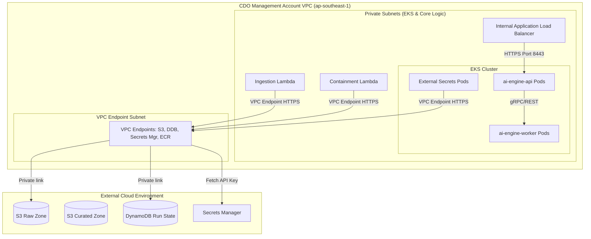

# Security Design - Task Force 2 · FinOps Watch CDO

<!-- Doc owner: CDO Team
     Status: Final (W11 T6 Pack #1) → Updated (W12 T4 Pack #2)
-->

## 1. Network Security

### 1.1 Network Diagram

The CDO platform enforces isolation within a dedicated VPC. All compute resources run in isolated private subnets with no internet gateway route. All AWS API communications and external model endpoint calls occur privately using AWS VPC Endpoints.

The security design assumes two primary trust boundaries: the CDO management account boundary and the member account boundary. Cost data, AI decision payloads, alert payloads, and containment audit records stay inside the CDO-controlled AWS network path. The AIOps-owned AI Engine is reachable only through an internal EKS service endpoint; it does not receive direct credentials for member account containment actions.



*Caption: The EKS cluster, load balancer, and orchestration Lambda functions are deployed within private-only subnets. They utilize dedicated AWS VPC Interface Endpoints (Privatelink) to connect to AWS services, preventing data transmission over the public internet.*

### 1.2 Security Groups

Traffic between compute components is regulated using stateful security groups enforcing the principle of least privilege:

| SG name | Inbound | Outbound | Attached to |
|---|---|---|---|
| `alb-sg` | TCP 443 (from Step Functions / Lambda Client) | TCP 8443 (to `eks-node-sg`) | internal ALB |
| `eks-cluster-sg` | TCP 443 (from CI/CD runner and bastion hosts) | TCP 10250, TCP 53 (to Node groups) | EKS Control Plane |
| `eks-node-sg` | TCP 10250 (from Control Plane), TCP 8443 (from `alb-sg`), TCP/UDP 53 (DNS) | TCP 443 (to `vpce-sg`), TCP 10250, TCP/UDP 53 | EKS managed node groups (On-Demand & Spot) |
| `lambda-sg` | None | TCP 443 (to `vpce-sg`), TCP 443 (to `alb-sg`) | Lambda functions |
| `vpce-sg` | TCP 443 (from `eks-node-sg` and `lambda-sg`) | None | VPC endpoints (S3, DynamoDB, ECR, Secrets Mgr) |

### 1.3 Network ACL / VPC Endpoint

VPC interface endpoints are configured with private DNS enabled, routing all traffic to:
- `com.amazonaws.ap-southeast-1.s3` (Gateway Endpoint)
- `com.amazonaws.ap-southeast-1.dynamodb` (Gateway Endpoint)
- `com.amazonaws.ap-southeast-1.secretsmanager` (Interface Endpoint)
- `com.amazonaws.ap-southeast-1.ecr.api` (Interface Endpoint)
- `com.amazonaws.ap-southeast-1.ecr.dkr` (Interface Endpoint)
- `com.amazonaws.ap-southeast-1.logs` (Interface Endpoint - CloudWatch logs)

Network policies are deployed in the EKS cluster to restrict pod-to-pod communications (e.g., blocking `ai-engine-worker` pods on spot nodes from initiating connections to anything other than the `ai-engine-api` pods).

Endpoint policies are scoped to the smallest practical action set. The S3 gateway endpoint allows reads from approved CUR export prefixes and writes only to the CDO raw/curated buckets. The DynamoDB endpoint allows access only to run-state, idempotency, audit, and dashboard-materialization tables. Interface endpoints for Secrets Manager, ECR, and CloudWatch Logs are restricted to the CDO VPC security groups and execution roles. Network ACLs remain simple and stateless, with public ingress denied and ephemeral return traffic allowed only inside private subnet ranges.

## 2. IAM & Access Control

### 2.1 Service Roles

AWS IAM service roles enforce strict separation. Crucially, no service role has administrative permissions or access to destructive functions on production environments:

| Role | Used by | Permissions |
|---|---|---|
| `FinOpsStepFunctionsRole` | Step Functions | `states:StartExecution`, `states:DescribeExecution`, `lambda:InvokeFunction` |
| `FinOpsCURPullerRole` | `LambdaCURPuller` | `s3:GetObject` (on target account CUR S3 bucket), `s3:PutObject` (on raw S3 bucket), `ce:GetCostAndUsage` |
| `EksClusterRole` | EKS Control Plane | Standard `AmazonEKSClusterPolicy` and `AmazonEKSVPCResourceController` |
| `EksNodeGroupRole` | EC2 Node Instances | `AmazonEKSWorkerNodePolicy`, `AmazonEC2ContainerRegistryReadOnly`, `AmazonEKS_CNI_Policy` |
| `FinOpsContainmentRole` | `LambdaContainment` | `ec2:CreateTags` (non-prod), `asg:UpdateAutoScalingGroup` (non-prod). Explicit deny for `iam:*`, `s3:Delete*`, and prod resource termination. |
| `FinOpsAiApiIamRole` | `ai-engine-api` via IRSA | Read model config, read curated feature inputs, write invocation health metrics; no member account access. |
| `FinOpsAiWorkerIamRole` | `ai-engine-worker` via IRSA | Read curated feature inputs and write batch output/checkpoints; no IAM mutation and no direct containment permissions. |
| `FinOpsExternalSecretsRole` | External Secrets Operator | Read only approved Secrets Manager keys needed by EKS workloads. |

> [!IMPORTANT]
> **Hard Security Boundary**: Every CDO execution role has an attached Service Control Policy (SCP) ensuring it can **NEVER terminate prod, delete data, or modify IAM**. Production containment tasks are strictly restricted to tag, suggest, or dry-run audits.

### 2.2 K8s RBAC & IRSA (IAM Roles for Service Accounts)

Kubernetes Access Control is mapped to AWS IAM using **IAM Roles for Service Accounts (IRSA)**. Pods assume specific IAM roles via OIDC federation rather than inheriting permissions from host EC2 instances.

- **K8s Service Accounts & Roles**:
  - `ai-engine-api-sa`: Federated to `FinOpsAiApiIamRole` with read-only S3 access to fetch model artifacts.
  - `ai-engine-worker-sa`: Federated to `FinOpsAiWorkerIamRole` with read-write access to S3 checkpoint and output buckets.
  - `external-secrets-sa`: Federated to `FinOpsSecretsReaderIamRole` with access only to the model configuration secret in Secrets Manager.

- **RBAC Mapping**:

| Role / ClusterRole | Subject (Service Account) | Namespace | Verbs | Resources |
|---|---|---|---|---|
| `ai-api-role` | `ai-engine-api-sa` | `ai-inference` | `get`, `list`, `watch` | `pods`, `services` |
| `job-runner-role` | `ai-engine-api-sa` | `ai-batch-jobs` | `create`, `get`, `list`, `watch`, `delete` | `jobs`, `cronjobs` |
| `eso-role` | `external-secrets-sa` | `kube-system` | `get`, `list`, `create`, `update` | `secrets` |

### 2.3 Cross-account Access

Cross-account access to member account CUR buckets is governed by target account S3 bucket policies allowing read access to the centralized `FinOpsCURPullerRole` using External IDs.
Containment actions in member accounts are triggered via cross-account IAM Role Assumption (`AssumeRole`). The management account `LambdaContainment` role assumes `FinOpsContainmentWorkerRole` in the target account, executing tag additions or scaling down sandbox ASGs.

Every cross-account role trust policy includes an external ID, source account condition, and session tagging requirement so audit logs can map each action back to a CDO run. Production roles include explicit deny statements for termination, destructive storage operations, and IAM mutation. Non-production roles may allow limited containment actions only when the incoming request includes an approved `execution_mode`, environment tag, anomaly ID, and policy decision ID. If any of those fields are missing, the containment worker records a denied audit event and exits without retrying.

## 3. Secrets Management

### 3.1 Secrets Inventory

The following secrets are stored in AWS Secrets Manager:

| Secret | Storage | Rotation | Accessed by |
|---|---|---|---|
| `finops/ai-engine/api-key` | AWS Secrets Manager (KMS CMK encrypted) | 30 days automatic | `ai-engine-api` pod (via External Secrets Operator) |
| `finops/dashboard/db-creds` | AWS Secrets Manager | 60 days automatic | QuickSight dataset engine / Athena crawler |
| `finops/alerting/slack-webhook` | AWS Secrets Manager | 90 days manual | `LambdaAlertRouting` |
| `finops/ai-engine/contract-signing-key` | AWS Secrets Manager | 90 days automatic | Step Functions validation Lambda and `ai-engine-api` |
| `finops/containment/external-id-seed` | AWS Secrets Manager | Manual rotation on incident | Containment role provisioning workflow |

### 3.2 Inject Pattern

We use the **External Secrets Operator (ESO)** in EKS to sync secrets from AWS Secrets Manager into Kubernetes native Secrets. The secrets are mounted as read-only files within tmpfs volumes in the containers.
```yaml
apiVersion: external-secrets.io/v1beta1
kind: ExternalSecret
metadata:
  name: ai-engine-api-key
  namespace: ai-inference
spec:
  refreshInterval: 1h
  secretStoreRef:
    name: aws-secretsmanager-store
    kind: SecretStore
  target:
    name: k8s-ai-api-key
    creationPolicy: Owner
  data:
    - secretKey: api-key
      remoteRef:
        key: finops/ai-engine/api-key
        property: apiKey
```
For Lambda functions, secrets are resolved during function cold-starts, cached in the `/tmp` memory directory, and validated with cache TTL policies to avoid direct API invocation overhead.

The injection path intentionally differs by runtime. Lambda functions read secrets directly through the Secrets Manager SDK because they are short-lived adapters. EKS workloads receive secrets through ESO so Kubernetes manifests never contain plaintext values. Terraform creates secret containers and IAM permissions, but it does not store secret values in `.tfvars`, Terraform state, Helm values, or GitOps manifests.

### 3.3 Anti-leak Controls

- **CI/CD Scanning**: Gitleaks is integrated into GitHub Actions pipelines, blocking PR merges if plain-text credentials or key headers are detected.
- **VPC Endpoint Restriction**: Secrets Manager VPC Endpoints enforce policies restricting access to only the CDO management VPC CIDR.
- **Log Redaction**: Outbound application logs are passed through a regex-based masking filter, replacing API keys, tokens, and authorization headers with `[REDACTED]`.
- **Terraform State Control**: Terraform state is encrypted, access-controlled, and reviewed so sensitive values are modeled as secret references rather than plaintext outputs.
- **Container Boundary**: EKS workloads run as non-root, mount secrets read-only, and avoid writing secret material to persistent volumes or checkpoints.
- **Incident Response**: Suspected secret exposure triggers secret rotation, Git history review, CloudTrail lookup for `GetSecretValue`, and temporary suspension of affected deployment credentials.

## 4. Encryption

### 4.1 At Rest

All platform data is encrypted at rest using Customer Managed Keys (CMKs) in AWS KMS:

| Data | Storage | KMS key | Notes |
|---|---|---|---|
| Raw/Curated Cost Data | S3 | `aws/s3` or custom CMK | S3 Bucket Key enabled to reduce KMS API costs. |
| Run State & Metadata | DynamoDB | `aws/dynamodb` or custom CMK | Encrypted using KMS. |
| Secrets Store | Secrets Manager | `finops-secrets-key` | Decryption requires role trust. |
| Node Disk Volumes | EC2 EBS (EKS Nodes) | `finops-ebs-key` | All node storage volumes are encrypted. |
| Audit Trail Logs | S3 Object Lock | `finops-audit-key` | Retained for 90 days with compliance lock. |

### 4.2 In Transit

- **TLS Requirements**: All ingress and egress traffic requires TLS 1.3 (with TLS 1.2 as a minimum fallback). Weak ciphers are disabled on the internal ALB.
- **Internal Service Traffic**: EKS pod-to-pod communications for API-to-worker traffic use HTTP/2 with mTLS via Linkerd/App Mesh (or Kubernetes internal ClusterIP services mapped to TLS endpoints).
- **AI Engine Calls**: Step Functions and Lambda invoke the internal AI Engine endpoint through private networking only. The request includes a contract version and correlation ID, and the response is rejected if the signature, schema, or required fields are invalid.
- **Alert Webhooks**: Slack or email integrations are called from the alerting Lambda after payload minimization. Sensitive cost evidence is linked through internal dashboard/audit references instead of embedded directly in external messages.

### 4.3 Key Management

- **Rotation**: CMK keys rotate automatically every 365 days.
- **Access Policies**: Key policies enforce separation of duties, ensuring only the deployment pipelines can modify key settings, and only execution roles (Lambda/EKS) can call decrypt operations.
- **Audit**: All key usage is monitored and logged in AWS CloudTrail.
- **Blast-radius control**: Separate CMKs are preferred for cost data, audit records, secrets, and EKS node volumes unless Finance and Security approve consolidation for cost reasons.
- **Break-glass access**: Manual decrypt access is not granted to day-to-day developers. Temporary access requires incident approval, ticket reference, expiry time, and post-use review.

## 5. Audit Logging

### 5.1 What to Log

Every action taken by the CDO platform is documented. For containment actions, the following schema is logged to the centralized database and S3:
```json
{
  "actor": "cdo-platform-orchestrator",
  "timestamp": "2026-06-23T07:20:00Z",
  "correlation_id": "corr-uuid-4444-5555-6666",
  "idempotency_key": "123456789012:2026-06-22T00:00:00Z",
  "anomaly_id": "anom-9988-7766",
  "resource_owner": "squad-prediction-models",
  "resource_id": "arn:aws:ec2:ap-southeast-1:123456789012:instance/i-0abcdef123456",
  "before_state": {
    "instance_type": "g5.4xlarge",
    "status": "running",
    "tags": {
      "Environment": "sandbox"
    }
  },
  "proposed_after_state": {
    "tags": {
      "Environment": "sandbox",
      "FinOpsWatch": "ReviewRequired",
      "AnomalyDetected": "true"
    }
  },
  "execution_mode": "dry-run",
  "rollback_path": {
    "action": "remove_tags",
    "keys": ["FinOpsWatch", "AnomalyDetected"]
  },
  "approval_status": "pending_squad_response",
  "retention_location": "s3://cdo-audit-trail-bucket/audit/year=2026/month=06/",
  "retention_period_days": 90
}
```

The audit record is written before any apply-mode operation is attempted, and it is updated after the operation with the final status. Dry-run operations still produce audit records because Finance needs to see what the platform would have done and why the action remained safe. AI model training datasets are not logged by CDO; CDO logs only invocation metadata, returned decision fields, and operational evidence references needed for alerting and containment.

### 5.2 Storage + Retention

Audit logs are stored securely with immutable controls:

| Log type | Storage | Retention | Query interface |
|---|---|---|---|
| Containment Audits | S3 + Object Lock | 90 days minimum | Athena / DynamoDB |
| AWS API Calls | CloudTrail (S3 Raw) | 1 year | Athena |
| EKS Cluster Logs | CloudWatch Logs | 30 days | CloudWatch Logs Insights |
| App/Lambda Logs | CloudWatch Logs | 14 days | CloudWatch Logs Insights |

Containment audit storage is append-only by design. DynamoDB supports low-latency dashboard lookup, while S3 with Object Lock is the durable evidence store. The dashboard should link to the audit record ID rather than duplicating sensitive before/after state in alert messages. Retention shorter than 90 days is not allowed for containment records, even in sandbox, because the capstone requirement measures traceability of automated decisions.

### 5.3 Synthetic Data Handling

To prevent mixing synthetic anomaly logs with real account settings during testing:
- CDO-owned demo injections are marked with `source = "synthetic-demo"`.
- QuickSight dashboard filters allow toggling between real and synthetic data displays.
- Synthetic containment actions are routed to a mock target endpoint, leaving real AWS resources untouched.
- AIOps-owned model training, enhancement, and backtest datasets remain outside CDO ownership. CDO may store AIOps-provided model metrics as integration evidence, but it does not copy or reclassify the AI team's training dataset as CDO operational data.

## 6. CI Security Controls

- **Image & Dependency Scanning**: Trivy is integrated into the CI/CD pipeline. Build actions fail automatically if container images contain `CRITICAL` or `HIGH` severity CVEs.
- **Non-Root Execution**: Container configurations enforce running workloads as a non-root user (`securityContext.runAsNonRoot: true`).
- **Pod Security Standards**: EKS namespaces are configured with Pod Security Admission (PSA) set to `restricted` mode, preventing privileged escalations, host network binding, and unsafe system calls.
- **Spot Workload Isolation**: Worker pods running batch tasks are scheduled with node selectors, tolerations, and node affinity rules, ensuring they compile and compute exclusively on designated spot node instances, avoiding resource starvation on stable service nodes.

## 7. Compliance Touchpoints

| Standard | Relevant controls (capstone scope) |
|---|---|
| **SOC 2 Type II** | Least privilege IAM roles, VPC private network boundaries, Secrets Manager rotation, encrypted S3 buckets. |
| **ISO 27001** | Weekly access audit reports, immutable containment logs, automatic key rotation. |
| **HIPAA** | Out of scope (Cost billing data contains no Protected Health Information). |

The compliance mapping is intentionally limited to capstone-relevant controls. The platform handles billing and operational metadata, not customer application payloads, but the data still reveals account structure, resource usage, and owner tags. That makes least privilege, audit retention, encryption, and alert minimization mandatory even when no regulated customer data is present.

## 8. Open Questions

- [ ] **Cross-Account KMS Strategy**: Should we use a centralized KMS key with cross-account access, or local target account keys for CUR S3 bucket encryption?
- [ ] **Operator Notification Channels**: When a containment action is denied, should the platform escalate alerts via PagerDuty or direct Slack webhook notifications?
- [ ] **External Alert Redaction**: Which cost fields are allowed in Slack/email, and which must remain dashboard-only?
- [ ] **Break-glass Approver**: Who approves temporary decrypt or production investigation access during an incident?

## Related documents

- [`02_infra_design.md`](02_infra_design.md) - Architecture design, VPC layout, and managed node groups.
- [`04_deployment_design.md`](04_deployment_design.md) - CI/CD pipeline, GitOps orchestration, and secret rotation gates.
