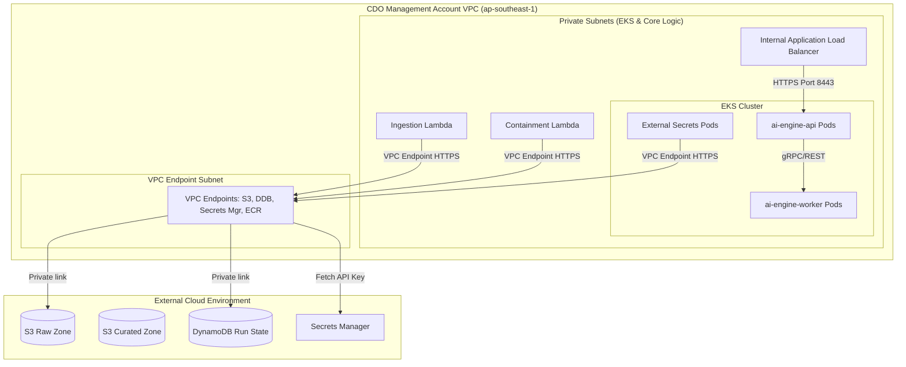

# Thiết kế Bảo mật (Security Design) - Task Force 2 · FinOps Watch CDO

<!-- Doc owner: CDO Team
     Status: Final (W11 T6 Pack #1) → Updated (W12 T4 Pack #2)
-->

## 1. Network Security

### 1.1 Network Diagram

CDO platform áp dụng nguyên tắc cô lập chặt chẽ bên trong một VPC chuyên biệt. Tất cả các tài nguyên compute đều chạy trong các private subnets không có route đi ra internet gateway. Mọi luồng giao tiếp với AWS API và các cuộc gọi API bên ngoài đều được định tuyến nội bộ qua AWS VPC Endpoints.



*Caption: Cụm EKS, load balancer, và các hàm Lambda điều phối được triển khai trong các subnets chỉ có quyền private. Các thành phần này sử dụng các AWS VPC Interface Endpoints (Privatelink) riêng biệt để kết nối tới các dịch vụ AWS, ngăn chặn mọi luồng truyền tải dữ liệu qua mạng internet công cộng.*

### 1.2 Security Groups

Luồng traffic giữa các thành phần compute được kiểm soát thông qua các stateful security groups tuân thủ nguyên tắc đặc quyền tối thiểu:

| SG name | Inbound | Outbound | Attached to |
|---|---|---|---|
| `alb-sg` | TCP 443 (từ Step Functions / Lambda Client) | TCP 8443 (đến `eks-node-sg`) | internal ALB |
| `eks-cluster-sg` | TCP 443 (từ CI/CD runner và bastion hosts) | TCP 10250, TCP 53 (đến Node groups) | EKS Control Plane |
| `eks-node-sg` | TCP 10250 (từ Control Plane), TCP 8443 (từ `alb-sg`), TCP/UDP 53 (DNS) | TCP 443 (đến `vpce-sg`), TCP 10250, TCP/UDP 53 | EKS managed node groups (On-Demand & Spot) |
| `lambda-sg` | None | TCP 443 (đến `vpce-sg`), TCP 443 (đến `alb-sg`) | Lambda functions |
| `vpce-sg` | TCP 443 (từ `eks-node-sg` và `lambda-sg`) | None | VPC endpoints (S3, DynamoDB, ECR, Secrets Mgr) |

### 1.3 Network ACL / VPC Endpoint

Các VPC interface endpoints được cấu hình bật tính năng Private DNS, định tuyến toàn bộ traffic đến:
- `com.amazonaws.ap-southeast-1.s3` (Gateway Endpoint)
- `com.amazonaws.ap-southeast-1.dynamodb` (Gateway Endpoint)
- `com.amazonaws.ap-southeast-1.secretsmanager` (Interface Endpoint)
- `com.amazonaws.ap-southeast-1.ecr.api` (Interface Endpoint)
- `com.amazonaws.ap-southeast-1.ecr.dkr` (Interface Endpoint)
- `com.amazonaws.ap-southeast-1.logs` (Interface Endpoint - CloudWatch logs)

Network policies được triển khai trong cụm EKS để giới hạn kết nối giữa các pod (ví dụ: chặn các pod `ai-engine-worker` trên các spot nodes khởi tạo kết nối đến bất kỳ tài nguyên nào ngoại trừ các pod `ai-engine-api`).

## 2. IAM & Access Control

### 2.1 Service Roles

Các IAM service roles trong AWS thực thi sự phân tách trách nhiệm nghiêm ngặt. Đặc biệt, không có service role nào có quyền admin hoặc quyền thực hiện các tác vụ phá hủy trên môi trường production:

| Role | Used by | Permissions |
|---|---|---|
| `FinOpsStepFunctionsRole` | Step Functions | `states:StartExecution`, `states:DescribeExecution`, `lambda:InvokeFunction` |
| `FinOpsCURPullerRole` | `LambdaCURPuller` | `s3:GetObject` (trên CUR S3 bucket của tài khoản đích), `s3:PutObject` (trên raw S3 bucket), `ce:GetCostAndUsage` |
| `EksClusterRole` | EKS Control Plane | Cấu hình standard `AmazonEKSClusterPolicy` và `AmazonEKSVPCResourceController` |
| `EksNodeGroupRole` | EC2 Node Instances | `AmazonEKSWorkerNodePolicy`, `AmazonEC2ContainerRegistryReadOnly`, `AmazonEKS_CNI_Policy` |
| `FinOpsContainmentRole` | `LambdaContainment` | `ec2:CreateTags` (non-prod), `asg:UpdateAutoScalingGroup` (non-prod). Cấu hình explicit deny cho các quyền `iam:*`, `s3:Delete*`, và xóa tài nguyên prod. |

> [!IMPORTANT]
> **Ranh giới Bảo mật Cứng**: Mọi role thực thi của CDO đều đi kèm một Service Control Policy (SCP) để đảm bảo hệ thống **NEVER terminate prod, delete data, hoặc modify IAM**. Các tác vụ containment trên production chỉ giới hạn ở mức tag, suggest, hoặc dry-run kiểm toán.

### 2.2 K8s RBAC & IRSA (IAM Roles for Service Accounts)

Cơ chế phân quyền trong Kubernetes được ánh xạ tới các AWS IAM roles thông qua tính năng **IAM Roles for Service Accounts (IRSA)**. Các pod sẽ assume các IAM role cụ thể qua liên kết OIDC thay vì kế thừa quyền từ các thực thể máy chủ EC2.

- **K8s Service Accounts & Roles**:
  - `ai-engine-api-sa`: Được liên kết với `FinOpsAiApiIamRole` cấp quyền read-only trên S3 để tải model artifacts.
  - `ai-engine-worker-sa`: Được liên kết với `FinOpsAiWorkerIamRole` cấp quyền read-write trên các S3 checkpoint và output buckets.
  - `external-secrets-sa`: Được liên kết với `FinOpsSecretsReaderIamRole` chỉ có quyền đọc các model configuration secret trong Secrets Manager.

- **RBAC Mapping**:

| Role / ClusterRole | Subject (Service Account) | Namespace | Verbs | Resources |
|---|---|---|---|---|
| `ai-api-role` | `ai-engine-api-sa` | `ai-inference` | `get`, `list`, `watch` | `pods`, `services` |
| `job-runner-role` | `ai-engine-api-sa` | `ai-batch-jobs` | `create`, `get`, `list`, `watch`, `delete` | `jobs`, `cronjobs` |
| `eso-role` | `external-secrets-sa` | `kube-system` | `get`, `list`, `create`, `update` | `secrets` |

### 2.3 Cross-account Access

Quyền truy cập chéo tài khoản (cross-account) tới các CUR buckets của tài khoản thành viên được quản lý bởi S3 bucket policies tại tài khoản đích, cho phép quyền đọc đối với `FinOpsCURPullerRole` tập trung thông qua External IDs.
Các hành động containment tại các tài khoản thành viên được kích hoạt thông qua cơ chế Assume IAM Role chéo tài khoản (`AssumeRole`). Role `LambdaContainment` tại tài khoản quản trị (management account) sẽ assume role `FinOpsContainmentWorkerRole` tại tài khoản đích, thực hiện gắn thẻ tag hoặc scale down các sandbox ASGs.

## 3. Secrets Management

### 3.1 Secrets Inventory

Các secret sau đây được lưu trữ trong AWS Secrets Manager:

| Secret | Storage | Rotation | Accessed by |
|---|---|---|---|
| `finops/ai-engine/api-key` | AWS Secrets Manager (mã hóa qua KMS CMK) | Tự động mỗi 30 ngày | Pod `ai-engine-api` (qua External Secrets Operator) |
| `finops/dashboard/db-creds` | AWS Secrets Manager | Tự động mỗi 60 ngày | QuickSight dataset engine / Athena crawler |
| `finops/alerting/slack-webhook` | AWS Secrets Manager | Thủ công mỗi 90 ngày | `LambdaAlertRouting` |

### 3.2 Inject Pattern

Chúng tôi sử dụng **External Secrets Operator (ESO)** trong EKS để đồng bộ secrets từ AWS Secrets Manager vào native Kubernetes Secrets. Các secrets này được mount dưới dạng các tệp read-only bên trong các phân vùng bộ nhớ tmpfs của container.
```yaml
apiVersion: external-secrets.io/v1beta1
kind: ExternalSecret
metadata:
  name: ai-engine-api-key
  namespace: ai-inference
spec:
  refreshInterval: 1h
  secretStoreRef:
    name: aws-secretsmanager-store
    kind: SecretStore
  target:
    name: k8s-ai-api-key
    creationPolicy: Owner
  data:
    - secretKey: api-key
      remoteRef:
        key: finops/ai-engine/api-key
        property: apiKey
```
Đối với các hàm Lambda, các secrets được truy xuất và phân giải trong quá trình cold-start, cache lại trong thư mục bộ nhớ tạm `/tmp` của function, và được kiểm tra hợp lệ theo các chính sách TTL cache để tránh gọi API trực tiếp quá nhiều.

### 3.3 Anti-leak Controls

- **CI/CD Scanning**: Gitleaks được tích hợp vào pipeline GitHub Actions, chặn merge các PR nếu phát hiện các thông tin xác thực ở dạng plain-text hoặc các API key.
- **VPC Endpoint Restriction**: Các chính sách (policies) trên Secrets Manager VPC Endpoints giới hạn quyền truy cập chỉ cho phép từ dải mạng CIDR của VPC quản trị CDO.
- **Log Redaction**: Toàn bộ nhật ký hoạt động đầu ra của ứng dụng được chạy qua bộ lọc regex để che giấu các thông tin nhạy cảm, thay thế các API keys, tokens, và các header authorization bằng nhãn `[REDACTED]`.

## 4. Encryption

### 4.1 At Rest

Toàn bộ dữ liệu của hệ thống được mã hóa tại chỗ (at rest) sử dụng Customer Managed Keys (CMKs) trong dịch vụ AWS KMS:

| Dữ liệu (Data) | Nơi lưu trữ (Storage) | KMS key | Ghi chú |
|---|---|---|---|
| Dữ liệu chi phí Raw/Curated | S3 | `aws/s3` hoặc CMK tùy chỉnh | Bật tính năng S3 Bucket Key để giảm thiểu chi phí gọi KMS API. |
| Run State & Metadata | DynamoDB | `aws/dynamodb` hoặc CMK tùy chỉnh | Mã hóa sử dụng KMS. |
| Secrets Store | Secrets Manager | `finops-secrets-key` | Việc giải mã yêu cầu chính sách role trust rõ ràng. |
| Node Disk Volumes | EC2 EBS (EKS Nodes) | `finops-ebs-key` | Toàn bộ dung lượng lưu trữ của node được mã hóa. |
| Nhật ký kiểm toán (Audit Logs) | S3 Object Lock | `finops-audit-key` | Lưu trữ tối thiểu 90 ngày với compliance lock. |

### 4.2 In Transit

- **Yêu cầu TLS**: Tất cả traffic đi vào và đi ra đều yêu cầu mã hóa TLS 1.3 (với TLS 1.2 là phiên bản tối thiểu được chấp nhận). Các cipher suites yếu đều bị vô hiệu hóa trên internal ALB.
- **Traffic nội bộ**: Giao tiếp giữa các pod trong EKS (như traffic giữa API và worker) sử dụng giao thức HTTP/2 mã hóa mTLS qua Linkerd/App Mesh (hoặc sử dụng các Kubernetes internal ClusterIP services được cấu hình TLS endpoint).

### 4.3 Key Management

- **Chu kỳ xoay vòng (Rotation)**: Các khóa CMK tự động xoay vòng mỗi 365 ngày.
- **Access Policies**: Các key policies thực thi phân tách nhiệm vụ, đảm bảo chỉ có các pipeline CI/CD mới có quyền thay đổi cấu hình key, và chỉ có các role thực thi (Lambda/EKS) mới có quyền gọi các hàm giải mã (decrypt).
- **Kiểm toán (Audit)**: Toàn bộ lịch sử sử dụng key được theo dõi và ghi lại qua AWS CloudTrail.

## 5. Audit Logging

### 5.1 What to Log

Mọi hành động kiểm soát do CDO platform thực hiện đều được ghi chép lại. Đối với các hành động containment, schema log sau sẽ được lưu trữ vào cơ sở dữ liệu và S3:
```json
{
  "actor": "cdo-platform-orchestrator",
  "timestamp": "2026-06-23T07:20:00Z",
  "correlation_id": "corr-uuid-4444-5555-6666",
  "idempotency_key": "123456789012:2026-06-22T00:00:00Z",
  "anomaly_id": "anom-9988-7766",
  "resource_owner": "squad-prediction-models",
  "resource_id": "arn:aws:ec2:ap-southeast-1:123456789012:instance/i-0abcdef123456",
  "before_state": {
    "instance_type": "g5.4xlarge",
    "status": "running",
    "tags": {
      "Environment": "sandbox"
    }
  },
  "proposed_after_state": {
    "tags": {
      "Environment": "sandbox",
      "FinOpsWatch": "ReviewRequired",
      "AnomalyDetected": "true"
    }
  },
  "execution_mode": "dry-run",
  "rollback_path": {
    "action": "remove_tags",
    "keys": ["FinOpsWatch", "AnomalyDetected"]
  },
  "approval_status": "pending_squad_response",
  "retention_location": "s3://cdo-audit-trail-bucket/audit/year=2026/month=06/",
  "retention_period_days": 90
}
```

### 5.2 Storage + Retention

Nhật ký kiểm toán được lưu trữ bảo mật với các cấu hình chống ghi đè:

| Loại Log (Log type) | Nơi lưu trữ | Retention | Giao diện truy vấn |
|---|---|---|---|
| Containment Audits | S3 + Object Lock | Tối thiểu 90 ngày | Athena / DynamoDB |
| AWS API Calls | CloudTrail (S3 Raw) | 1 năm | Athena |
| EKS Cluster Logs | CloudWatch Logs | 30 ngày | CloudWatch Logs Insights |
| App/Lambda Logs | CloudWatch Logs | 14 ngày | CloudWatch Logs Insights |

### 5.3 Synthetic Data Handling

Để tránh trộn lẫn dữ liệu hóa đơn tổng hợp (synthetic logs) với các cấu hình thực tế trong quá trình kiểm thử:
- Toàn bộ dữ liệu synthetic cost khi inject được đánh dấu `source = "synthetic"`.
- Bộ lọc trên dashboard QuickSight cho phép bật/tắt giữa hiển thị dữ liệu thực tế và dữ liệu giả lập.
- Các hành động containment giả lập được định tuyến đến một mock endpoint, giữ nguyên tài nguyên AWS thực tế không bị ảnh hưởng.

## 6. CI Security Controls

- **Quét Image & Dependency**: Trivy được tích hợp trực tiếp vào pipeline CI/CD. Tác vụ build sẽ tự động dừng nếu container image chứa các mã lỗi bảo mật CVE mức độ `CRITICAL` hoặc `HIGH`.
- **Chạy quyền Non-Root**: Cấu hình container bắt buộc chạy ứng dụng dưới quyền user non-root (`securityContext.runAsNonRoot: true`).
- **Pod Security Standards**: Các namespace trong EKS được cấu hình chế độ Pod Security Admission (PSA) ở mức `restricted`, ngăn chặn các quyền leo thang đặc quyền, gắn host network, và gọi các system call không an toàn.
- **Cô lập Spot Workload**: Các pod chạy tác vụ batch được lên lịch với node selectors, tolerations, và node affinity, đảm bảo chúng chỉ chạy trên các spot instances EC2 được chỉ định, tránh gây thiếu hụt tài nguyên cho các pod API chạy ổn định trên các on-demand nodes.

## 7. Compliance Touchpoints

| Standard | Relevant controls (capstone scope) |
|---|---|
| **SOC 2 Type II** | IAM least privilege, VPC private network boundaries, Secrets Manager rotation, encrypted S3 buckets. |
| **ISO 27001** | Báo cáo rà soát truy cập hàng tuần, nhật ký containment không thể sửa đổi, tự động xoay KMS key. |
| **HIPAA** | Nằm ngoài phạm vi (Dữ liệu hóa đơn chi phí không chứa thông tin sức khỏe cá nhân PHI). |

## 8. Open Questions

- [ ] **Cross-Account KMS Strategy**: Nên sử dụng KMS key tập trung với chính sách chia sẻ chéo tài khoản, hay sử dụng KMS key cục bộ tại mỗi tài khoản đích để mã hóa S3 CUR bucket?
- [ ] **Operator Notification Channels**: Khi một hành động containment bị từ chối, hệ thống nên gửi cảnh báo qua PagerDuty hay gửi trực tiếp về kênh Slack của đội bảo mật?

## Related documents

- [`02_infra_design_vi.md`](02_infra_design_vi.md) - Thiết kế kiến trúc, layout VPC, và managed node groups.
- [`04_deployment_design_vi.md`](04_deployment_design_vi.md) - Pipeline CI/CD, cơ chế GitOps, và chu kỳ xoay Secrets.
