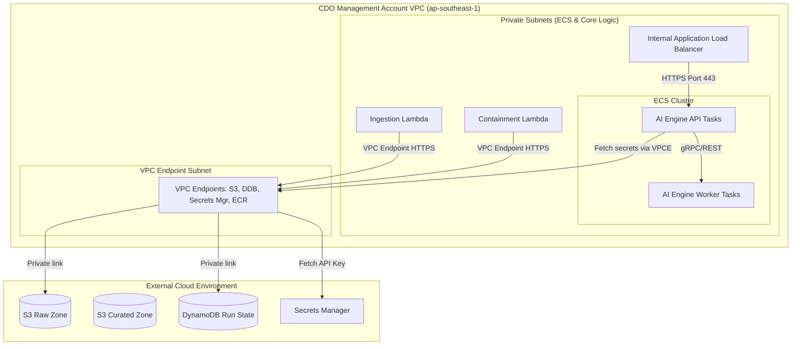

# Thiết kế Bảo mật (Security Design) - Task Force 2 · FinOps Watch CDO

<!-- Doc owner: CDO Team
     Status: Final (W11 T6 Pack #1) -> Updated (W12 T4 Pack #2)
-->

## 1. Network Security

### 1.1 Network Diagram

CDO platform áp dụng nguyên tắc cô lập chặt chẽ bên trong một VPC chuyên biệt. Tất cả các tài nguyên compute đều chạy trong các private subnets không có route đi ra internet gateway. Mọi luồng giao tiếp với AWS API và các cuộc gọi API bên ngoài đều được định tuyến nội bộ qua AWS VPC Endpoints.

Thiết kế bảo mật giả định hai ranh giới tin cậy chính: ranh giới tài khoản quản trị CDO và ranh giới tài khoản thành viên. Dữ liệu chi phí, payload quyết định của AI, payload cảnh báo và bản ghi kiểm toán containment đều nằm trong đường dẫn mạng AWS do CDO kiểm soát. Endpoint AI Engine dùng chung do AIOps cung cấp trên ECS Fargate (cluster 'tf-2-aiops-cluster') được expose nội bộ tới các nền tảng CDO (cả CDO-01 và CDO-02) dưới dạng một endpoint dịch vụ dùng chung duy nhất được truy cập tại `https://ai-engine.tf-2.internal/` thông qua xác thực IAM SigV4. AI Engine không nhận thông tin xác thực trực tiếp để thực hiện hành động containment trên tài khoản thành viên.



*Caption: Cụm ECS, internal ALB, và các hàm Lambda điều phối được triển khai trong các subnets chỉ có quyền private. Các thành phần này sử dụng các AWS VPC Interface Endpoints (Privatelink) riêng biệt để kết nối tới các dịch vụ AWS, ngăn chặn mọi luồng truyền tải dữ liệu qua mạng internet công cộng. Endpoint AI Engine dùng chung trên ECS được truy cập qua `https://ai-engine.tf-2.internal/` bằng xác thực IAM SigV4.*

### 1.2 Security Groups

Luồng traffic giữa các thành phần compute được kiểm soát thông qua các stateful security groups tuân thủ nguyên tắc đặc quyền tối thiểu:

| SG name | Inbound | Outbound | Attached to |
|---|---|---|---|
| `alb-sg` | TCP 443 (từ Step Functions / Lambda Client) | TCP 80/443 (đến `ecs-tasks-sg`) | internal ALB |
| `ecs-tasks-sg` | TCP 80/443 (từ `alb-sg`), TCP/UDP 53 (DNS) | TCP 443 (đến `vpce-sg`), TCP/UDP 53 | ECS Fargate tasks (always-on & Spot) |
| `lambda-sg` | None | TCP 443 (đến `vpce-sg`), TCP 443 (đến `alb-sg`) | Lambda functions |
| `vpce-sg` | TCP 443 (từ `ecs-tasks-sg` và `lambda-sg`) | None | VPC endpoints (S3, DynamoDB, ECR, Secrets Mgr) |

### 1.3 Network ACL / VPC Endpoint

Các VPC interface endpoints được cấu hình bật tính năng Private DNS, định tuyến toàn bộ traffic đến:
- `com.amazonaws.ap-southeast-1.s3` (Gateway Endpoint)
- `com.amazonaws.ap-southeast-1.dynamodb` (Gateway Endpoint)
- `com.amazonaws.ap-southeast-1.secretsmanager` (Interface Endpoint)
- `com.amazonaws.ap-southeast-1.ecr.api` (Interface Endpoint)
- `com.amazonaws.ap-southeast-1.ecr.dkr` (Interface Endpoint)
- `com.amazonaws.ap-southeast-1.logs` (Interface Endpoint - CloudWatch logs)

Security groups được triển khai trong cụm ECS để giới hạn kết nối giữa các task (ví dụ: chặn các task AI Engine Worker Tasks trên các Fargate Spot tasks khởi tạo kết nối đến bất kỳ tài nguyên nào ngoại trừ internal ALB hoặc các endpoint dịch vụ trực tiếp).

Các chính sách endpoint được thu hẹp phạm vi vào tập hợp hành động thực tế nhỏ nhất. S3 gateway endpoint cho phép đọc từ các tiền tố xuất CUR đã phê duyệt và chỉ ghi vào các bucket raw/curated của CDO. DynamoDB endpoint chỉ cho phép truy cập vào các bảng run-state, idempotency, kiểm toán và bảng materialized hiển thị của dashboard. Các interface endpoint dành cho Secrets Manager, ECR và CloudWatch Logs bị giới hạn trong các security group của VPC CDO và các role thực thi. Các Network ACL duy trì tính đơn giản và không trạng thái (stateless), với lượt truy cập công cộng bị từ chối và lưu lượng phản hồi tạm thời chỉ được phép trong phạm vi private subnet.

## 2. IAM & Access Control

### 2.1 Service Roles

Các IAM service roles trong AWS thực thi sự phân tách trách nhiệm nghiêm ngặt. Đặc biệt, không có service role nào có quyền admin hoặc quyền thực hiện các tác vụ phá hủy trên môi trường production:

| Role | Used by | Permissions |
|---|---|---|
| `FinOpsStepFunctionsRole` | Step Functions | `states:StartExecution`, `states:DescribeExecution`, `lambda:InvokeFunction` |
| `FinOpsCURPullerRole` | `LambdaCURPuller` | `s3:GetObject` (trên CUR S3 bucket của tài khoản đích), `s3:PutObject` (trên raw S3 bucket), `ce:GetCostAndUsage` |
| `FinOpsTaskExecutionRole` | ECS Agent | `ecr:GetAuthorizationToken`, `ecr:BatchCheckLayerAvailability`, `ecr:GetDownloadUrlForLayer`, `ecr:BatchGetImage`, `secretsmanager:GetSecretValue` (để map container secret) |
| `FinOpsAiApiIamRole` | AI Engine API task role | Đọc cấu hình mô hình, đọc đầu vào đặc trưng curated, ghi các chỉ số sức khỏe lệnh gọi; không có quyền truy cập tài khoản thành viên. |
| `FinOpsAiWorkerIamRole` | AI Engine Worker task role | Đọc đầu vào đặc trưng curated và ghi đầu ra batch/checkpoint; không có thay đổi IAM và không có quyền containment trực tiếp. |
| `FinOpsContainmentRole` | `LambdaContainment` | `ec2:CreateTags` (non-prod), `asg:UpdateAutoScalingGroup` (non-prod). Cấu hình explicit deny cho các quyền `iam:*`, `s3:Delete*`, và xóa tài nguyên prod. |

> [!IMPORTANT]
> **Ranh giới Bảo mật Cứng**: Mọi role thực thi của CDO đều đi kèm một Service Control Policy (SCP) để đảm bảo hệ thống **NEVER terminate prod, delete data, hoặc modify IAM**. Các tác vụ containment trên production chỉ giới hạn ở mức tag, suggest, hoặc dry-run kiểm toán.

### 2.2 ECS Task Role & ECS Task Execution Role

Các tác vụ ECS Fargate sử dụng hai loại IAM role riêng biệt để thực thi nguyên tắc đặc quyền tối thiểu:
1. **ECS Task Execution Role** (`FinOpsTaskExecutionRole`): Được sử dụng bởi ECS container agent để xác thực với ECR để kéo Docker images và truy vấn Secrets Manager để phân giải các ánh xạ secret trong task definition.
2. **ECS Task Role** (`FinOpsAiApiIamRole`, `FinOpsAiWorkerIamRole`): Được sử dụng bởi mã ứng dụng chạy trong container để thực hiện các cuộc gọi AWS API, chẳng hạn như đọc từ S3 hoặc viết số liệu vào CloudWatch, cô lập các đặc quyền container. Đội ngũ CDO sở hữu việc triển khai hạ tầng host, task execution role và task IAM role, trong khi đội AIOps cung cấp các container image được gắn phiên bản.

Workloads không kế thừa quyền IAM từ các thực thể máy chủ EC2. Mỗi task của dịch vụ được liên kết rõ ràng với task role tương ứng trong ECS task definition.

- **ECS Task Mappings**:

| Service/Task Name | Task Execution Role | Task Role | Managed Policies / Custom Scoped Policies |
|---|---|---|---|
| AI Engine API Tasks | `FinOpsTaskExecutionRole` | `FinOpsAiApiIamRole` | Quyền đọc S3 (model artifacts), CloudWatch ghi metric. |
| `ai-engine-explainer` | `FinOpsTaskExecutionRole` | `FinOpsAiApiIamRole` | Quyền đọc S3, CloudWatch ghi metric. |
| AI Engine Worker Tasks | `FinOpsTaskExecutionRole` | `FinOpsAiWorkerIamRole` | Quyền đọc-ghi S3 (checkpoint & features), SQS đọc/ghi. |

### 2.3 Cross-account Access

Quyền truy cập chéo tài khoản (cross-account) tới các CUR buckets của tài khoản thành viên được quản lý bởi S3 bucket policies tại tài khoản đích, cho phép quyền đọc đối với `FinOpsCURPullerRole` tập trung thông qua External IDs.
Các hành động containment tại các tài khoản thành viên được kích hoạt thông qua cơ chế Assume IAM Role chéo tài khoản (`AssumeRole`). Role `LambdaContainment` tại tài khoản quản trị (management account) sẽ assume role `FinOpsContainmentWorkerRole` tại tài khoản đích, thực hiện gắn thẻ tag hoặc scale down các sandbox ASGs.

Mỗi chính sách tin cậy role chéo tài khoản đều bao gồm một ID bên ngoài (external ID), điều kiện tài khoản nguồn và yêu cầu gắn thẻ session để nhật ký kiểm toán có thể ánh xạ từng hành động trở lại lượt chạy CDO. Các role trên production bao gồm các tuyên bố từ chối rõ ràng (explicit deny) đối với việc kết thúc tài nguyên, các hoạt động lưu trữ có tính chất phá hủy và thay đổi IAM. Các role trên non-production có thể cho phép các hành động containment hạn chế chỉ khi yêu cầu gửi đến bao gồm một `execution_mode` đã được phê duyệt, tag môi trường, mã bất thường (anomaly ID) và ID quyết định chính sách. Nếu bất kỳ trường nào trong số đó bị thiếu, containment worker sẽ ghi lại một sự kiện kiểm toán bị từ chối và thoát ra mà không thử lại.

## 3. Secrets Management

### 3.1 Secrets Inventory

Các secret sau đây được lưu trữ trong AWS Secrets Manager:

| Secret | Storage | Rotation | Accessed by |
|---|---|---|---|
| `finops/ai-engine/api-key` | AWS Secrets Manager (mã hóa qua KMS CMK) | Tự động mỗi 30 ngày | ECS Task Agent (qua native task definition Secrets mapping) |
| `finops/dashboard/db-creds` | AWS Secrets Manager | Tự động mỗi 60 ngày | Athena crawler / QuickSight dataset engine trong tương lai |
| `finops/alerting/slack-webhook` | AWS Secrets Manager | Thủ công mỗi 90 ngày | `LambdaAlertRouting` |
| `finops/ai-engine/contract-signing-key` | AWS Secrets Manager | Tự động mỗi 90 ngày | Hàm Lambda xác thực của Step Functions và AI Engine API Tasks |
| `finops/containment/external-id-seed` | AWS Secrets Manager | Xoay vòng thủ công khi có sự cố | Quy trình cung cấp role containment |

### 3.2 Inject Pattern

Chúng tôi sử dụng native ECS Task Definition Secrets Manager mapping để inject secrets từ AWS Secrets Manager vào container environment variables khi runtime. Secrets được fetch bởi ECS agent bằng Task Execution Role khi khởi động task, tránh lộ plaintext trong state files hay code.

```json
{
  "containerDefinitions": [
    {
      "name": "fargate-api-tasks",
      "image": "123456789012.dkr.ecr.ap-southeast-1.amazonaws.com/fargate-api-tasks:latest",
      "secrets": [
        {
          "name": "AI_ENGINE_API_KEY",
          "valueFrom": "arn:aws:secretsmanager:ap-southeast-1:123456789012:secret:finops/ai-engine/api-key:apiKey::"
        }
      ]
    }
  ]
}
```

Đối với các hàm Lambda, các secrets được truy xuất và phân giải trong quá trình cold-start, cache lại trong thư mục bộ nhớ tạm `/tmp` của function, và được kiểm tra hợp lệ theo các chính sách TTL cache để tránh gọi API trực tiếp quá nhiều.

Đường dẫn inject cố ý khác nhau theo thời gian chạy. Các hàm Lambda đọc trực tiếp secrets thông qua Secrets Manager SDK vì chúng là các adapter ngắn hạn. ECS workloads nhận secrets thông qua native ECS task definition mappings để các file triển khai không bao giờ chứa giá trị văn bản thuần túy (plaintext). Terraform tạo các secret container và quyền IAM, nhưng nó không lưu trữ giá trị bí mật trong `.tfvars`, Terraform state, hay các cấu hình build.

### 3.3 Anti-leak Controls

- **CI/CD Scanning**: Gitleaks được tích hợp vào pipeline GitHub Actions, chặn merge các PR nếu phát hiện các thông tin xác thực ở dạng plain-text hoặc các API key.
- **VPC Endpoint Restriction**: Các chính sách (policies) trên Secrets Manager VPC Endpoints giới hạn quyền truy cập chỉ cho phép từ dải mạng CIDR của VPC quản trị CDO.
- **Log Redaction**: Toàn bộ nhật ký hoạt động đầu ra của ứng dụng được chạy qua bộ lọc regex để che giấu các thông tin nhạy cảm, thay thế các API keys, tokens, và các header authorization bằng nhãn `[REDACTED]`.
- **Kiểm soát state của Terraform (Terraform State Control)**: State của Terraform được mã hóa, kiểm soát quyền truy cập và được xem xét kỹ lưỡng để các giá trị nhạy cảm được mô hình hóa dưới dạng tham chiếu bí mật (secret reference) thay vị đầu ra văn bản thuần túy.
- **Ranh giới container (Container Boundary)**: Workloads ECS chạy với tư cách là người dùng non-root, mount bộ nhớ tạm thời dưới dạng chỉ đọc và tránh ghi tài liệu bí mật vào các persistent volume hoặc checkpoint.
- **Phản ứng sự cố (Incident Response)**: Nghi ngờ lộ bí mật sẽ kích hoạt xoay vòng bí mật, xem lại lịch sử Git, tra cứu CloudTrail cho `GetSecretValue` và tạm dừng các thông tin xác thực triển khai bị ảnh hưởng.

## 4. Encryption

### 4.1 At Rest

Toàn bộ dữ liệu của hệ thống được mã hóa tại chỗ (at rest) sử dụng Customer Managed Keys (CMKs) trong dịch vụ AWS KMS:

| Dữ liệu (Data) | Nơi lưu trữ (Storage) | KMS key | Ghi chú |
|---|---|---|---|
| Dữ liệu chi phí Raw/Curated | S3 | `aws/s3` hoặc CMK tùy chỉnh | Bật tính năng S3 Bucket Key để giảm thiểu chi phí gọi KMS API. |
| Run State & Metadata | DynamoDB | `aws/dynamodb` hoặc CMK tùy chỉnh | Mã hóa sử dụng KMS. |
| Secrets Store | Secrets Manager | `finops-secrets-key` | Việc giải mã yêu cầu chính sách role trust rõ ràng. |
| Lưu trữ tác vụ (Task Storage) | Fargate Ephemeral Storage | `aws/ecs` hoặc CMK tùy chỉnh | Toàn bộ dung lượng lưu trữ ephemeral task được mã hóa mặc định. |
| Nhật ký kiểm toán (Audit Logs) | S3 Object Lock | `finops-audit-key` | Lưu trữ tối thiểu 90 ngày với compliance lock. |

### 4.2 In Transit

- **Yêu cầu TLS**: Tất cả traffic đi vào và đi ra đều yêu cầu mã hóa TLS 1.3 (với TLS 1.2 là phiên bản tối thiểu được chấp nhận). Các cipher suites yếu đều bị vô hiệu hóa trên internal ALB.
- **Traffic nội bộ**: Giao tiếp task-to-task trong ECS cho lưu lượng API-to-worker sử dụng tích hợp App Mesh riêng tư hoặc định tuyến DNS nội bộ trực tiếp với mã hóa TLS.
- **Các cuộc gọi AI Engine**: Step Functions và Lambda gọi endpoint AI Engine nội bộ chỉ qua mạng riêng tư. Yêu cầu bao gồm một phiên bản hợp đồng và ID tương quan, và phản hồi sẽ bị từ chối nếu chữ ký, schema hoặc các trường bắt buộc không hợp lệ.
- **Alert Webhook**: Tích hợp Slack hoặc email được gọi từ Lambda cảnh báo sau khi giảm thiểu payload. Dữ liệu chi phí nhạy cảm được liên kết thông qua các tham chiếu dashboard/audit nội bộ thay vì được nhúng trực tiếp vào các tin nhắn bên ngoài.

### 4.3 Key Management

- **Chu kỳ xoay vòng (Rotation)**: Các khóa CMK tự động xoay vòng mỗi 365 ngày.
- **Access Policies**: Các key policies thực thi phân tách nhiệm vụ, đảm bảo chỉ có các pipeline CI/CD mới có quyền thay đổi cấu hình key, và chỉ có các role thực thi (Lambda/ECS) mới có quyền gọi các hàm giải mã (decrypt).
- **Kiểm toán (Audit)**: Toàn bộ lịch sử sử dụng key được theo dõi và ghi lại qua AWS CloudTrail.
- **Kiểm soát bán kính ảnh hưởng (Blast-radius control)**: Ưu tiên sử dụng các KMS CMK riêng biệt cho dữ liệu chi phí, hồ sơ kiểm toán, secrets và task storage ECS, trừ khi bộ phận Finance và Security phê duyệt hợp nhất vì lý do chi phí.
- **Truy cập Break-glass**: Quyền giải mã thủ công không được cấp cho các nhà phát triển hàng ngày. Truy cập tạm thời yêu cầu phê duyệt sự cố, tham chiếu ticket, thời gian hết hạn và xem xét sau khi sử dụng.

## 5. Audit Logging

### 5.1 What to Log

Mọi hành động kiểm soát do CDO platform thực hiện đều được ghi chép lại. Đối với các hành động containment, schema log sau sẽ được lưu trữ vào cơ sở dữ liệu và S3:
```json
{
  "actor": "cdo-platform-orchestrator",
  "timestamp": "2026-06-23T07:20:00Z",
  "correlation_id": "corr-uuid-4444-5555-6666",
  "idempotency_key": "123456789012:2026-06-22T00:00:00Z",
  "anomaly_id": "anom-9988-7766",
  "resource_owner": "squad-prediction-models",
  "resource_id": "arn:aws:ec2:ap-southeast-1:123456789012:instance/i-0abcdef123456",
  "before_state": {
    "instance_type": "g5.4xlarge",
    "status": "running",
    "tags": {
      "Environment": "sandbox"
    }
  },
  "proposed_after_state": {
    "tags": {
      "Environment": "sandbox",
      "FinOpsWatch": "ReviewRequired",
      "AnomalyDetected": "true"
    }
  },
  "execution_mode": "dry-run",
  "rollback_path": {
    "action": "remove_tags",
    "keys": ["FinOpsWatch", "AnomalyDetected"]
  },
  "approval_status": "pending_squad_response",
  "retention_location": "s3://cdo-audit-trail-bucket/audit/year=2026/month=06/",
  "retention_period_days": 90,
  "audit_chain": {
    "audit_id": "8f3b610c-18a4-4e2b-9801-bde901844b20",
    "event_hash": "673f8a0dc...",
    "previous_hash": "a4f891b0d..."
  }
}
```

Bản ghi kiểm toán được ghi lại trước khi thực hiện bất kỳ hoạt động apply nào và được cập nhật sau hoạt động đó với trạng thái cuối cùng. Mọi bản ghi hành động containment đều được liên kết mã hóa với bản ghi trước đó trong một chuỗi append-only lưu trữ tại DynamoDB và S3, với mã băm kiểm tra toàn vẹn được tính toán là `sha256(current_payload + previous_hash)` nhằm đảm bảo khả năng chống giả mạo (tamper-evident). Hoạt động dry-run vẫn tạo ra các bản ghi kiểm toán vì Finance cần xem nền tảng sẽ làm gì và tại sao hành động đó vẫn an toàn. Bộ dữ liệu huấn luyện mô hình AI không được CDO ghi nhật ký; CDO chỉ ghi nhật ký metadata cuộc gọi, các trường quyết định được trả về và các tham chiếu bằng chứng vận hành cần thiết cho việc cảnh báo và containment. Telemetry gửi tới AI Engine để phát hiện bất thường là dữ liệu chi phí CUR-only và tuyệt đối không bao gồm các tín hiệu hiệu năng CloudWatch. Hệ thống log và metrics của CloudWatch chỉ phục vụ cho việc giám sát vận hành của CDO và cảnh báo SRE.

### 5.2 Storage + Retention

Nhật ký kiểm toán được lưu trữ bảo mật với các cấu hình chống ghi đè:

| Loại Log (Log type) | Nơi lưu trữ | Retention | Giao diện truy vấn |
|---|---|---|---|
| Containment Audits | S3 + Object Lock | Tối thiểu 90 ngày | Athena / DynamoDB |
| AWS API Calls | CloudTrail (S3 Raw) | 1 năm | Athena |
| ECS Container Logs | CloudWatch Logs | 30 ngày | CloudWatch Logs Insights |
| App/Lambda Logs | CloudWatch Logs | 14 ngày | CloudWatch Logs Insights |

Kho lưu trữ kiểm toán containment được thiết kế dưới dạng append-only. DynamoDB hỗ trợ tra cứu dashboard với độ trễ thấp, trong khi S3 với Object Lock là kho lưu trữ bằng chứng bền vững. Bảng điều khiển nên liên kết đến ID bản ghi kiểm toán thay vì sao chép trạng thái trước/sau nhạy cảm trong các tin nhắn cảnh báo. Thời gian lưu giữ ngắn hơn 90 ngày không được phép đối với các bản ghi containment, ngay cả trong sandbox, vì yêu cầu của capstone đo lường khả năng truy vết của các quyết định tự động.

### 5.3 Synthetic Data Handling

Để tránh trộn lẫn dữ liệu hóa đơn tổng hợp (synthetic logs) với các cấu hình thực tế trong quá trình kiểm thử:
- Các lệnh inject demo do CDO sở hữu được đánh dấu với `source = "synthetic-demo"`.
- Bộ lọc trên dashboard (giao diện S3 + CloudFront) cho phép bật/tắt giữa hiển thị dữ liệu thực tế và dữ liệu giả lập.
- Các hành động containment giả lập được định tuyến đến một mock endpoint, giữ nguyên tài nguyên AWS thực tế không bị ảnh hưởng.
- Các bộ dữ liệu huấn luyện, cải tiến và backtest mô hình do AIOps sở hữu nằm ngoài quyền sở hữu của CDO. CDO có thể lưu trữ các chỉ số mô hình do AIOps cung cấp làm bằng chứng tích hợp, nhưng không sao chép hoặc phân loại lại dữ liệu huấn luyện của đội AI thành dữ liệu vận hành của CDO.

## 6. CI Security Controls

- **Quét Image & Dependency**: Trivy được tích hợp trực tiếp vào pipeline CI/CD. Tác vụ build sẽ tự động dừng nếu container image chứa các mã lỗi bảo mật CVE mức độ `CRITICAL` hoặc `HIGH`.
- **Chạy quyền Non-Root**: Cấu hình container bắt buộc chạy ứng dụng dưới quyền user non-root (ví dụ: `"user": "1000"` trong ECS Task Definition).
- **Task Security Standards**: Cấu hình ECS Task Definition thực thi host network isolation (`awsvpc` network mode) và giới hạn quyền thực thi (`readonlyRootFilesystem: true`, `privileged: false`).
- **Cô lập Spot Workload**: Các task chạy tác vụ batch được cấu hình với ECS Fargate Spot capacity providers, đảm bảo chúng chạy riêng biệt trên các Spot instances, tránh gây thiếu hụt tài nguyên cho các task API chạy ổn định trên các always-on service tasks.

## 7. Compliance Touchpoints

| Standard | Relevant controls (capstone scope) |
|---|---|
| **SOC 2 Type II** | Least privilege IAM roles, VPC private network boundaries, Secrets Manager rotation, encrypted S3 buckets. |
| **ISO 27001** | Báo cáo rà soát truy cập hàng tuần, nhật ký containment không thể sửa đổi, tự động xoay KMS key. |
| **HIPAA** | Ngoài phạm vi (Dữ liệu hóa đơn chi phí không chứa Thông tin sức khỏe được bảo vệ). |

Ánh xạ tuân thủ cố ý được giới hạn ở các kiểm soát liên quan đến capstone. Nền tảng xử lý siêu dữ liệu thanh toán và vận hành, không phải payload ứng dụng của khách hàng, nhưng dữ liệu vẫn tiết lộ cấu trúc tài khoản, mức độ sử dụng tài nguyên và các thẻ tag của chủ sở hữu. Điều đó làm cho đặc quyền tối thiểu, thời gian lưu giữ kiểm toán, mã hóa và giảm thiểu cảnh báo trở thành bắt buộc ngay cả khi không có dữ liệu khách hàng được quy định.

## 8. Open Questions

- [ ] **Cross-Account KMS Strategy**: Nên sử dụng KMS key tập trung với chính sách chia sẻ chéo tài khoản, hay sử dụng KMS key cục bộ tại mỗi tài khoản đích để mã hóa S3 CUR bucket?
- [ ] **Operator Notification Channels**: Khi một hành động containment bị từ chối, hệ thống nên gửi cảnh báo qua PagerDuty hay gửi trực tiếp về kênh Slack của đội bảo mật?
- [ ] **External Alert Redaction**: Che giấu cảnh báo bên ngoài: Những trường chi phí nào được phép hiển thị trong Slack/email và những trường nào bắt buộc phải giữ riêng tư chỉ trên dashboard?
- [ ] **Break-glass Approver**: Người phê duyệt khẩn cấp: Ai sẽ phê duyệt quyền giải mã tạm thời hoặc truy cập điều tra production trong quá trình xảy ra sự cố?

## Related documents

- [`02_infra_design_vi.md`](02_infra_design_vi.md) - Thiết kế hạ tầng, bố cục VPC và ECS Capacity Providers.
- [`04_deployment_design_vi.md`](04_deployment_design_vi.md) - Pipeline CI/CD, các pipeline triển khai GitHub Actions, và chu kỳ xoay Secrets.
