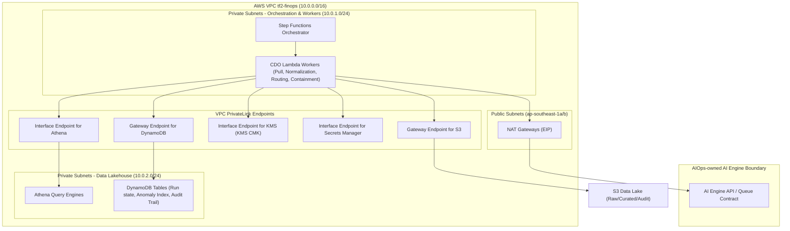

# Thiết kế Bảo mật (Security Design) - TF2 FinOps Watch CDO06 Platform

## 1. Bảo mật Mạng (Network Security)

Hạ tầng CDO platform cho TF2 FinOps Watch vận hành theo cấu trúc mạng serverless, hướng xử lý batch (theo lô) đặt tại `ap-southeast-1`. Thay vì công khai các API ra internet công cộng, hệ thống sử dụng mạng riêng tư (private networking), các Gateway/Interface VPC Endpoint và NAT Gateway được quản lý để thực hiện các workflow định kỳ theo chu kỳ 24 giờ.

### 1.1 Sơ đồ Mạng (Network Diagram)

Sơ đồ dưới đây mô tả cấu hình VPC, các subnet private, security group và các VPC Endpoint giúp cô lập data lakehouse, Step Functions điều phối (orchestration) và các Lambda worker khỏi internet công cộng. Sơ đồ cũng làm nổi bật kết nối outbound tới endpoint của AI Engine do AIOps sở hữu thông qua NAT Gateway.



### 1.2 Nhóm Bảo mật (Security Groups)

Luồng lưu lượng được kiểm soát bằng cách sử dụng các security group được gắn trực tiếp vào các tài nguyên trong subnet. Vì CDO platform chạy các thành phần serverless (Lambda và truy vấn Athena) thay vì các cụm EC2 hoặc EKS chạy liên tục, các security group sẽ được áp dụng cho các Lambda function được kết nối VPC và các VPC interface endpoint.

| Tên Security Group | Quy tắc Inbound | Quy tắc Outbound | Gắn vào |
|---|---|---|---|
| `tf2-finops-lambda-sg` | Không có | `HTTPS (443)` tới VPC Endpoints; `HTTPS (443)` tới NAT Gateway (cho AI Engine) | Tất cả các CDO Lambda function kết nối VPC |
| `tf2-finops-vpce-sg` | `HTTPS (443)` từ `tf2-finops-lambda-sg` | Không có | Các VPC Interface Endpoint (KMS, Secrets Manager, Athena) |
| `tf2-finops-athena-sg` | `HTTPS (443)` từ `tf2-finops-lambda-sg` | Không có | Các nhóm thực thi truy vấn Athena |

### 1.3 ACL Mạng / VPC Endpoint (Network ACL / VPC Endpoint)

Để đảm bảo toàn bộ dữ liệu nội bộ, thông tin xác thực và lưu lượng khoá mã hoá luôn nằm trong mạng xương sống private của AWS, lưu lượng mạng sẽ không đi qua internet công cộng ngoại trừ các cuộc gọi đi (outbound call) tới API của AIOps AI Engine bên ngoài.

- **S3 Gateway Endpoint**: Các bản ghi định tuyến (route table) trong subnet private điều hướng trực tiếp lưu lượng hướng tới các bucket CDO Lakehouse qua S3.
- **DynamoDB Gateway Endpoint**: Phân giải lưu lượng tới các bảng DynamoDB ghi nhận trạng thái chạy (run state), idempotency và anomaly (bất thường) một cách riêng tư.
- **Secrets Manager Interface Endpoint (`com.amazonaws.ap-southeast-1.secretsmanager`)**: Phân giải các cuộc gọi API để truy xuất thông tin xác thực giả lập và các API key bên trong VPC.
- **KMS Interface Endpoint (`com.amazonaws.ap-southeast-1.kms`)**: Phân giải các thao tác khoá (mã hoá, giải mã, tạo data key) cho các KMS CMK.
- **Athena Interface Endpoint (`com.amazonaws.ap-southeast-1.athena`)**: Bảo mật các truy vấn phân tích nội bộ được thực hiện bởi cổng kết nối dữ liệu của dashboard.

---

## 2. Quản lý Định danh & Kiểm soát Truy cập (IAM & Access Control)

Quản lý Định danh và Truy cập (IAM) được cấu trúc xung quanh các service role theo nguyên tắc đặc quyền tối thiểu (least-privilege) và các quyền containment (ngăn chặn) nhận biết môi trường.

### 2.1 Quyền hạn Dịch vụ (Service Roles)

CDO platform thực thi phân tách nhiệm vụ giữa điều phối workflow, chuẩn hoá dữ liệu, tích hợp AI engine và thực thi hành động containment.

#### 1. CDO Platform Execution Role (`tf2-finops-cdo-workflow-role`)
Được sử dụng bởi Step Functions state machine. Role này được phép kích hoạt và giám sát các CDO Lambda function, đọc và cập nhật các bản ghi run state trên DynamoDB, và ghi nhận các metric thực thi.

#### 2. CDO AI Client Role (`tf2-finops-ai-client-role`)
Được sử dụng bởi Lambda function thực hiện gọi AIOps-owned AI Engine. Role này có quyền đọc các file cost đã chuẩn hoá từ S3, lấy API key của AI Engine từ Secrets Manager và ghi nhận các bản ghi anomaly vào DynamoDB.

```json
{
    "Version": "2012-10-17",
    "Statement": [
        {
            "Sid": "ReadNormalizedCostData",
            "Effect": "Allow",
            "Action": [
                "s3:GetObject"
            ],
            "Resource": "arn:aws:s3:::tf2-finops-lakehouse/cost/curated/*"
        },
        {
            "Sid": "RetrieveAIEngineApiKey",
            "Effect": "Allow",
            "Action": [
                "secretsmanager:GetSecretValue"
            ],
            "Resource": "arn:aws:secretsmanager:ap-southeast-1:123456789012:secret:tf2-finops/ai-engine/api-key-*"
        },
        {
            "Sid": "WriteAnomalyRecords",
            "Effect": "Allow",
            "Action": [
                "dynamodb:PutItem",
                "dynamodb:UpdateItem"
            ],
            "Resource": "arn:aws:dynamodb:ap-southeast-1:123456789012:table/tf2-finops-anomaly-records"
        }
    ]
}
```

#### 3. CDO Containment Worker Role (`tf2-finops-containment-role`)
Được sử dụng bởi Lambda function áp dụng các chính sách containment. Role này có quyền truy xuất dữ liệu anomaly và ghi lại nhật ký kiểm toán (audit record), nhưng phải assume các role đặc thù theo môi trường trong các member account để kích hoạt các hành động containment.

```json
{
    "Version": "2012-10-17",
    "Statement": [
        {
            "Sid": "ReadAuditAndAnomalyMetadata",
            "Effect": "Allow",
            "Action": [
                "dynamodb:GetItem",
                "dynamodb:UpdateItem",
                "s3:PutObject"
            ],
            "Resource": [
                "arn:aws:dynamodb:ap-southeast-1:123456789012:table/tf2-finops-anomaly-records",
                "arn:aws:s3:::tf2-finops-audit-log/*"
            ]
        },
        {
            "Sid": "AssumeScopedContainmentRoles",
            "Effect": "Allow",
            "Action": "sts:AssumeRole",
            "Resource": [
                "arn:aws:iam::*:role/tf2-finops-member-containment-role"
            ]
        }
    ]
}
```

### 2.2 Ranh giới Bảo mật Cứng (Deny Policy) (Hard Security Boundary (Deny Policy))

Để đáp ứng các yêu cầu bảo mật cứng tuyệt đối của khách hàng, CDO platform gắn một IAM Permission Boundary hoặc Service Control Policy (SCP) vào tất cả các role tự động hoá.

> [!IMPORTANT]
> **Ranh giới an toàn sản xuất cứng (Hard production safety boundary)**: `NEVER terminate prod, delete data, or modify IAM`. Trong mọi tình huống, hệ thống CDO sẽ KHÔNG BAO GIỜ tắt các tài nguyên production đang chạy, xóa các kho lưu trữ dữ liệu vĩnh viễn hoặc sửa đổi phạm vi chính sách IAM.

Đoạn mã chính sách (policy snippet) sau đây được gắn dưới dạng ranh giới Deny rõ ràng cho containment worker role và tất cả các role cross-account được assume:

```json
{
    "Version": "2012-10-17",
    "Statement": [
        {
            "Sid": "DenyUnsafeActions",
            "Effect": "Deny",
            "Action": [
                "iam:*",
                "organizations:*",
                "ec2:TerminateInstances",
                "rds:DeleteDBInstance",
                "rds:DeleteDBCluster",
                "s3:DeleteBucket",
                "s3:DeleteObject",
                "dynamodb:DeleteTable",
                "dynamodb:DeleteBackup"
            ],
            "Resource": "*"
        }
    ]
}
```

### 2.3 Mô hình Truy cập Liên tài khoản (Cross-Account Access Pattern)

CDO platform nằm trong tài khoản FinOps Security/Management trung tâm. Các member account được truy cập bằng cách sử dụng cơ chế assume role liên tài khoản thông qua AWS Security Token Service (STS):

1. **Truy cập Chi phí và Metadata ở chế độ Read-only**: Bộ phận cost puller và normalization worker assume một role read-only (`tf2-finops-member-read-role`) trong các member account. Điều này cho phép hệ thống liệt kê các tag của tài nguyên và đọc loại instance để đưa ra các đề xuất tối ưu hoá kích cỡ (right-sizing).
2. **Truy cập Containment nhận biết Môi trường (Environment-Aware Containment Access)**: Bộ phận containment worker assume role `tf2-finops-member-containment-role` trong tài khoản đích. Quyền hạn của role này được giới hạn chặt chẽ dựa trên các tag môi trường của tài nguyên trong tài khoản đó:

| Môi trường Đích | Hành động Containment được Phép | Hành động bị từ chối (Chặn cứng) |
|---|---|---|
| **Production** (`prod`) | `ec2:CreateTags` (Gắn tag để đánh giá), Đề xuất các khuyến nghị | Tắt (Terminate), Xoá (Delete), Sửa đổi IAM, Dừng instance (Stop), Giới hạn quota |
| **Staging** (`staging`) | `ec2:CreateTags`, Dừng instance chạy thử (Dry-run schedule shutdown), Giới hạn quota chạy thử (Dry-run quota cap) | Tắt (Terminate), Xoá (Delete), Sửa đổi IAM, Dừng instance trực tiếp (Direct stop) |
| **Development** (`dev`) | `ec2:CreateTags`, `ec2:StopInstances` (Dừng theo lịch trình), Áp dụng giới hạn Quota định sẵn | Tắt (Terminate), Xoá (Delete), Sửa đổi IAM, Xoá dữ liệu trực tiếp |
| **Sandbox** (`sandbox`) | `ec2:CreateTags`, `ec2:StopInstances` (Dừng theo lịch trình), Áp dụng giới hạn Quota định sẵn | Tắt (Terminate), Xoá (Delete), Sửa đổi IAM, Xoá dữ liệu trực tiếp |

Tất cả các cuộc gọi API liên tài khoản đều được thực thi với một `correlation_id` được truyền qua session tag để đảm bảo có thể theo dõi được trong CloudTrail của các member account.

---

## 3. Quản lý Thông tin mật (Secrets Management)

Thông tin xác thực và mã khoá không bao giờ được viết cứng (hardcode) hoặc đẩy vào hệ thống quản lý mã nguồn (Git).

### 3.1 Danh mục Thông tin mật (Secrets Inventory)

Các secret sau đây được lưu trữ trong AWS Secrets Manager:

| Tên Secret | Lưu trữ / ARN | Chu kỳ Xoay vòng | Truy cập bởi | Mô tả |
|---|---|---|---|---|
| `tf2-finops/ai-engine/api-key` | Secrets Manager | Thủ công (xoay vòng khi khoá hết hạn) | `tf2-finops-ai-client-role` | API key để xác thực các yêu cầu gửi tới AIOps AI Engine |
| `tf2-finops/platform/db-conn` | Secrets Manager | Tự động xoay vòng mỗi 30 ngày | Normalization worker | Thông tin xác thực metadata hoặc data warehouse (khi sử dụng cơ sở dữ liệu bên ngoài) |
| `tf2-finops/platform/webhook` | Secrets Manager | Thủ công (kiểm tra hàng năm) | Lambda điều phối cảnh báo | Các mã xác thực đầu vào/đầu ra cho Slack webhook và các endpoint HTTP của SNS |

### 3.2 Cơ chế Tiêm Thông tin mật (Inject Pattern)

Đối với việc thực thi AWS Lambda, các secret được lấy động tại thời điểm chạy (runtime) bằng cách sử dụng **AWS Secrets Manager Lambda Layer (Caching Client)**.

- Code Lambda yêu cầu secrets từ `localhost:2773` để lấy các secret đã được cache.
- Điều này giúp giảm số lượng cuộc gọi API, tránh vượt quá giới hạn throttling của Secrets Manager và đảm bảo secrets chỉ được lưu trữ trong bộ nhớ container tạm thời.
- Các task ECS Fargate tải các secret thông qua các tham số trong task definition sử dụng khai báo `valueFrom`, đảm bảo thông tin xác thực không bao giờ được lưu trữ dưới dạng text thông thường trong container image hoặc định nghĩa môi trường:

```yaml
secrets:
  - name: AI_ENGINE_API_KEY
    valueFrom: "arn:aws:secretsmanager:ap-southeast-1:123456789012:secret:tf2-finops/ai-engine/api-key-abcde:api_key::"
```

### 3.3 Kiểm soát Chống rò rỉ (Anti-leak Controls)

1. **Pre-commit Scan Hook**: Các nhà phát triển phải sử dụng các hook pre-commit tại local được cấu hình bằng `Gitleaks` hoặc `TruffleHog` để quét các khối mã nhằm tìm kiếm mật khẩu, private key hoặc API token.
2. **Quét Secret trong Pipeline CI**: CI/CD runner quét kho lưu trữ trên mỗi pull request. Nếu phát hiện thấy secret, lượt chạy sẽ thất bại ngay lập tức.
3. **Ẩn thông tin nhạy cảm trong Nhật ký ứng dụng (Application Log Redaction)**: Các CDO logging utility sử dụng các mẫu regex để chặn và loại bỏ dữ liệu nhạy cảm khỏi nhật ký JSON có cấu trúc trước khi ghi chúng vào CloudWatch:
   - Mẫu `Bearer\s+[A-Za-z0-9\-\._~\+\/]+=*` được thay thế bằng `[REDACTED]`.
   - Mẫu `(?i)password|api_key|token\s*:\s*"[^"]*"` được ẩn đi.

---

## 4. Mã hoá (Encryption)

Tất cả dữ liệu được lưu trữ trong CDO platform hoặc di chuyển qua mạng đều được bảo vệ bằng các giao thức mã hoá tiêu chuẩn công nghiệp.

### 4.1 Mã hoá Lưu trữ (At Rest)

Data lakehouse và các metadata catalog sử dụng khoá do khách hàng quản lý (CMK) được cấu hình trong KMS thay vì các khoá mặc định do AWS quản lý.

| Thành phần Dữ liệu | Phương tiện Lưu trữ | KMS Key / Loại | Kiểm soát An toàn |
|---|---|---|---|
| **Audit Logs** | S3 bucket `tf2-finops-audit` | `tf2-finops-audit-cmk` (CMK) | Bật Object Lock (Chế độ Compliance, thời gian lưu trữ 90 ngày) |
| **Cost Raw Zone** | S3 bucket `tf2-finops-lakehouse` | `tf2-finops-data-cmk` (CMK) | SSE-KMS, Chính sách bucket bắt buộc mã hoá |
| **Cost Curated Zone** | S3 bucket `tf2-finops-lakehouse` | `tf2-finops-data-cmk` (CMK) | SSE-KMS, Chính sách bucket bắt buộc mã hoá |
| **Operational Metadata** | DynamoDB Tables | `tf2-finops-ddb-cmk` (CMK) | Mã hoá cấp bảng sử dụng CMK |
| **Lambda Storage** | `/tmp` và gói triển khai (deployment package) | Khoá do AWS quản lý | Khoá thực thi mặc định của KMS |

### 4.2 Mã hoá Truyền tải (In Transit)

Tất cả các truyền tải dữ liệu bắt buộc phải sử dụng TLS 1.2 hoặc TLS 1.3:

1. **VPC Endpoints**: Các kết nối tới KMS, Secrets Manager, S3 và DynamoDB được thực thi thông qua gateway và interface routing trong VPC, nghĩa là lưu lượng không bao giờ đi qua internet công cộng.
2. **Outbound tới AI Engine**: Tất cả các cuộc gọi HTTP từ CDO AI client tới endpoint của AI Engine phải sử dụng HTTPS. Việc xác thực TLS tiêu chuẩn được thực thi; các chứng chỉ tự ký (self-signed) sẽ bị từ chối.
3. **Dịch vụ Dữ liệu Nội bộ**: Các kết nối dữ liệu Athena và tích hợp QuickSight dashboard bắt buộc sử dụng HTTPS với chính sách mã hoá `ELBSecurityPolicy-TLS13-1-2-2021-06`.

### 4.3 Quản lý Khoá (Key Management)

1. **Xoay vòng CMK**: Tính năng tự động xoay vòng được bật cho tất cả các khoá tuỳ chỉnh (`tf2-finops-*-cmk`) với chu kỳ xoay vòng 1 năm do KMS quản lý.
2. **Chính sách Khoá Đặc quyền Tối thiểu (Least Privilege Key Policies)**: Các chính sách khoá giới hạn quyền truy cập cho role thực thi cụ thể của dịch vụ. Ngay cả quản trị viên cũng bị từ chối quyền giải mã khoá, ngăn chặn việc truy cập dữ liệu ngoài luồng.
3. **Kiểm toán KMS qua CloudTrail (KMS CloudTrail Auditing)**: Các data event của CloudTrail được bật cho khoá kiểm toán (audit key), theo dõi mọi giao dịch mã hoá, giải mã và quản lý khoá.

---

## 5. Nhật ký Kiểm toán (Audit Logging)

Yêu cầu cốt lõi của CDO platform là duy trì một vết kiểm toán (audit trail) hoàn chỉnh và chống giả mạo.

### 5.1 Các thông tin cần ghi nhận (What to Log)

Nền tảng ghi nhận hai loại dữ liệu riêng biệt vào các vị trí có cấu trúc:

#### 1. Nhật ký Nhập dữ liệu và Quyết định của AI (Ingestion and AI Decision Logs)
Mỗi lượt chạy định kỳ ghi lại các chi tiết payload đo lường từ xa, xác thực hợp đồng mô hình, thời gian truy vấn và kết quả độ tin cậy từ AI Engine:
- Timestamp, Run ID, Correlation ID và Phiên bản Mô hình (Model Version).
- URI tham chiếu tập dữ liệu đã chuẩn hoá (S3 path).
- Phân loại anomaly, Điểm tin cậy (Confidence score) và Kết quả mức độ nghiêm trọng (Severity).
- Quyết định định tuyến hành động của CDO (các kênh Finance vs Engineering).

#### 2. Vết Kiểm toán Hành động Ngăn chặn (Containment Action Audit Trail)
Mỗi hành động dry-run, đề xuất hoặc hành động containment được phê duyệt đều tạo ra một bản ghi JSON chứa các trường schema sau:

```json
{
  "actor": "cdo-platform-containment-worker",
  "timestamp": "2026-06-22T14:45:00Z",
  "correlation_id": "run-f19472e3-bc12-4d56-a789-0123456789ab",
  "idempotency_key": "finops-watch:24h:2026-06-21:2026-06-22:global:v1",
  "anomaly_id": "anom-987654",
  "target_resource": "arn:aws:ec2:ap-southeast-1:999999999999:instance/i-0bcd1234ef5678a99",
  "account_id": "999999999999",
  "squad_owner": "squad-billing-analytics",
  "environment": "dev",
  "before_state": {
    "instance_state": "running",
    "tags": {
      "Environment": "dev",
      "Owner": "squad-billing-analytics"
    }
  },
  "proposed_action": "stop-instance",
  "after_state": {
    "instance_state": "stopping",
    "tags": {
      "Environment": "dev",
      "Owner": "squad-billing-analytics",
      "FinOpsContainmentAction": "ScheduledShutdown",
      "FinOpsAnomalyId": "anom-987654"
    }
  },
  "execution_mode": "apply",
  "rollback_path": {
    "action": "start-instance",
    "revert_tags": [
      "FinOpsContainmentAction",
      "FinOpsAnomalyId"
    ]
  },
  "approval_status": "approved_by_policy",
  "retention_location": "s3://tf2-finops-audit-log/containment/2026/06/",
  "retention_period_days": 90
}
```

### 5.2 Lưu trữ & Thời hạn Lưu giữ (Storage & Retention)

Bảng dưới đây liệt kê thời hạn giữ và phương thức truy vấn cho tất cả dữ liệu kiểm toán của hệ thống:

| Danh mục Nhật ký | Vị trí Lưu trữ | Ràng buộc Lưu giữ | Giao diện Truy vấn | Kiểm soát An toàn |
|---|---|---|---|---|
| **Containment Audits** | S3 bucket `tf2-finops-audit-log` | **>=90 ngày** (90 ngày S3 Object Lock; chuyển sang Glacier sau 90 ngày) | Athena SQL / QuickSight Audit Tab | Chính sách bucket chỉ cho phép append, S3 Object Lock ở chế độ compliance |
| **AI Decision Records** | DynamoDB & S3 | 90 ngày hot; 1 năm cold trong S3 | Athena SQL | Mã hoá KMS với CMK dữ liệu riêng biệt |
| **AWS CloudTrail Logs** | S3 bucket `tf2-finops-cloudtrail` | 1 năm | Athena / CloudTrail Lake | Bật tính năng xác thực tính toàn vẹn của file log |
| **Application Debug Logs** | CloudWatch Logs | 14 ngày | CloudWatch Logs Insights | Chính sách tự động hết hạn thời gian lưu giữ |

### 5.3 Xử lý Dữ liệu Cá nhân (PII Handling - Cơ bản)

1. **Danh sách Whitelist Nghiêm ngặt**: Dữ liệu đo lường từ xa được nhập từ CUR 2.0 hoặc Cost Explorer bị giới hạn ở tên dịch vụ, resource ID, account ID, các cặp tag key-value và các metric chi phí. Không thu thập thông tin hồ sơ người dùng, payload cơ sở dữ liệu hoặc thông tin định danh cá nhân.
2. **Scrubbing khi Nhập**: Bất kỳ giá trị tag nào chứa cấu trúc tương tự như địa chỉ email hoặc thông tin xác thực của người dùng sẽ bị lọc hoặc thay thế bằng `[REDACTED]` trong quá trình chuẩn hoá dữ liệu.

---

## 6. Bảo mật Container & Serverless (Container & Serverless Security)

CDO platform sử dụng AWS Lambda cho các tác vụ thời gian ngắn và các thực thể ECS Fargate tuỳ chọn cho bất kỳ adapter nhập dữ liệu chạy dài nào trong tương lai.

- **Quét Image trên ECR (ECR Container Image Scanning)**: Các Docker image được sử dụng cho ECS Fargate hoặc containerized Lambda function được đẩy lên Amazon ECR. Kho lưu trữ ECR đã bật tính năng "Scan on Push" bằng Amazon Inspector. Bất kỳ image nào chứa lỗ hổng bảo mật (CVE) mức `HIGH` hoặc `CRITICAL` sẽ bị chặn triển khai.
- **Cô lập Môi trường Lambda (Lambda Environment Isolation)**: Các Lambda function hoạt động với một hệ thống tệp root ở chế độ read-only. Bộ nhớ `/tmp` bị giới hạn tối đa 512 MB và các hàm tạm thời được cấu hình với giới hạn concurrency tối đa để ngăn chặn các cuộc tấn công vắt kiệt tài nguyên.
- **Tối ưu Bảo mật Runtime cho Task (Task Runtime Hardening)**: Các task definition của ECS Fargate chạy không có quyền root (`user: nobody` hoặc một người dùng Linux không phải root) và chạy với thuộc tính `readOnlyRootFilesystem: true` để ngăn chặn giả mạo container.

---

## 7. Các Điểm chạm Tuân thủ (Compliance Touchpoints)

Các kiểm soát được triển khai trong CDO platform trực tiếp giải quyết các khung tiêu chuẩn công nghiệp.

| Tiêu chuẩn Tuân thủ | Mã Kiểm soát Khung (Framework Control ID) | Triển khai Kiểm soát Bảo mật Nền tảng |
|---|---|---|
| **SOC2 Type II** | CC6.1 (Logical Access) | Các IAM execution role được giới hạn phạm vi, các role assume liên tài khoản và các IAM Permission Boundary. |
| **SOC2 Type II** | CC7.2 (System Monitoring) | Các metric và cảnh báo CloudWatch được kích hoạt bởi các dashboard bị cũ (stale), lỗi API throttling và lỗi AI Engine timeout. |
| **SOC2 Type II** | CC8.1 (Change Management) | Mã nguồn hạ tầng bất biến (immutable IaC), xác thực plan-on-PR và các lượt quét CI tự động. |
| **GDPR** | Điều 32 (Bảo mật Xử lý) | Mã hoá hai lớp (SSE-KMS + TLS 1.3), whitelist dữ liệu và tự động xoá bỏ PII. |
| **ISO/IEC 27001** | A.12.4.1 (Event Logging) | Bucket S3 audit được tăng cường bảo mật, chỉ cho phép append với cấu hình Object Lock 90 ngày. |

---

## 8. Các Câu hỏi Mở (Open Questions)

1. **Cơ chế Xác thực Endpoint của AI Engine**: Đội ngũ AIOps sẽ hỗ trợ xác thực chứng chỉ client (mTLS) hay dựa trên API key được quản lý bởi Secrets Manager để xác thực API Gateway?
2. **Luồng Khôi phục Ngăn chặn Khẩn cấp (Emergency Containment Rollback Flow)**: Chúng ta có cần xây dựng một nút UI rollback thủ công cho người dùng Finance không, hay việc rollback sẽ được kích hoạt bằng CLI chạy bởi các DevOps operator?

---

## Các tài liệu liên quan (Related Documents)

- [02_infra_design_vi.md](file:///E:/code-folder/xbrain_projects/capstone_phase2_main/tf2-finops-docs/docs/tf2-finops/02_infra_design_vi.md) - Thiết kế hạ tầng và cấu hình VPC.
- [04_deployment_design_vi.md](file:///E:/code-folder/xbrain_projects/capstone_phase2_main/tf2-finops-docs/docs/tf2-finops/04_deployment_design_vi.md) - Quét bảo mật trong pipeline CI/CD và xác thực mã nguồn tĩnh.
- [08_adrs_vi.md](file:///E:/code-folder/xbrain_projects/capstone_phase2_main/tf2-finops-docs/docs/tf2-finops/08_adrs_vi.md) - Các quyết định kiến trúc liên quan đến an toàn ngăn chặn (containment safety) và thời gian giữ nhật ký kiểm toán.
