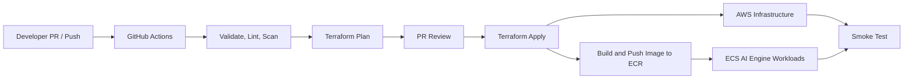

# Deployment & CI/CD Design - Task Force 2 · FinOps Watch CDO

<!-- Doc owner: CDO Team
     Status: Final (W11 T6 Pack #1) -> Updated (W12 T4 Pack #2)
-->

## 1. IaC strategy

### 1.1 Tool choice

The CDO platform uses a dual-layer deployment strategy to separate infrastructure provisioning from application workload deployments.
1. **Infrastructure Layer (AWS Resources)**: Provisioned using **Terraform (v1.5+)** to ensure immutable resources (VPC, ECS cluster, Fargate capacity providers, DynamoDB, S3, IAM roles).
2. **Workload Layer (ECS Services & Tasks)**: Deployed using **Terraform ECS configuration** and **GitHub Actions (CI/CD) deployment pipelines**, and native zip deployment files for Lambda functions.

Terraform owns the AWS platform foundation: networking, lakehouse buckets, Glue/Athena metadata, Step Functions, Lambda wrappers, DynamoDB tables, IAM roles, ECS control plane, Fargate capacity providers, ECR repositories, ECS Task/Task Execution roles, internal load-balancer prerequisites, and secrets plumbing. CDO owns the ECS hosting infrastructure deployment (VPC, subnets, ALB, tasks sizing, auto scaling, security groups, task IAM roles, queues, and DynamoDB state stores), while AIOps owns the container image builds, contract management, and model logic. Runtime ECS desired state is managed through the Terraform ECS configuration and GitHub Actions (CI/CD) deployment pipelines, so application task definitions can move independently from infrastructure modules while still depending on Terraform outputs.

### 1.2 Module structure

The repository is organized to separate infrastructure modules from environmental variables:
```
├── iac/
│   ├── modules/
│   │   ├── vpc/                  # Private VPC, subnets, NAT gateways, VPC endpoints
│   │   ├── ecs/                  # ECS cluster control plane, Fargate Capacity Providers
│   │   ├── s3-lakehouse/         # Raw and curated S3 buckets, lifecycle policies
│   │   ├── glue-catalog/         # Glue databases and tables
│   │   ├── step-functions/       # Step Functions workflow definitions
│   │   ├── lambdas/              # Lambda functions (CUR puller, routing, containment)
│   │   └── dynamodb/             # Run state, idempotency, and audit tables
│   └── environments/
│       ├── sandbox/              # Sandbox environment variables (.tfvars)
│       ├── staging/              # Staging environment variables
│       └── prod/                 # Production environment variables
```

The module boundary is intentionally service-oriented rather than team-oriented. Shared platform concerns such as KMS keys, VPC endpoints, IAM policies, and observability are reusable modules, while environment roots provide only sizing, account IDs, feature flags, and approval-sensitive variables. This prevents sandbox shortcuts from leaking into staging or prod.

### 1.3 State management

- **Remote State**: Terraform state is stored in a secure, centralized S3 bucket with server-side encryption, versioning, and environment-specific state keys.
- **State Locking**: Long-lived environment roots use the S3 backend lockfile capability (`use_lockfile = true`) to avoid a separate DynamoDB lock table.
- **CI/CD Ingestion**: Plan outputs are generated on PR (`plan-on-PR`) and apply jobs consume reviewed plan artifacts instead of recomputing unreviewed changes.
- **State Access**: CI roles can read/write only the state key for the target environment. Developers can run local validation, but staging and prod applies must be executed by CI with OIDC and environment controls.

## 2. CI/CD pipeline

### 2.1 Pipeline stages

The CI/CD pipeline is implemented with **GitHub Actions** as the delivery control plane for the CDO infrastructure. It is not part of the runtime FinOps data path, but it controls how the infrastructure components in this design are validated, provisioned, updated, and verified.

The pipeline manages infrastructure and platform changes for:

* EventBridge Scheduler and Step Functions workflow.
* Lambda functions for ingestion, state handling, alert routing, and containment.
* S3 raw/curated zones, Glue Data Catalog, Athena query resources.
* DynamoDB run state and audit tables.
* ECS cluster, Fargate tasks, Internal ALB, ECR, and ECS workloads.
* IAM roles and environment-specific configuration required by the CDO platform.



*Caption: GitHub Actions validates every infrastructure change, generates a Terraform plan, applies approved changes to AWS, publishes container images to ECR, updates ECS workloads, and runs a smoke test to verify that the CDO platform can execute the FinOps workflow.*

The pipeline follows a simple environment flow:

| Environment | Trigger                        | Purpose                                                                            |
| ----------- | ------------------------------ | ---------------------------------------------------------------------------------- |
| `sandbox`   | Merge to `develop`             | Validate infrastructure and run safe integration tests with synthetic FinOps data. |
| `staging`   | Merge to `main`                | Verify the production-like workflow before final release.                          |
| `prod`      | Manual approval or release tag | Apply reviewed infrastructure changes only after approval.                         |

For Pull Requests, the pipeline runs only validation steps:

* `terraform fmt -check`
* `terraform validate`
* `tflint`
* Secret scanning
* IaC security scanning
* ECS task definition validation
* Terraform plan generation

Pull Requests do **not** apply changes directly to AWS. The generated Terraform plan is reviewed before merge so the team can see which resources will be created, updated, replaced, or destroyed.

After merge, the deployment stage provisions or updates the infrastructure using Terraform. GitHub Actions assumes an AWS IAM role through **GitHub OIDC**, so no long-lived AWS access keys are stored in GitHub Secrets. Each environment uses a separate IAM role to limit blast radius.

| Pipeline stage  | Main target                           | Purpose                                                        |
| --------------- | ------------------------------------- | -------------------------------------------------------------- |
| Validate        | Terraform, scripts                    | Catch invalid infrastructure code before deployment.           |
| Plan            | Terraform modules                     | Preview AWS infrastructure changes before apply.               |
| Apply           | AWS infrastructure                    | Provision or update CDO platform components.                   |
| Build image     | ECR                                   | Store versioned container images for ECS workloads.            |
| Deploy workload | ECS                                   | Update AI Engine API/worker workloads behind the Internal ALB. |
| Smoke test      | Step Functions, Lambda, ECS, DynamoDB | Verify the FinOps workflow after deployment.                   |

The post-deployment smoke test uses synthetic data and runs in dry-run mode:

```text
1. Trigger the Step Functions workflow manually.
2. Run the ingestion Lambda against synthetic CUR/Cost Explorer data.
3. Confirm raw and curated data are written to S3.
4. Confirm Glue/Athena can query the curated cost dataset.
5. Call the shared ECS-hosted AI Engine endpoint `https://ai-engine.tf-2.internal/` through the Internal ALB using IAM SigV4 authentication.
6. Confirm alert routing produces Finance/Engineering payloads.
7. Confirm containment stays in dry-run mode unless the target is dev/sandbox.
8. Confirm run state and audit records are written to DynamoDB.
```

A deployment is accepted only when the workflow passes validation, Terraform apply completes successfully, ECS workloads become healthy, and the smoke test confirms that ingestion, AI invocation, alert routing, containment dry-run, and audit logging work together.

### 2.2 Branch strategy

- `feature/*`: Dedicated branches for features. PR target: `develop`; validation only, no cloud apply.
- `develop`: Sandbox integration branch. Pushes to `develop` can auto-apply to sandbox after checks pass.
- `main`: Staging branch. Merges from `develop` into `main` trigger staging deployment and full integration validation.
- `prod`: Production release path. Production apply is never automatic; it uses GitHub environment approval, reviewed plan artifacts, and prod-safe containment settings.

## 3. Deployment gates

### 3.1 Security scans

In addition to static code analysis, ECR repositories are configured with **Scan on Push** enabled. Any image uploaded by AIOps is automatically scanned. Container deployment is blocked if the image contains severe CVEs. CI pipelines authenticate to AWS using **OpenID Connect (OIDC)**, eliminating the need to store static AWS Access Keys in GitHub.

The security gate also checks Terraform plans, ECS task definitions, Lambda dependencies, and container images. Required checks include `terraform fmt`, `terraform validate`, TFLint, Checkov or equivalent IaC scanning, Trivy image scan, Gitleaks secret scan, and policy checks that prevent public AI Engine exposure. Any CRITICAL finding blocks deployment unless a documented capstone exception is approved.

### 3.2 Destructive-change review

Any Terraform plan that modifies resource indexes or indicates resource deletion (e.g., S3 bucket recreation or IAM role changes) is flagged in the PR summary. These changes require explicit manual verification and dual approvals from both the CDO and Security Leads.

The destructive-change gate is stricter for stateful resources. S3 buckets, DynamoDB tables, KMS keys, ECS clusters, Fargate tasks, IAM roles, and audit storage require reviewer acknowledgement when replacement or deletion appears in the plan. Production plans must fail if they attempt to terminate prod resources, delete data, or modify IAM outside the approved module set.

### 3.3 AI contract compatibility

Before ECS updates are allowed, a pre-deployment script runs validation checks:
1. Compares the AIOps model version registry against the current ECS target configuration.
2. Performs JSON schema validation on the AI Engine `/v1/detect` request/response API contracts.
3. If schemas mismatch, the build fails before applying ECS changes, ensuring deployment compatibility.

The compatibility check does not evaluate model quality or inspect AIOps training data. It verifies only the operational contract CDO depends on: endpoint health, request schema, response schema, required fields, model version field, timeout behavior, and failure modes. If the AI Engine is unavailable or incompatible, CDO deployment can proceed only for infrastructure changes that do not enable containment apply paths.

### 3.4 Artifact Immutability & Supply Chain Security (SLSA Level 2)

To ensure secure software delivery and prevent tampering in compliance with the signed `deployment-contract.md` §3:
- **Digest Pinning**: CDO deploys the AI Engine container using immutable ECR image digests (`sha256:...`) instead of mutable version tags (e.g., `v1.0.0` or `latest`).
- **Signature Verification**: Every container image is verified against signed signatures using AWS Signer KMS keys before ECR deployment.
- **SBOM Attachment**: Container builds must be accompanied by a Software Bill of Materials (SBOM) in CycloneDX format for license and package auditing.
- **OpenSSF SLSA Level 2**: The CI/CD pipelines enforce automated provenance tracking, building containers exclusively in verified environments with zero static credentials.

## 4. Deployment strategy

### 4.1 Strategy

- **ECS API Workloads**: Deployed using **ECS Rolling Updates** with a max surge of `25%` and max unavailable of `0%`. This ensures stable tasks (AI Engine API Tasks) have new tasks ready before old ones are terminated.
- **ECS Batch Workers**: ECS Tasks execute dynamically. Updates to worker configurations affect new task invocations without interrupting active runs.
- **Lambda Functions**: Deployed using **Weighted Aliases**. Traffic shifts gradually: `10%` canary for 5 minutes, transitioning to `100%` if no errors occur.
- **Fargate Spot Interruption Handling**: AWS ECS handles Fargate Spot interruptions natively. When a termination signal is received, the task enters a draining state for 120 seconds. If a batch scoring task is interrupted, the CDO orchestrator detects the failure and schedules a retry on Fargate Spot or always-on fallback.

### 4.2 Rollback method

- **Primary Rollback**: Reverting a Git commit to the previous stable release SHA triggers an automatic GitHub Actions deployment pipeline run to redeploy the previous stable task definition to the ECS cluster.
- **Secondary Rollback**: For Lambda functions, the Step Functions workflow catches invocation errors and immediately shifts the Lambda alias weight back to the previous stable version (RTO < 10 seconds).
- **Infrastructure Rollback**: Terraform rollback is plan-reviewed rather than automatic. State-bearing resources are preserved, `prevent_destroy` remains enabled where supported, and any ECS infrastructure rollback must account for Fargate tasks, ECS task roles, and internal endpoint dependencies.
- **Runbook Trigger**: Rollback is triggered by failed smoke tests, AI contract validation failure, elevated Step Functions error rate, unhealthy ECS services, or stale dashboard data after deployment.

### 4.3 Budget Guardrails & SLO Circuit Breakers (Error Budget Lock)

Operational spending and reliability thresholds are managed through automated circuit breakers to protect AWS resources:
- **Bedrock Budget Guardrail**: Enforces a strict budget of **<$50/month** ($1.67/day limit). The circuit breaker triggers three escalation levels:
  - **Level 1 (80% daily budget)**: Auto-degrades modeling from Nova Pro to Nova Lite.
  - **Level 2 (100% daily budget)**: Auto-falls back to the static Rules Engine (zero LLM token cost).
  - **Level 3 (120% monthly budget)**: Halts all processing and triggers P1 alerts.
- **1% Error Budget Lock**: Enforces a minimum SLO of 99.0% for automated containment success. If the rollback/undo rate exceeds 1% in a rolling 30-day window, the tenant is automatically `LOCKED`. In this state, any further automated containment is disabled, converting all platform interventions into `Dry-run/Alert-only` mode until the issue is diagnosed by SREs.

## 5. Environment separation

We enforce isolation across three AWS accounts:

| Env | Purpose | Account | Auto-deploy |
|---|---|---|---|
| **Sandbox** | Fast iteration, integration smoke tests, and non-prod containment examples. | `1111-2222-3333` | True, from `develop` after checks pass |
| **Staging** | Validation of AIOps container artifacts, ECS hosting, and full Step Functions E2E pipeline execution. | `4444-5555-6666` | True, from `main` after reviewed merge |
| **Prod** | Production control plane. Monitors approved company accounts. Auto-containment is strictly tag/suggest/dry-run. | `7777-8888-9999` | False, requires GitHub environment approval |

Environment-specific values live only in `environments/*`. Sandbox may enable limited non-prod apply-mode examples; staging validates dry-run and integration behavior; prod must keep containment apply disabled by default.

## 6. Secrets in pipeline

Secrets are never embedded in the code or pipeline variables.
1. The CI/CD runner assumes an IAM role via OIDC to retrieve short-lived tokens.
2. Secrets (such as Slack webhooks or database passwords) are stored directly in AWS Secrets Manager.
3. The ECS agent injects these secrets into ECS tasks using native ECS Secrets mapping during task initialization.

GitHub secrets are limited to non-cloud metadata needed to bootstrap OIDC, not long-lived AWS keys. Terraform receives secret names and ARNs, not secret values. The deployment pipeline verifies that Terraform ECS configurations and Terraform outputs do not expose API keys, webhook URLs, or AI Engine credentials.

## 7. Scheduled batch deployment

The Step Functions state machine and EventBridge Scheduler are deployed using Terraform modules. The deployment process incorporates operational check runbooks:

```
1. Deploy updated Step Functions JSON definition via Terraform.
2. Temporarily disable the EventBridge Scheduler rule to prevent triggering midway.
3. Execute smoke-test run to verify API endpoint connectivity and Glue tables.
4. Enable the EventBridge Scheduler rule targeting the new state machine version.
5. Record pipeline transition and execution time in the DynamoDB deployment log.
```

The scheduler deployment sequence prevents half-updated workflow definitions from processing a daily run. If the state machine changes the AI invocation payload, the deployment also runs the AI contract compatibility check before re-enabling the schedule. Failed smoke tests leave the schedule disabled and create an operator alert with the previous known-good state machine ARN.

## 8. Observability stack

The platform's operational health is monitored using a centralized observability suite:

| Component | Tool | Purpose |
|---|---|---|
| **Log Aggregator** | CloudWatch Logs / Container Insights | Centralizes application, Lambda, and ECS container stdout logs. |
| **Trace Analyzer** | AWS X-Ray | Traces requests from Step Functions, through Lambda, to the ECS internal ALB. |
| **Metrics Collector** | Prometheus / Managed Grafana | Tracks ECS task CPU/Memory usage and Fargate capacity provider allocations. |
| **Alarms Engine** | CloudWatch Alarms | Sends alerts via SNS if Step Functions fail, or if the dashboard data is stale (>26 hours). |

Core deployment alarms cover Step Functions failure, Lambda error rate, AI Engine internal endpoint unavailability, ECS service unhealthy state, excessive pending tasks, spot interruption spikes, audit write failure, and dashboard data freshness. Deployment is not considered complete until these alarms are present and the smoke test writes an audit record.

## 9. Open questions

- [ ] **ECS Topology**: Should we manage ECS tasks using a single central pipeline, or deploy environment-specific GitHub Actions runners?
- [ ] **Grafana Integration**: Should the engineering metrics dashboard be shared with the AIOps team, or kept restricted to the CDO infrastructure team?
- [ ] **Plan Artifact Retention**: How long should reviewed Terraform plan artifacts be retained for staging and prod audit evidence?
- [ ] **Prod Release Branching**: Should production releases use a protected `prod` branch or GitHub release tags backed by environment approval?

## Related documents

- [`02_infra_design.md`](02_infra_design.md) - ECS cluster layout, network subnets, and capacity provider routing.
- [`03_security_design.md`](03_security_design.md) - ECS Task Role configurations, secrets inventory, and security groups.
