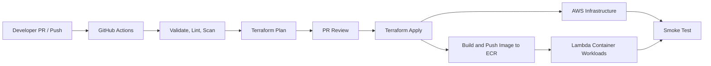

# Deployment & CI/CD Design - Task Force 2 · FinOps Watch CDO

<!-- Doc owner: CDO Team
     Status: Final (W11 T6 Pack #1) -> Updated (W12 T4 Pack #2)
-->

> [!IMPORTANT]
> **Safety Boundary**: All deployment and infrastructure operations must conform to the absolute hard boundaries: **NEVER terminate prod, delete data, or modify IAM**.


## 1. IaC strategy

### 1.1 Tool choice

The CDO platform uses a dual-layer deployment strategy to separate infrastructure provisioning from application workload deployments.
1. **Infrastructure Layer (AWS Resources)**: Provisioned using **Terraform (v1.5+)** to ensure immutable resources (VPC, Lambda functions, ECR, DynamoDB, S3, IAM roles).
2. **Workload Layer (Lambda Container Functions)**: Deployed using **Terraform Lambda configuration** and **GitHub Actions (CI/CD) deployment pipelines** by pinning ECR container image digests.

Terraform owns the AWS platform foundation: networking, lakehouse buckets, Glue/Athena metadata, Step Functions, Lambda execution roles, ECR repositories, DynamoDB tables, and secrets plumbing. CDO owns the serverless hosting infrastructure deployment (VPC, subnets, reserved concurrency settings, security groups, Lambda execution roles, and S3-based audit and idempotency stores), while AIOps owns the container image builds, contract management, and model logic. Runtime Lambda desired state is managed through Terraform and GitHub Actions (CI/CD) deployment pipelines, so application image versions can move independently from infrastructure modules while still depending on Terraform outputs.

### 1.2 Module structure

The repository is organized to separate infrastructure modules from environmental variables:
```
├── iac/
│   ├── modules/
│   │   ├── vpc/                  # Private VPC, subnets, NAT gateways, VPC endpoints
│   │   ├── s3-lakehouse/         # Raw and curated S3 buckets, lifecycle policies
│   │   ├── glue-catalog/         # Glue databases and tables
│   │   ├── step-functions/       # Step Functions workflow definitions
│   │   ├── lambdas/              # Lambda functions (CUR puller, routing, containment)
│   │   ├── dynamodb/             # Read cache for dashboard and metadata
│   │   ├── dashboard/            # CloudFront distribution, S3 static hosting bucket with OAC, and Lambda@Edge viewer-request auth
│   │   └── cognito/              # Cognito User Pool, Client, Groups (finance-readonly, engineering-operator, cdo-admin), Hosted UI
│   └── environments/
│       ├── sandbox/              # Sandbox environment variables (.tfvars)
│       ├── staging/              # Staging environment variables
│       └── prod/                 # Production environment variables
```

The module boundary is intentionally service-oriented rather than team-oriented. Shared platform concerns such as KMS keys, VPC endpoints, IAM policies, and observability are reusable modules, while environment roots provide only sizing, account IDs, feature flags, and approval-sensitive variables. This prevents sandbox shortcuts from leaking into staging or prod.

### 1.3 State management

- **Remote State**: Terraform state is stored in a secure, centralized S3 bucket with server-side encryption, versioning, and environment-specific state keys.
- **State Locking**: Long-lived environment roots use the S3 backend lockfile capability (`use_lockfile = true`) to avoid a separate DynamoDB lock table.
- **CI/CD Ingestion**: Plan outputs are generated on PR (`plan-on-PR`) and apply jobs consume reviewed plan artifacts instead of recomputing unreviewed changes.
- **State Access**: CI roles can read/write only the state key for the target environment. Developers can run local validation, but staging and prod applies must be executed by CI with OIDC and environment controls.

## 2. CI/CD pipeline

### 2.1 Pipeline stages

The CI/CD pipeline is implemented with **GitHub Actions** as the delivery control plane for the CDO infrastructure. It is not part of the runtime FinOps data path, but it controls how the infrastructure components in this design are validated, provisioned, updated, and verified.

The pipeline manages infrastructure and platform changes for:

* EventBridge Scheduler and Step Functions workflow.
* Lambda functions for ingestion, state handling, alert routing, and containment.
* S3 raw/curated zones, Glue Data Catalog, Athena query resources.
* DynamoDB run state and audit tables.
* AI Engine Lambda container function, ECR, SQS queues for alerts, and Lambda execution roles.
* Cognito User Pool, User Groups, and App Client configurations.
* S3 dashboard static hosting bucket, CloudFront distribution, Origin Access Control (OAC), and Lambda@Edge viewer-request auth functions.
* IAM roles and environment-specific configuration required by the CDO platform.



*Caption: GitHub Actions validates every infrastructure change, generates a Terraform plan, applies approved changes to AWS, publishes container images to ECR, updates Lambda container workloads, and runs a smoke test to verify that the CDO platform can execute the FinOps workflow.*

The pipeline follows a simple environment flow:

| Environment | Trigger                        | Purpose                                                                            |
| ----------- | ------------------------------ | ---------------------------------------------------------------------------------- |
| `sandbox`   | Merge to `develop`             | Validate infrastructure and run safe integration tests with synthetic FinOps data. |
| `staging`   | Merge to `main`                | Verify the production-like workflow before final release.                          |
| `prod`      | Manual approval or release tag | Apply reviewed infrastructure changes only after approval.                         |

For Pull Requests, the pipeline runs only validation steps:

* `terraform fmt -check`
* `terraform validate`
* `tflint`
* Secret scanning
* IaC security scanning
* Lambda function and container image contract validation
* Terraform plan generation

Pull Requests do **not** apply changes directly to AWS. The generated Terraform plan is reviewed before merge so the team can see which resources will be created, updated, replaced, or destroyed.

After merge, the deployment stage provisions or updates the infrastructure using Terraform. GitHub Actions assumes an AWS IAM role through **GitHub OIDC**, so no long-lived AWS access keys are stored in GitHub Secrets. Each environment uses a separate IAM role to limit blast radius.

| Pipeline stage  | Main target                                    | Purpose                                                                        |
| --------------- | ---------------------------------------------- | ------------------------------------------------------------------------------ |
| Validate        | Terraform, scripts                             | Catch invalid infrastructure code before deployment.                           |
| Plan            | Terraform modules                              | Preview AWS infrastructure changes before apply.                               |
| Apply           | AWS infrastructure                             | Provision or update CDO platform components.                                   |
| Build image     | ECR                                            | Store versioned container images for Lambda workloads.                         |
| Deploy workload | Lambda (AI Engine)                             | Deploy Lambda container function by publishing versions and updating aliases. |
| Smoke test      | Step Functions, Lambda, DynamoDB               | Verify the FinOps workflow after deployment.                                   |

The post-deployment smoke test uses synthetic data and runs in dry-run mode:

```text
1. Trigger the Step Functions workflow manually.
2. Run the ingestion Lambda against synthetic CUR/Cost Explorer data.
3. Confirm raw and curated data are written to S3.
4. Confirm Glue/Athena can query the curated cost dataset.
5. Invoke the AI Engine Lambda function directly using IAM authorization.
6. Verify the AI Engine Lambda returns a synchronous 200 OK with success indicator.
```

Note: Verification of the workflow execution (confirming alert routing payloads, checking containment dry-run behavior, and verifying audit records in S3) is decoupled from the deployment pipeline and run via a dedicated, periodic End-to-End (E2E) test suite to avoid blocking CI/CD runners.

A deployment is accepted only when the workflow passes validation, Terraform apply completes successfully, Lambda functions become healthy, and the smoke test confirms that ingestion and AI execution work together. The execution is verified by the periodic E2E test suite.

### 2.2 Branch strategy

- `feature/*`: Dedicated branches for features. PR target: `develop`; validation only, no cloud apply.
- `develop`: Sandbox integration branch. Pushes to `develop` can auto-apply to sandbox after checks pass.
- `main`: Staging branch. Merges from `develop` into `main` trigger staging deployment and full integration validation.
- `prod`: Production release path. Production apply is never automatic; it uses GitHub environment approval, reviewed plan artifacts, and prod-safe containment settings.

## 3. Deployment gates

### 3.1 Security scans

In addition to static code analysis, ECR repositories are configured with **Scan on Push** enabled. Any image uploaded by AIOps is automatically scanned. Container deployment is blocked if the image contains severe CVEs. CI pipelines authenticate to AWS using **OpenID Connect (OIDC)**, eliminating the need to store static AWS Access Keys in GitHub.

The security gate also checks Terraform plans, Lambda deployment configurations, Lambda dependencies, and container images. Required checks include `terraform fmt`, `terraform validate`, TFLint, Checkov or equivalent IaC scanning, Trivy image scan, Gitleaks secret scan, and policy checks that prevent public AI Engine exposure. It also enforces validation of Cognito configurations (including JWT cookie lifetimes, secure session configurations, and Hosted UI domain permissions) and Lambda@Edge code to ensure all dashboard traffic is authenticated. Any CRITICAL finding blocks deployment unless a documented capstone exception is approved.

### 3.2 Destructive-change review

Any Terraform plan that modifies resource indexes or indicates resource deletion (e.g., S3 bucket recreation or IAM role changes) is flagged in the PR summary. These changes require explicit manual verification and dual approvals from both the CDO and Security Leads.

The destructive-change gate is stricter for stateful resources. S3 buckets, DynamoDB tables, KMS keys, Lambda functions, IAM roles, and audit storage require reviewer acknowledgement when replacement or deletion appears in the plan. Production plans must fail if they attempt to terminate prod resources, delete data, or modify IAM outside the approved module set.

### 3.3 AI contract compatibility

Before Lambda container image updates are allowed, a pre-deployment script runs validation checks:
1. Compares the AIOps model version registry against the target ECR image manifest.
2. Performs JSON schema validation on the AI Engine's logical `/v1/detect` request/response contracts for direct Lambda invocation.
3. If schemas mismatch, the build fails before updating the Lambda function configuration, ensuring deployment compatibility.

The compatibility check does not evaluate model quality or inspect AIOps training data. It verifies only the operational contract CDO depends on: endpoint health, request schema, response schema, required fields, model version field, timeout behavior, and failure modes. If the AI Engine is unavailable or incompatible, CDO deployment can proceed only for infrastructure changes that do not enable containment apply paths.

### 3.4 Artifact Immutability & Supply Chain Security (SLSA Level 2)

To ensure secure software delivery and prevent tampering in compliance with the signed `deployment-contract.md` §3:
- **Digest Pinning**: CDO deploys the AI Engine container using immutable ECR image digests (`sha256:...`) instead of mutable version tags (e.g., `v1.0.0` or `latest`).
- **Signature Verification**: Every container image is verified against signed signatures using AWS Signer KMS keys before ECR deployment.
- **SBOM Attachment**: Container builds must be accompanied by a Software Bill of Materials (SBOM) in CycloneDX format for license and package auditing.
- **OpenSSF SLSA Level 2**: The CI/CD pipelines enforce automated provenance tracking, building containers exclusively in verified environments with zero static credentials.

## 4. Deployment strategy

### 4.1 Strategy

- **AI Engine Lambda Workloads (Synchronous)**: Deployed using **Lambda Weighted Aliases** by publishing Lambda versions and pinning ECR digests. Traffic shifts gradually: a `10%` canary window for 5 minutes, transitioning to `100%` if no execution errors occur.
- **Alert Routing Lambda (SQS Triggered)**: Deployed using an **All-at-once** strategy for alert retries. SQS/DLQ are used only for alert routing retry buffers rather than the detection flow. Safe deployment is ensured via a strict **Dead Letter Queue (DLQ)** configuration to capture alert routing failures.
- **Lambda Reserved Concurrency**: Configured with a default reserved concurrency limit (e.g., 5-10 concurrent executions baseline) to act as a rate-limiting and cost guardrail, avoiding execution spikes and throttling limits.
- **SQS Concurrency Controls**: Configured on the event source mapping using maximum concurrency settings and batch size constraints to align message processing with AI Engine capacity and prevent database connection exhaustion.
- **Lambda Timeout & Execution Retry Handling**: The AI Engine Lambda function is configured with a safe execution timeout and automatic retry rules. For alert routing, SQS acts as a buffer; if a Lambda execution is interrupted, the message is returned to the queue for a retry, up to a maximum limit, before being routed to the Dead Letter Queue (DLQ).

### 4.2 Rollback method

- **Primary Rollback**: Reverting a Git commit to the previous stable release SHA triggers an automatic GitHub Actions deployment pipeline run to redeploy the previous stable container digest and configuration to the Lambda function.
- **Secondary Rollback**: If the Step Functions workflow or smoke tests catch execution errors, a rollback script shifts the Lambda alias weight back to the previous stable version immediately (RTO < 5 seconds).
- **Infrastructure Rollback**: Terraform rollback is plan-reviewed rather than automatic. State-bearing resources are preserved, `prevent_destroy` remains enabled where supported, and any Lambda infrastructure rollback must account for VPC settings and SQS configuration.
- **Runbook Trigger**: Rollback is triggered by failed smoke tests, AI contract validation failure, elevated Step Functions or Lambda execution error rates, Lambda cold-start failures/timeouts, or stale dashboard data after deployment.

### 4.3 Budget Guardrails & SLO Circuit Breakers (Error Budget Lock)

Operational spending and reliability thresholds are managed through automated circuit breakers to protect AWS resources:
- **Bedrock Budget Guardrail**: Enforces a strict budget of **<$50/month** ($1.67/day limit). The circuit breaker triggers three escalation levels:
  - **Level 1 (80% daily budget)**: Auto-degrades modeling from Nova Pro to Nova Lite.
  - **Level 2 (100% daily budget)**: Auto-falls back to the static Rules Engine (zero LLM token cost).
  - **Level 3 (120% monthly budget)**: Halts all processing and triggers P1 alerts.
- **1% Error Budget Lock**: Enforces a minimum SLO of 99.0% for automated containment success. If the rollback/undo rate exceeds 1% in a rolling 30-day window, the tenant is automatically `LOCKED`. In this state, any further automated containment is disabled, converting all platform interventions into `Dry-run/Alert-only` mode until the issue is diagnosed by SREs.

## 5. Environment separation

We enforce isolation across three AWS accounts:

| Env | Purpose | Account | Auto-deploy |
|---|---|---|---|
| **Sandbox** | Fast iteration, integration smoke tests, and non-prod containment examples. | `1111-2222-3333` | True, from `develop` after checks pass |
| **Staging** | Validation of AIOps container artifacts, direct Lambda invocation, and full Step Functions E2E pipeline execution. | `4444-5555-6666` | True, from `main` after reviewed merge |
| **Prod** | Production control plane. Monitors approved company accounts. Auto-containment is strictly tag/suggest/dry-run. | `7777-8888-9999` | False, requires GitHub environment approval |

Environment-specific values live only in `environments/*`. Sandbox may enable limited non-prod apply-mode examples; staging validates dry-run and integration behavior; prod must keep containment apply disabled by default.

## 6. Secrets in pipeline

Secrets are never embedded in the code or pipeline variables.
1. The CI/CD runner assumes an IAM role via OIDC to retrieve short-lived tokens.
2. Secrets (such as Slack webhooks or database passwords) are stored directly in AWS Secrets Manager.
3. Lambda functions retrieve secrets dynamically from AWS Secrets Manager using the AWS SDK, with caching enabled to minimize retrieve calls.

GitHub secrets are limited to non-cloud metadata needed to bootstrap OIDC, not long-lived AWS keys. Terraform receives secret names and ARNs, not secret values. The deployment pipeline verifies that Terraform Lambda configurations and Terraform outputs do not expose API keys, webhook URLs, or AI Engine credentials.

## 7. Scheduled batch deployment

The Step Functions state machine and EventBridge Scheduler are deployed using Terraform modules leveraging Step Functions Versions and Aliases to enable zero-downtime atomic transitions. The deployment process incorporates operational checks:

```
1. Deploy the updated Step Functions JSON definition via Terraform.
2. Publish a new Version of the Step Functions state machine.
3. Perform validation checks on the new version.
4. Update the target Alias (e.g. PROD) to point to the new Version atomically.
5. Record the pipeline transition and execution time in the DynamoDB deployment log.
```

The Step Functions Alias deployment sequence prevents half-updated workflow definitions from processing a daily run. The EventBridge Scheduler rule always targets the stable Alias (e.g., `PROD`), completely eliminating the need to disable/enable the scheduler rule during deployment. If the state machine changes the AI invocation payload, the deployment also runs the AI contract compatibility check before updating the alias version. Failed verification checks halt the alias update, leaving the alias pointing to the previous known-good state machine Version and alerting the operator.

## 8. Observability stack

The platform's operational health is monitored using a centralized observability suite:

| Component | Tool | Purpose |
|---|---|---|
| **Log Aggregator** | CloudWatch Logs | Centralizes application and Lambda container execution logs. |
| **Trace Analyzer** | AWS X-Ray | Traces requests from Step Functions, through AI Engine Lambda execution. |
| **Metrics Collector** | CloudWatch Metrics / X-Ray | Tracks Lambda execution duration, cold starts, concurrency, and SQS queue age. |
| **Alarms Engine** | CloudWatch Alarms | Sends alerts via SNS if Step Functions fail, or if the dashboard data is stale (>26 hours). |

Core deployment alarms cover Step Functions failure, Lambda error rate, AI Engine internal endpoint unavailability, SQS age of oldest message spikes, Lambda reserved concurrency throttling, audit write failure, and dashboard data freshness. Deployment is not considered complete until these alarms are present and the smoke test writes an audit record. All audit records generated during deployment validation are stored in compliance-ready S3 buckets with Object Lock enabled, adhering to the strict platform requirement of >=90 days audit retention.

## 9. Open questions

- [ ] **Lambda Warm-up**: Should we deploy pre-warmed Provisioned Concurrency for peak execution times, or is the standard cold-start acceptable for our 24h cadence?
- [ ] **Metrics Integration**: Should the engineering CloudWatch dashboards be shared with the AIOps team, or kept restricted to the CDO infrastructure team?
- [ ] **Plan Artifact Retention**: How long should reviewed Terraform plan artifacts be retained for staging and prod audit evidence?
- [ ] **Prod Release Branching**: Should production releases use a protected `prod` branch or GitHub release tags backed by environment approval?

## Related documents

- [`02_infra_design.md`](02_infra_design.md) - AI Engine Lambda container function, and alert SQS/DLQ routing.
- [`03_security_design.md`](03_security_design.md) - Lambda Execution Role configurations, VPC endpoints, and security groups.
