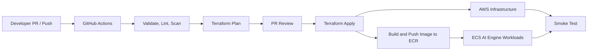

# Thiết kế Triển khai và CI/CD (Deployment & CI/CD Design) - Task Force 2 · FinOps Watch CDO

<!-- Doc owner: CDO Team
     Status: Final (W11 T6 Pack #1) -> Updated (W12 T4 Pack #2)
-->

## 1. IaC strategy

### 1.1 Tool choice

CDO platform sử dụng chiến lược triển khai hai lớp để phân tách rõ ràng giữa việc thiết lập hạ tầng và việc triển khai các ứng dụng chạy trên đó.
1. **Lớp hạ tầng (AWS Resources)**: Sử dụng **Terraform (v1.5+)** để khởi tạo các tài nguyên bất biến (VPC, ECS cluster, Fargate capacity providers, DynamoDB, S3, IAM roles).
2. **Lớp ứng dụng (ECS Services & Tasks)**: Sử dụng **Terraform ECS configuration** và **GitHub Actions (CI/CD) deployment pipelines** đối với các trạng thái ứng dụng trong cụm ECS, và cơ chế đóng gói tệp zip tiêu chuẩn để triển khai cho các hàm Lambda.

Terraform sở hữu nền tảng AWS: mạng, các bucket lakehouse, siêu dữ liệu Glue/Athena, Step Functions, Lambda wrapper, các bảng DynamoDB, role IAM, ECS control plane, các Fargate capacity providers, ECR repository, nền tảng ECS Task/Task Execution roles, các điều kiện cần thiết cho load-balancer nội bộ và phân phối secrets. Trạng thái mong muốn của ECS trong thời gian chạy được quản lý thông qua cấu hình Terraform ECS và các pipeline triển khai GitHub Actions (CI/CD), do đó các định nghĩa tác vụ ứng dụng (task definitions) có thể di chuyển độc lập với các module hạ tầng trong khi vẫn phụ thuộc vào đầu ra của Terraform.

### 1.2 Module structure

Cấu trúc thư mục mã nguồn được phân chia rõ ràng giữa các modules định nghĩa tài nguyên và cấu hình môi trường cụ thể:

```
├── iac/
│   ├── modules/
│   │   ├── vpc/                  # Thiết lập VPC riêng tư, subnets, NAT gateways, VPC endpoints
│   │   ├── ecs/                  # Cụm ECS control plane, các Fargate Capacity Providers
│   │   ├── s3-lakehouse/         # S3 raw và curated buckets, lifecycle policies
│   │   ├── glue-catalog/         # Khởi tạo Glue databases và tables
│   │   ├── step-functions/       # Định nghĩa các trạng thái workflow của Step Functions
│   │   ├── lambdas/              # Các mã nguồn Lambda (CUR puller, routing, containment)
│   │   └── dynamodb/             # Bảng DynamoDB lưu run state, idempotency, và audit logs
│   └── environments/
│       ├── sandbox/              # File biến cấu hình sandbox (.tfvars)
│       ├── staging/              # File biến cấu hình staging
│       └── prod/                 # File biến cấu hình production
```

Ranh giới module được cố ý định hướng theo dịch vụ thay vì định hướng theo nhóm. Các mối quan tâm chung của nền tảng như KMS key, VPC endpoint, chính sách IAM và khả năng quan sát (observability) là các module có thể tái sử dụng, trong khi các thư mục môi trường gốc chỉ cung cấp định cỡ (sizing), account ID, feature flag và các biến nhạy cảm cần phê duyệt. Điều này ngăn các phím tắt sandbox rò rỉ vào staging hoặc prod.

### 1.3 State management

- **Lưu trữ State từ xa (Remote State)**: State của Terraform được lưu trữ trong một bucket S3 an toàn, tập trung với mã hóa phía máy chủ, bật phiên bản (versioning) và các khóa state cụ thể cho từng môi trường.
- **Khóa State (State Locking)**: Các thư mục môi trường gốc chạy lâu dài sử dụng tính năng khóa file của S3 backend (`use_lockfile = true`) để tránh việc dùng một bảng khóa DynamoDB riêng biệt.
- **Tiếp nhận CI/CD (CI/CD Ingestion)**: Đầu ra plan được tạo trên PR (`plan-on-PR`) và các job apply tiêu thụ các plan artifact đã được xem xét thay vì tính toán lại các thay đổi chưa được xem xét.
- **Truy cập State**: Các role CI chỉ có thể đọc/ghi khóa state cho môi trường đích. Các nhà phát triển có thể chạy xác thực cục bộ, nhưng các lệnh apply trên staging và prod phải được thực thi bởi CI với OIDC và kiểm soát môi trường.

## 2. CI/CD pipeline

### 2.1 Pipeline stages

Pipeline CI/CD được xây dựng bằng **GitHub Actions** để tự động kiểm tra, triển khai và xác minh các thành phần hạ tầng của hệ thống **TF2 FinOps Watch**. Pipeline này không nằm trong luồng xử lý dữ liệu runtime, nhưng đóng vai trò kiểm soát việc thay đổi hạ tầng, giúp quá trình triển khai lặp lại được, có kiểm soát và có bằng chứng rõ ràng.

Pipeline chịu trách nhiệm cho các thành phần sau:

* EventBridge Scheduler và Step Functions workflow.
* Lambda phục vụ ingest dữ liệu, xử lý trạng thái, alert routing và containment.
* S3 raw/curated zone, Glue Data Catalog và Athena query resources.
* DynamoDB lưu run state và audit log.
* ECS cluster, Fargate tasks, ECR, Internal ALB và workload chạy trên ECS.
* IAM roles và cấu hình theo từng môi trường.



*Caption: GitHub Actions kiểm tra thay đổi hạ tầng, tạo Terraform plan, triển khai các tài nguyên AWS, build/push image lên ECR, cập nhật workload trên ECS và chạy smoke test để xác minh hệ thống hoạt động đúng.*

Pipeline được chia theo 3 môi trường:

| Môi trường | Trigger                          | Mục đích                                                                 |
| ---------- | -------------------------------- | ------------------------------------------------------------------------ |
| `sandbox`  | Merge vào `develop`              | Kiểm tra hạ tầng và chạy integration test an toàn với dữ liệu synthetic. |
| `staging`  | Merge vào `main`                 | Kiểm tra workflow gần giống production trước khi release.                |
| `prod`     | Manual approval hoặc release tag | Chỉ triển khai sau khi đã review và được phê duyệt.                      |

Ở Pull Request, pipeline chỉ chạy các bước kiểm tra, không triển khai trực tiếp lên AWS:

* Kiểm tra format Terraform bằng `terraform fmt -check`.
* Kiểm tra cấu hình Terraform bằng `terraform validate`.
* Chạy `tflint` để phát hiện lỗi IaC.
* Quét secret để tránh commit nhầm AWS key, webhook, API token hoặc private key.
* Quét bảo mật IaC để phát hiện cấu hình rủi ro như S3 public, IAM quá rộng, tài nguyên không mã hóa hoặc network mở không cần thiết.
* Validate ECS task definition nếu có thay đổi workload trên ECS.
* Tạo Terraform plan để reviewer kiểm tra trước khi merge.

Sau khi Pull Request được merge, pipeline mới thực hiện deploy. GitHub Actions sử dụng **GitHub OIDC** để assume IAM role trên AWS, không lưu AWS Access Key/Secret Key dài hạn trong GitHub Secrets. Mỗi môi trường sử dụng một IAM role riêng để giới hạn phạm vi ảnh hưởng.

| Giai đoạn       | Thành phần chính                      | Mục đích                                        |
| --------------- | ------------------------------------- | ----------------------------------------------- |
| Validate        | Terraform, scripts                    | Phát hiện lỗi trước khi triển khai.             |
| Plan            | Terraform modules                     | Xem trước các thay đổi hạ tầng.                 |
| Apply           | AWS resources                         | Tạo hoặc cập nhật hạ tầng CDO.                  |
| Build image     | ECR                                   | Build và lưu image versioned cho workload.      |
| Deploy workload | ECS                                   | Cập nhật AI Engine API/worker sau Internal ALB. |
| Smoke test      | Step Functions, Lambda, ECS, DynamoDB | Kiểm tra workflow FinOps sau triển khai.        |

Sau mỗi lần deploy, pipeline chạy smoke test bằng dữ liệu synthetic và ở chế độ an toàn:

```text
1. Trigger Step Functions workflow thủ công.
2. Chạy Lambda ingest với dữ liệu CUR/Cost Explorer synthetic.
3. Kiểm tra dữ liệu được ghi vào S3 raw/curated zone.
4. Kiểm tra Glue/Athena có thể query dữ liệu curated.
5. Gọi AI Engine chạy trên ECS thông qua Internal ALB.
6. Kiểm tra alert routing tạo đúng payload cho Finance và Engineering.
7. Kiểm tra containment vẫn chạy ở dry-run mode.
8. Kiểm tra run state và audit record được ghi vào DynamoDB.
```

Một lần triển khai chỉ được xem là hợp lệ khi toàn bộ bước validate pass, Terraform apply thành công, workload trên ECS ở trạng thái healthy và smoke test xác nhận được luồng chính: ingest dữ liệu, gọi AI Engine, routing alert, containment dry-run và ghi audit log.

Thiết kế CI/CD này giúp hạ tầng của TF2 FinOps Watch được triển khai nhất quán, có thể review trước khi apply, không dùng credential dài hạn và có bằng chứng rõ ràng cho từng lần thay đổi.

### 2.2 Branch strategy

- `feature/*`: Nhánh dành cho từng thay đổi tính năng. PR target: `develop`; chỉ chạy validate/plan, không apply lên AWS.
- `develop`: Nhánh tích hợp sandbox. Merge/push vào `develop` có thể auto-apply lên `sandbox` sau khi các bước kiểm tra pass.
- `main`: Nhánh staging. Merge từ `develop` vào `main` kích hoạt triển khai `staging` và chạy kiểm thử tích hợp đầy đủ.
- `prod`: Đường phát hành production. Apply lên `prod` không bao giờ tự động; sử dụng GitHub environment approval, plan artifact đã review, và cấu hình containment an toàn (tag/suggest/dry-run).

## 3. Deployment gates

### 3.1 Security scans

Bên cạnh việc quét mã nguồn tĩnh, các kho lưu trữ ECR được bật cấu hình **Scan on Push**. Mọi image do AIOps đẩy lên sẽ được tự động quét lỗi bảo mật. Việc deploy lên ECS sẽ bị chặn lại nếu image chứa các lỗ hổng bảo mật nghiêm trọng. Pipeline CI/CD xác thực với tài khoản AWS thông qua giao thức **OpenID Connect (OIDC)**, loại bỏ việc lưu trữ cố định các AWS Access Keys trên GitHub.

Cổng bảo mật cũng kiểm tra các plan Terraform, ECS task definitions, dependency của Lambda và image container. Các bước kiểm tra bắt buộc bao gồm `terraform fmt`, `terraform validate`, TFLint, quét IaC bằng Checkov hoặc tương đương, quét image bằng Trivy, quét secret bằng Gitleaks và kiểm tra chính sách ngăn chặn việc expose AI Engine ra công cộng. Bất kỳ phát hiện CRITICAL nào cũng chặn triển khai trừ khi có ngoại lệ capstone được ghi chép và phê duyệt.

### 3.2 Destructive-change review

Bất kỳ Terraform plan nào hiển thị cảnh báo thay đổi index tài nguyên hoặc có hành động xóa/khởi tạo lại (như tạo lại S3 bucket hoặc thay đổi IAM role) sẽ được gắn nhãn cảnh báo trong PR. Các thay đổi này bắt buộc phải có sự xác nhận thủ công và phê duyệt kép (dual approvals) từ CDO Lead và Security Lead.

Cổng destructive-change nghiêm ngặt hơn đối với các tài nguyên có lưu trạng thái (stateful). Các bucket S3, bảng DynamoDB, KMS key, ECS cluster, Fargate tasks, IAM role và bộ lưu trữ kiểm toán yêu cầu sự xác nhận của người xem xét khi có sự thay thế hoặc xóa xuất hiện trong plan. Các plan production phải bị hủy nếu chúng cố gắng terminate tài nguyên prod, xóa dữ liệu hoặc thay đổi IAM bên ngoài tập hợp module đã được phê duyệt.

### 3.3 AI contract compatibility

Trước khi cập nhật container trong ECS, pipeline sẽ khởi chạy một tập lệnh kiểm tra độ tương thích:
1. Đối chiếu model version đăng ký từ AIOps với cấu hình ECS hiện tại.
2. Kiểm tra JSON schema của API contract đầu vào và đầu ra tại endpoint `/detect` của AI Engine.
3. Nếu schema không tương thích, quá trình build sẽ bị dừng ngay lập tức trước khi tác động vào cụm ECS, đảm bảo tính nhất quán của hệ thống.

Việc kiểm tra khả năng tương thích không đánh giá chất lượng mô hình hoặc kiểm tra dữ liệu huấn luyện của AIOps. Nó chỉ xác thực hợp đồng vận hành mà CDO phụ thuộc vào: sức khỏe endpoint, request schema, response schema, các trường bắt buộc, trường phiên bản mô hình, hành vi timeout và các chế độ lỗi. Nếu AI Engine không khả dụng hoặc không tương thích, việc triển khai CDO chỉ có thể tiếp tục đối với các thay đổi hạ tầng mà không kích hoạt các đường dẫn áp dụng containment.

### 3.4 Tính bất biến của Artifact & An toàn chuỗi cung ứng (SLSA Level 2)

Để đảm bảo quy trình phân phối phần mềm an toàn và chống giả mạo theo `deployment-contract.md` §3 đã ký:
- **Digest Pinning (Ghim mã băm)**: CDO triển khai container AI Engine bằng cách sử dụng mã băm ECR bất biến (`sha256:...`) thay vì dùng tag phiên bản có thể bị ghi đè (như `v1.0.0` hoặc `latest`).
- **Xác thực chữ ký**: Mỗi container image được xác thực độ tin cậy bằng chữ ký số qua AWS Signer KMS key trước khi được kéo vào cụm ECS.
- **SBOM đính kèm**: Các bản build container bắt buộc phải đính kèm Software Bill of Materials (SBOM) định dạng CycloneDX để phục vụ kiểm toán giấy phép và lỗ hổng thư viện.
- **Tuân thủ OpenSSF SLSA Level 2**: Pipeline CI/CD thực thi việc truy vết nguồn gốc (provenance) tự động, build container trong môi trường được xác thực và không lưu trữ thông tin đăng nhập AWS tĩnh.

## 4. Deployment strategy

### 4.1 Strategy

- **ECS API Workloads**: Sử dụng chiến lược **ECS Rolling Updates** với cấu hình max surge `25%` and max unavailable `0%`. Điều này đảm bảo các task chạy ổn định (AI Engine API Tasks) luôn có task mới sẵn sàng trước khi thu hồi các task cũ.
- **ECS Batch Workers**: Các ECS Tasks thực thi động. Các cập nhật về cấu hình worker sẽ áp dụng cho các lượt gọi task tiếp theo mà không làm ảnh hưởng đến các task đang chạy.
- **Lambda Functions**: Triển khai theo cơ chế **Weighted Aliases**. Traffic được chuyển dịch dần dần: chạy thử nghiệm canary `10%` traffic trong 5 phút, và tự động chuyển sang `100%` nếu không phát sinh lỗi.
- **Fargate Spot Interruption Handling**: AWS ECS xử lý ngắt Fargate Spot một cách tự nhiên. Khi nhận được tín hiệu chấm dứt, tác vụ sẽ đi vào trạng thái draining trong vòng 120 giây. Nếu một tác vụ batch scoring bị gián đoạn, CDO orchestrator sẽ phát hiện sự thất bại và lập lịch chạy lại trên Fargate Spot hoặc always-on dự phòng.

### 4.2 Rollback method

- **Rollback chính**: Việc hoàn tác (revert) một commit Git về SHA ổn định trước đó sẽ tự động kích hoạt pipeline triển khai của GitHub Actions chạy lại để redeploy định nghĩa task ổn định trước đó vào cụm ECS.
- **Rollback phụ**: Đối với các hàm Lambda, workflow Step Functions sẽ bắt các mã lỗi gọi function và ngay lập tức chuyển trọng số (weight) của Lambda alias về phiên bản ổn định trước đó (RTO < 10 giây).
- **Rollback hạ tầng (Infrastructure Rollback)**: Rollback Terraform được xem xét qua plan thay vì chạy tự động. Các tài nguyên lưu trạng thái được bảo toàn, `prevent_destroy` vẫn được bật nếu được hỗ trợ và bất kỳ hoạt động rollback hạ tầng ECS nào cũng phải tính đến các Fargate tasks, ECS task roles và endpoint nội bộ.
- **Kích hoạt Runbook (Runbook Trigger)**: Rollback được kích hoạt bởi smoke test thất bại, xác thực hợp đồng AI thất bại, tỷ lệ lỗi Step Functions tăng cao, các dịch vụ ECS không khỏe mạnh hoặc dữ liệu dashboard cũ sau khi triển khai.

### 4.3 Budget Guardrails & Bộ ngắt mạch SLO (Error Budget Lock)

Ngân sách vận hành và các ngưỡng tin cậy được quản lý tự động thông qua các cơ chế ngắt mạch (circuit breakers) bảo vệ tài nguyên:
- **Cơ chế ngắt Bedrock**: Thực thi nghiêm ngặt ngân sách **<$50/tháng** ($1.67/ngày). Cơ chế tự động kích hoạt 3 cấp độ leo thang:
  - **Cấp độ 1 (80% ngân sách ngày)**: Tự động hạ cấp mô hình gọi từ Nova Pro xuống Nova Lite.
  - **Cấp độ 2 (100% ngân sách ngày)**: Tự động chuyển đổi sang Rules Engine tĩnh (không tốn token LLM).
  - **Cấp độ 3 (120% ngân sách tháng)**: Dừng tất cả các hoạt động xử lý và gửi cảnh báo khẩn cấp P1.
- **Khóa Error Budget 1%**: Thực thi SLO tối thiểu 99.0% đối với các can thiệp containment tự động thành công. Nếu tỷ lệ hoàn tác/undo vượt quá 1% trong cửa sổ trượt 30 ngày, tenant sẽ tự động bị `LOCKED` (khóa). Ở trạng thái này, mọi can thiệp containment tự động bị vô hiệu hóa, chuyển toàn bộ sang chế độ `Dry-run/Alert-only` để SRE điều tra nguyên nhân.

## 5. Environment separation

Hạ tầng được cô lập hoàn toàn trên ba tài khoản AWS độc lập:

| Môi trường (Env) | Mục đích sử dụng | Tài khoản AWS | Auto-deploy |
|---|---|---|---|
| **Sandbox** | Vòng lặp nhanh, integration smoke tests và các ví dụ containment trên non-prod. | `1111-2222-3333` | Đúng, từ `develop` sau khi các kiểm tra vượt qua |
| **Staging** | Xác thực các container artifact của AIOps, ECS hosting và chạy E2E pipeline của Step Functions. | `4444-5555-6666` | Đúng, từ `main` sau khi merge đã xem xét |
| **Prod** | Control plane production. Giám sát các tài khoản công ty được phê duyệt. Auto-containment nghiêm ngặt chỉ ở mức tag/suggest/dry-run. | `7777-8888-9999` | Sai, yêu cầu phê duyệt môi trường GitHub |

Các giá trị cụ thể cho từng môi trường chỉ nằm trong `environments/*`. Sandbox có thể kích hoạt các ví dụ chế độ apply hạn chế trên non-prod; staging xác thực hành vi dry-run và tích hợp; prod phải tắt chế độ apply containment theo mặc định.

## 6. Secrets in pipeline

Secrets tuyệt đối không được ghi trực tiếp vào mã nguồn hay biến môi trường của pipeline.
1. CI/CD runner assume một IAM role thông qua liên kết OIDC để lấy token tạm thời.
2. Các secret (như Slack webhooks hay database passwords) được lưu trữ trực tiếp trong AWS Secrets Manager.
3. ECS agent inject các secret này vào các task trong cụm ECS thông qua native ECS Secrets mapping tại thời điểm task khởi chạy.

GitHub secret được giới hạn ở metadata phi đám mây cần thiết để bootstrap OIDC, không phải các khóa AWS dài hạn. Terraform nhận tên secret và ARN, không phải giá trị secret. Pipeline triển khai xác minh rằng các cấu hình Terraform ECS và đầu ra Terraform không để lộ API key, webhook URL hoặc thông tin xác thực của AI Engine.

## 7. Scheduled batch deployment

State machine của Step Functions và EventBridge Scheduler được quản lý và triển khai qua các module Terraform. Quy trình deploy tuân thủ quy trình kiểm tra vận hành:

```
1. Deploy định nghĩa JSON mới của Step Functions qua Terraform.
2. Tạm thời vô hiệu hóa (disable) quy tắc EventBridge Scheduler để tránh kích hoạt pipeline giữa chừng.
3. Chạy thử nghiệm (smoke-test) để xác minh kết nối đến endpoint API và các bảng Glue.
4. Kích hoạt (enable) lại quy tắc EventBridge Scheduler để trỏ vào version state machine mới.
5. Ghi nhận thời gian cập nhật và phiên bản triển khai vào bảng DynamoDB deployment log.
```

Trình tự triển khai bộ lập lịch ngăn chặn việc các định nghĩa workflow được cập nhật một nửa xử lý một lượt chạy hàng ngày. Nếu state machine thay đổi payload gọi AI, việc triển khai cũng chạy kiểm tra tính tương thích hợp đồng AI trước khi kích hoạt lại lịch trình. Các smoke test thất bại sẽ giữ lịch trình ở trạng thái vô hiệu hóa và tạo một cảnh báo cho người vận hành với ARN state machine tốt đã biết trước đó.

## 8. Observability stack

Trạng thái vận hành và độ ổn định của hệ thống được giám sát qua bộ công cụ tập trung:

| Thành phần | Công cụ sử dụng | Mục đích giám sát |
|---|---|---|
| **Log Aggregator** | CloudWatch Logs / Container Insights | Tập trung hóa nhật ký hoạt động từ application, Lambda, và stdout của các container ECS. |
| **Trace Analyzer** | AWS X-Ray | Tracing đường đi của request từ Step Functions, qua Lambda, đến internal ALB trong ECS. |
| **Metrics Collector** | Prometheus / Managed Grafana | Theo dõi mức sử dụng CPU/Memory của các task ECS và các phân bổ Fargate capacity provider. |
| **Alarms Engine** | CloudWatch Alarms | Gửi cảnh báo qua SNS nếu Step Functions gặp lỗi, hoặc dữ liệu dashboard không cập nhật (>26 giờ). |

Các báo động triển khai cốt lõi bao gồm lỗi Step Functions, tỷ lệ lỗi Lambda, endpoint nội bộ AI Engine không khả dụng, trạng thái không khỏe mạnh của dịch vụ ECS, số lượng task pending quá mức, gián đoạn spot tăng đột biến, lỗi ghi audit và dữ liệu dashboard cũ. Việc triển khai không được coi là hoàn thành cho đến khi các báo động này hiện diện và smoke test ghi lại một bản ghi kiểm toán.

## 9. Open questions

- [ ] **ECS Topology**: Nên quản lý các tác vụ ECS bằng một pipeline trung tâm duy nhất, hay triển khai các runners GitHub Actions chuyên biệt cho từng môi trường?
- [ ] **Grafana Integration**: Có nên chia sẻ dashboard theo dõi chỉ số hạ tầng với đội ngũ AIOps không, hay chỉ giới hạn quyền truy cập cho đội hạ tầng CDO?
- [ ] **Plan Artifact Retention**: Thời gian lưu trữ plan artifact: Plan artifact của Terraform đã xem xét nên được lưu trữ trong bao lâu để làm bằng chứng kiểm toán cho staging và prod?
- [ ] **Prod Release Branching**: Nhánh release trên prod: Các bản phát hành production nên sử dụng một nhánh `prod` được bảo vệ hay sử dụng các thẻ phát hành (release tags) của GitHub được hỗ trợ bởi phê duyệt môi trường?

## Related documents

- [`02_infra_design_vi.md`](02_infra_design_vi.md) - Cấu trúc cụm ECS, subnet mạng, và định tuyến capacity provider.
- [`03_security_design_vi.md`](03_security_design_vi.md) - Thiết lập ECS Task Role, danh mục secret, và security groups.
